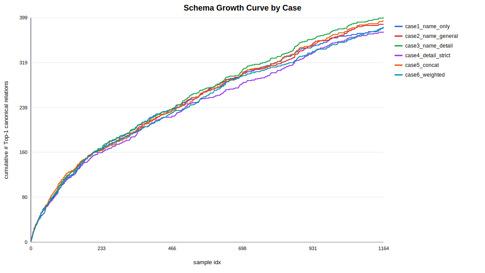
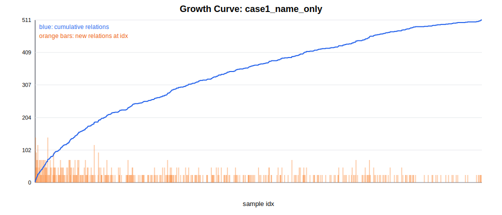
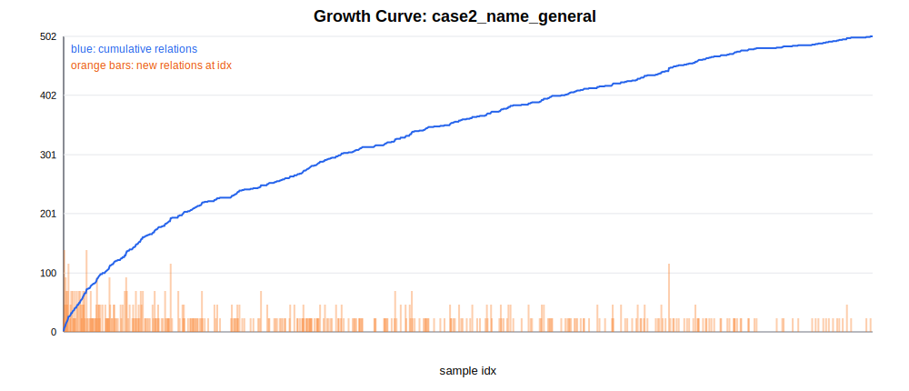
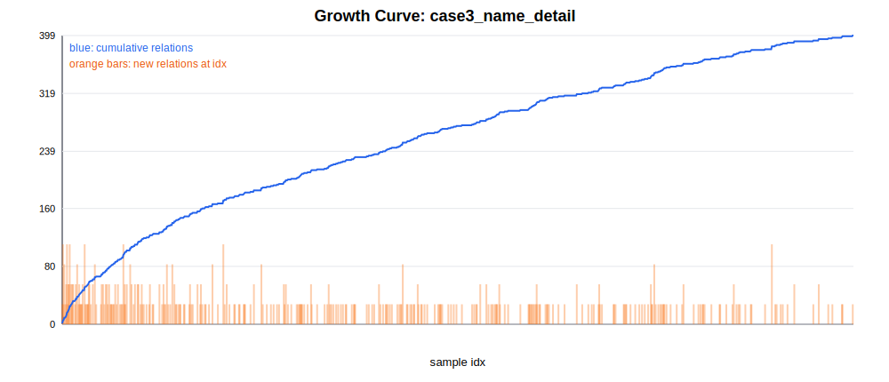
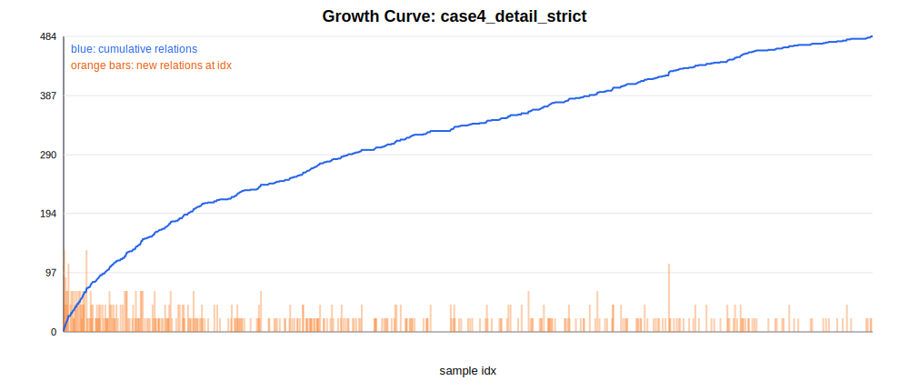
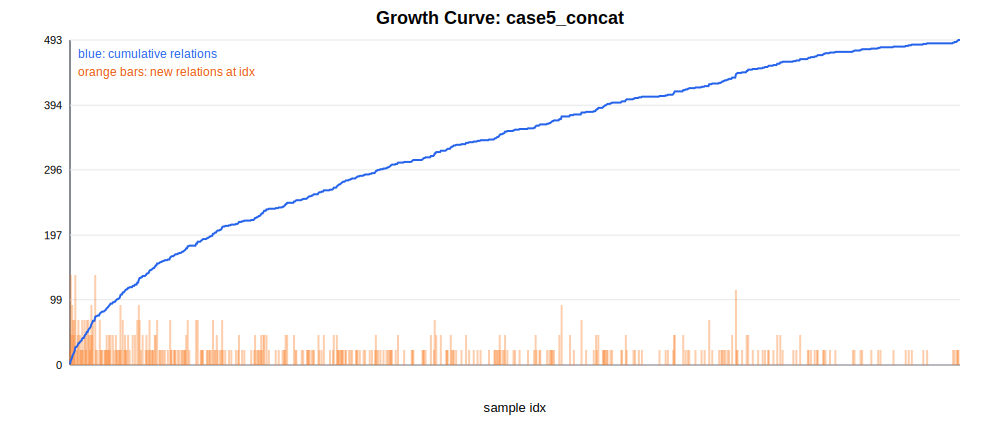
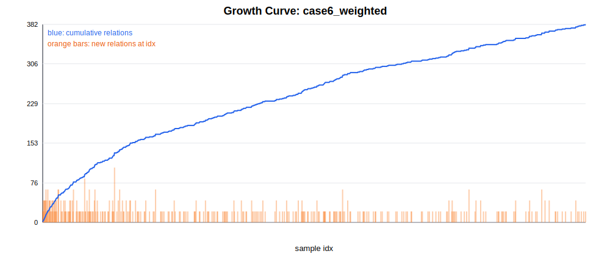

# Schema Relation Growth Report

## Inputs And Assumptions

- `|R_case|` is counted from `canon_schema_case*.json` -> `relation_types`.
- New/reused relation ratio uses `is_new_relation` when present.
- This run does not contain `is_new_relation`, so the analyzer inferred new/reused labels.
- Base schema used for inference: `canon_schema.csv`.
- Growth curves use cumulative unique Top-1 canonical relations by sample index from `case*.json`.
- Because final `canon_schema_case*.json` does not store creation index, growth curves are a Top-1 usage growth proxy.

## Summary By Case

| iter | case | relation_count | new_relation_count | reused_relation_count | new_relation_ratio | reused_relation_ratio | growth_final_top1_relations | max_new_relations_at_idx | max_growth_idx |
| --- | --- | --- | --- | --- | --- | --- | --- | --- | --- |
| iter0 | case1_name_only | 514 | 362 | 152 | 0.7043 | 0.2957 | 382 | 4 | 1 |
| iter0 | case2_name_general | 502 | 350 | 152 | 0.6972 | 0.3028 | 387 | 5 | 7 |
| iter0 | case3_name_detail | 528 | 372 | 156 | 0.7045 | 0.2955 | 399 | 4 | 1 |
| iter0 | case4_detail_strict | 487 | 336 | 151 | 0.6899 | 0.3101 | 374 | 4 | 1 |
| iter0 | case5_concat | 496 | 344 | 152 | 0.6935 | 0.3065 | 393 | 4 | 48 |
| iter0 | case6_weighted | 558 | 400 | 158 | 0.7168 | 0.2832 | 382 | 5 | 154 |

## Ranking: Largest Final Schema

| case | relation_count | new_relation_count | new_relation_ratio |
| --- | --- | --- | --- |
| case6_weighted | 558 | 400 | 0.7168 |
| case3_name_detail | 528 | 372 | 0.7045 |
| case1_name_only | 514 | 362 | 0.7043 |
| case2_name_general | 502 | 350 | 0.6972 |
| case5_concat | 496 | 344 | 0.6935 |
| case4_detail_strict | 487 | 336 | 0.6899 |

## Ranking: Highest New Relation Ratio

| case | new_relation_ratio | new_relation_count | relation_count |
| --- | --- | --- | --- |
| case6_weighted | 0.7168 | 400 | 558 |
| case3_name_detail | 0.7045 | 372 | 528 |
| case1_name_only | 0.7043 | 362 | 514 |
| case2_name_general | 0.6972 | 350 | 502 |
| case5_concat | 0.6935 | 344 | 496 |
| case4_detail_strict | 0.6899 | 336 | 487 |

## Growth Curve

## Largest Growth Bursts

| case | idx | new_relations_at_idx | cumulative_top1_relations | new_relation_names |
| --- | --- | --- | --- | --- |
| case2_name_general | 7 | 5 | 18 | currentTenants; builtIn; municipality; isPartOf; county |
| case6_weighted | 154 | 5 | 134 | placeOfBirth; receivedAward; awardedTo; retiredOn; placeOfOrigin |
| case1_name_only | 1 | 4 | 5 | studiesAt; populationDensity; location; population |
| case1_name_only | 7 | 4 | 16 | manager; powerType; isPartOf; type |
| case1_name_only | 100 | 4 | 101 | genre; author; previousChampion; precedes |
| case2_name_general | 1 | 4 | 5 | containsAdministrativeTerritory; location; populationDensity; locatedInCountry |
| case2_name_general | 11 | 4 | 25 | diedIn; ethnicGroup; operatedBy; selectedBy |
| case2_name_general | 90 | 4 | 97 | currentClub; weight; currentTeam; previousTeam |
| case2_name_general | 100 | 4 | 105 | genre; author; publisher; precedes |
| case2_name_general | 154 | 4 | 138 | placeOfBirth; receivedAward; awardedTo; retiredOn |
| case3_name_detail | 1 | 4 | 5 | location; populationDensity; isPartOf; population |
| case3_name_detail | 7 | 4 | 16 | builtIn; municipality; powerType; county |
| case3_name_detail | 11 | 4 | 25 | bornIn; diedIn; ethnicGroup; selectedBy |
| case3_name_detail | 33 | 4 | 51 | discoveredBy; rotationPeriod; orbitalPeriod; apoapsis |
| case3_name_detail | 90 | 4 | 96 | currentTeam; weight; previousChampion; previousTeam |
| case3_name_detail | 237 | 4 | 171 | staffMembers; numberOfUndergraduateStudents; doctoralStudents; enrollment |
| case3_name_detail | 1044 | 4 | 384 | relationTo_Alan_Shepard; graduatedIn; awarded; awardingBody |
| case4_detail_strict | 1 | 4 | 5 | location; populationDensity; isPartOf; population |
| case4_detail_strict | 7 | 4 | 16 | builtIn; municipality; powerType; county |
| case4_detail_strict | 33 | 4 | 51 | discoveredBy; rotationPeriod; orbitalPeriod; apoapsis |
| case4_detail_strict | 90 | 4 | 91 | currentTeam; weight; previousChampion; previousTeam |
| case4_detail_strict | 366 | 4 | 204 | lastAiredOn; airedOn; role; isBasedAt |
| case5_concat | 48 | 4 | 64 | county; containsAdministrativeTerritory; isLocatedIn; has |
| case5_concat | 90 | 4 | 103 | currentClub; weight; currentTeam; previousTeam |
| case6_weighted | 90 | 4 | 92 | currentTeam; elevation; previousChampion; previousTeam |
| case1_name_only | 9 | 3 | 19 | creator; currentTenants; address |
| case1_name_only | 11 | 3 | 24 | diedIn; operatedBy; selectedBy |
| case1_name_only | 22 | 3 | 36 | birthDate; builtIn; makes |
| case1_name_only | 33 | 3 | 46 | foundIn; rotationPeriod; orbitalPeriod |
| case1_name_only | 48 | 3 | 58 | affiliation; sells; containsAdministrativeTerritory |

## Per-Case Growth Plots

### case1_name_only

### case2_name_general

### case3_name_detail

### case4_detail_strict

### case5_concat

### case6_weighted

## Relation-Level New/Reused Details

| case | relation | is_new_relation | classification_source | head_type | tail_type | definition |
| --- | --- | --- | --- | --- | --- | --- |
| case1_name_only | CEO | True | inferred_from_base_schema | Company | CEO | indicates that a company is led by a chief executive officer |
| case1_name_only | aboveSeaLevel | True | inferred_from_base_schema | City | AboveSeaLevel | indicates that a city is located above a certain sea level |
| case1_name_only | absoluteMagnitude | False | inferred_from_base_schema | Asteroid | AbsoluteMagnitude | indicates that an asteroid has a specific absolute magnitude |
| case1_name_only | absolute_magnitude | False | inferred_from_base_schema | CelestialBody | AbsoluteMagnitude | represents the relationship where an asteroid has a specific brightness measurement |
| case1_name_only | actedIn | True | inferred_from_base_schema | Actor | TelevisionSeries | indicates that an actor starred in a television series |
| case1_name_only | actor | True | inferred_from_base_schema | TelevisionShow | Actor | indicates that a show features actors in its cast |
| case1_name_only | address | False | inferred_from_base_schema | ArchitecturalStructure | GeographicLocation | indicates that an architectural structure has a specific physical address |
| case1_name_only | adjacentCounty | True | inferred_from_base_schema | County | County | represents the relationship where one county is geographically adjacent to another county |
| case1_name_only | affiliatedWith | False | inferred_from_base_schema | EducationalInstitution | University | represents the relationship where an educational institution is associated with a university |
| case1_name_only | affiliation | True | inferred_from_base_schema | Institute | University | indicates that an educational institution is associated with a university for academic purposes |
| case1_name_only | airedBananaman | True | inferred_from_base_schema | BroadcastNetwork | TVSeries | represents the relationship where a broadcast network broadcasts a TV series |
| case1_name_only | airedOn | True | inferred_from_base_schema | TVSeries | BroadcastingCompany | indicates that a TV series is broadcasted by a specific broadcasting company |
| case1_name_only | airedShowOn | True | inferred_from_base_schema | BroadcastingCompany | EventDate | indicates that a broadcasting company aired a show on a specific date |
| case1_name_only | altitudeAboveSeaLevel | False | inferred_from_base_schema | Airport | Altitude | indicates that an airport is at a specific altitude above sea level |
| case1_name_only | annualRevenue | False | inferred_from_base_schema | Company | AnnualRevenue | represents the total revenue generated by a company in a fiscal year |
| case1_name_only | anthem | True | inferred_from_base_schema | Monarchy | NationalAnthem | represents the relationship where a monarchy has a national anthem |
| case1_name_only | apoapsis | False | inferred_from_base_schema | Asteroid | Apoapsis | indicates that an asteroid has a specific apoapsis distance |
| case1_name_only | apolloCrewMember | True | inferred_from_base_schema | HistoricalFigure | SpaceMission | indicates that a historical figure was a crew member of a space mission |
| case1_name_only | architect | False | inferred_from_base_schema | ArchitecturalStructure | Architect | indicates that an architectural structure is designed by a professional architect |
| case1_name_only | are | True | inferred_from_base_schema | Thing | Thing | indicates that a group of entities share a common identity or classification |
| case1_name_only | area | False | inferred_from_base_schema | Country | Area | represents the relationship where a countrys geographical extent is quantified |
| case1_name_only | areaCode | True | inferred_from_base_schema | Place | AreaCode | represents the relationship where a place is uniquely identified by a numeric area code |
| case1_name_only | assembledBy | True | inferred_from_base_schema | Automobile | AutomotiveCompany | indicates that an automobile is manufactured by an automotive company |
| case1_name_only | assembledIn | True | inferred_from_base_schema | Automobile | City | represents the relationship where a vehicle is produced within a city |
| case1_name_only | assemblyLineLocation | True | inferred_from_base_schema | Vehicle | City | indicates that a vehicle was produced on an assembly line located within a city |
| case1_name_only | assemblyLocation | False | inferred_from_base_schema | Automobile | City | represents the relationship where a vehicle is produced in a city |
| case1_name_only | associatedBand | True | inferred_from_base_schema | Musician | Band | indicates that a musician is associated with a musical group |
| case1_name_only | associatedWith | False | inferred_from_base_schema | Musician | Musician | indicates that a musician collaborates with another artist in musical projects |
| case1_name_only | attendedSchool | False | inferred_from_base_schema | Individual | School | indicates that an individual studied at a specific educational institution |
| case1_name_only | author | True | inferred_from_base_schema | Book | Author | indicates that a book is authored by an individual |
| case1_name_only | award | True | inferred_from_base_schema | HistoricalFigure | MilitaryAward | indicates that a historical figure received a specific military award |
| case1_name_only | awardedBy | False | inferred_from_base_schema | HistoricalFigure | MilitaryBranch | indicates that a historical figure received a military award from a branch of the armed forces |
| case1_name_only | awardedTechnicalCampusStatusTo | True | inferred_from_base_schema | GovernmentAgency | EducationalInstitution | represents the relationship where a government agency grants a technical campus status to an educational institution |
| case1_name_only | awardingBody | True | inferred_from_base_schema | Individual | MilitaryBranch | indicates that an individual is awarded by a specific military branch |
| case1_name_only | band | True | inferred_from_base_schema | Musician | Band | indicates that a musician is part of a band |
| case1_name_only | becameProfessional | True | inferred_from_base_schema | Individual | Profession | indicates that an individual transitioned into a professional role |
| case1_name_only | beganMusicalCareer | True | inferred_from_base_schema | Musician | Year | represents the relationship where a musician starts their professional music career |
| case1_name_only | birthDate | True | inferred_from_base_schema | MilitaryPerson | Date | indicates that a military person was born on a specific date |
| case1_name_only | birthPlace | False | inferred_from_base_schema | MilitaryPerson | City | indicates that a military person is born in a specific city |
| case1_name_only | birthYear | True | inferred_from_base_schema | HistoricalFigure | Year | indicates that a historical figure was born in a specific year |
| case1_name_only | bodyStyle | False | inferred_from_base_schema | Automobile | BodyStyle | represents the relationship where an automobile has a specific body style |
| case1_name_only | borderingCounty | True | inferred_from_base_schema | County | County | indicates that a county shares borders with other counties |
| case1_name_only | bornIn | False | inferred_from_base_schema | Individual | City | indicates that an individual is born in a specific city |
| case1_name_only | bornOn | True | inferred_from_base_schema | Athlete | BirthDate | indicates that an athlete was born on a specific date |
| case1_name_only | bornWithin | True | inferred_from_base_schema | Individual | Monarchy | indicates that an individual was born within a monarchy |
| case1_name_only | born_on | True | inferred_from_base_schema | Astronaut | BirthDate | indicates that an astronaut was born on a specific date |
| case1_name_only | broadcastedBy | False | inferred_from_base_schema | TVShow | BroadcastingCompany | indicates that a TV show is broadcast by a specific broadcasting company |
| case1_name_only | broughtUpBy | True | inferred_from_base_schema | MediaCompany | AnimatedCharacter | represents the relationship where a media company is associated with a specific animated character |
| case1_name_only | buildStartDate | True | inferred_from_base_schema | EducationalBuilding | TemporalValue | indicates that a building was constructed on a specific date |
| case1_name_only | builder | True | inferred_from_base_schema | Locomotive | Company | represents the relationship where a locomotive is produced by a manufacturing company |
| case1_name_only | built | True | inferred_from_base_schema | HistoricalStructure | Year | indicates that a historical structure was constructed in a specific year |
| case1_name_only | builtBy | True | inferred_from_base_schema | EducationalBuilding | Architect | represents the relationship where an educational building is designed by an architect |
| case1_name_only | builtIn | True | inferred_from_base_schema | HistoricalStructure | TimePeriod | indicates that a historical structure is constructed in a specific year |
| case1_name_only | builtOn | True | inferred_from_base_schema | EducationalBuilding | ConstructionDate | indicates that an educational building was constructed on a specific date |
| case1_name_only | campusLocation | True | inferred_from_base_schema | University | Road | indicates that a university is situated on a specific road within its campus |
| case1_name_only | campus_location | True | inferred_from_base_schema | EducationalInstitution | Address | indicates that an educational institution has a specific campus location |
| case1_name_only | canBeVaryWith | True | inferred_from_base_schema | Dessert | DairyProduct | indicates that a dessert can be prepared with a dairy product |
| case1_name_only | category | True | inferred_from_base_schema |  |  |  |
| case1_name_only | ceremonialCounty | False | inferred_from_base_schema | Town | CeremonialCounty | represents the relationship where a town is part of a ceremonial county |
| case1_name_only | championOf | True | inferred_from_base_schema | SportsTeam | League | represents the relationship where a sports team is the champion of a league |
| case1_name_only | champions | True | inferred_from_base_schema | SportsTeam | League | indicates that a sports team is the champion of a league |
| case1_name_only | championship | True | inferred_from_base_schema | SportsClub | League | indicates that a sports club has won a specific league championship |
| case1_name_only | character | True | inferred_from_base_schema | Actor | TelevisionSeries | indicates that an actor portrays a character in a television series |
| case1_name_only | citizens | True | inferred_from_base_schema | Nation | Population | represents the relationship where a nation comprises a specific demographic group |
| case1_name_only | citizenship | False | inferred_from_base_schema | Citizen | Thing | indicates that a citizen holds citizenship in a country |
| case1_name_only | city | False | inferred_from_base_schema | EducationalInstitution | City | indicates that an educational institution is located in a specific city |
| case1_name_only | cityManager | True | inferred_from_base_schema | City | Position | indicates that a city is led by a specific leadership role |
| case1_name_only | coach | True | inferred_from_base_schema | Team | Coach | represents the relationship where a coach leads a sports team |
| case1_name_only | completedOn | False | inferred_from_base_schema | ArchitecturalStructure | CompletionDate | indicates that an architectural structure is finished on a specific completion date |
| case1_name_only | completionDate | False | inferred_from_base_schema | Structure | Year | indicates that a building was completed on a specific year |
| case1_name_only | constructedBy | True | inferred_from_base_schema | Structure | Architect | represents the relationship where a structure is designed by an architect |
| case1_name_only | constructionEnd | True | inferred_from_base_schema | EducationalBuilding | Date | indicates that an educational building was completed on a specific date |
| case1_name_only | constructionPeriod | True | inferred_from_base_schema | Structure | Period | indicates that a structure was built within a specific time frame |
| case1_name_only | constructionStart | True | inferred_from_base_schema | Facility | Temporal | indicates that a facilitys construction began on a specific date |
| case1_name_only | constructionStartDate | False | inferred_from_base_schema | EducationalBuilding | ConstructionStartDate | indicates that an educational building has a specific start date for construction |
| case1_name_only | contains | False | inferred_from_base_schema | Dessert | DriedFruit | indicates that a dessert includes dried fruit as an ingredient |
| case1_name_only | containsAdministrativeTerritory | True | inferred_from_base_schema | AdministrativeTerritory | AdministrativeTerritory | Indicates that an administrative territory contains another administrative territory. |
| case1_name_only | containsIngredient | True | inferred_from_base_schema | Dish | Nutrition | indicates that a dish includes granola, shredded coconut, and raisins as nutritional ingredients |
| case1_name_only | containsSettlement | False | inferred_from_base_schema | AdministrativeTerritory | Settlement | Indicates that an administrative territory contains a settlement such as a city or town. |
| case1_name_only | containsTeam | True | inferred_from_base_schema | League | SportsTeam | represents the relationship where a league includes multiple sports teams |
| case1_name_only | corporateForm | True | inferred_from_base_schema | Company | LegalForm | represents the relationship where a company has a specific legal form |
| case1_name_only | cosparId | False | inferred_from_base_schema | SpaceMission | CosparId | represents the relationship where a space mission is uniquely identified by a COSPAR ID |
| case1_name_only | country | False | inferred_from_base_schema | EducationalInstitution | Country | indicates that an educational institution is located in a specific country |
| case1_name_only | countryOfBirth | True | inferred_from_base_schema | HistoricalFigure | Country | represents the relationship where a historical figure is born in a specific country |
| case1_name_only | countryOfCitizenship | True | inferred_from_base_schema | Politician | Nation | indicates that a politician holds citizenship in a sovereign state |
| case1_name_only | countryOfOrigin | True | inferred_from_base_schema | Musician | Country | indicates that a musician originates from a specific country |
| case1_name_only | countryOrigin | True | inferred_from_base_schema | Sweet | Nation | indicates that a sweet dessert originates from a specific nation |
| case1_name_only | county | True | inferred_from_base_schema | HistoricalStructure | County | indicates that a historical structure is situated within a county |
| case1_name_only | created | True | inferred_from_base_schema | Author | Book | represents the relationship where an author produces a literary work |
| case1_name_only | creator | True | inferred_from_base_schema | TVShow | Creator | represents the relationship where a TV show is created by a specific creator |
| case1_name_only | crew | True | inferred_from_base_schema | HistoricalFigure | SpaceMission | indicates that a historical figure was a member of a specific space mission |
| case1_name_only | currency | False | inferred_from_base_schema | GeopoliticalEntity | MonetaryUnit | indicates that a country uses a specific currency for transactions |
| case1_name_only | currentClub | False | inferred_from_base_schema | Athlete | SportsTeam | represents the relationship where an athlete is currently associated with a sports team |
| case1_name_only | currentDirector | True | inferred_from_base_schema | EducationalInstitution | Educator | indicates that an educational institution has a current director who is an educator |
| case1_name_only | currentLeader | True | inferred_from_base_schema | Nation | Politician | represents the relationship where a nation is led by a political leader |
| case1_name_only | currentLocation | True | inferred_from_base_schema | Company | Country | indicates that a company is headquartered in a specific country |
| case1_name_only | currentPosition | True | inferred_from_base_schema | Politician | PoliticalOffice | represents the relationship where a politician holds a current political office position |
| case1_name_only | currentSenator | True | inferred_from_base_schema | State | Politician | represents the relationship where a state is governed by a current senator |
| case1_name_only | currentTeam | False | inferred_from_base_schema | Player | Team | represents the relationship where a player is currently associated with a specific team |
| case1_name_only | currentTenants | True | inferred_from_base_schema | ArchitecturalStructure | EducationalInstitution | indicates that an architectural structure is currently occupied by an educational institution |
| case1_name_only | currentlyPlaysFor | True | inferred_from_base_schema | Athlete | SportsTeam | indicates that an athlete is currently affiliated with a sports team |
| case1_name_only | dateOfBirth | False | inferred_from_base_schema | Individual | BirthDate | indicates that an individual has a specific birth date |
| case1_name_only | dateOfDeath | False | inferred_from_base_schema | HistoricalFigure | Thing | indicates that a historical figure has an unknown death date |
| case1_name_only | dateOfRetirement | True | inferred_from_base_schema | HistoricalFigure | RetirementDate | indicates that a historical figure retired on a specific date |
| case1_name_only | dateOfRole | True | inferred_from_base_schema | HistoricalFigure | HistoricalYear | indicates that a historical figure held a role in a specific year |
| case1_name_only | deathDate | False | inferred_from_base_schema | Individual | DeathDate | indicates that an individual has a specific death date |
| case1_name_only | deathPlace | False | inferred_from_base_schema | Politician | Nation | indicates that a politician died in a specific nation |
| case1_name_only | debutTeam | False | inferred_from_base_schema | Player | Team | indicates that a player made their initial appearance for a specific team |
| case1_name_only | degree | False | inferred_from_base_schema | HistoricalFigure | Degree | indicates that a historical figure earned a formal academic qualification |
| case1_name_only | designatedAs | True | inferred_from_base_schema | EducationalInstitution | CampusDesignation | represents the relationship where an educational institution is given a specific designation or classification |
| case1_name_only | designatedTechnicalCampusStatusTo | True | inferred_from_base_schema | Council | Institute | indicates that a council formally recognizes a technical education institution as a campus |
| case1_name_only | designed | True | inferred_from_base_schema | Professional | Structure | indicates that a professional architect created the design for a constructed facility |
| case1_name_only | diedDateTime | True | inferred_from_base_schema | Individual | DateTime | indicates that an individual died on a specific date and time |
| case1_name_only | diedIn | True | inferred_from_base_schema | Individual | Country | indicates that an individual dies in a specific country |
| case1_name_only | diedOn | True | inferred_from_base_schema | Individual | DeathDate | indicates that an individual passed away on a specific date |
| case1_name_only | directedBy | True | inferred_from_base_schema | EducationalInstitution | Educator | indicates that an educational institution is led by an educator |
| case1_name_only | direction | True | inferred_from_base_schema | AdministrativeDivision | GeographicalDirection | indicates that a territorial division is geographically positioned relative to another |
| case1_name_only | director | True | inferred_from_base_schema | EducationalInstitution | Educator | represents the relationship where an educational institution is led by an educator |
| case1_name_only | discovered | False | inferred_from_base_schema | Astronomer | AstronomicalBody | indicates that an astronomer identifies a celestial body |
| case1_name_only | discoveredAsteroid | True | inferred_from_base_schema | Astronomer | AstronomicalBody | indicates that an astronomer identifies a new celestial body |
| case1_name_only | discoveredBy | False | inferred_from_base_schema | Asteroid | Astronomer | indicates that an asteroid is identified by an astronomer |
| case1_name_only | discoveryDate | False | inferred_from_base_schema | Asteroid | Date | indicates that an asteroids discovery is recorded with a specific date |
| case1_name_only | doctoralStudents | False | inferred_from_base_schema | University | DoctoralStudentsCount | indicates that a university has a specific number of doctoral students enrolled |
| case1_name_only | draftPick | False | inferred_from_base_schema | Athlete | DraftPick | indicates that an athlete is selected as a draft pick |
| case1_name_only | draftPickNumber | True | inferred_from_base_schema | Athlete | DraftPickNumber | indicates that an athlete is assigned a draft pick number |
| case1_name_only | earnings | True | inferred_from_base_schema | Company | Earnings | indicates that a company generates financial income over a year |
| case1_name_only | eat | True | inferred_from_base_schema | Dessert | Type | indicates that a dessert is consumed as a type of food |
| case1_name_only | educatedAt | True | inferred_from_base_schema | FootballClub | Athlete | indicates that a football club has an athlete as a former member |
| case1_name_only | educates | True | inferred_from_base_schema | University | StudentPopulation | indicates that a university enrolls a total number of students |
| case1_name_only | education | True | inferred_from_base_schema | HistoricalFigure | Degree | indicates that a historical figure has earned a formal academic degree |
| case1_name_only | elevationAboveSeaLevel | False | inferred_from_base_schema | City | ElevationAboveSeaLevel | indicates that a city has a specific elevation above sea level |
| case1_name_only | engineType | True | inferred_from_base_schema |  |  |  |
| case1_name_only | enrollment | True | inferred_from_base_schema | University | StudentCount | represents the relationship where a university has a specific number of students enrolled |
| case1_name_only | epoch | False | inferred_from_base_schema | Asteroid | Time | represents the relationship where an asteroid reaches a specific epoch in its orbit |
| case1_name_only | epochDate | True | inferred_from_base_schema | CelestialBody | Date | indicates that a celestial body has a specific reference date |
| case1_name_only | erectedIn | False | inferred_from_base_schema | Monument | State | indicates that a monument is erected in a specific state |
| case1_name_only | established | True | inferred_from_base_schema | HistoricalMonument | TimePeriod | indicates that a historical monument is founded in a specific year |
| case1_name_only | establishedIn | False | inferred_from_base_schema | Monument | Year | indicates that a monument is created in a specific year |
| case1_name_only | establishmentYear | True | inferred_from_base_schema | Monument | Year | indicates that a monument was established in a specific year |
| case1_name_only | ethnicGroup | False | inferred_from_base_schema | Country | Group | represents the relationship where a country has a specific ethnic group |
| case1_name_only | ethnonym | False | inferred_from_base_schema | Nation | EthnicGroup | represents the relationship where a nation has an ethnonym |
| case1_name_only | extinctionDate | False | inferred_from_base_schema | AutomobileBrand | Year | represents the relationship where an automobile brand ceased operations on a specific year |
| case1_name_only | firstAired | True | inferred_from_base_schema | TVShow | EventDate | indicates that a TV show marks its premiere on a specific date |
| case1_name_only | firstAiredBy | True | inferred_from_base_schema | TelevisionShow | BroadcastingCompany | indicates that a television show is broadcasted by a specific broadcasting company |
| case1_name_only | firstAiredOn | True | inferred_from_base_schema | Program | EventDate | indicates that a program was first broadcasted on a specific date |
| case1_name_only | firstAppearance | False | inferred_from_base_schema | Film | AnimatedCharacter | represents the relationship where a film features its initial appearance of an animated character |
| case1_name_only | firstAppearedAsFilmCharacterIn | True | inferred_from_base_schema | FilmCharacter | Film | represents the relationship where a characters first appearance in a film is specified |
| case1_name_only | firstAppearedIn | True | inferred_from_base_schema | AnimatedCharacter | Film | represents the relationship where an animated characters debut is in a movie |
| case1_name_only | firstProducedIn | True | inferred_from_base_schema | Automobile | Year | indicates that an automobile was first manufactured in a specific year |
| case1_name_only | firstProducedOn | True | inferred_from_base_schema | Vehicle | Year | represents the relationship where a vehicle was first manufactured in a specific year |
| case1_name_only | followedBy | False | inferred_from_base_schema | Book | Book | indicates that one book series continues another in a narrative sequence |
| case1_name_only | follows | True | inferred_from_base_schema | Book | Book | indicates that one book comes after another in a series |
| case1_name_only | foodServedAsDessert | True | inferred_from_base_schema | Nation | Dessert | indicates that a nation serves a specific dessert as a dessert |
| case1_name_only | formerClub | True | inferred_from_base_schema | Player | FootballClub | represents the relationship where a player was previously affiliated with a football club |
| case1_name_only | formerTeam | True | inferred_from_base_schema | Player | Team | represents the relationship where a player was formerly part of a team |
| case1_name_only | formerlyPlayedFor | True | inferred_from_base_schema | Athlete | SportsTeam | indicates that an athlete previously played for a sports team |
| case1_name_only | foundIn | True | inferred_from_base_schema | DessertFood | Country | represents the relationship where a dessert food item is located within a specific country |
| case1_name_only | founded | False | inferred_from_base_schema | Company | Date | indicates that a company was established on a specific date |
| case1_name_only | foundedBy | True | inferred_from_base_schema | Company | Founder | represents the relationship where a company is initiated by a person |
| case1_name_only | founder | False | inferred_from_base_schema | Company | Founder | represents the relationship where a company is initiated and managed by a founder |
| case1_name_only | founding | True | inferred_from_base_schema | City | HistoricalFigure | represents the relationship where a city is founded by a historical figure |
| case1_name_only | foundingDate | False | inferred_from_base_schema | PharmaceuticalCompany | FoundingDate | indicates that a pharmaceutical company was established on a specific founding date |
| case1_name_only | foundingEntity | True | inferred_from_base_schema | BroadcastingCompany | FoundingEntity | represents the relationship where a broadcasting company is established by a founding entity |
| case1_name_only | foundingFather | True | inferred_from_base_schema | BroadcastingCompany | FoundingFather | represents the relationship where a broadcasting company was established by a founding father |
| case1_name_only | foundingPerson | True | inferred_from_base_schema | Company | Founder | indicates that a company was founded by a specific person |
| case1_name_only | foundingPlace | True | inferred_from_base_schema | Company | City | indicates that a company was founded in a specific city |
| case1_name_only | foundingYear | False | inferred_from_base_schema | Aerodrome | Year | indicates that an aerodrome was founded in a specific year |
| case1_name_only | from | True | inferred_from_base_schema | Musician | Thing | indicates that a musician is associated with a specific geographic entity |
| case1_name_only | fullAddress | True | inferred_from_base_schema | Institute | Address | indicates that an institute has a specific full physical address |
| case1_name_only | fullName | False | inferred_from_base_schema | State | Name | indicates that a state has a formal name |
| case1_name_only | full_name | False | inferred_from_base_schema | SportsTeam | SportsTeam | indicates that a sports team has a formal name |
| case1_name_only | gaveStatusBy | True | inferred_from_base_schema | EducationalInstitution | EducationalAuthority | indicates that an educational institution is granted a status by an educational authority |
| case1_name_only | gaveTechnicalCampusStatusTo | True | inferred_from_base_schema | Council | Institute | indicates that a council grants a specific status to a technical education institution |
| case1_name_only | genre | False | inferred_from_base_schema | TV_series | Series | indicates that a TV series belongs to a specific series category |
| case1_name_only | giverOfStatus | True | inferred_from_base_schema | EducationalInstitution | GovernmentAgency | indicates that a government agency grants a designation or accreditation to an educational institution |
| case1_name_only | governingBody | True | inferred_from_base_schema | City | Position | indicates that a city is governed by a specific leadership position |
| case1_name_only | governmentForm | True | inferred_from_base_schema | StateFormOfGovernment | UnitaryState | indicates that a state form of government is characterized by a centralized system of governance |
| case1_name_only | governmentType | False | inferred_from_base_schema |  |  |  |
| case1_name_only | governor | True | inferred_from_base_schema | City | GovernmentBody | indicates that a city is governed by a government body |
| case1_name_only | graduatedFrom | True | inferred_from_base_schema | Historian | Institution | indicates that a historian received their education from an academic institution |
| case1_name_only | graduatedIn | True | inferred_from_base_schema | HistoricalFigure | Year | indicates that a historical figure graduated in a specific year |
| case1_name_only | graduationYear | True | inferred_from_base_schema | HistoricalFigure | GraduationYear | indicates that a historical figure completed an educational program in a specific year |
| case1_name_only | ground | False | inferred_from_base_schema | Stadium | SportsTeam | indicates that a stadium hosts a sports team |
| case1_name_only | grounds | True | inferred_from_base_schema | SportsTeam | Stadium | indicates that a sports team has a specific ground or stadium |
| case1_name_only | hadCampusIn | True | inferred_from_base_schema | University | City | indicates that a university had its campus within a specific city |
| case1_name_only | has | True | inferred_from_base_schema | AdministrativeDivision | AdministrativeDivision | indicates that a territorial division contains another territorial division |
| case1_name_only | hasBird | True | inferred_from_base_schema | State | Species | represents the relationship where a state is associated with a specific bird species |
| case1_name_only | hasCylinderCount | True | inferred_from_base_schema | Locomotive | CylinderCount | indicates that a locomotive has a specific number of cylinders |
| case1_name_only | hasDessert | True | inferred_from_base_schema | City | SweetDish | indicates that a city has a specific dessert dish |
| case1_name_only | hasDoctoralStudents | True | inferred_from_base_schema | University | DoctoralStudents | indicates that a university enrolls a specific number of doctoral students |
| case1_name_only | hasEngine | True | inferred_from_base_schema | Locomotive | Engine | indicates that a locomotive is equipped with a specific type of engine |
| case1_name_only | hasFood | True | inferred_from_base_schema | Nation | Dessert | indicates that a nation includes a specific type of food in its culinary offerings |
| case1_name_only | hasIngredient | True | inferred_from_base_schema | Dessert | Ingredient | indicates that a dessert contains a specific ingredient |
| case1_name_only | hasItem | True | inferred_from_base_schema | UrbanCenter | SweetFood | represents the relationship where an urban center has another specific type of sweet food item |
| case1_name_only | hasMember | True | inferred_from_base_schema | Band | Musician | represents the relationship where a band comprises a musician |
| case1_name_only | hasNativeBird | True | inferred_from_base_schema | State | Bird | represents the relationship where a state is home to a specific native bird species |
| case1_name_only | hasOfficial | True | inferred_from_base_schema | State | Official | represents the relationship where a state appoints an official to lead its administration |
| case1_name_only | hasPart | True | inferred_from_base_schema | GeographicArea | GeographicArea | represents the relationship where one geographic area contains another |
| case1_name_only | hasPopulationDensity | True | inferred_from_base_schema | Country | PopulationDensity | represents the relationship where a country has a specific population density |
| case1_name_only | hasProperty | True | inferred_from_base_schema | City | Monument | indicates that a city has a specific historical or commemorative monument |
| case1_name_only | hasSenator | False | inferred_from_base_schema | State | Politician | represents the relationship where a state has a senator |
| case1_name_only | hasSubsidiary | True | inferred_from_base_schema | Company | Subsidiary | represents the relationship where a company maintains a subsidiary organization |
| case1_name_only | hasTeam | True | inferred_from_base_schema | ProfessionalLeague | SportsClub | represents the relationship where a professional league has a team belonging to a sports club |
| case1_name_only | hasVariation | True | inferred_from_base_schema | Dessert | Dessert | indicates that a dessert has a variation of another dessert |
| case1_name_only | headquarteredIn | True | inferred_from_base_schema | University | City | indicates that a university is geographically located within a specific city |
| case1_name_only | headquarters | True | inferred_from_base_schema | TelevisionNetwork | Headquarters | indicates that a television network has its administrative center in a specific building |
| case1_name_only | headquartersLocation | True | inferred_from_base_schema | AirlineCompany | City | indicates that an airline company has its headquarters in a city |
| case1_name_only | height | False | inferred_from_base_schema | Athlete | Height | indicates that an athlete has a specific height measurement |
| case1_name_only | heldOfficeWhile | True | inferred_from_base_schema | Politician | Politician | indicates that a politician held office during the tenure of another politician |
| case1_name_only | homeGround | False | inferred_from_base_schema | SportsTeam | Stadium | indicates that a sports team has a designated home ground venue |
| case1_name_only | icaoIdentifier | True | inferred_from_base_schema | Aerodrome | ICAOIdentifier | indicates that an aerodrome is assigned a unique ICAO identifier |
| case1_name_only | icaoLocationIdentifier | False | inferred_from_base_schema | Aerodrome | ICAOIdentifier | represents the relationship where an aerodrome is assigned a unique ICAO identifier |
| case1_name_only | inBand | True | inferred_from_base_schema | Musician | Band | represents the relationship where a musician is part of a musical group |
| case1_name_only | inOfficeWith | False | inferred_from_base_schema | Politician | Politician | indicates that two politicians held office simultaneously |
| case1_name_only | industry | False | inferred_from_base_schema | Company | BuildingMaterials | represents the relationship where a company operates within a specific industry category |
| case1_name_only | ingredient | False | inferred_from_base_schema | MexicanDessert | DairyProduct | indicates that a Mexican dessert contains a dairy-based ingredient |
| case1_name_only | ingredients | True | inferred_from_base_schema | DessertFood | FoodIngredients | indicates that a dessert food is composed of specific ingredients |
| case1_name_only | inhabitant | True | inferred_from_base_schema | GeopoliticalEntity | HumanPopulation | represents the relationship where a country is populated by its inhabitants |
| case1_name_only | inhabitants | False | inferred_from_base_schema | Country | Population | indicates that a country is inhabited by a population |
| case1_name_only | inhabitedBy | False | inferred_from_base_schema | Mexico | HumanPopulation | represents the relationship where the inhabitants of Mexico are the Mexicans |
| case1_name_only | inhabits | False | inferred_from_base_schema | State | Bird | represents the relationship where a state is home to a specific bird species |
| case1_name_only | is | True | inferred_from_base_schema | Thing | Thing | represents the relationship where an entity belongs to a specific category |
| case1_name_only | isA | True | inferred_from_base_schema |  |  |  |
| case1_name_only | isAffiliatedTo | True | inferred_from_base_schema |  |  |  |
| case1_name_only | isAffiliatedWith | True | inferred_from_base_schema |  |  |  |
| case1_name_only | isAnEthnicGroup | True | inferred_from_base_schema |  |  |  |
| case1_name_only | isAssociatedWith | True | inferred_from_base_schema |  |  |  |
| case1_name_only | isBasedAt | True | inferred_from_base_schema | BroadcastingCompany | Building | indicates that a broadcasting company operates from a physical workplace |
| case1_name_only | isBasedIn | True | inferred_from_base_schema | Airport | City | indicates that an airport is geographically located within a city |
| case1_name_only | isCapitalOf | True | inferred_from_base_schema | Country | Country | represents the relationship where a country is the capital of itself |
| case1_name_only | isCategorizedAs | True | inferred_from_base_schema | HistoricalMonument | HistoricProperty | indicates that a historical monument is classified as a significant property |
| case1_name_only | isCategory | True | inferred_from_base_schema |  |  |  |
| case1_name_only | isChampion | True | inferred_from_base_schema | SportsClub | BooleanValue | indicates that a sports club is the champion of a league |
| case1_name_only | isChiefOf | True | inferred_from_base_schema | HistoricalFigure | AerospaceAgency | indicates that a historical figure leads an aerospace agency |
| case1_name_only | isContributing_Property | True | inferred_from_base_schema | HistoricalMonument | TrueValue | represents the relationship where a historical monument is considered significant or contributing to a site |
| case1_name_only | isDessert | True | inferred_from_base_schema | SweetDish | LogicalValue | represents the relationship where a dessert dish is classified as a dessert |
| case1_name_only | isEthnicGroup | True | inferred_from_base_schema | Community | Nation | indicates that an ethnic group belongs to a sovereign nation |
| case1_name_only | isEthnicGroupIn | True | inferred_from_base_schema | Ethnicity | Nation | a relation between Ethnicity and Nation |
| case1_name_only | isFoundationPlace | True | inferred_from_base_schema | FoundationPlace | FoundationPlace | indicates that a FoundationPlace serves as the origin or basis of another FoundationPlace |
| case1_name_only | isFrom | True | inferred_from_base_schema | Individual | Thing | indicates that an individual is from a specific entity |
| case1_name_only | isHomeTo | True | inferred_from_base_schema | EducationalBuilding | EducationalInstitution | indicates that an educational building houses an educational institution |
| case1_name_only | isInhabitedBy | True | inferred_from_base_schema | Nation | Population | indicates that a nation is populated by a specific demographic group |
| case1_name_only | isLeaderIn | True | inferred_from_base_schema | Politician | Nation | indicates that a politician leads a nation |
| case1_name_only | isLeaderOf | False | inferred_from_base_schema | Politician | Thing | indicates that a politician holds leadership over a specific entity |
| case1_name_only | isLocatedAt | True | inferred_from_base_schema | EducationalInstitution | City | indicates that an educational institution is physically situated within a city |
| case1_name_only | isLocatedIn | True | inferred_from_base_schema | HistoricalMonument | Municipality | indicates that a historical monument is located within a populated place |
| case1_name_only | isLocationOf | True | inferred_from_base_schema | Country | Population | represents the relationship where a country is the location of its population |
| case1_name_only | isManagedBy | True | inferred_from_base_schema | City | GovernmentPosition | indicates that a city is managed by a specific government position |
| case1_name_only | isMemberOf | True | inferred_from_base_schema | Musician | Band | represents the relationship where a musician is part of a musical group |
| case1_name_only | isNationalityOf | True | inferred_from_base_schema | Country | Individual | indicates that a country is the nationality of an individual |
| case1_name_only | isNear | True | inferred_from_base_schema | HistoricalMonument | County | indicates that a historical monument is located near another county |
| case1_name_only | isPartOf | False | inferred_from_base_schema | City | State | indicates that a city is administratively part of a state |
| case1_name_only | isServedAs | True | inferred_from_base_schema | FoodItem | MealComponent | represents the relationship where a food item is part of a meal course |
| case1_name_only | isServedBy | False | inferred_from_base_schema | Autodrome | Aerodrome | indicates that an autodrome is served by another location |
| case1_name_only | isStarOf | True | inferred_from_base_schema | Actor | TVShow | indicates that an actor performs in a television show |
| case1_name_only | isType | True | inferred_from_base_schema |  |  |  |
| case1_name_only | isWestOf | True | inferred_from_base_schema | City | County | indicates that a city is located west of a county |
| case1_name_only | jobTitle | True | inferred_from_base_schema | MilitaryPerson | MilitaryRole | indicates that a military person holds a specific combat leadership role |
| case1_name_only | keyPerson | False | inferred_from_base_schema | PharmaceuticalCompany | Executive | represents the relationship where a pharmaceutical company is led by a high-ranking executive |
| case1_name_only | keyPersonAt | True | inferred_from_base_schema | KeyPerson | Company | indicates that a key person holds a significant role within a company organization |
| case1_name_only | keyPersonFor | True | inferred_from_base_schema | KeyPerson | Company | indicates that a key person oversees a company |
| case1_name_only | keyPersonIn | True | inferred_from_base_schema | KeyPerson | Company | indicates that a key person holds a significant role within a company organization |
| case1_name_only | language | True | inferred_from_base_schema | Nation | ModernLanguage | represents the relationship where a nation employs a modern form of a language |
| case1_name_only | lastAired | False | inferred_from_base_schema | Broadcast | EventDate | indicates that a broadcast program concludes on a specific event date |
| case1_name_only | lastAiredOn | True | inferred_from_base_schema | Program | Date | indicates that a program was last aired on a specific date |
| case1_name_only | lastProducedIn | True | inferred_from_base_schema | Automobile | Year | indicates that an automobile was last manufactured in a specific year |
| case1_name_only | lastProducedOn | True | inferred_from_base_schema | Vehicle | Year | represents the relationship where a vehicle was last manufactured in a specific year |
| case1_name_only | laterCrewMemberOf | True | inferred_from_base_schema | HistoricalFigure | SpaceMission | indicates that a historical figure serves as a crew member on a space mission |
| case1_name_only | leader | False | inferred_from_base_schema | City | Politician | represents the relationship where a city is governed by a political leader |
| case1_name_only | leaderName | True | inferred_from_base_schema | City | Leader | represents the relationship where a city is led by a specific person |
| case1_name_only | leaderTitle | False | inferred_from_base_schema | City | LeaderTitle | indicates that a city has a leadership role title |
| case1_name_only | leadershipTitle | False | inferred_from_base_schema | Country | LeadershipRole | indicates that a country has a specific title for its leadership role |
| case1_name_only | league | False | inferred_from_base_schema | SportsTeam | League | indicates that a sports team competes in a specific league |
| case1_name_only | leagueTitle | True | inferred_from_base_schema | SportsTeam | League | indicates that a sports team competes in a specific league title |
| case1_name_only | length | False | inferred_from_base_schema | Locomotive | Length | represents the relationship where a locomotives physical dimension is defined |
| case1_name_only | locatedAboveSeaLevel | True | inferred_from_base_schema | Airport | Altitude | indicates that an airport is at a specific elevation above sea level |
| case1_name_only | locatedAt | True | inferred_from_base_schema | EducationalInstitution | Address | represents the specific address or location of an educational institution |
| case1_name_only | locatedIn | True | inferred_from_base_schema | HistoricalMonument | County | indicates that a historical monument is geographically located within a county |
| case1_name_only | locatedInAdministrativeTerritory | True | inferred_from_base_schema | Location | AdministrativeTerritory | Indicates that a location is located within a specific administrative territorial entity. |
| case1_name_only | locatedInCountry | True | inferred_from_base_schema | Location | Country | Indicates that a location is located in a country. |
| case1_name_only | location | False | inferred_from_base_schema | Company | City | represents the relationship where a companys physical presence is located within a city |
| case1_name_only | locationCity | True | inferred_from_base_schema | BroadcastingCompany | City | indicates that a broadcasting company is headquartered in a specific city |
| case1_name_only | locationElevation | True | inferred_from_base_schema | Aerodrome | Elevation | indicates that an aerodrome has a specific elevation above sea level |
| case1_name_only | locationInTimezone | True | inferred_from_base_schema | City | Zone | indicates that a city is located in a specific time zone |
| case1_name_only | locationOf | True | inferred_from_base_schema | Stadium | FootballClub | indicates that a stadium is associated with a specific football club |
| case1_name_only | locationOfBroadcast | True | inferred_from_base_schema | Program | Building | indicates that a program is broadcast from a specific building |
| case1_name_only | locationOfDeath | True | inferred_from_base_schema | Country | Country | indicates that a country is the location of an individual's death |
| case1_name_only | locationOfFounding | True | inferred_from_base_schema | Company | City | indicates that a company was founded in a specific city location |
| case1_name_only | locationOfOccurrence | True | inferred_from_base_schema | Ingredient | Country | indicates that an ingredient is found within a specific country |
| case1_name_only | locationRelation | True | inferred_from_base_schema | County | SpatialRelation | represents the relationship where a county is situated relative to another county in a north-south direction |
| case1_name_only | longName | False | inferred_from_base_schema | Nation | OfficialName | represents the relationship where a nations long name corresponds to its official name |
| case1_name_only | madeAutomobile | True | inferred_from_base_schema | AutomobileCompany | Automobile | represents the relationship where an automobile company creates a vehicle product |
| case1_name_only | magnitude | True | inferred_from_base_schema | Asteroid | Magnitude | indicates that an asteroid has a numerical measure of its brightness |
| case1_name_only | mainDishType | True | inferred_from_base_schema |  |  |  |
| case1_name_only | mainIngredient | False | inferred_from_base_schema | Dessert | DairyProduct | indicates that a dessert contains raisins |
| case1_name_only | mainProduct | True | inferred_from_base_schema | Company | Software | represents the relationship where a company specializes in creating software products |
| case1_name_only | makes | True | inferred_from_base_schema | PharmaceuticalCompany | Medicine | indicates that a pharmaceutical company produces medical products |
| case1_name_only | manager | False | inferred_from_base_schema | SportsTeam | Manager | indicates that a sports team is led by a manager |
| case1_name_only | managerOfCurrentTeam | True | inferred_from_base_schema | Athlete | Manager | indicates that an athlete has a manager for their current team |
| case1_name_only | managerTitle | True | inferred_from_base_schema | Company | ManagerTitle | indicates that a company is managed by a specific title |
| case1_name_only | manages | True | inferred_from_base_schema | Athlete | Coach | represents the relationship where an athlete oversees a coaching role |
| case1_name_only | manufacturer | False | inferred_from_base_schema | Locomotive | Manufacturer | indicates that a locomotive is produced by a specific manufacturer |
| case1_name_only | manufacturingEndDate | True | inferred_from_base_schema | AutomobileModel | ManufacturingEndDate | represents the relationship where a specific vehicle model has a defined end date for production |
| case1_name_only | marriage | True | inferred_from_base_schema | Individual | Individual | indicates that two individuals are legally or socially united in marriage |
| case1_name_only | member | True | inferred_from_base_schema | Band | Musician | indicates that a band has a musician as one of its members |
| case1_name_only | memberOf | False | inferred_from_base_schema | Athlete | YouthTeam | indicates that an athlete is a member of a youth sports team |
| case1_name_only | mission | True | inferred_from_base_schema | Individual | SpaceMission | indicates that an individual participates in a spaceflight mission |
| case1_name_only | monumentCategory | True | inferred_from_base_schema |  |  |  |
| case1_name_only | monumentLocation | True | inferred_from_base_schema | MilitaryUnit | County | represents the relationship where a military units monument is located within a county |
| case1_name_only | movedTo | False | inferred_from_base_schema | Company | Country | indicates that a company relocated to a specific country |
| case1_name_only | municipality | True | inferred_from_base_schema | HistoricalStructure | City | indicates that a historical structure is located within a city |
| case1_name_only | name | True | inferred_from_base_schema | Stadium | Stadium | indicates that a stadium has a specific name |
| case1_name_only | nationalAnthem | False | inferred_from_base_schema | Government | NationalAnthem | represents the relationship where a government holds a national anthem |
| case1_name_only | nationality | False | inferred_from_base_schema | Individual | Country | indicates that an individual belongs to a specific country |
| case1_name_only | nativeOf | True | inferred_from_base_schema | State | Bird | indicates that a state is the native home of a bird species |
| case1_name_only | nativeState | True | inferred_from_base_schema | Bird | State | represents the relationship where a bird species is native to a specific state |
| case1_name_only | neighbor | True | inferred_from_base_schema | County | County | represents the relationship where a county is geographically adjacent to another county |
| case1_name_only | netIncome | False | inferred_from_base_schema | Company | NetIncome | represents the relationship where a companys net income is a specific financial metric |
| case1_name_only | network | False | inferred_from_base_schema | TV_series | BroadcastingCompany | indicates that a TV series is broadcasted by a broadcasting company |
| case1_name_only | nickname | True | inferred_from_base_schema | SportsTeam | Nickname | represents the relationship where a sports team has a distinctive nickname |
| case1_name_only | northNeighbour | True | inferred_from_base_schema | County | County | indicates that a county is geographically located north of another county |
| case1_name_only | northOf | True | inferred_from_base_schema | County | County | indicates that one county is geographically situated north of another |
| case1_name_only | numberOfAcademicStaff | False | inferred_from_base_schema | EducationalInstitution | NumberOfStaff | indicates that an educational institution has a total number of academic staff |
| case1_name_only | numberOfDoctoralStudents | False | inferred_from_base_schema | University | Number_of_DoctoralStudents | indicates that a university has a specific count of doctoral students enrolled |
| case1_name_only | numberOfEmployees | False | inferred_from_base_schema | Company | Number | indicates that a company has a specific number of employees |
| case1_name_only | numberOfMembers | False | inferred_from_base_schema | SportsTeam | Number | indicates that a sports team has a specific number of members |
| case1_name_only | numberOfPages | True | inferred_from_base_schema | Book | Pages | indicates that a book has a specific number of pages |
| case1_name_only | numberOfPostgraduateStudents | True | inferred_from_base_schema | EducationalInstitution | PostgraduateStudents | indicates that an educational institution has a specific number of postgraduate students enrolled |
| case1_name_only | numberOfStaff | True | inferred_from_base_schema | University | Number | indicates that a university employs a specific number of staff members |
| case1_name_only | numberOfStaffMembers | True | inferred_from_base_schema | University | NumberOfStaffMembers | indicates that a university has a specific number of staff members |
| case1_name_only | numberOfStudents | False | inferred_from_base_schema | University | StudentCount | indicates that a university has a total count of students including various levels and staff members |
| case1_name_only | numberOfUndergraduateStudents | False | inferred_from_base_schema | University | Number | indicates that a university has a specific count of undergraduate students |
| case1_name_only | occupation | False | inferred_from_base_schema | MilitaryPerson | MilitaryOccupation | indicates that a military person holds a specific military role |
| case1_name_only | offersProduct | True | inferred_from_base_schema | MediaCompany | Software | represents the relationship where a media company provides software products |
| case1_name_only | offersServices | True | inferred_from_base_schema | Company | WebServices | represents the relationship where a company provides services related to the World Wide Web |
| case1_name_only | offersSport | True | inferred_from_base_schema | EducationalInstitution | Activity | indicates that an educational institution offers a specific sport |
| case1_name_only | officeHolder | True | inferred_from_base_schema | Politician | Politician | indicates that a politician holds a position equivalent to another politician |
| case1_name_only | officialLanguage | True | inferred_from_base_schema | State | OfficialLanguage | represents the relationship where a state has a primary official language |
| case1_name_only | officialName | True | inferred_from_base_schema | Nation | OfficialName | represents the relationship where a nations official name is its primary identifier |
| case1_name_only | operatedBy | False | inferred_from_base_schema | Airbase | MilitaryBranch | indicates that an airbase is managed by a military branch |
| case1_name_only | operates | True | inferred_from_base_schema | Airline | Airport | indicates that an airline manages an airport facility |
| case1_name_only | operatingArea | True | inferred_from_base_schema | Company | Country | represents the relationship where a company operates within a specific country |
| case1_name_only | operatingEntity | True | inferred_from_base_schema | Airbase | MilitaryBranch | represents the relationship where an airbase is managed by a military branch |
| case1_name_only | operatingOrganisation | True | inferred_from_base_schema |  |  |  |
| case1_name_only | operatingOrganisationFor | True | inferred_from_base_schema |  |  |  |
| case1_name_only | operatingOrganization | False | inferred_from_base_schema | Aerodrome | OperatingOrganization | represents the relationship where an aerodrome is managed by an operating organization |
| case1_name_only | operator | True | inferred_from_base_schema | Airport | AeronauticsCompany | indicates that an airport is managed by an aeronautics company |
| case1_name_only | orbitalPeriod | False | inferred_from_base_schema | Asteroid | OrbitalPeriod | indicates that an asteroid has a specific orbital period |
| case1_name_only | orbital_period | False | inferred_from_base_schema | Asteroid | OrbitalPeriod | indicates that an asteroid has a duration for its orbit around its primary body |
| case1_name_only | origin | True | inferred_from_base_schema | Musician | City | indicates that a musician originates from a specific city |
| case1_name_only | originCountry | True | inferred_from_base_schema | Dessert | Nation | represents the relationship where a dessert is associated with a country of origin |
| case1_name_only | otherTeam | True | inferred_from_base_schema | Athlete | SportsTeam | indicates that an athlete is associated with another sports team |
| case1_name_only | ownedBy | False | inferred_from_base_schema | Structure | EducationalInstitution | indicates that a structure is owned by an educational institution |
| case1_name_only | owner | False | inferred_from_base_schema | EducationalFacility | EducationalInstitution | indicates that an educational institution owns a specific facility |
| case1_name_only | owns | True | inferred_from_base_schema | EducationalInstitution | EducationalFacility | indicates that an educational institution possesses a specific educational facility |
| case1_name_only | parent | True | inferred_from_base_schema | Actor | Daughter | indicates that an actor has a daughter |
| case1_name_only | parentCompany | False | inferred_from_base_schema | Company | Company | represents the relationship where a company is the parent entity of another company |
| case1_name_only | partOf | False | inferred_from_base_schema | Astronaut | SpaceMission | represents the relationship where an astronaut is part of a spaceflight undertaking |
| case1_name_only | partOfMission | True | inferred_from_base_schema | MilitaryPerson | SpaceMission | indicates that a military person is part of a specific space mission |
| case1_name_only | participatedIn | False | inferred_from_base_schema | Fighter_pilot | SpaceMission | represents the relationship where a fighter pilot participates in a space mission |
| case1_name_only | peopleName | True | inferred_from_base_schema | Nation | PeopleGroup | represents the relationship where a nation has a specific name for its people |
| case1_name_only | periapsis | False | inferred_from_base_schema | Asteroid | Periapsis | indicates that an asteroid has a specific periapsis distance |
| case1_name_only | placeOfBirth | False | inferred_from_base_schema | HistoricalFigure | State | indicates that a historical figure was born in a specific state |
| case1_name_only | placeOfDeath | False | inferred_from_base_schema | HistoricalFigure | State | indicates that a historical figure died in a specific state |
| case1_name_only | placeOfOrigin | False | inferred_from_base_schema | Individual | State | indicates that an individuals place of origin is within a specific state |
| case1_name_only | playIn | True | inferred_from_base_schema | SportsTeam | League | indicates that a sports team competes in a league organized by a governing body |
| case1_name_only | playInLeague | True | inferred_from_base_schema | SportsTeam | ProfessionalLeague | represents the relationship where a sports team is affiliated with a professional sports league |
| case1_name_only | playedBy | True | inferred_from_base_schema | League | SportsTeam | indicates that a league is contested by multiple sports teams |
| case1_name_only | playedFor | True | inferred_from_base_schema | Athlete | SportsTeam | indicates that an athlete competes for a sports team |
| case1_name_only | playedIn | True | inferred_from_base_schema | SportsClub | Year | indicates that a sports club participated in a competition in a specific year |
| case1_name_only | playedInSeason | True | inferred_from_base_schema | SportsTeam | Year | indicates that a sports team participated in a season |
| case1_name_only | playedWith | False | inferred_from_base_schema | Musician | Band | indicates that a musician is a member of a band |
| case1_name_only | playground | True | inferred_from_base_schema | SportsClub | Stadium | indicates that a sports club has a designated sports facility |
| case1_name_only | playsFor | True | inferred_from_base_schema | Athlete | SportsTeam | indicates that an athlete competes for a sports team |
| case1_name_only | playsIn | True | inferred_from_base_schema | SportsTeam | ProfessionalLeague | indicates that a sports team competes in a professional league |
| case1_name_only | playsInstrument | True | inferred_from_base_schema | Musician | MusicalInstrument | indicates that a musician uses a specific musical instrument in their performances |
| case1_name_only | playsMusic | True | inferred_from_base_schema | Musician | Genre | indicates that a musician performs music within a specific genre |
| case1_name_only | population | False | inferred_from_base_schema | City | Population | indicates that a city has a total population count |
| case1_name_only | populationDensity | False | inferred_from_base_schema | City | PopulationDensity | indicates that a city has a specific population density |
| case1_name_only | populationMetro | False | inferred_from_base_schema | City | Population | indicates that a city has a total population count within its metropolitan area |
| case1_name_only | populationTotal | True | inferred_from_base_schema | DemographicEntity | Population | represents the relationship where a countrys total population is specified |
| case1_name_only | position | True | inferred_from_base_schema | Politician | LegislativeOffice | indicates that a politician holds a legislative office position |
| case1_name_only | postalCode | False | inferred_from_base_schema | Village | PostalCode | represents the relationship where a village is linked to a standardized alphanumeric postal code |
| case1_name_only | postalCodeRange | False | inferred_from_base_schema | City | PostalCodeRange | represents the relationship where a citys postal codes are grouped within a specific range |
| case1_name_only | postgraduateStudentCount | True | inferred_from_base_schema | University | PostgraduateStudentCount | represents the relationship where a university has a specific number of post-graduate students |
| case1_name_only | postgraduateStudents | True | inferred_from_base_schema | University | PostgraduateStudents | indicates that a university has a specific number of students enrolled in postgraduate programs |
| case1_name_only | powerType | False | inferred_from_base_schema |  |  |  |
| case1_name_only | precedes | False | inferred_from_base_schema | FantasyWork | FantasyWork | indicates that one work of fiction follows another in a chronological order |
| case1_name_only | prequelOf | True | inferred_from_base_schema | Book | Book | represents the relationship where one book is a prequel to another |
| case1_name_only | president | True | inferred_from_base_schema | EducationalInstitution | Individual | indicates that an educational institution is led by an individual holding a leadership position |
| case1_name_only | presidentDuringService | True | inferred_from_base_schema | Politician | Politician | indicates that a politician served during the presidency of another politician |
| case1_name_only | presidentDuringTenure | True | inferred_from_base_schema | Politician | Politician | represents the relationship where a politician serves as president during a specific tenure |
| case1_name_only | previousChampion | True | inferred_from_base_schema | SportsTeam | SportsTeam | indicates that a sports team has previously won a championship |
| case1_name_only | previousChampions | True | inferred_from_base_schema | League | SportsClub | represents the relationship where a league has previously been won by a sports club |
| case1_name_only | previousPosition | True | inferred_from_base_schema | HistoricalFigure | ProfessionalRole | indicates that a historical figure held a previous professional role |
| case1_name_only | previousRole | True | inferred_from_base_schema | Athlete | TeamRole | indicates that an athlete held a specific role in a previous team |
| case1_name_only | previousTeam | True | inferred_from_base_schema | Athlete | SportsTeam | indicates that an athlete previously played for a different sports team |
| case1_name_only | previouslyLedBy | True | inferred_from_base_schema | City | Politician | represents the relationship where a city was previously governed by a political leader |
| case1_name_only | produced | True | inferred_from_base_schema | AutomotiveCompany | Automobile | indicates that an automotive company manufactures a specific vehicle model |
| case1_name_only | produces | False | inferred_from_base_schema | Company | Software | indicates that a company manufactures or develops software products |
| case1_name_only | product | False | inferred_from_base_schema | Company | HeatingVentilationAir Conditioning | indicates that a company produces a specific type of product |
| case1_name_only | productionEndYear | True | inferred_from_base_schema | Automobile | Year | indicates that an automobile ends production in a specific year |
| case1_name_only | productionLocation | True | inferred_from_base_schema | Automobile | State | indicates that an automobile is manufactured in a specific state |
| case1_name_only | productionPeriod | True | inferred_from_base_schema | Locomotive | ProductionPeriod | indicates that a locomotive was manufactured within a specific time frame |
| case1_name_only | productionStartYear | False | inferred_from_base_schema | Automobile | Year | indicates that an automobile begins production in a specific year |
| case1_name_only | propertyOf | True | inferred_from_base_schema | ArchitecturalStructure | University | indicates that a university owns the architectural structure |
| case1_name_only | publicationDate | False | inferred_from_base_schema | FantasyNovel | PublicationDate | represents the relationship where a fantasy novel has a specific release date |
| case1_name_only | published | False | inferred_from_base_schema | Publisher | FantasyNovel | indicates that a publisher releases a fantasy novel into the market |
| case1_name_only | publisher | True | inferred_from_base_schema | FantasyWork | Publisher | indicates that a publisher is responsible for the publication of a work of fiction |
| case1_name_only | receivedAward | True | inferred_from_base_schema | HistoricalFigure | MilitaryAward | indicates that a historical figure has been awarded a military honor |
| case1_name_only | region | False | inferred_from_base_schema | Dessert | GeographicArea | indicates that a dessert is associated with a specific geographic region |
| case1_name_only | relateto | True | inferred_from_base_schema | County | County | indicates that two counties are geographically adjacent to each other |
| case1_name_only | relationTo | True | inferred_from_base_schema | Book | Book | represents the relationship where one book is related to another book |
| case1_name_only | relationToOther | True | inferred_from_base_schema | Actor | Daughter | represents the relationship where an actor is the father of another person |
| case1_name_only | relationTo_Alan_Shepard | True | inferred_from_base_schema | EducationalInstitution | Graduation | represents the relationship where an educational institution is associated with an individual completing an educational program |
| case1_name_only | relativePositionTo | True | inferred_from_base_schema | County | County | indicates that one county is geographically positioned relative to another county |
| case1_name_only | relativerelation | True | inferred_from_base_schema | County | GeographicalRelation | represents the relationship where a county is positioned relative to another location |
| case1_name_only | releaseDate | True | inferred_from_base_schema | Book | ReleaseDate | indicates that a book was released on a specific date |
| case1_name_only | represented | True | inferred_from_base_schema | Politician | State | indicates that a politician represents a specific state |
| case1_name_only | requires | True | inferred_from_base_schema | SweetDish | FoodItem | indicates that a dessert requires a specific food item as an ingredient |
| case1_name_only | retired | True | inferred_from_base_schema | HistoricalFigure | Date | indicates that a historical figure retires on a specific date |
| case1_name_only | retiredOn | True | inferred_from_base_schema | HistoricalFigure | Date | indicates that a historical figure retired on a specific date |
| case1_name_only | retirementDate | False | inferred_from_base_schema | HistoricalFigure | RetirementDate | indicates that a historical figure retires on a specific date |
| case1_name_only | revenue | False | inferred_from_base_schema | Company | Revenue | represents the relationship where a company generates a specific amount of income |
| case1_name_only | role | True | inferred_from_base_schema | Citizen | Professional | indicates that a citizen holds a specific professional role |
| case1_name_only | rotationPeriod | False | inferred_from_base_schema | Asteroid | RotationPeriod | indicates that an asteroid has a specific rotation period |
| case1_name_only | rotation_period | False | inferred_from_base_schema | Planet | Duration | indicates that a planet completes one rotation in a given duration |
| case1_name_only | rotationalPeriod | True | inferred_from_base_schema | Asteroid | RotationalPeriod | indicates that an asteroid rotates on its axis in a specific amount of time |
| case1_name_only | runwayLength | True | inferred_from_base_schema | Airbase | RunwayLength | indicates that an airbase has a specific runway length |
| case1_name_only | runwayMaterial | False | inferred_from_base_schema | Aerodrome | Concrete | represents the relationship where an aerodrome runway is constructed with concrete |
| case1_name_only | runwayName | False | inferred_from_base_schema | Airport | RunwayName | indicates that an airport has a specific runway name for identification |
| case1_name_only | runwaySurface | False | inferred_from_base_schema | Aerodrome | Concrete | indicates that an aerodrome has a runway surface made of concrete |
| case1_name_only | selectedBy | False | inferred_from_base_schema | Individual | GovernmentAgency | indicates that an individual is selected by a governmental agency |
| case1_name_only | selectedYear | True | inferred_from_base_schema | HistoricalFigure | SelectionYear | indicates that a historical figure was selected in a specific year |
| case1_name_only | selectionYear | True | inferred_from_base_schema | GovernmentAgency | Year | indicates that a governmental agency selects individuals in a specific year |
| case1_name_only | sells | False | inferred_from_base_schema | PharmaceuticalCompany | PersonalCareProduct | indicates that a pharmaceutical company offers personal care products |
| case1_name_only | servedAs | True | inferred_from_base_schema | DessertFood | Dessert | indicates that a dessert food item is specifically prepared as a sweet course at the end of a meal |
| case1_name_only | servedAt | False | inferred_from_base_schema | SweetDish | DessertCourse | indicates that a sweet dish is served as part of a dessert course |
| case1_name_only | servedBy | True | inferred_from_base_schema | Aerodrome | Autodrome | represents the relationship where an aerodrome is managed by an autodrome |
| case1_name_only | servedFor | True | inferred_from_base_schema | SweetDish | SweetMeal | indicates that a sweet dish is typically served as a dessert course |
| case1_name_only | serves | True | inferred_from_base_schema | Airport | Autodrome | indicates that an airport provides services to a nearby auto racing facility |
| case1_name_only | serviceBranch | False | inferred_from_base_schema | HistoricalFigure | MilitaryBranch | indicates that a historical figure served in a specific military branch |
| case1_name_only | shownBy | False | inferred_from_base_schema | Film | BroadcastingCompany | indicates that a film is broadcasted by a specific broadcasting company |
| case1_name_only | singsIn | True | inferred_from_base_schema | Musician | Band | represents the relationship where a musician is a member of a musical group |
| case1_name_only | southeastNeighbor | True | inferred_from_base_schema | AdministrativeDivision | AdministrativeDivision | indicates that an administrative division is geographically located to the southeast of another |
| case1_name_only | southeastNeighbour | True | inferred_from_base_schema | County | County | indicates that a county is geographically located southeast of another county |
| case1_name_only | southeast_of | True | inferred_from_base_schema | County | County | indicates that one county is located southeast of another county |
| case1_name_only | southwestNeighbour | True | inferred_from_base_schema | County | County | indicates that a county is geographically located southwest of another county |
| case1_name_only | sportsOffered | True | inferred_from_base_schema | EducationalInstitution | RecreationalSport | indicates that an educational institution offers a recreational sport |
| case1_name_only | spouse | False | inferred_from_base_schema | Politician | Individual | indicates that a politician is married to an individual |
| case1_name_only | staffCount | True | inferred_from_base_schema | University | StaffCount | indicates that a university has a total number of staff members employed |
| case1_name_only | staffMembers | False | inferred_from_base_schema | University | StaffMembers | indicates that a university has a specific number of individuals employed by the institution |
| case1_name_only | staffSize | False | inferred_from_base_schema | University | StaffSize | indicates that a university has a number of staff members |
| case1_name_only | starredBy | False | inferred_from_base_schema | TelevisionShow | Actor | indicates that a television show features a specific actor |
| case1_name_only | starredIn | False | inferred_from_base_schema | Actor | Broadcast | represents the relationship where an actor participates in a broadcast program |
| case1_name_only | starring | True | inferred_from_base_schema | TV_series | Individual | indicates that a TV series features individual actors |
| case1_name_only | startDate | True | inferred_from_base_schema | Structure | TemporalUnit | indicates that a building structure began construction at a specific date |
| case1_name_only | startDateConstruction | True | inferred_from_base_schema | Structure | Year | indicates that construction on a building began on a specific year |
| case1_name_only | startedConstructionOn | True | inferred_from_base_schema | Structure | YearMonthDay | indicates that a structure began construction on a specific date |
| case1_name_only | startedPerforming | True | inferred_from_base_schema | Musician | Date | indicates that a musician began performing at a specific date |
| case1_name_only | state | False | inferred_from_base_schema | AdministrativeDivision | AdministrativeDivision | represents the relationship where an administrative division belongs to a state |
| case1_name_only | stateOfDeath | False | inferred_from_base_schema | Politician | State | indicates that a politician died in a specific state |
| case1_name_only | status | True | inferred_from_base_schema | EducationalInstitution | EducationalStatus | indicates that an educational institution is recognized with a specific designation by a regulatory body |
| case1_name_only | statusGrantedBy | True | inferred_from_base_schema | EducationalInstitution | EducationalCouncil | indicates that an educational institution receives a status designation from an educational council |
| case1_name_only | studentBody_size | True | inferred_from_base_schema | University | StudentBody_size | represents the relationship where a university has a total student body size |
| case1_name_only | studentCount_Doctoral | True | inferred_from_base_schema | University | StudentCount_Doctoral | indicates that a university has a specific number of doctoral students enrolled |
| case1_name_only | studentType | True | inferred_from_base_schema |  |  |  |
| case1_name_only | students | True | inferred_from_base_schema | University | StudentCount | indicates that a university has a total number of students |
| case1_name_only | studiesAt | True | inferred_from_base_schema | Person | EducationalInstitution | Indicates that a person studies at an educational institution. |
| case1_name_only | succeeded | True | inferred_from_base_schema | Politician | Politician | indicates that one politician replaces another in a political leadership role |
| case1_name_only | succeededBy | False | inferred_from_base_schema | Politician | Politician | indicates that one politician succeeded another in a political role |
| case1_name_only | successor | False | inferred_from_base_schema | Politician | Politician | represents the relationship where one politician succeeds another in a political role |
| case1_name_only | support | True | inferred_from_base_schema | University | StudentPopulation | indicates that a university institution provides support services to a student body |
| case1_name_only | team | True | inferred_from_base_schema | Player | Team | indicates that a player competes with a specific team |
| case1_name_only | teamLocation | True | inferred_from_base_schema | Athlete | Stadium | indicates that an athletes team is based at a specific stadium |
| case1_name_only | technicalCampusAffiliation | True | inferred_from_base_schema | EducationalInstitution | RegulatoryBody | indicates that an educational institution is affiliated with a regulatory body responsible for technical education |
| case1_name_only | technicalCampusStatus | True | inferred_from_base_schema | EducationalInstitution | GrantStatus | represents the relationship where an educational institution is granted a specific status by a regulatory body |
| case1_name_only | timeZone | False | inferred_from_base_schema | City | Timezone | indicates that a city operates within a specific time zone |
| case1_name_only | timezone | False | inferred_from_base_schema | City | StandardTimezone | indicates that a city operates under a specific time zone |
| case1_name_only | toTheSouthEastOf | False | inferred_from_base_schema | County | County | indicates that one county is located to the southeast of another county |
| case1_name_only | tookPartIn | True | inferred_from_base_schema | Astronaut | SpaceMission | indicates that an astronaut participates in a spaceflight mission |
| case1_name_only | totalArea | True | inferred_from_base_schema | Country | Area | indicates that a country has a specific total area |
| case1_name_only | totalNumberOfStudents | True | inferred_from_base_schema | University | TotalNumberOfStudents | indicates that a university has a comprehensive student body count |
| case1_name_only | totalStudents | True | inferred_from_base_schema | University | TotalStudents | indicates that a university has a total number of enrolled students |
| case1_name_only | type | False | inferred_from_base_schema |  |  |  |
| case1_name_only | undergraduateCount | True | inferred_from_base_schema | StudentPopulation | UndergraduateCount | represents the relationship where a student population includes a specific count of undergraduate students |
| case1_name_only | undergraduatePopulation | True | inferred_from_base_schema | University | UndergraduatePopulation | represents the relationship where a university has a specific number of undergraduate students |
| case1_name_only | undergraduateStudentCount | True | inferred_from_base_schema | University | UndergraduateStudentCount | indicates that a university has a specific count of undergraduate students |
| case1_name_only | undergraduateTotal | True | inferred_from_base_schema | University | UndergraduateTotal | indicates that a university has a specific number of undergraduate students |
| case1_name_only | undergraduates | True | inferred_from_base_schema | EducationalInstitution | Undergraduates | indicates that an educational institution has a count of students enrolled in undergraduate programs |
| case1_name_only | uses | True | inferred_from_base_schema | DessertFood | Cheese | indicates that a dessert food item utilizes a specific ingredient |
| case1_name_only | utcOffset | False | inferred_from_base_schema | City | UTCOffset | indicates that a city has a UTC offset |
| case1_name_only | wasCrewMemberOf | True | inferred_from_base_schema | Astronaut | SpaceMission | indicates that an astronaut serves as a crew member on a space mission |
| case1_name_only | wasFoundedBy | True | inferred_from_base_schema | BroadcastingCompany | FoundingEntity | indicates that a broadcasting company was founded by a specific founding entity |
| case1_name_only | wasInOfficeWhile | True | inferred_from_base_schema | Individual | Presidency | indicates that an individual held a position during a specific presidency |
| case1_name_only | wasMarriedTo | True | inferred_from_base_schema | Individual | Individual | indicates that an individual was married to another individual |
| case1_name_only | wasMemberOf | True | inferred_from_base_schema | HistoricalFigure | SpaceMission | represents the relationship where a historical figure was part of a space mission |
| case1_name_only | wasPartOf | True | inferred_from_base_schema | Astronaut | SpaceMission | indicates that an astronaut participates in a space mission |
| case1_name_only | weight | False | inferred_from_base_schema | Individual | Weight | indicates that an individuals weight is measured |
| case1_name_only | westNeighbor | True | inferred_from_base_schema | AdministrativeDivision | AdministrativeDivision | indicates that an administrative division is geographically located to the west of another |
| case1_name_only | winLeague | True | inferred_from_base_schema | SportsTeam | League | indicates that a sports team has won a league |
| case1_name_only | winLeagueTitle | True | inferred_from_base_schema | SportsTeam | ProfessionalLeague | indicates that a sports team has won a league title |
| case1_name_only | winningLeague | True | inferred_from_base_schema | SportsClub | League | indicates that a sports club won a league |
| case1_name_only | wonLeague | True | inferred_from_base_schema | SportsTeam | League | indicates that a sports team has won a league championship |
| case1_name_only | wonLeagueChampionship | True | inferred_from_base_schema | SportsTeam | Year | indicates that a sports team won a league championship in a specific year |
| case1_name_only | wrote | True | inferred_from_base_schema | Author | Book | represents the relationship where an author creates a book |
| case1_name_only | year | False | inferred_from_base_schema | League | Year | indicates that a league takes place in a specific year |
| case1_name_only | yearBegunCareer | True | inferred_from_base_schema | Musician | Year | indicates that a musician began their musical career in a specific year |
| case1_name_only | yearErected | True | inferred_from_base_schema | HistoricalMonument | Year | represents the relationship where a monument is associated with a specific year of erection |
| case1_name_only | yearInLeague | True | inferred_from_base_schema | SportsTeam | Year | indicates that a sports team has been in a league for a specific year |
| case1_name_only | yearInPosition | True | inferred_from_base_schema | HistoricalFigure | YearInPosition | indicates that a historical figure served in a leadership role for a specific year |
| case1_name_only | yearOfDeath | True | inferred_from_base_schema | Individual | Year | indicates that an individual died in a specific year |
| case1_name_only | youthClub | True | inferred_from_base_schema | Athlete | SportsTeam | indicates that an athlete is a member of the youth team of a sports club |
| case1_name_only | youthTeam | True | inferred_from_base_schema | Athlete | FootballClub | indicates that an athlete began their career with a specific youth football club |
| case2_name_general | CEO | True | inferred_from_base_schema | Company | CEO | indicates that a company is led by a chief executive officer |
| case2_name_general | aboveSeaLevel | True | inferred_from_base_schema | City | AboveSeaLevel | indicates that a city is located above a certain sea level |
| case2_name_general | absoluteMagnitude | False | inferred_from_base_schema | Asteroid | AbsoluteMagnitude | indicates that an asteroid has a specific absolute magnitude |
| case2_name_general | absolute_magnitude | False | inferred_from_base_schema | CelestialBody | AbsoluteMagnitude | represents the relationship where an asteroid has a specific brightness measurement |
| case2_name_general | actedIn | True | inferred_from_base_schema | Actor | TelevisionSeries | indicates that an actor starred in a television series |
| case2_name_general | actor | True | inferred_from_base_schema | TelevisionShow | Actor | indicates that a show features actors in its cast |
| case2_name_general | address | False | inferred_from_base_schema | ArchitecturalStructure | GeographicLocation | indicates that an architectural structure has a specific physical address |
| case2_name_general | adjacentCounty | True | inferred_from_base_schema | County | County | represents the relationship where one county is geographically adjacent to another county |
| case2_name_general | affiliatedWith | False | inferred_from_base_schema | EducationalInstitution | University | represents the relationship where an educational institution is associated with a university |
| case2_name_general | affiliation | True | inferred_from_base_schema | Institute | University | indicates that an educational institution is associated with a university for academic purposes |
| case2_name_general | airedOn | True | inferred_from_base_schema | TVSeries | BroadcastingCompany | indicates that a TV series is broadcasted by a specific broadcasting company |
| case2_name_general | altitudeAboveSeaLevel | False | inferred_from_base_schema | Airport | Altitude | indicates that an airport is at a specific altitude above sea level |
| case2_name_general | anthem | True | inferred_from_base_schema | Monarchy | NationalAnthem | represents the relationship where a monarchy has a national anthem |
| case2_name_general | apoapsis | False | inferred_from_base_schema | Asteroid | Apoapsis | indicates that an asteroid has a specific apoapsis distance |
| case2_name_general | architect | False | inferred_from_base_schema | ArchitecturalStructure | Architect | indicates that an architectural structure is designed by a professional architect |
| case2_name_general | are | True | inferred_from_base_schema | Thing | Thing | indicates that a group of entities share a common identity or classification |
| case2_name_general | area | False | inferred_from_base_schema | Country | Area | represents the relationship where a countrys geographical extent is quantified |
| case2_name_general | areaCode | True | inferred_from_base_schema | Place | AreaCode | represents the relationship where a place is uniquely identified by a numeric area code |
| case2_name_general | assembledIn | True | inferred_from_base_schema | Automobile | City | indicates that an automobile is manufactured in a specific city |
| case2_name_general | assemblyLineLocation | True | inferred_from_base_schema | Vehicle | City | indicates that a vehicle was produced on an assembly line located within a city |
| case2_name_general | assemblyLocation | False | inferred_from_base_schema | Automobile | City | indicates that an automobile is assembled in a specific city |
| case2_name_general | associatedBand | True | inferred_from_base_schema | Musician | Band | indicates that a musician is associated with a musical group |
| case2_name_general | associatedWith | False | inferred_from_base_schema | Musician | Musician | indicates that a musician collaborates with another artist in musical projects |
| case2_name_general | attendedSchool | False | inferred_from_base_schema | Student | EducationalInstitution | represents the relationship where a student is enrolled in an educational institution |
| case2_name_general | author | True | inferred_from_base_schema | Book | Author | indicates that a book is authored by an individual |
| case2_name_general | award | True | inferred_from_base_schema | HistoricalFigure | MilitaryAward | indicates that a historical figure received a specific military award |
| case2_name_general | awarded | True | inferred_from_base_schema | HistoricalFigure | Medal | represents the relationship where a historical figure receives a distinguished service medal |
| case2_name_general | awardedBy | False | inferred_from_base_schema | HistoricalFigure | MilitaryBranch | indicates that a historical figure received a military award from a branch of the armed forces |
| case2_name_general | awardedTechnicalCampusStatusTo | True | inferred_from_base_schema | GovernmentAgency | EducationalInstitution | represents the relationship where a government agency grants a technical campus status to an educational institution |
| case2_name_general | awardedTo | True | inferred_from_base_schema | MilitaryBranch | HistoricalFigure | indicates that a military branch awards a specific historical figure a medal |
| case2_name_general | awardingBody | True | inferred_from_base_schema | HistoricalFigure | MilitaryBranch | indicates that a historical figure is awarded by a specific military branch |
| case2_name_general | beganCareerIn | True | inferred_from_base_schema | Musician | Date | indicates that a musician starts their professional career at a specific date |
| case2_name_general | beganMusicalCareer | True | inferred_from_base_schema | Musician | Year | represents the relationship where a musician starts their professional music career |
| case2_name_general | beganPerforming | True | inferred_from_base_schema | Musician | Date | indicates that a musician starts performing at a specific point in time |
| case2_name_general | birthDate | True | inferred_from_base_schema | MilitaryPerson | Date | indicates that a military person was born on a specific date |
| case2_name_general | birthPlace | False | inferred_from_base_schema | MilitaryPerson | City | indicates that a military person is born in a specific city |
| case2_name_general | birthYear | True | inferred_from_base_schema | HistoricalFigure | Year | indicates that a historical figure was born in a specific year |
| case2_name_general | bodyStyle | False | inferred_from_base_schema | Automobile | BodyStyle | represents the relationship where an automobile has a specific body style |
| case2_name_general | borderingCounty | True | inferred_from_base_schema | County | County | indicates that a county shares borders with other counties |
| case2_name_general | born | True | inferred_from_base_schema | Astronaut | BirthDate | indicates that an astronaut was born on a specific date |
| case2_name_general | bornIn | False | inferred_from_base_schema | Individual | City | indicates that an individual is born in a specific city |
| case2_name_general | bornOn | True | inferred_from_base_schema | Athlete | BirthDate | indicates that an athlete was born on a specific date |
| case2_name_general | bornWithin | True | inferred_from_base_schema | Individual | Monarchy | indicates that an individual was born within a monarchy |
| case2_name_general | broadcastedBy | False | inferred_from_base_schema | TVShow | BroadcastingCompany | indicates that a TV show is broadcast by a specific broadcasting company |
| case2_name_general | broughtUpBy | True | inferred_from_base_schema | MediaCompany | AnimatedCharacter | represents the relationship where a media company is associated with a specific animated character |
| case2_name_general | buildStartDate | True | inferred_from_base_schema | EducationalBuilding | TemporalValue | indicates that a building was constructed on a specific date |
| case2_name_general | builder | True | inferred_from_base_schema | Locomotive | Company | represents the relationship where a locomotive is produced by a manufacturing company |
| case2_name_general | builtBetween | True | inferred_from_base_schema | Locomotive | HistoricalPeriod | indicates that a locomotive was constructed within a specific historical time frame |
| case2_name_general | builtIn | True | inferred_from_base_schema | HistoricalStructure | TimePeriod | indicates that a historical structure is constructed in a specific year |
| case2_name_general | builtOn | True | inferred_from_base_schema | Structure | Date | indicates that a structure was built on a specific date |
| case2_name_general | campusLocation | True | inferred_from_base_schema | University | Road | indicates that a university is situated on a specific road within its campus |
| case2_name_general | campusStatus | True | inferred_from_base_schema | EducationalInstitution | CampusStatus | indicates that an educational institution has been granted a specific status by a governing body |
| case2_name_general | campus_location | True | inferred_from_base_schema | EducationalInstitution | Address | indicates that an educational institution has a specific campus location |
| case2_name_general | canBeVaryWith | True | inferred_from_base_schema | Dessert | DairyProduct | indicates that a dessert can be prepared with a dairy product |
| case2_name_general | categorization | True | inferred_from_base_schema | HistoricalStructure | HistoricResource | indicates that a historical structure is recognized as a resource contributing to the significance of a district |
| case2_name_general | category | True | inferred_from_base_schema |  |  |  |
| case2_name_general | ceremonialCounty | False | inferred_from_base_schema | Town | CeremonialCounty | represents the relationship where a town is part of a ceremonial county |
| case2_name_general | championOf | True | inferred_from_base_schema | SportsTeam | League | represents the relationship where a sports team is the champion of a league |
| case2_name_general | champions | True | inferred_from_base_schema | SportsTeam | League | indicates that a sports team is the champion of a league |
| case2_name_general | championship | True | inferred_from_base_schema | SportsClub | League | indicates that a sports club has won a specific league championship |
| case2_name_general | championships | True | inferred_from_base_schema | SportsTeam | Number | indicates that a sports team has won a specific number of championships |
| case2_name_general | channel | True | inferred_from_base_schema | TVSeries | BroadcastingCompany | indicates that a TV series is broadcasted on a specific television channel operated by a broadcasting company |
| case2_name_general | character | True | inferred_from_base_schema | Actor | TelevisionSeries | indicates that an actor portrays a character in a television series |
| case2_name_general | citizens | True | inferred_from_base_schema | Nation | Population | represents the relationship where a nation comprises a specific demographic group |
| case2_name_general | citizenship | False | inferred_from_base_schema | Politician | Citizen | indicates that a politician holds a specific citizenship status |
| case2_name_general | city | False | inferred_from_base_schema | EducationalInstitution | City | indicates that an educational institution is located in a specific city |
| case2_name_general | cityManager | True | inferred_from_base_schema | City | Position | indicates that a city is led by a specific leadership role |
| case2_name_general | coach | True | inferred_from_base_schema | Team | Coach | represents the relationship where a coach leads a sports team |
| case2_name_general | competedIn | True | inferred_from_base_schema | SportsTeam | Season | represents the relationship where a sports team participated in a specific season |
| case2_name_general | completedOn | False | inferred_from_base_schema | ArchitecturalStructure | CompletionDate | indicates that an architectural structure is finished on a specific completion date |
| case2_name_general | completionDate | False | inferred_from_base_schema | Structure | Year | indicates that a building was completed on a specific year |
| case2_name_general | constructedBy | True | inferred_from_base_schema | Structure | Architect | represents the relationship where a structure is designed by an architect |
| case2_name_general | constructionPeriod | True | inferred_from_base_schema | Structure | Period | indicates that a structure was built within a specific time frame |
| case2_name_general | constructionStart | True | inferred_from_base_schema | Facility | Temporal | indicates that a facilitys construction began on a specific date |
| case2_name_general | constructionStartDate | False | inferred_from_base_schema | EducationalBuilding | ConstructionStartDate | indicates that an educational building has a specific start date for construction |
| case2_name_general | contains | False | inferred_from_base_schema | Dessert | DriedFruit | indicates that a dessert includes dried fruit as an ingredient |
| case2_name_general | containsAdministrativeTerritory | True | inferred_from_base_schema | AdministrativeTerritory | AdministrativeTerritory | Indicates that an administrative territory contains another administrative territory. |
| case2_name_general | containsIngredient | True | inferred_from_base_schema | Dish | Nutrition | indicates that a dish includes granola, shredded coconut, and raisins as nutritional ingredients |
| case2_name_general | containsSettlement | False | inferred_from_base_schema | AdministrativeTerritory | Settlement | Indicates that an administrative territory contains a settlement such as a city or town. |
| case2_name_general | containsTeam | True | inferred_from_base_schema | League | SportsTeam | represents the relationship where a league includes multiple sports teams |
| case2_name_general | corporateForm | True | inferred_from_base_schema | Company | LegalForm | represents the relationship where a company has a specific legal form |
| case2_name_general | cosparId | False | inferred_from_base_schema | SpaceMission | CosparId | represents the relationship where a space mission is uniquely identified by a COSPAR ID |
| case2_name_general | country | False | inferred_from_base_schema | EducationalInstitution | Country | indicates that an educational institution is located in a specific country |
| case2_name_general | countryOfBirth | True | inferred_from_base_schema | HistoricalFigure | Country | represents the relationship where a historical figure is born in a specific country |
| case2_name_general | countryOfCitizenship | True | inferred_from_base_schema | Photographer | Nation | indicates that a photographer holds citizenship in a sovereign nation |
| case2_name_general | countryOfOrigin | True | inferred_from_base_schema | AutomobileCompany | Nation | represents the relationship where an automobile company is founded in a particular nation |
| case2_name_general | countryOrigin | True | inferred_from_base_schema | Sweet | Nation | indicates that a sweet dessert originates from a specific nation |
| case2_name_general | county | True | inferred_from_base_schema | HistoricalStructure | County | indicates that a historical structure is situated within a county |
| case2_name_general | creator | True | inferred_from_base_schema | TVShow | Creator | represents the relationship where a TV show is created by a specific creator |
| case2_name_general | crewMember | True | inferred_from_base_schema | SpaceMission | Citizen | indicates that a space mission includes a citizen as a crew member |
| case2_name_general | currency | False | inferred_from_base_schema | GeopoliticalEntity | MonetaryUnit | indicates that a country uses a specific currency for transactions |
| case2_name_general | currentAssemblyLocation | True | inferred_from_base_schema | Automobile | City | indicates that an automobile is currently assembled in a specific city |
| case2_name_general | currentClub | False | inferred_from_base_schema | Athlete | FootballClub | indicates that an athlete is currently affiliated with a football club |
| case2_name_general | currentDirector | True | inferred_from_base_schema | EducationalInstitution | Educator | indicates that an educational institution has a current director who is an educator |
| case2_name_general | currentLeader | True | inferred_from_base_schema | Nation | Politician | represents the relationship where a nation is led by a political leader |
| case2_name_general | currentOwner | True | inferred_from_base_schema | EducationalBuilding | EducationalInstitution | indicates that an educational building is owned by an educational institution |
| case2_name_general | currentPosition | True | inferred_from_base_schema | Politician | PoliticalOffice | represents the relationship where a politician holds a current political office position |
| case2_name_general | currentSenator | True | inferred_from_base_schema | State | Politician | represents the relationship where a state is governed by a current senator |
| case2_name_general | currentTeam | False | inferred_from_base_schema | Athlete | SportsTeam | indicates that an athlete competes for a specific sports team |
| case2_name_general | currentTenant | True | inferred_from_base_schema | EducationalBuilding | EducationalInstitution | indicates that an educational building houses an educational institution |
| case2_name_general | currentTenants | True | inferred_from_base_schema | ArchitecturalStructure | EducationalInstitution | indicates that an architectural structure is currently occupied by an educational institution |
| case2_name_general | currentlyPlaysFor | True | inferred_from_base_schema | Athlete | SportsTeam | indicates that an athlete is currently affiliated with a sports team |
| case2_name_general | cylinderCount | False | inferred_from_base_schema | Locomotive | CylinderCount | indicates that a locomotive has a specific number of cylinders |
| case2_name_general | dateOfBirth | False | inferred_from_base_schema | Individual | BirthDate | indicates that an individual has a specific birth date |
| case2_name_general | dateOfDeath | False | inferred_from_base_schema | Individual | DeathDate | indicates that an individual died on a specific date |
| case2_name_general | dateOfRetirement | True | inferred_from_base_schema | HistoricalFigure | RetirementDate | indicates that a historical figure retired on a specific date |
| case2_name_general | dateOfRole | True | inferred_from_base_schema | HistoricalFigure | HistoricalYear | indicates that a historical figure held a role in a specific year |
| case2_name_general | deathCause | True | inferred_from_base_schema | Individual | Death | indicates that an individuals death is caused by a natural or medical condition |
| case2_name_general | deathDate | False | inferred_from_base_schema | Individual | DeathDate | indicates that an individual has a specific death date |
| case2_name_general | deathPlace | False | inferred_from_base_schema | Politician | Nation | indicates that a politician died in a specific nation |
| case2_name_general | debutTeam | False | inferred_from_base_schema | Player | Team | indicates that a player made their initial appearance for a specific team |
| case2_name_general | degree | False | inferred_from_base_schema | EducationalInstitution | Degree | indicates that an educational institution awarded a specific degree |
| case2_name_general | designatedTechnicalCampusStatusTo | True | inferred_from_base_schema | Council | Institute | indicates that a council formally recognizes a technical education institution as a campus |
| case2_name_general | diedIn | True | inferred_from_base_schema | Individual | Country | indicates that an individual dies in a specific country |
| case2_name_general | directedBy | True | inferred_from_base_schema | EducationalInstitution | EducationalLeader | indicates that an educational institution is led by a person in charge of academic affairs |
| case2_name_general | direction | True | inferred_from_base_schema | AdministrativeDivision | GeographicalDirection | indicates that a territorial division is geographically positioned relative to another |
| case2_name_general | director | True | inferred_from_base_schema | EducationalInstitution | Educator | represents the relationship where an educational institution is led by an educator |
| case2_name_general | discovered | False | inferred_from_base_schema | Astronomer | AstronomicalBody | indicates that an astronomer identifies a celestial body |
| case2_name_general | discoveredBy | False | inferred_from_base_schema | Asteroid | Astronomer | indicates that an asteroid is identified by an astronomer |
| case2_name_general | discoveryDate | False | inferred_from_base_schema | Asteroid | Date | indicates that an asteroids discovery is recorded with a specific date |
| case2_name_general | doctoralStudents | False | inferred_from_base_schema | University | DoctoralStudents | indicates that a university has a specific number of students enrolled in doctoral programs |
| case2_name_general | draftPick | False | inferred_from_base_schema | Athlete | DraftPick | indicates that an athlete is selected as a draft pick |
| case2_name_general | draftPickNumber | True | inferred_from_base_schema | Athlete | DraftPickNumber | indicates that an athlete is assigned a draft pick number |
| case2_name_general | earnings | True | inferred_from_base_schema | Company | Earnings | indicates that a company generates financial income over a year |
| case2_name_general | eat | True | inferred_from_base_schema | Dessert | Type | indicates that a dessert is consumed as a type of food |
| case2_name_general | educates | True | inferred_from_base_schema | University | StudentPopulation | indicates that a university enrolls a total number of students |
| case2_name_general | education | True | inferred_from_base_schema | HistoricalFigure | Degree | indicates that a historical figure has earned a formal academic degree |
| case2_name_general | elevationAboveSeaLevel | False | inferred_from_base_schema | Airport | ElevationAboveSeaLevel | indicates that an airport has a specific elevation above sea level measurement |
| case2_name_general | endDateConstruction | True | inferred_from_base_schema | Structure | Temporal | indicates that a building was completed at a specific point in time |
| case2_name_general | endedManufacturingOf | True | inferred_from_base_schema | Automaker | AutomobileModel | indicates that an automaker ceases production of a specific vehicle model |
| case2_name_general | engine | False | inferred_from_base_schema | Locomotive | Engine | indicates that a locomotive is equipped with a particular type of engine |
| case2_name_general | engineConfiguration | True | inferred_from_base_schema | Locomotive | EngineConfiguration | indicates that a locomotive employs a particular engine configuration |
| case2_name_general | engineType | True | inferred_from_base_schema |  |  |  |
| case2_name_general | enrollment | True | inferred_from_base_schema | University | StudentCount | represents the relationship where a university has a specific number of students enrolled |
| case2_name_general | epoch | False | inferred_from_base_schema | Asteroid | Time | represents the relationship where an asteroid reaches a specific epoch in its orbit |
| case2_name_general | epochDate | True | inferred_from_base_schema | CelestialBody | Date | indicates that a celestial body has a specific reference date |
| case2_name_general | erectedIn | False | inferred_from_base_schema | Monument | State | indicates that a monument is erected in a specific state |
| case2_name_general | established | True | inferred_from_base_schema | HistoricalMonument | TimePeriod | indicates that a historical monument is founded in a specific year |
| case2_name_general | establishedIn | False | inferred_from_base_schema | EducationalInstitution | Year | indicates that an educational institution was founded in a specific year |
| case2_name_general | establishmentYear | True | inferred_from_base_schema | HistoricalStructure | TimePeriod | indicates that a historical structure was founded in a specific year |
| case2_name_general | ethnicGroup | False | inferred_from_base_schema | Country | Group | represents the relationship where a country has a specific ethnic group |
| case2_name_general | ethnonym | False | inferred_from_base_schema | Nation | EthnicGroup | represents the relationship where a nation has an ethnonym |
| case2_name_general | extinctionDate | False | inferred_from_base_schema | AutomobileBrand | Year | represents the relationship where an automobile brand ceased operations on a specific year |
| case2_name_general | firstAired | True | inferred_from_base_schema | TVShow | EventDate | indicates that a TV show marks its premiere on a specific date |
| case2_name_general | firstAiredOn | True | inferred_from_base_schema | TVSeries | EventDate | indicates that a TVSeries has a specific event date of its premiere |
| case2_name_general | firstAppearance | False | inferred_from_base_schema | Film | AnimatedCharacter | represents the relationship where a film features its initial appearance of an animated character |
| case2_name_general | firstAppearedAsFilmCharacterIn | True | inferred_from_base_schema | FilmCharacter | Film | represents the relationship where a characters first appearance in a film is specified |
| case2_name_general | firstAppearedIn | True | inferred_from_base_schema | AnimatedCharacter | Film | represents the relationship where an animated characters debut is in a movie |
| case2_name_general | firstBroadcast | False | inferred_from_base_schema | AnimatedCharacter | EventDate | indicates that an animated character had its first broadcast on a specific date |
| case2_name_general | firstProducedIn | True | inferred_from_base_schema | Automobile | Year | indicates that an automobile was first manufactured in a specific year |
| case2_name_general | firstProducedOn | True | inferred_from_base_schema | Vehicle | Year | represents the relationship where a vehicle was first manufactured in a specific year |
| case2_name_general | followedBy | False | inferred_from_base_schema | Book | Book | indicates that one book series continues another in a narrative sequence |
| case2_name_general | follows | True | inferred_from_base_schema | Book | Book | indicates that one book comes after another in a series |
| case2_name_general | foodServedAsDessert | True | inferred_from_base_schema | Nation | Dessert | indicates that a nation serves a specific dessert as a dessert |
| case2_name_general | formerClub | True | inferred_from_base_schema | Player | FootballClub | represents the relationship where a player was previously affiliated with a football club |
| case2_name_general | formerTeam | True | inferred_from_base_schema | Player | Team | represents the relationship where a player was formerly part of a team |
| case2_name_general | formerlyPlayedWith | True | inferred_from_base_schema | Athlete | SportsTeam | indicates that an athlete previously played for a sports team |
| case2_name_general | foundIn | True | inferred_from_base_schema | DessertFood | Country | represents the relationship where a dessert food item is located within a specific country |
| case2_name_general | founded | False | inferred_from_base_schema | Company | Date | indicates that a company was established on a specific date |
| case2_name_general | foundedBy | True | inferred_from_base_schema | Company | Founder | represents the relationship where a company is initiated by a person |
| case2_name_general | founder | False | inferred_from_base_schema | Company | Founder | represents the relationship where a company is initiated and managed by a founder |
| case2_name_general | founding | True | inferred_from_base_schema | City | HistoricalFigure | represents the relationship where a city is founded by a historical figure |
| case2_name_general | foundingDate | False | inferred_from_base_schema | PharmaceuticalCompany | FoundingDate | indicates that a pharmaceutical company was established on a specific founding date |
| case2_name_general | foundingEntity | True | inferred_from_base_schema | BroadcastingCompany | FoundingEntity | represents the relationship where a broadcasting company is established by a founding entity |
| case2_name_general | foundingPerson | True | inferred_from_base_schema | Company | Founder | indicates that a company was founded by a specific person |
| case2_name_general | foundingPlace | True | inferred_from_base_schema | Company | City | indicates that a company was founded in a specific city |
| case2_name_general | from | True | inferred_from_base_schema | Musician | Thing | indicates that a musician is associated with a specific geographic entity |
| case2_name_general | fullAddress | True | inferred_from_base_schema | Institute | Address | indicates that an institute has a specific full physical address |
| case2_name_general | fullName | False | inferred_from_base_schema | State | Name | indicates that a state has a formal name |
| case2_name_general | full_name | False | inferred_from_base_schema | SportsTeam | SportsTeam | indicates that a sports team has a formal name |
| case2_name_general | gaveStatusBy | True | inferred_from_base_schema | EducationalInstitution | EducationalAuthority | indicates that an educational institution is granted a status by an educational authority |
| case2_name_general | gaveTechnicalCampusStatusTo | True | inferred_from_base_schema | Council | Institute | indicates that a council grants a specific status to a technical education institution |
| case2_name_general | genre | False | inferred_from_base_schema | TV_series | Series | indicates that a TV series belongs to a specific series category |
| case2_name_general | governingBody | True | inferred_from_base_schema | City | Position | indicates that a city is governed by a specific leadership position |
| case2_name_general | governmentForm | True | inferred_from_base_schema | StateFormOfGovernment | UnitaryState | indicates that a state form of government is characterized by a centralized system of governance |
| case2_name_general | governmentType | False | inferred_from_base_schema |  |  |  |
| case2_name_general | graduatedFrom | True | inferred_from_base_schema | HistoricalFigure | EducationalInstitution | indicates that a historical figure received a degree from an educational institution |
| case2_name_general | graduatedIn | True | inferred_from_base_schema | HistoricalFigure | Year | indicates that a historical figure graduated in a specific year |
| case2_name_general | graduationYear | True | inferred_from_base_schema | HistoricalFigure | GraduationYear | indicates that a historical figure completed an educational program in a specific year |
| case2_name_general | ground | False | inferred_from_base_schema | Stadium | SportsTeam | indicates that a stadium hosts a sports team |
| case2_name_general | hadCampusIn | True | inferred_from_base_schema | University | City | indicates that a university had its campus within a specific city |
| case2_name_general | has | True | inferred_from_base_schema | AdministrativeDivision | AdministrativeDivision | indicates that a territorial division contains another territorial division |
| case2_name_general | hasBird | True | inferred_from_base_schema | State | Species | represents the relationship where a state is associated with a specific bird species |
| case2_name_general | hasFood | True | inferred_from_base_schema | Nation | Dessert | indicates that a nation includes a specific type of food in its culinary offerings |
| case2_name_general | hasIngredient | True | inferred_from_base_schema | Dish | Ingredient | represents the relationship where a dish has a variety of ingredients |
| case2_name_general | hasItem | True | inferred_from_base_schema | UrbanCenter | SweetFood | represents the relationship where an urban center has another specific type of sweet food item |
| case2_name_general | hasMember | True | inferred_from_base_schema | Band | Musician | represents the relationship where a band includes a musician as one of its members |
| case2_name_general | hasNativeBird | True | inferred_from_base_schema | State | Bird | represents the relationship where a state is home to a specific native bird species |
| case2_name_general | hasOfficial | True | inferred_from_base_schema | State | Official | represents the relationship where a state appoints an official to lead its administration |
| case2_name_general | hasPart | True | inferred_from_base_schema | GeographicArea | GeographicArea | represents the relationship where one geographic area contains another |
| case2_name_general | hasPopulationDensity | True | inferred_from_base_schema | Country | PopulationDensity | represents the relationship where a country has a specific population density |
| case2_name_general | hasSenator | False | inferred_from_base_schema | State | Politician | represents the relationship where a state has a senator |
| case2_name_general | hasSubsidiary | True | inferred_from_base_schema | Company | Subsidiary | represents the relationship where a company maintains a subsidiary organization |
| case2_name_general | hasTeam | True | inferred_from_base_schema | ProfessionalLeague | SportsClub | represents the relationship where a professional league has a team belonging to a sports club |
| case2_name_general | hasUndergraduateStudents | True | inferred_from_base_schema | University | UndergraduateStudents | indicates that a university enrolls a specific number of undergraduate students |
| case2_name_general | hasVariation | True | inferred_from_base_schema | Dessert | Dessert | indicates that a dessert has a variation of another dessert |
| case2_name_general | headquarteredIn | True | inferred_from_base_schema | University | City | indicates that a university is geographically located within a specific city |
| case2_name_general | headquarters | True | inferred_from_base_schema | TelevisionNetwork | Headquarters | indicates that a television network has its administrative center in a specific building |
| case2_name_general | headquartersLocation | True | inferred_from_base_schema | AirlineCompany | City | indicates that an airline company has its headquarters in a city |
| case2_name_general | height | False | inferred_from_base_schema | Athlete | Height | indicates that an athlete has a specific height measurement |
| case2_name_general | heldOfficeWhile | True | inferred_from_base_schema | Politician | Politician | indicates that a politician held office during the tenure of another politician |
| case2_name_general | homeGround | False | inferred_from_base_schema | SportsTeam | Stadium | indicates that a sports team has a designated home ground venue |
| case2_name_general | icaoIdentifier | True | inferred_from_base_schema | Aerodrome | ICAOIdentifier | indicates that an aerodrome is assigned a unique ICAO identifier |
| case2_name_general | icaoLocationIdentifier | False | inferred_from_base_schema | Aerodrome | ICAOIdentifier | represents the relationship where an aerodrome is assigned a unique ICAO identifier |
| case2_name_general | inOfficeWith | False | inferred_from_base_schema | Politician | Politician | indicates that two politicians held office simultaneously |
| case2_name_general | industry | False | inferred_from_base_schema | Company | BuildingMaterials | represents the relationship where a company operates within a specific industry category |
| case2_name_general | ingredient | False | inferred_from_base_schema | MexicanDessert | DairyProduct | indicates that a Mexican dessert contains a dairy-based ingredient |
| case2_name_general | ingredients | True | inferred_from_base_schema | DessertFood | FoodIngredients | indicates that a dessert food is composed of specific ingredients |
| case2_name_general | inhabit | True | inferred_from_base_schema | Nation | Country | represents the relationship where a nation is inhabited by a specific country |
| case2_name_general | inhabitant | True | inferred_from_base_schema | GeopoliticalEntity | HumanPopulation | represents the relationship where a country is populated by its inhabitants |
| case2_name_general | inhabitants | False | inferred_from_base_schema | Country | Population | indicates that a country is inhabited by a population |
| case2_name_general | inhabitedBy | False | inferred_from_base_schema | Mexico | HumanPopulation | represents the relationship where the inhabitants of Mexico are the Mexicans |
| case2_name_general | is | True | inferred_from_base_schema | Thing | Thing | represents the relationship where an entity belongs to a specific category |
| case2_name_general | isA | True | inferred_from_base_schema |  |  |  |
| case2_name_general | isAffiliatedTo | True | inferred_from_base_schema |  |  |  |
| case2_name_general | isAffiliatedWith | True | inferred_from_base_schema |  |  |  |
| case2_name_general | isAnEthnicGroup | True | inferred_from_base_schema |  |  |  |
| case2_name_general | isAssociatedWith | True | inferred_from_base_schema |  |  |  |
| case2_name_general | isBasedAt | True | inferred_from_base_schema | BroadcastingCompany | Building | indicates that a broadcasting company operates from a physical workplace |
| case2_name_general | isBasedIn | True | inferred_from_base_schema | Airport | City | indicates that an airport is geographically located within a city |
| case2_name_general | isCapitalOf | True | inferred_from_base_schema | Country | Country | represents the relationship where a country is the capital of itself |
| case2_name_general | isCategorizedAs | True | inferred_from_base_schema | HistoricalMonument | HistoricProperty | indicates that a historical monument is classified as a significant property |
| case2_name_general | isChampion | True | inferred_from_base_schema | SportsClub | BooleanValue | indicates that a sports club is the champion of a league |
| case2_name_general | isChampionOf | True | inferred_from_base_schema | SportsTeam | League | indicates that a sports team won a championship in a league competition |
| case2_name_general | isChiefOf | True | inferred_from_base_schema | HistoricalFigure | AerospaceAgency | indicates that a historical figure leads an aerospace agency |
| case2_name_general | isContributing_Property | True | inferred_from_base_schema | HistoricalMonument | TrueValue | represents the relationship where a historical monument is considered significant or contributing to a site |
| case2_name_general | isDessert | True | inferred_from_base_schema | SweetDish | LogicalValue | represents the relationship where a dessert dish is classified as a dessert |
| case2_name_general | isEthnicGroup | True | inferred_from_base_schema | Community | Nation | represents the relationship where an ethnic group is part of a national entity |
| case2_name_general | isFoundationPlace | True | inferred_from_base_schema | FoundationPlace | FoundationPlace | indicates that a FoundationPlace serves as the origin or basis of another FoundationPlace |
| case2_name_general | isFrom | True | inferred_from_base_schema | Individual | Thing | indicates that an individual is from a specific entity |
| case2_name_general | isHomeTo | True | inferred_from_base_schema | EducationalBuilding | EducationalInstitution | indicates that an educational building houses an educational institution |
| case2_name_general | isInhabitedBy | True | inferred_from_base_schema | Nation | Population | indicates that a nation is populated by a specific demographic group |
| case2_name_general | isLeaderOf | False | inferred_from_base_schema | Politician | Thing | indicates that a politician holds leadership over a specific entity |
| case2_name_general | isLocatedIn | True | inferred_from_base_schema | HistoricalMonument | Municipality | indicates that a historical monument is located within a populated place |
| case2_name_general | isLocationOf | True | inferred_from_base_schema | Country | Population | represents the relationship where a country is the location of its population |
| case2_name_general | isManagedBy | True | inferred_from_base_schema | City | GovernmentPosition | indicates that a city is managed by a specific government position |
| case2_name_general | isMemberOf | True | inferred_from_base_schema | Musician | Band | represents the relationship where a musician is part of a musical group |
| case2_name_general | isNear | True | inferred_from_base_schema | HistoricalMonument | County | indicates that a historical monument is located near another county |
| case2_name_general | isPartOf | False | inferred_from_base_schema | City | State | indicates that a city is administratively part of a state |
| case2_name_general | isServedAs | True | inferred_from_base_schema | FoodItem | MealComponent | represents the relationship where a food item is part of a meal course |
| case2_name_general | isServedBy | False | inferred_from_base_schema | Autodrome | Aerodrome | indicates that an autodrome is served by another location |
| case2_name_general | isStarOf | True | inferred_from_base_schema | Actor | TVShow | indicates that an actor performs in a television show |
| case2_name_general | isType | True | inferred_from_base_schema |  |  |  |
| case2_name_general | isWestOf | True | inferred_from_base_schema | City | County | indicates that a city is located west of a county |
| case2_name_general | jobTitle | True | inferred_from_base_schema | MilitaryPerson | MilitaryRole | indicates that a military person holds a specific combat leadership role |
| case2_name_general | keyPerson | False | inferred_from_base_schema | PharmaceuticalCompany | Executive | represents the relationship where a pharmaceutical company is led by a high-ranking executive |
| case2_name_general | keyPersonAt | True | inferred_from_base_schema | KeyPerson | MassMediaCompany | indicates that a key person holds a significant role within a mass media company |
| case2_name_general | keyPersonFor | True | inferred_from_base_schema | KeyPerson | Company | indicates that a key person oversees a company |
| case2_name_general | keyPersonIn | True | inferred_from_base_schema | KeyPerson | Company | indicates that a key person holds a significant role within a company organization |
| case2_name_general | language | True | inferred_from_base_schema | Nation | ModernLanguage | represents the relationship where a nation employs a modern form of a language |
| case2_name_general | lastAired | False | inferred_from_base_schema | TVSeries | EventDate | indicates that a TV series concludes on a specific event date |
| case2_name_general | lastAiredOn | True | inferred_from_base_schema | Program | Date | indicates that a program was last aired on a specific date |
| case2_name_general | lastProducedIn | True | inferred_from_base_schema | Automobile | Year | indicates that an automobile was last manufactured in a specific year |
| case2_name_general | lastProducedOn | True | inferred_from_base_schema | Vehicle | Year | represents the relationship where a vehicle was last manufactured in a specific year |
| case2_name_general | leader | False | inferred_from_base_schema | City | Politician | represents the relationship where a city is governed by a political leader |
| case2_name_general | leaderName | True | inferred_from_base_schema | City | Leader | represents the relationship where a city is led by a specific person |
| case2_name_general | leaderTitle | False | inferred_from_base_schema | City | LeaderTitle | indicates that a city has a leadership role title |
| case2_name_general | leadershipTitle | False | inferred_from_base_schema | Country | LeadershipRole | indicates that a country has a specific title for its leadership role |
| case2_name_general | league | False | inferred_from_base_schema | SportsTeam | League | indicates that a sports team competes in a specific league |
| case2_name_general | leagueTitle | True | inferred_from_base_schema | SportsTeam | League | indicates that a sports team competes in a specific league title |
| case2_name_general | length | False | inferred_from_base_schema | Locomotive | Length | represents the relationship where a locomotives physical dimension is defined |
| case2_name_general | locatedAboveSeaLevel | True | inferred_from_base_schema | Airport | Altitude | indicates that an airport is at a specific elevation above sea level |
| case2_name_general | locatedAt | True | inferred_from_base_schema | EducationalInstitution | Address | represents the specific address or location of an educational institution |
| case2_name_general | locatedIn | True | inferred_from_base_schema | HistoricalMonument | County | indicates that a historical monument is geographically located within a county |
| case2_name_general | locatedInAdministrativeTerritory | True | inferred_from_base_schema | Location | AdministrativeTerritory | Indicates that a location is located within a specific administrative territorial entity. |
| case2_name_general | locatedInCountry | True | inferred_from_base_schema | Location | Country | Indicates that a location is located in a country. |
| case2_name_general | location | False | inferred_from_base_schema | Company | City | represents the relationship where a companys physical presence is located within a city |
| case2_name_general | locationElevation | True | inferred_from_base_schema | Aerodrome | Elevation | indicates that an aerodrome has a specific elevation above sea level |
| case2_name_general | locationInTimezone | True | inferred_from_base_schema | City | Zone | indicates that a city is located in a specific time zone |
| case2_name_general | locationOf | True | inferred_from_base_schema | Stadium | SportsTeam | indicates that a stadium is the home ground of a sports team |
| case2_name_general | locationOfDeath | True | inferred_from_base_schema | Country | Country | indicates that a country is the location of an individual's death |
| case2_name_general | locationOfFounding | True | inferred_from_base_schema | Company | City | indicates that a company was founded in a specific city location |
| case2_name_general | locationOfManufacture | True | inferred_from_base_schema | Automobile | City | indicates that an automobile is manufactured in a specific city |
| case2_name_general | locationOfOccurrence | True | inferred_from_base_schema | Ingredient | Country | indicates that an ingredient is found within a specific country |
| case2_name_general | locationOfProduction | True | inferred_from_base_schema | Automobile | City | indicates that an automobile was produced in a specific city |
| case2_name_general | locationRelation | True | inferred_from_base_schema | County | SpatialRelation | represents the relationship where a county is situated relative to another county in a north-south direction |
| case2_name_general | longName | False | inferred_from_base_schema | Nation | OfficialName | represents the relationship where a nations long name corresponds to its official name |
| case2_name_general | magnitude | True | inferred_from_base_schema | Asteroid | Magnitude | indicates that an asteroid has a numerical measure of its brightness |
| case2_name_general | mainDishType | True | inferred_from_base_schema |  |  |  |
| case2_name_general | mainIngredient | False | inferred_from_base_schema | BakeryItem | DairyProduct | indicates that a bakery item has dairy products as main ingredients |
| case2_name_general | mainProduct | True | inferred_from_base_schema | Company | Software | represents the relationship where a company specializes in creating software products |
| case2_name_general | makes | True | inferred_from_base_schema | PharmaceuticalCompany | Medicine | indicates that a pharmaceutical company produces medical products |
| case2_name_general | makesProduct | True | inferred_from_base_schema | Company | Software | indicates that a company produces software products |
| case2_name_general | manager | False | inferred_from_base_schema | SportsTeam | Manager | indicates that a sports team is led by a manager |
| case2_name_general | managerOfCurrentTeam | True | inferred_from_base_schema | Athlete | Manager | indicates that an athlete has a manager for their current team |
| case2_name_general | managerTitle | True | inferred_from_base_schema | Company | ManagerTitle | indicates that a company is managed by a specific title |
| case2_name_general | manages | True | inferred_from_base_schema | Athlete | Coach | represents the relationship where an athlete oversees a coaching role |
| case2_name_general | manufacturer | False | inferred_from_base_schema | Locomotive | Company | indicates that a locomotive is produced by a manufacturing company |
| case2_name_general | marriage | True | inferred_from_base_schema | Individual | Individual | indicates that two individuals are legally or socially united in marriage |
| case2_name_general | member | True | inferred_from_base_schema | Band | Musician | indicates that a band has a musician as one of its members |
| case2_name_general | memberOf | False | inferred_from_base_schema | Athlete | YouthTeam | indicates that an athlete is a member of a youth sports team |
| case2_name_general | mission | True | inferred_from_base_schema | Individual | SpaceMission | indicates that an individual participates in a spaceflight mission |
| case2_name_general | monumentCategory | True | inferred_from_base_schema |  |  |  |
| case2_name_general | movedTo | False | inferred_from_base_schema | Company | Country | indicates that a company relocated to a specific country |
| case2_name_general | municipality | True | inferred_from_base_schema | HistoricalStructure | City | indicates that a historical structure is located within a city |
| case2_name_general | name | True | inferred_from_base_schema | Stadium | Stadium | indicates that a stadium has a specific name |
| case2_name_general | nationalAnthem | False | inferred_from_base_schema | Government | NationalAnthem | represents the relationship where a government holds a national anthem |
| case2_name_general | nationality | False | inferred_from_base_schema | Individual | Country | indicates that an individual belongs to a specific country |
| case2_name_general | nativeOf | True | inferred_from_base_schema | State | Bird | indicates that a state is the native home of a bird species |
| case2_name_general | nearbyPlace | True | inferred_from_base_schema | County | County | indicates that a county has another county nearby |
| case2_name_general | neighbor | True | inferred_from_base_schema | State | County | indicates that a state shares administrative boundaries with another county |
| case2_name_general | netIncome | False | inferred_from_base_schema | Company | NetIncome | represents the relationship where a companys net income is a specific financial metric |
| case2_name_general | network | False | inferred_from_base_schema | TV_series | BroadcastingCompany | indicates that a TV series is broadcasted by a broadcasting company |
| case2_name_general | nickname | True | inferred_from_base_schema | SportsTeam | Nickname | represents the relationship where a sports team has a distinctive nickname |
| case2_name_general | northNeighbour | True | inferred_from_base_schema | County | County | indicates that a county is geographically located north of another county |
| case2_name_general | numberOfAcademicStaff | False | inferred_from_base_schema | EducationalInstitution | Number | indicates that an educational institution employs a specific number of academic staff |
| case2_name_general | numberOfDoctoralStudents | False | inferred_from_base_schema | University | Number | indicates that a university has a specific number of doctoral students |
| case2_name_general | numberOfEmployees | False | inferred_from_base_schema | Company | Number | indicates that a company has a specific number of employees |
| case2_name_general | numberOfMembers | False | inferred_from_base_schema | SportsTeam | Number | indicates that a sports team has a specific number of members |
| case2_name_general | numberOfPages | True | inferred_from_base_schema | Book | Pages | indicates that a book has a specific number of pages |
| case2_name_general | numberOfPostgraduateStudents | True | inferred_from_base_schema | University | PostgraduateStudentsQuantity | indicates that a university has a specific number of postgraduate students enrolled |
| case2_name_general | numberOfStaffMembers | True | inferred_from_base_schema | University | NumberOfStaffMembers | indicates that a university has a specific number of staff members |
| case2_name_general | numberOfStudents | False | inferred_from_base_schema | University | StudentCount | indicates that a university has a total count of students including various levels and staff members |
| case2_name_general | numberOfUndergraduateStudents | False | inferred_from_base_schema | University | Number | indicates that a university has a specific count of undergraduate students |
| case2_name_general | occupation | False | inferred_from_base_schema | MilitaryPerson | MilitaryOccupation | indicates that a military person holds a specific military role |
| case2_name_general | offersProduct | True | inferred_from_base_schema | MediaCompany | Software | represents the relationship where a media company provides software products |
| case2_name_general | offersServices | True | inferred_from_base_schema | Company | WebServices | represents the relationship where a company provides services related to the World Wide Web |
| case2_name_general | offersSport | True | inferred_from_base_schema | EducationalInstitution | Activity | indicates that an educational institution offers a specific sport |
| case2_name_general | officeHolder | True | inferred_from_base_schema | Politician | Politician | indicates that a politician holds a position equivalent to another politician |
| case2_name_general | officeStartDate | True | inferred_from_base_schema | HistoricalFigure | Year | indicates that a historical figure began holding an administrative role in a specific year |
| case2_name_general | officialLanguage | True | inferred_from_base_schema | State | OfficialLanguage | represents the relationship where a state has a primary official language |
| case2_name_general | operatedBy | False | inferred_from_base_schema | Airbase | MilitaryBranch | indicates that an airbase is managed by a military branch |
| case2_name_general | operates | True | inferred_from_base_schema | Airline | Airport | indicates that an airline manages an airport facility |
| case2_name_general | operatingArea | True | inferred_from_base_schema | Company | Country | represents the relationship where a company operates within a specific country |
| case2_name_general | operatingOrganisationFor | True | inferred_from_base_schema |  |  |  |
| case2_name_general | operatingOrganization | False | inferred_from_base_schema | Aerodrome | OperatingOrganization | represents the relationship where an aerodrome is managed by an operating organization |
| case2_name_general | operator | True | inferred_from_base_schema | Airport | AeronauticsCompany | indicates that an airport is managed by an aeronautics company |
| case2_name_general | orbitalPeriod | False | inferred_from_base_schema | Asteroid | OrbitalPeriod | indicates that an asteroid has a specific orbital period |
| case2_name_general | orbital_period | False | inferred_from_base_schema | Asteroid | OrbitalPeriod | indicates that an asteroid has a duration for its orbit around its primary body |
| case2_name_general | origin | True | inferred_from_base_schema | Musician | City | indicates that a musician originates from a specific city |
| case2_name_general | originCountry | True | inferred_from_base_schema | Musician | Nation | indicates that a musician originates from a sovereign state |
| case2_name_general | otherTeam | True | inferred_from_base_schema | Athlete | SportsTeam | indicates that an athlete is associated with another sports team |
| case2_name_general | ownedBuilding | True | inferred_from_base_schema | EducationalInstitution | EducationalBuilding | indicates that an educational institution owns a specific educational building |
| case2_name_general | ownedBy | False | inferred_from_base_schema | Structure | EducationalInstitution | indicates that a structure is owned by an educational institution |
| case2_name_general | owner | False | inferred_from_base_schema | EducationalFacility | EducationalInstitution | indicates that an educational institution owns a specific facility |
| case2_name_general | owns | True | inferred_from_base_schema | EducationalInstitution | EducationalFacility | indicates that an educational institution possesses a specific educational facility |
| case2_name_general | parent | True | inferred_from_base_schema | Actor | Daughter | indicates that an actor has a daughter |
| case2_name_general | parentCompany | False | inferred_from_base_schema | Company | Company | represents the relationship where a company is the parent entity of another company |
| case2_name_general | partOfMission | True | inferred_from_base_schema | MilitaryPerson | SpaceMission | indicates that a military person is part of a specific space mission |
| case2_name_general | participatedIn | False | inferred_from_base_schema | MilitaryPerson | SpaceMission | indicates that a military person participated in a space mission |
| case2_name_general | people | True | inferred_from_base_schema | Region | Nationality | represents the relationship where a region is inhabited by a specific nationality |
| case2_name_general | peopleName | True | inferred_from_base_schema | Nation | PeopleGroup | represents the relationship where a nation has a specific name for its people |
| case2_name_general | periapsis | False | inferred_from_base_schema | Asteroid | Periapsis | indicates that an asteroid has a specific periapsis distance |
| case2_name_general | placeOfBirth | False | inferred_from_base_schema | Individual | BirthPlace | indicates that an individual was born in a specific geographic location |
| case2_name_general | placeOfDeath | False | inferred_from_base_schema | HistoricalFigure | State | indicates that a historical figure died in a specific state |
| case2_name_general | placeOfOrigin | False | inferred_from_base_schema | Individual | State | indicates that an individuals place of origin is within a specific state |
| case2_name_general | placeOfUpbringing | True | inferred_from_base_schema | Individual | Country | indicates that an individual grew up in a sovereign country |
| case2_name_general | playIn | True | inferred_from_base_schema | SportsTeam | League | indicates that a sports team competes in a league organized by a governing body |
| case2_name_general | playInLeague | True | inferred_from_base_schema | SportsTeam | ProfessionalLeague | represents the relationship where a sports team is affiliated with a professional sports league |
| case2_name_general | playedBy | True | inferred_from_base_schema | League | SportsTeam | indicates that a league is contested by multiple sports teams |
| case2_name_general | playedFor | True | inferred_from_base_schema | Athlete | SportsTeam | indicates that an athlete competes for a sports team |
| case2_name_general | playedIn | True | inferred_from_base_schema | SportsClub | Year | indicates that a sports club participated in a competition in a specific year |
| case2_name_general | playedInLeague | True | inferred_from_base_schema | SportsTeam | League | represents the relationship where a sports team competes in a league |
| case2_name_general | playedInSeason | True | inferred_from_base_schema | SportsTeam | Year | indicates that a sports team competes in a specific season |
| case2_name_general | playedWith | False | inferred_from_base_schema | Musician | Band | indicates that a musician is a member of a band |
| case2_name_general | playground | True | inferred_from_base_schema | SportsClub | Stadium | indicates that a sports club has a designated sports facility |
| case2_name_general | playsInstrument | True | inferred_from_base_schema | Musician | MusicalInstrument | indicates that a musician uses a specific musical instrument in their performances |
| case2_name_general | playsMusic | True | inferred_from_base_schema | Musician | Genre | indicates that a musician performs music within a specific genre |
| case2_name_general | population | False | inferred_from_base_schema | City | Population | indicates that a city has a total population count |
| case2_name_general | populationDensity | False | inferred_from_base_schema | City | PopulationDensity | indicates that a city has a specific population density |
| case2_name_general | populationMetro | False | inferred_from_base_schema | City | Population | indicates that a city has a total population count within its metropolitan area |
| case2_name_general | populationTotal | True | inferred_from_base_schema | DemographicEntity | Population | represents the relationship where a countrys total population is specified |
| case2_name_general | position | True | inferred_from_base_schema | Politician | LegislativeOffice | indicates that a politician holds a legislative office position |
| case2_name_general | postalCode | False | inferred_from_base_schema | Village | PostalCode | represents the relationship where a village is linked to a standardized alphanumeric postal code |
| case2_name_general | postalCodeRange | False | inferred_from_base_schema | City | PostalCodeRange | represents the relationship where a citys postal codes are grouped within a specific range |
| case2_name_general | postgraduateStudentCount | True | inferred_from_base_schema | University | PostgraduateStudentCount | represents the relationship where a university has a specific number of post-graduate students |
| case2_name_general | postgraduateStudents | True | inferred_from_base_schema | University | PostgraduateStudentsCount | indicates that a university has a specific number of postgraduate students enrolled |
| case2_name_general | postgraduates | True | inferred_from_base_schema | EducationalInstitution | Postgraduates | indicates that an educational institution has a count of students enrolled in postgraduate programs |
| case2_name_general | powerType | False | inferred_from_base_schema |  |  |  |
| case2_name_general | precedes | False | inferred_from_base_schema | FantasyWork | FantasyWork | indicates that one work of fiction follows another in a chronological order |
| case2_name_general | prequelOf | True | inferred_from_base_schema | Book | Book | represents the relationship where one book is a prequel to another |
| case2_name_general | president | True | inferred_from_base_schema | EducationalInstitution | Individual | indicates that an educational institution is led by an individual holding a leadership position |
| case2_name_general | presidentDuringService | True | inferred_from_base_schema | Politician | Politician | indicates that a politician served during the presidency of another politician |
| case2_name_general | presidentDuringTenure | True | inferred_from_base_schema | Politician | Politician | represents the relationship where a politician serves as president during a specific tenure |
| case2_name_general | presidentServedUnder | True | inferred_from_base_schema | Politician | Politician | represents the relationship where a politician served under a specific president |
| case2_name_general | previousChampion | True | inferred_from_base_schema | SportsTeam | SportsTeam | indicates that a sports team has previously won a championship |
| case2_name_general | previousChampions | True | inferred_from_base_schema | League | SportsClub | represents the relationship where a league has previously been won by a sports club |
| case2_name_general | previousPosition | True | inferred_from_base_schema | HistoricalFigure | ProfessionalRole | indicates that a historical figure held a previous professional role |
| case2_name_general | previousRole | True | inferred_from_base_schema | Athlete | TeamRole | indicates that an athlete held a specific role in a previous team |
| case2_name_general | previousTeam | True | inferred_from_base_schema | Athlete | SportsTeam | indicates that an athlete previously played for a different sports team |
| case2_name_general | previouslyLedBy | True | inferred_from_base_schema | City | Politician | represents the relationship where a city was previously governed by a political leader |
| case2_name_general | produced | True | inferred_from_base_schema | AutomotiveCompany | Automobile | indicates that an automotive company manufactures a specific vehicle model |
| case2_name_general | produces | False | inferred_from_base_schema | Company | Software | indicates that a company manufactures or develops software products |
| case2_name_general | productionEndYear | True | inferred_from_base_schema | Automobile | Year | indicates that an automobile ends production in a specific year |
| case2_name_general | productionEnded | True | inferred_from_base_schema | Automobile | Thing | represents the relationship where an automobile production ends at a particular point in time |
| case2_name_general | productionLocation | True | inferred_from_base_schema | Automobile | State | indicates that an automobile is manufactured in a specific state |
| case2_name_general | productionPeriod | True | inferred_from_base_schema | Locomotive | ProductionPeriod | indicates that a locomotive was produced within a specific time frame |
| case2_name_general | productionStartYear | False | inferred_from_base_schema | Automobile | Year | indicates that an automobile begins production in a specific year |
| case2_name_general | propertyOf | True | inferred_from_base_schema | ArchitecturalStructure | University | indicates that a university owns the architectural structure |
| case2_name_general | publicationDate | False | inferred_from_base_schema | FantasyNovel | PublicationDate | represents the relationship where a fantasy novel has a specific release date |
| case2_name_general | published | False | inferred_from_base_schema | Publisher | FantasyNovel | indicates that a publisher releases a fantasy novel into the market |
| case2_name_general | publisher | True | inferred_from_base_schema | FantasyWork | Publisher | indicates that a publisher is responsible for the publication of a work of fiction |
| case2_name_general | receivedAward | True | inferred_from_base_schema | HistoricalFigure | MilitaryAward | indicates that a historical figure has been awarded a military honor |
| case2_name_general | region | False | inferred_from_base_schema | Dessert | GeographicArea | indicates that a dessert is associated with a specific geographic region |
| case2_name_general | relateto | True | inferred_from_base_schema | County | County | indicates that two counties are geographically adjacent to each other |
| case2_name_general | relationToOther | True | inferred_from_base_schema | Actor | Daughter | represents the relationship where an actor is the father of another person |
| case2_name_general | relationTo_Alan_Shepard | True | inferred_from_base_schema | EducationalInstitution | Graduation | represents the relationship where an educational institution is associated with an individual completing an educational program |
| case2_name_general | releaseDate | True | inferred_from_base_schema | Book | ReleaseDate | indicates that a book was released on a specific date |
| case2_name_general | represented | True | inferred_from_base_schema | Politician | State | indicates that a politician represents a specific state |
| case2_name_general | requires | True | inferred_from_base_schema | SweetDish | FoodItem | indicates that a dessert requires a specific food item as an ingredient |
| case2_name_general | retiredOn | True | inferred_from_base_schema | HistoricalFigure | Date | indicates that a historical figure retired on a specific date |
| case2_name_general | retirementDate | False | inferred_from_base_schema | HistoricalFigure | RetirementDate | indicates that a historical figure retires on a specific date |
| case2_name_general | revenue | False | inferred_from_base_schema | Company | Revenue | represents the relationship where a company generates a specific amount of income |
| case2_name_general | role | True | inferred_from_base_schema | Citizen | Professional | indicates that a citizen holds a specific professional role |
| case2_name_general | rotationPeriod | False | inferred_from_base_schema | Asteroid | RotationPeriod | indicates that an asteroid has a specific rotation period |
| case2_name_general | rotation_period | False | inferred_from_base_schema | Planet | Duration | indicates that a planet completes one rotation in a given duration |
| case2_name_general | rotationalPeriod | True | inferred_from_base_schema | Asteroid | RotationalPeriod | indicates that an asteroid rotates on its axis in a specific amount of time |
| case2_name_general | runwayLength | True | inferred_from_base_schema | Airbase | RunwayLength | indicates that an airbase has a specific runway length |
| case2_name_general | runwayMaterial | False | inferred_from_base_schema | Aerodrome | Concrete | represents the relationship where an aerodrome runway is constructed with concrete |
| case2_name_general | runwayName | False | inferred_from_base_schema | Airport | RunwayName | indicates that an airport has a unique runway name |
| case2_name_general | runwaySurface | False | inferred_from_base_schema | Aerodrome | Concrete | indicates that an aerodrome has a runway surface made of concrete |
| case2_name_general | runwaySurfaceMaterial | True | inferred_from_base_schema | Aerodrome | ConstructionMaterial | indicates that an aerodrome has a runway surface made of a specific construction material |
| case2_name_general | runwaySurfaceType | True | inferred_from_base_schema |  |  |  |
| case2_name_general | school | False | inferred_from_base_schema | HistoricalFigure | EducationalInstitution | indicates that a historical figure attended an educational institution |
| case2_name_general | selectedBy | False | inferred_from_base_schema | Individual | GovernmentAgency | indicates that an individual is selected by a governmental agency |
| case2_name_general | selectedYear | True | inferred_from_base_schema | HistoricalFigure | SelectionYear | indicates that a historical figure was selected in a specific year |
| case2_name_general | selectionYear | True | inferred_from_base_schema | GovernmentAgency | Year | indicates that a governmental agency selects individuals in a specific year |
| case2_name_general | sells | False | inferred_from_base_schema | PharmaceuticalCompany | PersonalCareProduct | indicates that a pharmaceutical company offers personal care products |
| case2_name_general | sequelTo | True | inferred_from_base_schema | Book | Book | indicates that one book follows another in a series |
| case2_name_general | servedAs | True | inferred_from_base_schema | DessertFood | Dessert | indicates that a dessert food item is specifically prepared as a sweet course at the end of a meal |
| case2_name_general | servedAt | False | inferred_from_base_schema | SweetDish | DessertCourse | indicates that a sweet dish is served as part of a dessert course |
| case2_name_general | servedBy | True | inferred_from_base_schema | Aerodrome | Autodrome | represents the relationship where an aerodrome is managed by an autodrome |
| case2_name_general | servedFor | True | inferred_from_base_schema | SweetDish | SweetMeal | indicates that a sweet dish is typically served as a dessert course |
| case2_name_general | serves | True | inferred_from_base_schema | Aerodrome | Autodrome | indicates that an aerodrome facilitates the use of another facility |
| case2_name_general | servesAs | True | inferred_from_base_schema | Nation | SweetDish | indicates that a nation is associated with a particular sweet dish |
| case2_name_general | serviceBranch | False | inferred_from_base_schema | HistoricalFigure | MilitaryBranch | indicates that a historical figure served in a specific military branch |
| case2_name_general | singsIn | True | inferred_from_base_schema | Musician | Band | represents the relationship where a musician is a member of a musical group |
| case2_name_general | southeastNeighbor | True | inferred_from_base_schema | AdministrativeDivision | AdministrativeDivision | indicates that an administrative division is geographically located to the southeast of another |
| case2_name_general | southeastNeighbour | True | inferred_from_base_schema | County | County | indicates that a county is geographically located southeast of another county |
| case2_name_general | southeastOf | True | inferred_from_base_schema | County | County | indicates that one county is geographically located to the southeast of another county |
| case2_name_general | southeast_of | True | inferred_from_base_schema | County | County | indicates that one county is located southeast of another county |
| case2_name_general | southwestNeighbour | True | inferred_from_base_schema | County | County | indicates that a county is geographically located southwest of another county |
| case2_name_general | sportsOffered | True | inferred_from_base_schema | EducationalInstitution | RecreationalSport | indicates that an educational institution offers a recreational sport |
| case2_name_general | spouse | False | inferred_from_base_schema | Politician | Individual | indicates that a politician is married to an individual |
| case2_name_general | staffCount | True | inferred_from_base_schema | University | StaffCount | indicates that a university has a total number of staff members employed |
| case2_name_general | staffMembers | False | inferred_from_base_schema | University | StaffMembers | indicates that a university has a specific number of individuals employed by the institution |
| case2_name_general | staffSize | False | inferred_from_base_schema | University | StaffSize | indicates that a university has a specific number of staff members |
| case2_name_general | staffTotal | True | inferred_from_base_schema | University | StaffTotal | indicates that a university has a total number of staff members |
| case2_name_general | starredIn | False | inferred_from_base_schema | Actor | Broadcast | represents the relationship where an actor participates in a broadcast program |
| case2_name_general | starring | True | inferred_from_base_schema | TV_series | Individual | indicates that a TV series features individual actors |
| case2_name_general | starringIn | True | inferred_from_base_schema | Actor | TVShow | indicates that an Actor is a key performer in a TVShow |
| case2_name_general | startDate | True | inferred_from_base_schema | EducationalFacility | TemporalEntity | indicates that an educational facility was constructed on a specific date |
| case2_name_general | startDateConstruction | True | inferred_from_base_schema | Structure | Year | indicates that construction on a building began on a specific year |
| case2_name_general | startedPerforming | True | inferred_from_base_schema | Musician | Date | indicates that a musician began performing at a specific date |
| case2_name_general | state | False | inferred_from_base_schema | AdministrativeDivision | AdministrativeDivision | represents the relationship where an administrative division belongs to a state |
| case2_name_general | stateOfDeath | False | inferred_from_base_schema | Politician | State | indicates that a politician died in a specific state |
| case2_name_general | status | True | inferred_from_base_schema | EducationalInstitution | EducationalStatus | indicates that an educational institution is recognized with a specific designation by a regulatory body |
| case2_name_general | studentBody_size | True | inferred_from_base_schema | University | StudentBody_size | represents the relationship where a university has a total student body size |
| case2_name_general | studentCount_Doctoral | True | inferred_from_base_schema | University | StudentCount_Doctoral | indicates that a university has a specific number of doctoral students enrolled |
| case2_name_general | studentCount_Postgraduate | True | inferred_from_base_schema | University | StudentCount_Postgraduate | indicates that a university has a specific number of postgraduate students enrolled |
| case2_name_general | studentCount_Undergraduate | True | inferred_from_base_schema | University | StudentCount_Undergraduate | indicates that a university has a specific number of undergraduate students enrolled |
| case2_name_general | studentType | True | inferred_from_base_schema |  |  |  |
| case2_name_general | students | True | inferred_from_base_schema | University | Students | indicates that a university has a total number of students enrolled |
| case2_name_general | studiedAt | False | inferred_from_base_schema | Photographer | EducationalInstitution | indicates that a photographer pursued formal education at an applied arts school |
| case2_name_general | studiesAt | True | inferred_from_base_schema | Person | EducationalInstitution | Indicates that a person studies at an educational institution. |
| case2_name_general | succeeded | True | inferred_from_base_schema | Politician | Politician | indicates that one politician replaces another in a political leadership role |
| case2_name_general | succeededBy | False | inferred_from_base_schema | Politician | Politician | represents the relationship where one politician is succeeded by another |
| case2_name_general | successor | False | inferred_from_base_schema | Politician | Politician | represents the relationship where one politician succeeds another in a political role |
| case2_name_general | support | True | inferred_from_base_schema | University | StudentPopulation | indicates that a university institution provides support services to a student body |
| case2_name_general | team | True | inferred_from_base_schema | Player | Team | indicates that a player competes with a specific team |
| case2_name_general | teamLocation | True | inferred_from_base_schema | Athlete | Stadium | indicates that an athletes team is based at a specific stadium |
| case2_name_general | technicalCampusAffiliation | True | inferred_from_base_schema | EducationalInstitution | RegulatoryBody | indicates that an educational institution is affiliated with a regulatory body responsible for technical education |
| case2_name_general | timeZone | False | inferred_from_base_schema | City | Timezone | indicates that a city operates within a specific time zone |
| case2_name_general | timezone | False | inferred_from_base_schema | City | StandardTimezone | indicates that a city operates under a specific time zone |
| case2_name_general | toTheSouthEastOf | False | inferred_from_base_schema | County | County | indicates that one county is located to the southeast of another county |
| case2_name_general | tookPartIn | True | inferred_from_base_schema | Astronaut | SpaceMission | represents the relationship where an astronaut engages in a space-related activity |
| case2_name_general | totalArea | True | inferred_from_base_schema | Country | Area | indicates that a country has a specific total area |
| case2_name_general | totalNumberOfStudents | True | inferred_from_base_schema | University | TotalNumberOfStudents | indicates that a university has a comprehensive student body count |
| case2_name_general | totalStudents | True | inferred_from_base_schema | University | TotalNumberOfStudents | indicates that a university has a total count of all enrolled students |
| case2_name_general | type | False | inferred_from_base_schema |  |  |  |
| case2_name_general | undergraduatePopulation | True | inferred_from_base_schema | University | UndergraduatePopulation | represents the relationship where a university has a specific number of undergraduate students |
| case2_name_general | undergraduateStudentCount | True | inferred_from_base_schema | University | UndergraduateStudentCount | indicates that a university has a specific count of undergraduate students |
| case2_name_general | undergraduateStudentPopulation | True | inferred_from_base_schema | University | StudentPopulation | indicates that a university has a specific number of undergraduate students |
| case2_name_general | undergraduateStudents | True | inferred_from_base_schema | University | UndergraduateStudents | indicates that a university has a specific number of students enrolled in undergraduate programs |
| case2_name_general | undergraduateTotal | True | inferred_from_base_schema | University | UndergraduateTotal | indicates that a university has a specific number of undergraduate students |
| case2_name_general | undergraduates | True | inferred_from_base_schema | EducationalInstitution | Undergraduates | indicates that an educational institution has a count of students enrolled in undergraduate programs |
| case2_name_general | uses | True | inferred_from_base_schema | DessertFood | Cheese | indicates that a dessert food item utilizes a specific ingredient |
| case2_name_general | utcOffset | False | inferred_from_base_schema | City | UTCOffset | indicates that a city has a UTC offset |
| case2_name_general | wasAMemberOf | True | inferred_from_base_schema | Astronaut | SpaceMission | indicates that an astronaut participates in a specific spaceflight mission |
| case2_name_general | wasFoundedBy | True | inferred_from_base_schema | BroadcastingCompany | FoundingEntity | indicates that a broadcasting company was founded by a specific founding entity |
| case2_name_general | wasInOfficeWhile | True | inferred_from_base_schema | Individual | Presidency | indicates that an individual held a position during a specific presidency |
| case2_name_general | wasMarriedTo | True | inferred_from_base_schema | Individual | Individual | indicates that an individual was married to another individual |
| case2_name_general | weight | False | inferred_from_base_schema | Individual | Weight | indicates that an individuals weight is measured |
| case2_name_general | westNeighbor | True | inferred_from_base_schema | AdministrativeDivision | AdministrativeDivision | indicates that an administrative division is geographically located to the west of another |
| case2_name_general | winLeague | True | inferred_from_base_schema | SportsTeam | League | indicates that a sports team has won a league |
| case2_name_general | winLeagueTitle | True | inferred_from_base_schema | SportsTeam | ProfessionalLeague | indicates that a sports team has won a league title |
| case2_name_general | wonChampionship | True | inferred_from_base_schema | SportsTeam | League | indicates that a sports team achieved victory in a league organized by a governing body |
| case2_name_general | wonLeague | True | inferred_from_base_schema | SportsClub | League | indicates that a sports club has won a league championship |
| case2_name_general | wonLeagueChampionship | True | inferred_from_base_schema | SportsTeam | Year | indicates that a sports team won a league championship in a specific year |
| case2_name_general | wrote | True | inferred_from_base_schema | Author | Book | represents the relationship where an author creates a book |
| case2_name_general | year | False | inferred_from_base_schema | League | Year | indicates that a league takes place in a specific year |
| case2_name_general | yearBegunCareer | True | inferred_from_base_schema | Musician | Year | indicates that a musician began their musical career in a specific year |
| case2_name_general | yearErected | True | inferred_from_base_schema | HistoricalMonument | Year | represents the relationship where a monument is associated with a specific year of erection |
| case2_name_general | yearInLeague | True | inferred_from_base_schema | SportsTeam | Year | indicates that a sports team has been in a league for a specific year |
| case2_name_general | yearInPosition | True | inferred_from_base_schema | HistoricalFigure | YearInPosition | indicates that a historical figure served in a leadership role for a specific year |
| case2_name_general | yearOfBirth | True | inferred_from_base_schema | Individual | Year | indicates that an individual was born in a specific year |
| case2_name_general | yearOfConstruction | False | inferred_from_base_schema | Monument | Year | indicates that a monument was constructed in a specific year |
| case2_name_general | yearOfDeath | True | inferred_from_base_schema | Individual | Year | indicates that an individual died in a specific year |
| case2_name_general | yearOfGraduation | False | inferred_from_base_schema | Historian | Year | indicates that a historian graduated from their educational institution in a specific year |
| case2_name_general | youthClub | True | inferred_from_base_schema | Athlete | SportsTeam | indicates that an athlete is a member of the youth team of a sports club |
| case2_name_general | youthFootballClub | True | inferred_from_base_schema | Athlete | YouthFootballClub | indicates that an athlete was initially nurtured by a youth football club |
| case2_name_general | youthTeam | True | inferred_from_base_schema | Athlete | FootballClub | indicates that an athlete began their career with a specific youth football club |
| case3_name_detail | CEO | True | inferred_from_base_schema | Company | CEO | indicates that a company is led by a chief executive officer |
| case3_name_detail | aboveSeaLevel | True | inferred_from_base_schema | City | AboveSeaLevel | indicates that a city is located above a certain sea level |
| case3_name_detail | absoluteMagnitude | False | inferred_from_base_schema | Asteroid | AbsoluteMagnitude | indicates that an asteroid has a specific absolute magnitude |
| case3_name_detail | absolute_magnitude | False | inferred_from_base_schema | CelestialBody | AbsoluteMagnitude | represents the relationship where an asteroid has a specific brightness measurement |
| case3_name_detail | actedIn | True | inferred_from_base_schema | Actor | TelevisionSeries | indicates that an actor starred in a television series |
| case3_name_detail | actor | True | inferred_from_base_schema | TelevisionShow | Actor | indicates that a show features actors in its cast |
| case3_name_detail | address | False | inferred_from_base_schema | ArchitecturalStructure | GeographicLocation | indicates that an architectural structure has a specific physical address |
| case3_name_detail | adjacentCounty | True | inferred_from_base_schema | County | County | represents the relationship where one county is geographically adjacent to another county |
| case3_name_detail | affiliatedWith | False | inferred_from_base_schema | EducationalInstitution | University | represents the relationship where an educational institution is associated with a university |
| case3_name_detail | affiliation | True | inferred_from_base_schema | Institute | University | indicates that an educational institution is associated with a university for academic purposes |
| case3_name_detail | airedBananaman | True | inferred_from_base_schema | BroadcastNetwork | TVSeries | represents the relationship where a broadcast network broadcasts a TV series |
| case3_name_detail | airedOn | True | inferred_from_base_schema | TVSeries | BroadcastingCompany | indicates that a TV series is broadcasted by a specific broadcasting company |
| case3_name_detail | airedShowOn | True | inferred_from_base_schema | BroadcastingCompany | EventDate | indicates that a broadcasting company aired a show on a specific date |
| case3_name_detail | altitudeAboveSeaLevel | False | inferred_from_base_schema | Airport | Altitude | indicates that an airport is at a specific altitude above sea level |
| case3_name_detail | annualRevenue | False | inferred_from_base_schema | Company | AnnualRevenue | represents the total revenue generated by a company in a fiscal year |
| case3_name_detail | anthem | True | inferred_from_base_schema | Monarchy | NationalAnthem | represents the relationship where a monarchy has a national anthem |
| case3_name_detail | apoapsis | False | inferred_from_base_schema | Asteroid | Apoapsis | indicates that an asteroid has a specific apoapsis distance |
| case3_name_detail | architect | False | inferred_from_base_schema | ArchitecturalStructure | Architect | indicates that an architectural structure is designed by a professional architect |
| case3_name_detail | architected | True | inferred_from_base_schema | Professional | Structure | indicates that an architect designed a specific building |
| case3_name_detail | area | False | inferred_from_base_schema | Country | Area | represents the relationship where a countrys geographical extent is quantified |
| case3_name_detail | areaCode | True | inferred_from_base_schema | Place | AreaCode | represents the relationship where a place is uniquely identified by a numeric area code |
| case3_name_detail | assembledIn | True | inferred_from_base_schema | Automobile | City | indicates that an automobile is manufactured in a specific city |
| case3_name_detail | assemblyLineLocation | True | inferred_from_base_schema | Vehicle | City | indicates that a vehicle was produced on an assembly line located within a city |
| case3_name_detail | assemblyLocation | False | inferred_from_base_schema | Automobile | City | indicates that an automobile is assembled in a specific city |
| case3_name_detail | associatedBand | True | inferred_from_base_schema | Musician | Band | indicates that a musician is associated with a musical group |
| case3_name_detail | associatedWith | False | inferred_from_base_schema | Musician | Musician | indicates that a musician collaborates with another artist in musical projects |
| case3_name_detail | attendedSchool | False | inferred_from_base_schema | Student | EducationalInstitution | represents the relationship where a student is enrolled in an educational institution |
| case3_name_detail | author | True | inferred_from_base_schema | Book | Author | indicates that a book is authored by an individual |
| case3_name_detail | award | True | inferred_from_base_schema | HistoricalFigure | MilitaryAward | indicates that a historical figure received a specific military award |
| case3_name_detail | awarded | True | inferred_from_base_schema | HistoricalFigure | Medal | represents the relationship where a historical figure receives a distinguished service medal |
| case3_name_detail | awardedBy | False | inferred_from_base_schema | HistoricalFigure | MilitaryBranch | indicates that a historical figure received a military award from a branch of the armed forces |
| case3_name_detail | awardedTechnicalCampusStatusTo | True | inferred_from_base_schema | GovernmentAgency | EducationalInstitution | represents the relationship where a government agency grants a technical campus status to an educational institution |
| case3_name_detail | awardedTo | True | inferred_from_base_schema | MilitaryBranch | HistoricalFigure | indicates that a military branch awards a specific historical figure a medal |
| case3_name_detail | awardingBody | True | inferred_from_base_schema | HistoricalFigure | MilitaryBranch | indicates that a historical figure is awarded by a specific military branch |
| case3_name_detail | beganCareerIn | True | inferred_from_base_schema | Musician | Date | indicates that a musician starts their professional career at a specific date |
| case3_name_detail | beganMusicalCareer | True | inferred_from_base_schema | Musician | Year | represents the relationship where a musician starts their professional music career |
| case3_name_detail | beganPerforming | True | inferred_from_base_schema | Musician | Date | indicates that a musician starts performing at a specific point in time |
| case3_name_detail | birthDate | True | inferred_from_base_schema | MilitaryPerson | Date | indicates that a military person was born on a specific date |
| case3_name_detail | birthPlace | False | inferred_from_base_schema | MilitaryPerson | City | indicates that a military person is born in a specific city |
| case3_name_detail | birthYear | True | inferred_from_base_schema | HistoricalFigure | Year | indicates that a historical figure was born in a specific year |
| case3_name_detail | bodyStyle | False | inferred_from_base_schema | Automobile | BodyStyle | represents the relationship where an automobile has a specific body style |
| case3_name_detail | borderingCounty | True | inferred_from_base_schema | County | County | indicates that a county shares borders with other counties |
| case3_name_detail | born | True | inferred_from_base_schema | Astronaut | BirthDate | indicates that an astronaut was born on a specific date |
| case3_name_detail | bornIn | False | inferred_from_base_schema | Individual | City | indicates that an individual is born in a specific city |
| case3_name_detail | bornOn | True | inferred_from_base_schema | Athlete | BirthDate | indicates that an athlete was born on a specific date |
| case3_name_detail | bornWithin | True | inferred_from_base_schema | Individual | Monarchy | indicates that an individual was born within a monarchy |
| case3_name_detail | born_on | True | inferred_from_base_schema | Astronaut | BirthDate | indicates that an astronaut was born on a specific date |
| case3_name_detail | broadcastedBy | False | inferred_from_base_schema | TVShow | BroadcastingCompany | indicates that a TV show is broadcast by a specific broadcasting company |
| case3_name_detail | broughtUpBy | True | inferred_from_base_schema | MediaCompany | AnimatedCharacter | represents the relationship where a media company is associated with a specific animated character |
| case3_name_detail | buildStartDate | True | inferred_from_base_schema | EducationalBuilding | TemporalValue | indicates that a building was constructed on a specific date |
| case3_name_detail | builder | True | inferred_from_base_schema | Locomotive | Company | represents the relationship where a locomotive is produced by a manufacturing company |
| case3_name_detail | builtBy | True | inferred_from_base_schema | EducationalBuilding | Architect | represents the relationship where an educational building is designed by an architect |
| case3_name_detail | builtIn | True | inferred_from_base_schema | HistoricalStructure | TimePeriod | indicates that a historical structure is constructed in a specific year |
| case3_name_detail | builtOn | True | inferred_from_base_schema | EducationalBuilding | ConstructionDate | indicates that an educational building was constructed on a specific date |
| case3_name_detail | campusLocation | True | inferred_from_base_schema | University | Road | indicates that a university is situated on a specific road within its campus |
| case3_name_detail | campusStatus | True | inferred_from_base_schema | EducationalInstitution | CampusStatus | indicates that an educational institution has been granted a specific status by a governing body |
| case3_name_detail | campus_location | True | inferred_from_base_schema | EducationalInstitution | Address | indicates that an educational institution has a specific campus location |
| case3_name_detail | categorization | True | inferred_from_base_schema | HistoricalStructure | HistoricResource | indicates that a historical structure is recognized as a resource contributing to the significance of a district |
| case3_name_detail | category | True | inferred_from_base_schema |  |  |  |
| case3_name_detail | ceremonialCounty | False | inferred_from_base_schema | Town | CeremonialCounty | represents the relationship where a town is part of a ceremonial county |
| case3_name_detail | championOf | True | inferred_from_base_schema | SportsTeam | League | represents the relationship where a sports team is the champion of a league |
| case3_name_detail | champions | True | inferred_from_base_schema | SportsTeam | League | indicates that a sports team is the champion of a league |
| case3_name_detail | championship | True | inferred_from_base_schema | SportsClub | League | indicates that a sports club has won a specific league championship |
| case3_name_detail | championships | True | inferred_from_base_schema | SportsTeam | Number | indicates that a sports team has won a specific number of championships |
| case3_name_detail | channel | True | inferred_from_base_schema | TVSeries | BroadcastingCompany | indicates that a TV series is broadcasted on a specific television channel operated by a broadcasting company |
| case3_name_detail | character | True | inferred_from_base_schema | Actor | TelevisionSeries | indicates that an actor portrays a character in a television series |
| case3_name_detail | citizenship | False | inferred_from_base_schema | Politician | Citizen | indicates that a politician holds a specific citizenship status |
| case3_name_detail | city | False | inferred_from_base_schema | EducationalInstitution | City | indicates that an educational institution is located in a specific city |
| case3_name_detail | cityManagerTitle | True | inferred_from_base_schema | City | CityManager | indicates that a city is led by a city manager |
| case3_name_detail | coach | True | inferred_from_base_schema | Team | Coach | represents the relationship where a coach leads a sports team |
| case3_name_detail | competedIn | True | inferred_from_base_schema | SportsTeam | Season | represents the relationship where a sports team participated in a specific season |
| case3_name_detail | completedOn | False | inferred_from_base_schema | ArchitecturalStructure | CompletionDate | indicates that an architectural structure is finished on a specific completion date |
| case3_name_detail | completionDate | False | inferred_from_base_schema | Structure | Year | indicates that a building was completed on a specific year |
| case3_name_detail | constructedBy | True | inferred_from_base_schema | Structure | Architect | represents the relationship where a structure is designed by an architect |
| case3_name_detail | constructionPeriod | True | inferred_from_base_schema | Structure | Period | indicates that a structure was built within a specific time frame |
| case3_name_detail | constructionStart | True | inferred_from_base_schema | Facility | Temporal | indicates that a facilitys construction began on a specific date |
| case3_name_detail | constructionStartDate | False | inferred_from_base_schema | EducationalBuilding | ConstructionStartDate | indicates that an educational building has a specific start date for construction |
| case3_name_detail | constructionStartedOn | True | inferred_from_base_schema | Structure | Temporal | indicates that the construction of a constructed facility began on a specific date |
| case3_name_detail | contains | False | inferred_from_base_schema | SweetDessert | CondensedMilk | indicates that a dessert includes a specific dairy product |
| case3_name_detail | containsAdministrativeTerritory | True | inferred_from_base_schema | AdministrativeTerritory | AdministrativeTerritory | Indicates that an administrative territory contains another administrative territory. |
| case3_name_detail | containsIngredient | True | inferred_from_base_schema | Dish | Nutrition | indicates that a dish includes granola, shredded coconut, and raisins as nutritional ingredients |
| case3_name_detail | containsSettlement | False | inferred_from_base_schema | AdministrativeTerritory | Settlement | Indicates that an administrative territory contains a settlement such as a city or town. |
| case3_name_detail | containsTeam | True | inferred_from_base_schema | League | SportsTeam | represents the relationship where a league includes multiple sports teams |
| case3_name_detail | corporateForm | True | inferred_from_base_schema | Company | LegalForm | represents the relationship where a company has a specific legal form |
| case3_name_detail | cosparId | False | inferred_from_base_schema | SpaceMission | CosparId | represents the relationship where a space mission is uniquely identified by a COSPAR ID |
| case3_name_detail | country | False | inferred_from_base_schema | EducationalInstitution | Country | indicates that an educational institution is located in a specific country |
| case3_name_detail | countryOfBirth | True | inferred_from_base_schema | HistoricalFigure | Country | represents the relationship where a historical figure is born in a specific country |
| case3_name_detail | countryOfCitizenship | True | inferred_from_base_schema | Politician | Nation | indicates that a politician holds citizenship in a sovereign state |
| case3_name_detail | countryOfDeath | True | inferred_from_base_schema | GeopoliticalEntity | GeopoliticalEntity | indicates that a sovereign state is the place where an individual died |
| case3_name_detail | countryOfOrigin | True | inferred_from_base_schema | AutomobileCompany | Nation | represents the relationship where an automobile company is founded in a particular nation |
| case3_name_detail | countryOrigin | True | inferred_from_base_schema | Sweet | Nation | indicates that a sweet dessert originates from a specific nation |
| case3_name_detail | county | True | inferred_from_base_schema | HistoricalStructure | County | indicates that a historical structure is situated within a county |
| case3_name_detail | created | True | inferred_from_base_schema | Creator | AnimatedCharacter | indicates that a creator produces an animated character |
| case3_name_detail | creator | True | inferred_from_base_schema | TVShow | Creator | represents the relationship where a TV show is created by a specific creator |
| case3_name_detail | crew | True | inferred_from_base_schema | HistoricalFigure | SpaceMission | indicates that a historical figure was a member of a specific space mission |
| case3_name_detail | crewMember | True | inferred_from_base_schema | SpaceMission | Citizen | indicates that a space mission includes a citizen as a crew member |
| case3_name_detail | crewMemberOf | True | inferred_from_base_schema | Astronaut | SpaceMission | represents the relationship where an astronaut serves as a crew member on a space mission |
| case3_name_detail | currency | False | inferred_from_base_schema | GeopoliticalEntity | MonetaryUnit | indicates that a country uses a specific currency for transactions |
| case3_name_detail | currentAssemblyLocation | True | inferred_from_base_schema | Automobile | City | indicates that an automobile is currently assembled in a specific city |
| case3_name_detail | currentClub | False | inferred_from_base_schema | Athlete | FootballClub | indicates that an athlete is currently affiliated with a football club |
| case3_name_detail | currentLeader | True | inferred_from_base_schema | Nation | Politician | represents the relationship where a nation is led by a political leader |
| case3_name_detail | currentLocation | True | inferred_from_base_schema | Company | Country | indicates that a company is headquartered in a specific country |
| case3_name_detail | currentPosition | True | inferred_from_base_schema | Politician | PoliticalOffice | represents the relationship where a politician holds a current political office position |
| case3_name_detail | currentSenator | True | inferred_from_base_schema | State | Politician | represents the relationship where a state is governed by a current senator |
| case3_name_detail | currentTeam | False | inferred_from_base_schema | Player | Team | represents the relationship where a player is currently associated with a specific team |
| case3_name_detail | currentTenant | True | inferred_from_base_schema | EducationalBuilding | EducationalInstitution | indicates that an educational building houses an educational institution |
| case3_name_detail | currentTenants | True | inferred_from_base_schema | ArchitecturalStructure | EducationalInstitution | indicates that an architectural structure is currently occupied by an educational institution |
| case3_name_detail | currentlyPlaysFor | True | inferred_from_base_schema | Athlete | SportsTeam | indicates that an athlete is currently affiliated with a sports team |
| case3_name_detail | cylinderCount | False | inferred_from_base_schema | Locomotive | CylinderCount | indicates that a locomotive has a specific number of cylinders |
| case3_name_detail | dateOfBirth | False | inferred_from_base_schema | Individual | BirthDate | indicates that an individual has a specific birth date |
| case3_name_detail | dateOfDeath | False | inferred_from_base_schema | Individual | DeathDate | indicates that an individual died on a specific date |
| case3_name_detail | dateOfRetirement | True | inferred_from_base_schema | HistoricalFigure | RetirementDate | indicates that a historical figure retired on a specific date |
| case3_name_detail | dateOfRole | True | inferred_from_base_schema | HistoricalFigure | HistoricalYear | indicates that a historical figure held a role in a specific year |
| case3_name_detail | deathCause | True | inferred_from_base_schema | Individual | Death | indicates that an individuals death is caused by a natural or medical condition |
| case3_name_detail | deathDate | False | inferred_from_base_schema | Individual | DeathDate | indicates that an individual has a specific death date |
| case3_name_detail | deathPlace | False | inferred_from_base_schema | Politician | Nation | indicates that a politician died in a specific nation |
| case3_name_detail | debutTeam | False | inferred_from_base_schema | Player | Team | indicates that a player made their initial appearance for a specific team |
| case3_name_detail | degree | False | inferred_from_base_schema | EducationalInstitution | Degree | indicates that an educational institution awarded a specific degree |
| case3_name_detail | designatedAs | True | inferred_from_base_schema | EducationalInstitution | CampusDesignation | represents the relationship where an educational institution is given a specific designation or classification |
| case3_name_detail | designatedTechnicalCampusStatusTo | True | inferred_from_base_schema | Council | Institute | indicates that a council formally recognizes a technical education institution as a campus |
| case3_name_detail | designed | True | inferred_from_base_schema | Professional | Structure | indicates that a professional architect created the design for a constructed facility |
| case3_name_detail | diedDateTime | True | inferred_from_base_schema | Individual | DateTime | indicates that an individual died on a specific date and time |
| case3_name_detail | diedIn | True | inferred_from_base_schema | Individual | Country | indicates that an individual dies in a specific country |
| case3_name_detail | directedBy | True | inferred_from_base_schema | EducationalInstitution | EducationalLeader | indicates that an educational institution is led by a person in charge of academic affairs |
| case3_name_detail | direction | True | inferred_from_base_schema | AdministrativeDivision | GeographicalDirection | indicates that a territorial division is geographically positioned relative to another |
| case3_name_detail | director | True | inferred_from_base_schema | EducationalInstitution | Educator | represents the relationship where an educational institution is led by an educator |
| case3_name_detail | discovered | False | inferred_from_base_schema | Astronomer | AstronomicalBody | indicates that an astronomer identifies a celestial body |
| case3_name_detail | discoveredBy | False | inferred_from_base_schema | Asteroid | Astronomer | indicates that an asteroid is identified by an astronomer |
| case3_name_detail | discoveryDate | False | inferred_from_base_schema | Asteroid | Date | indicates that an asteroids discovery is recorded with a specific date |
| case3_name_detail | doctoralStudents | False | inferred_from_base_schema | University | DoctoralStudents | indicates that a university has a specific number of students enrolled in doctoral programs |
| case3_name_detail | draftPick | False | inferred_from_base_schema | Athlete | DraftPick | indicates that an athlete is selected as a draft pick |
| case3_name_detail | draftPickNumber | True | inferred_from_base_schema | Athlete | DraftPickNumber | indicates that an athlete is assigned a draft pick number |
| case3_name_detail | earnings | True | inferred_from_base_schema | Company | Earnings | indicates that a company generates financial income over a year |
| case3_name_detail | eat | True | inferred_from_base_schema | Dessert | Type | indicates that a dessert is consumed as a type of food |
| case3_name_detail | educate | True | inferred_from_base_schema | University | StudentCount | indicates that a university enrolls a specific number of students |
| case3_name_detail | educatedAt | True | inferred_from_base_schema | FootballClub | Athlete | indicates that a football club has an athlete as a former member |
| case3_name_detail | education | True | inferred_from_base_schema | HistoricalFigure | Degree | indicates that a historical figure has earned a formal academic degree |
| case3_name_detail | elevationAboveSeaLevel | False | inferred_from_base_schema | Airport | ElevationAboveSeaLevel | indicates that an airport has a specific elevation above sea level measurement |
| case3_name_detail | endedManufacturingOf | True | inferred_from_base_schema | Automaker | AutomobileModel | indicates that an automaker ceases production of a specific vehicle model |
| case3_name_detail | engine | False | inferred_from_base_schema | Locomotive | Engine | indicates that a locomotive is equipped with a particular type of engine |
| case3_name_detail | engineConfiguration | True | inferred_from_base_schema | Locomotive | EngineConfiguration | indicates that a locomotive employs a particular engine configuration |
| case3_name_detail | enrollment | True | inferred_from_base_schema | University | StudentCount | represents the relationship where a university has a specific number of students enrolled |
| case3_name_detail | epoch | False | inferred_from_base_schema | Asteroid | Time | represents the relationship where an asteroid reaches a specific epoch in its orbit |
| case3_name_detail | epochDate | True | inferred_from_base_schema | CelestialBody | Date | indicates that a celestial body has a specific reference date |
| case3_name_detail | erectedIn | False | inferred_from_base_schema | Monument | State | indicates that a monument is erected in a specific state |
| case3_name_detail | established | True | inferred_from_base_schema | HistoricalMonument | TimePeriod | indicates that a historical monument is founded in a specific year |
| case3_name_detail | establishedIn | False | inferred_from_base_schema | EducationalInstitution | Year | indicates that an educational institution was founded in a specific year |
| case3_name_detail | establishmentYear | True | inferred_from_base_schema | Monument | Year | indicates that a monument was established in a specific year |
| case3_name_detail | ethnicGroup | False | inferred_from_base_schema | Country | Group | represents the relationship where a country has a specific ethnic group |
| case3_name_detail | extinctionDate | False | inferred_from_base_schema | AutomobileBrand | Year | represents the relationship where an automobile brand ceased operations on a specific year |
| case3_name_detail | firstAired | True | inferred_from_base_schema | TVShow | EventDate | indicates that a TV show marks its premiere on a specific date |
| case3_name_detail | firstAiredBy | True | inferred_from_base_schema | TelevisionShow | BroadcastingCompany | indicates that a television show is broadcasted by a specific broadcasting company |
| case3_name_detail | firstAiredOn | True | inferred_from_base_schema | TVSeries | EventDate | indicates that a TVSeries has a specific event date of its premiere |
| case3_name_detail | firstAppearance | False | inferred_from_base_schema | Film | AnimatedCharacter | represents the relationship where a film features its initial appearance of an animated character |
| case3_name_detail | firstAppearedAsFilmCharacterIn | True | inferred_from_base_schema | FilmCharacter | Film | represents the relationship where a characters first appearance in a film is specified |
| case3_name_detail | firstAppearedIn | True | inferred_from_base_schema | AnimatedCharacter | Film | represents the relationship where an animated characters debut is in a movie |
| case3_name_detail | firstBroadcast | False | inferred_from_base_schema | AnimatedCharacter | EventDate | indicates that an animated character had its first broadcast on a specific date |
| case3_name_detail | firstProducedIn | True | inferred_from_base_schema | Automobile | Year | indicates that an automobile was first manufactured in a specific year |
| case3_name_detail | firstProducedOn | True | inferred_from_base_schema | Vehicle | Year | represents the relationship where a vehicle was first manufactured in a specific year |
| case3_name_detail | followedBy | False | inferred_from_base_schema | Book | Book | indicates that one book series continues another in a narrative sequence |
| case3_name_detail | follows | True | inferred_from_base_schema | Book | Book | indicates that one book comes after another in a series |
| case3_name_detail | foodServedAsDessert | True | inferred_from_base_schema | Nation | Dessert | indicates that a nation serves a specific dessert as a dessert |
| case3_name_detail | formerTeam | True | inferred_from_base_schema | Athlete | SportsTeam | indicates that an athlete has previously been associated with a specific sports team |
| case3_name_detail | formerlyPlayedFor | True | inferred_from_base_schema | Athlete | SportsTeam | indicates that an athlete previously played for a sports team |
| case3_name_detail | formerlyPlayedWith | True | inferred_from_base_schema | Athlete | SportsTeam | indicates that an athlete previously played for a sports team |
| case3_name_detail | foundIn | True | inferred_from_base_schema | DessertFood | Country | represents the relationship where a dessert food item is located within a specific country |
| case3_name_detail | founded | False | inferred_from_base_schema | Company | Date | indicates that a company was established on a specific date |
| case3_name_detail | foundedBy | True | inferred_from_base_schema | Company | Founder | represents the relationship where a company is initiated by a person |
| case3_name_detail | foundedIn | True | inferred_from_base_schema | Company | City | indicates that a company was established in a specific city |
| case3_name_detail | founder | False | inferred_from_base_schema | Company | Founder | represents the relationship where a company is initiated and managed by a founder |
| case3_name_detail | founding | True | inferred_from_base_schema | City | HistoricalFigure | represents the relationship where a city is founded by a historical figure |
| case3_name_detail | foundingDate | False | inferred_from_base_schema | PharmaceuticalCompany | FoundingDate | indicates that a pharmaceutical company was established on a specific founding date |
| case3_name_detail | foundingEntity | True | inferred_from_base_schema | BroadcastingCompany | FoundingEntity | represents the relationship where a broadcasting company is established by a founding entity |
| case3_name_detail | foundingFather | True | inferred_from_base_schema | BroadcastingCompany | FoundingFather | represents the relationship where a broadcasting company was established by a founding father |
| case3_name_detail | foundingPerson | True | inferred_from_base_schema | Company | Founder | indicates that a company was founded by a specific person |
| case3_name_detail | foundingPlace | True | inferred_from_base_schema | Company | City | indicates that a company was founded in a specific city |
| case3_name_detail | foundingYear | False | inferred_from_base_schema | Aerodrome | Year | indicates that an aerodrome was founded in a specific year |
| case3_name_detail | from | True | inferred_from_base_schema | Musician | Thing | indicates that a musician is associated with a specific geographic entity |
| case3_name_detail | fullAddress | True | inferred_from_base_schema | Institute | Address | indicates that an institute has a specific full physical address |
| case3_name_detail | fullName | False | inferred_from_base_schema | State | Name | indicates that a state has a formal name |
| case3_name_detail | full_name | False | inferred_from_base_schema | SportsTeam | SportsTeam | indicates that a sports team has a formal name |
| case3_name_detail | gaveStatusBy | True | inferred_from_base_schema | EducationalInstitution | EducationalAuthority | indicates that an educational institution is granted a status by an educational authority |
| case3_name_detail | genre | False | inferred_from_base_schema | TV_series | Series | indicates that a TV series belongs to a specific series category |
| case3_name_detail | governingBody | True | inferred_from_base_schema | City | Position | indicates that a city is governed by a specific leadership position |
| case3_name_detail | governmentForm | True | inferred_from_base_schema | StateFormOfGovernment | UnitaryState | indicates that a state form of government is characterized by a centralized system of governance |
| case3_name_detail | governmentType | False | inferred_from_base_schema |  |  |  |
| case3_name_detail | governor | True | inferred_from_base_schema | City | GovernmentBody | indicates that a city is governed by a government body |
| case3_name_detail | graduatedFrom | True | inferred_from_base_schema | HistoricalFigure | EducationalInstitution | indicates that a historical figure received a degree from an educational institution |
| case3_name_detail | graduatedIn | True | inferred_from_base_schema | HistoricalFigure | Year | indicates that a historical figure graduated in a specific year |
| case3_name_detail | graduationYear | True | inferred_from_base_schema | HistoricalFigure | GraduationYear | indicates that a historical figure completed an educational program in a specific year |
| case3_name_detail | ground | False | inferred_from_base_schema | Stadium | SportsTeam | indicates that a stadium hosts a sports team |
| case3_name_detail | hadCampusIn | True | inferred_from_base_schema | University | City | indicates that a university had its campus within a specific city |
| case3_name_detail | has | True | inferred_from_base_schema | AdministrativeDivision | AdministrativeDivision | indicates that a territorial division contains another territorial division |
| case3_name_detail | hasBird | True | inferred_from_base_schema | State | Species | represents the relationship where a state is associated with a specific bird species |
| case3_name_detail | hasDessert | True | inferred_from_base_schema | City | SweetDish | indicates that a city has a specific dessert dish |
| case3_name_detail | hasFood | True | inferred_from_base_schema | Nation | Dessert | indicates that a nation includes a specific type of food in its culinary offerings |
| case3_name_detail | hasIngredient | True | inferred_from_base_schema | Dessert | Ingredient | indicates that a dessert contains a specific ingredient |
| case3_name_detail | hasItem | True | inferred_from_base_schema | UrbanCenter | SweetFood | represents the relationship where an urban center has another specific type of sweet food item |
| case3_name_detail | hasMember | True | inferred_from_base_schema | Band | Musician | represents the relationship where a band includes a musician as one of its members |
| case3_name_detail | hasNativeBird | True | inferred_from_base_schema | State | Bird | represents the relationship where a state is home to a specific native bird species |
| case3_name_detail | hasOfficial | True | inferred_from_base_schema | State | Official | represents the relationship where a state appoints an official to lead its administration |
| case3_name_detail | hasPart | True | inferred_from_base_schema | GeographicArea | GeographicArea | represents the relationship where one geographic area contains another |
| case3_name_detail | hasPopulationDensity | True | inferred_from_base_schema | Country | PopulationDensity | represents the relationship where a country has a specific population density |
| case3_name_detail | hasSenator | False | inferred_from_base_schema | State | Politician | represents the relationship where a state has a senator |
| case3_name_detail | hasSubsidiary | True | inferred_from_base_schema | Company | Subsidiary | represents the relationship where a company maintains a subsidiary organization |
| case3_name_detail | hasTeam | True | inferred_from_base_schema | ProfessionalLeague | SportsClub | represents the relationship where a professional league has a team belonging to a sports club |
| case3_name_detail | hasUndergraduateStudents | True | inferred_from_base_schema | University | UndergraduateStudents | indicates that a university enrolls a specific number of undergraduate students |
| case3_name_detail | hasVariation | True | inferred_from_base_schema | Dessert | Dessert | indicates that a dessert has a variation of another dessert |
| case3_name_detail | headquarteredIn | True | inferred_from_base_schema | University | City | indicates that a university is geographically located within a specific city |
| case3_name_detail | headquarters | True | inferred_from_base_schema | TelevisionNetwork | Headquarters | indicates that a television network has its administrative center in a specific building |
| case3_name_detail | headquartersLocation | True | inferred_from_base_schema | AirlineCompany | City | indicates that an airline company has its headquarters in a city |
| case3_name_detail | height | False | inferred_from_base_schema | Athlete | Height | indicates that an athlete has a specific height measurement |
| case3_name_detail | heldOfficeWhile | True | inferred_from_base_schema | Politician | Politician | indicates that a politician held office during the tenure of another politician |
| case3_name_detail | homeGround | False | inferred_from_base_schema | SportsTeam | Stadium | indicates that a sports team has a designated home ground venue |
| case3_name_detail | icaoIdentifier | True | inferred_from_base_schema | Aerodrome | ICAOIdentifier | indicates that an aerodrome is assigned a unique ICAO identifier |
| case3_name_detail | icaoLocationIdentifier | False | inferred_from_base_schema | Aerodrome | ICAOIdentifier | represents the relationship where an aerodrome is assigned a unique ICAO identifier |
| case3_name_detail | inOfficeWith | False | inferred_from_base_schema | Politician | Politician | indicates that two politicians held office simultaneously |
| case3_name_detail | industry | False | inferred_from_base_schema | Company | BuildingMaterials | represents the relationship where a company operates within a specific industry category |
| case3_name_detail | ingredient | False | inferred_from_base_schema | MexicanDessert | DairyProduct | indicates that a Mexican dessert contains a dairy-based ingredient |
| case3_name_detail | ingredients | True | inferred_from_base_schema | DessertFood | FoodIngredients | indicates that a dessert food is composed of specific ingredients |
| case3_name_detail | inhabit | True | inferred_from_base_schema | Nation | Country | represents the relationship where a nation is inhabited by a specific country |
| case3_name_detail | inhabitant | True | inferred_from_base_schema | GeopoliticalEntity | HumanPopulation | represents the relationship where a country is populated by its inhabitants |
| case3_name_detail | inhabitants | False | inferred_from_base_schema | Country | Population | indicates that a country is inhabited by a population |
| case3_name_detail | inhabitedBy | False | inferred_from_base_schema | Nation | Population | indicates that a nation is inhabited by a specific demographic group of people |
| case3_name_detail | inhabits | False | inferred_from_base_schema | State | Bird | represents the relationship where a state is home to a specific bird species |
| case3_name_detail | is | True | inferred_from_base_schema | Thing | Thing | represents the relationship where an entity belongs to a specific category |
| case3_name_detail | isA | True | inferred_from_base_schema |  |  |  |
| case3_name_detail | isAffiliatedTo | True | inferred_from_base_schema |  |  |  |
| case3_name_detail | isAffiliatedWith | True | inferred_from_base_schema |  |  |  |
| case3_name_detail | isAnEthnicGroup | True | inferred_from_base_schema |  |  |  |
| case3_name_detail | isAssociatedWith | True | inferred_from_base_schema |  |  |  |
| case3_name_detail | isBasedAt | True | inferred_from_base_schema | BroadcastingCompany | Building | indicates that a broadcasting company operates from a physical workplace |
| case3_name_detail | isBasedIn | True | inferred_from_base_schema | Airport | City | indicates that an airport is geographically located within a city |
| case3_name_detail | isCapitalOf | True | inferred_from_base_schema | Country | Country | represents the relationship where a country is the capital of itself |
| case3_name_detail | isCategorizedAs | True | inferred_from_base_schema | HistoricalMonument | HistoricProperty | indicates that a historical monument is classified as a significant property |
| case3_name_detail | isCategoryOf | True | inferred_from_base_schema |  |  |  |
| case3_name_detail | isChampion | True | inferred_from_base_schema | SportsClub | BooleanValue | indicates that a sports club is the champion of a league |
| case3_name_detail | isChampionOf | True | inferred_from_base_schema | SportsTeam | League | indicates that a sports team won a championship in a league competition |
| case3_name_detail | isChiefOf | True | inferred_from_base_schema | HistoricalFigure | AerospaceAgency | indicates that a historical figure leads an aerospace agency |
| case3_name_detail | isContributing_Property | True | inferred_from_base_schema | HistoricalMonument | TrueValue | represents the relationship where a historical monument is considered significant or contributing to a site |
| case3_name_detail | isDessert | True | inferred_from_base_schema | SweetDish | LogicalValue | represents the relationship where a dessert dish is classified as a dessert |
| case3_name_detail | isEthnicGroup | True | inferred_from_base_schema | Community | Nation | indicates that an ethnic group belongs to a sovereign nation |
| case3_name_detail | isEthnicGroupIn | True | inferred_from_base_schema | Ethnicity | Location | a relation between Ethnicity and Location |
| case3_name_detail | isFoundationPlace | True | inferred_from_base_schema | FoundationPlace | FoundationPlace | indicates that a FoundationPlace serves as the origin or basis of another FoundationPlace |
| case3_name_detail | isFrom | True | inferred_from_base_schema | Individual | Thing | indicates that an individual is from a specific entity |
| case3_name_detail | isHomeTo | True | inferred_from_base_schema | EducationalBuilding | EducationalInstitution | indicates that an educational building houses an educational institution |
| case3_name_detail | isLeaderIn | True | inferred_from_base_schema | Politician | Nation | indicates that a politician leads a nation |
| case3_name_detail | isLeaderOf | False | inferred_from_base_schema | Politician | Thing | indicates that a politician holds leadership over a specific entity |
| case3_name_detail | isLeagueChampion | True | inferred_from_base_schema | SportsTeam | ChampionStatus | indicates that a sports team is the current champion of a league |
| case3_name_detail | isLocatedIn | True | inferred_from_base_schema | HistoricalMonument | Municipality | indicates that a historical monument is located within a populated place |
| case3_name_detail | isLocationOf | True | inferred_from_base_schema | Country | Population | represents the relationship where a country is the location of its population |
| case3_name_detail | isManagedBy | True | inferred_from_base_schema | City | GovernmentPosition | indicates that a city is managed by a specific government position |
| case3_name_detail | isMemberOf | True | inferred_from_base_schema | Musician | Band | represents the relationship where a musician is part of a musical group |
| case3_name_detail | isNationalityOf | True | inferred_from_base_schema | Country | Individual | indicates that a country is the nationality of an individual |
| case3_name_detail | isNear | True | inferred_from_base_schema | HistoricalMonument | County | indicates that a historical monument is located near another county |
| case3_name_detail | isPartOf | False | inferred_from_base_schema | City | State | indicates that a city is administratively part of a state |
| case3_name_detail | isServedAs | True | inferred_from_base_schema | FoodItem | MealComponent | represents the relationship where a food item is part of a meal course |
| case3_name_detail | isServedBy | False | inferred_from_base_schema | Autodrome | Aerodrome | indicates that an autodrome is served by another location |
| case3_name_detail | isStarOf | True | inferred_from_base_schema | Actor | AnimatedCharacter | indicates that an actor stars in an animated character |
| case3_name_detail | isType | True | inferred_from_base_schema |  |  |  |
| case3_name_detail | isWestOf | True | inferred_from_base_schema | City | County | indicates that a city is located west of a county |
| case3_name_detail | jobTitle | True | inferred_from_base_schema | MilitaryPerson | MilitaryRole | indicates that a military person holds a specific combat leadership role |
| case3_name_detail | keyPerson | False | inferred_from_base_schema | PharmaceuticalCompany | Executive | represents the relationship where a pharmaceutical company is led by a high-ranking executive |
| case3_name_detail | keyPersonAt | True | inferred_from_base_schema | KeyPerson | Company | indicates that a key person holds a significant role within a company organization |
| case3_name_detail | keyPersonFor | True | inferred_from_base_schema | KeyPerson | Company | indicates that a key person oversees a company |
| case3_name_detail | language | True | inferred_from_base_schema | Nation | ModernLanguage | represents the relationship where a nation employs a modern form of a language |
| case3_name_detail | lastAired | False | inferred_from_base_schema | TVSeries | EventDate | indicates that a TV series concludes on a specific event date |
| case3_name_detail | lastAiredOn | True | inferred_from_base_schema | Program | Date | indicates that a program was last aired on a specific date |
| case3_name_detail | lastProducedIn | True | inferred_from_base_schema | Automobile | Year | indicates that an automobile was last manufactured in a specific year |
| case3_name_detail | lastProducedOn | True | inferred_from_base_schema | Vehicle | Year | represents the relationship where a vehicle was last manufactured in a specific year |
| case3_name_detail | leader | False | inferred_from_base_schema | City | Politician | represents the relationship where a city is governed by a political leader |
| case3_name_detail | leaderName | True | inferred_from_base_schema | City | Leader | represents the relationship where a city is led by a specific person |
| case3_name_detail | leaderTitle | False | inferred_from_base_schema | City | LeaderTitle | indicates that a city has a leadership role title |
| case3_name_detail | leadershipTitle | False | inferred_from_base_schema | Country | LeadershipRole | indicates that a country has a specific title for its leadership role |
| case3_name_detail | league | False | inferred_from_base_schema | SportsTeam | League | indicates that a sports team competes in a specific league |
| case3_name_detail | leagueTitle | True | inferred_from_base_schema | SportsTeam | League | indicates that a sports team competes in a specific league title |
| case3_name_detail | length | False | inferred_from_base_schema | Locomotive | Length | represents the relationship where a locomotives physical dimension is defined |
| case3_name_detail | locatedAboveSeaLevel | True | inferred_from_base_schema | Airport | Altitude | indicates that an airport is at a specific elevation above sea level |
| case3_name_detail | locatedAt | True | inferred_from_base_schema | EducationalInstitution | Address | represents the specific address or location of an educational institution |
| case3_name_detail | locatedIn | True | inferred_from_base_schema | Dessert | Location | indicates that a dessert is served in a specific geographical location |
| case3_name_detail | locatedInAdministrativeTerritory | True | inferred_from_base_schema | Location | AdministrativeTerritory | Indicates that a location is located within a specific administrative territorial entity. |
| case3_name_detail | locatedInCountry | True | inferred_from_base_schema | Location | Country | Indicates that a location is located in a country. |
| case3_name_detail | location | False | inferred_from_base_schema | Company | City | represents the relationship where a companys physical presence is located within a city |
| case3_name_detail | locationCity | True | inferred_from_base_schema | BroadcastingCompany | City | indicates that a broadcasting company is headquartered in a specific city |
| case3_name_detail | locationElevation | True | inferred_from_base_schema | Aerodrome | Elevation | indicates that an aerodrome has a specific elevation above sea level |
| case3_name_detail | locationInTimezone | True | inferred_from_base_schema | City | Zone | indicates that a city is located in a specific time zone |
| case3_name_detail | locationOf | True | inferred_from_base_schema | Stadium | SportsTeam | indicates that a stadium is the home ground of a sports team |
| case3_name_detail | locationOfBroadcast | True | inferred_from_base_schema | Program | Building | indicates that a program is broadcast from a specific building |
| case3_name_detail | locationOfDeath | True | inferred_from_base_schema | Country | Country | indicates that a country is the location of an individual's death |
| case3_name_detail | locationOfFounding | True | inferred_from_base_schema | Company | City | indicates that a company was founded in a specific city location |
| case3_name_detail | locationOfManufacture | True | inferred_from_base_schema | Automobile | City | indicates that an automobile is manufactured in a specific city |
| case3_name_detail | locationOfOccurrence | True | inferred_from_base_schema | Ingredient | Country | indicates that an ingredient is found within a specific country |
| case3_name_detail | locationOfProduction | True | inferred_from_base_schema | Automobile | City | indicates that an automobile was produced in a specific city |
| case3_name_detail | locationRelation | True | inferred_from_base_schema | County | SpatialRelation | represents the relationship where a county is situated relative to another county in a north-south direction |
| case3_name_detail | longName | False | inferred_from_base_schema | Nation | OfficialName | represents the relationship where a nations long name corresponds to its official name |
| case3_name_detail | madeAutomobile | True | inferred_from_base_schema | AutomobileCompany | Automobile | represents the relationship where an automobile company creates a vehicle product |
| case3_name_detail | magnitude | True | inferred_from_base_schema | Asteroid | Magnitude | indicates that an asteroid has a numerical measure of its brightness |
| case3_name_detail | mainDishType | True | inferred_from_base_schema |  |  |  |
| case3_name_detail | mainIngredient | False | inferred_from_base_schema | Dessert | DairyProduct | indicates that a dessert contains raisins |
| case3_name_detail | mainProduct | True | inferred_from_base_schema | Company | Software | represents the relationship where a company specializes in creating software products |
| case3_name_detail | makes | True | inferred_from_base_schema | PharmaceuticalCompany | Medicine | indicates that a pharmaceutical company produces medical products |
| case3_name_detail | makesProduct | True | inferred_from_base_schema | Company | Software | indicates that a company produces software products |
| case3_name_detail | manager | False | inferred_from_base_schema | SportsTeam | Manager | indicates that a sports team is led by a manager |
| case3_name_detail | managerOfCurrentTeam | True | inferred_from_base_schema | Athlete | Manager | indicates that an athlete has a manager for their current team |
| case3_name_detail | managerTitle | True | inferred_from_base_schema | Company | ManagerTitle | indicates that a company is managed by a specific title |
| case3_name_detail | manages | True | inferred_from_base_schema | Athlete | Coach | represents the relationship where an athlete oversees a coaching role |
| case3_name_detail | manufacturer | False | inferred_from_base_schema | Locomotive | Manufacturer | indicates that a locomotive is produced by a specific manufacturer |
| case3_name_detail | marriage | True | inferred_from_base_schema | Individual | Individual | indicates that two individuals are legally or socially united in marriage |
| case3_name_detail | member | True | inferred_from_base_schema | Band | Musician | indicates that a band has a musician as one of its members |
| case3_name_detail | memberOf | False | inferred_from_base_schema | Athlete | YouthTeam | indicates that an athlete is a member of a youth sports team |
| case3_name_detail | mission | True | inferred_from_base_schema | Individual | SpaceMission | indicates that an individual participates in a spaceflight mission |
| case3_name_detail | monumentCategory | True | inferred_from_base_schema |  |  |  |
| case3_name_detail | movedTo | False | inferred_from_base_schema | Company | Country | indicates that a company relocated to a specific country |
| case3_name_detail | municipality | True | inferred_from_base_schema | HistoricalStructure | City | indicates that a historical structure is located within a city |
| case3_name_detail | name | True | inferred_from_base_schema | Stadium | Stadium | indicates that a stadium has a specific name |
| case3_name_detail | nameOfGround | True | inferred_from_base_schema | Stadium | SportsTeam | represents the relationship where a stadium is named after a sports team |
| case3_name_detail | nationalAnthem | False | inferred_from_base_schema | Government | NationalAnthem | represents the relationship where a government holds a national anthem |
| case3_name_detail | nationality | False | inferred_from_base_schema | Individual | Country | indicates that an individual belongs to a specific country |
| case3_name_detail | nativeOf | True | inferred_from_base_schema | State | Bird | indicates that a state is the native home of a bird species |
| case3_name_detail | nearbyPlace | True | inferred_from_base_schema | County | County | indicates that a county has another county nearby |
| case3_name_detail | neighbor | True | inferred_from_base_schema | County | County | represents the relationship where a county is geographically adjacent to another county |
| case3_name_detail | netIncome | False | inferred_from_base_schema | Company | NetIncome | represents the relationship where a companys net income is a specific financial metric |
| case3_name_detail | network | False | inferred_from_base_schema | TV_series | BroadcastingCompany | indicates that a TV series is broadcasted by a broadcasting company |
| case3_name_detail | nickname | True | inferred_from_base_schema | SportsTeam | Nickname | represents the relationship where a sports team has a distinctive nickname |
| case3_name_detail | northNeighbour | True | inferred_from_base_schema | County | County | indicates that a county is geographically located north of another county |
| case3_name_detail | numberOfDoctoralStudents | False | inferred_from_base_schema | University | Number_of_DoctoralStudents | indicates that a university has a specific number of doctoral students |
| case3_name_detail | numberOfEmployees | False | inferred_from_base_schema | Company | Number | indicates that a company has a specific number of employees |
| case3_name_detail | numberOfMembers | False | inferred_from_base_schema | SportsTeam | Number | indicates that a sports team has a specific number of members |
| case3_name_detail | numberOfPages | True | inferred_from_base_schema | Book | Pages | indicates that a book has a specific number of pages |
| case3_name_detail | numberOfPostgraduateStudents | True | inferred_from_base_schema | University | PostgraduateStudents | represents the relationship where a university has a specific number of postgraduate students |
| case3_name_detail | numberOfPostgraduates | True | inferred_from_base_schema | EducationalInstitution | StudentCount | indicates that an educational institution has a specific number of postgraduate students |
| case3_name_detail | numberOfStaffMembers | True | inferred_from_base_schema | University | NumberOfStaffMembers | indicates that a university has a specific number of staff members |
| case3_name_detail | numberOfStudents | False | inferred_from_base_schema | University | StudentCount | indicates that a university has a total count of students including various levels and staff members |
| case3_name_detail | numberOfUndergraduateStudents | False | inferred_from_base_schema | University | Number | indicates that a university has a specific count of undergraduate students |
| case3_name_detail | occupation | False | inferred_from_base_schema | MilitaryPerson | MilitaryOccupation | indicates that a military person holds a specific military role |
| case3_name_detail | offersServices | True | inferred_from_base_schema | Company | WebServices | represents the relationship where a company provides services related to the World Wide Web |
| case3_name_detail | offersSport | True | inferred_from_base_schema | EducationalInstitution | Activity | indicates that an educational institution offers a specific sport |
| case3_name_detail | officeHolder | True | inferred_from_base_schema | Politician | Politician | indicates that a politician holds a position equivalent to another politician |
| case3_name_detail | officialLanguage | True | inferred_from_base_schema | State | OfficialLanguage | represents the relationship where a state has a primary official language |
| case3_name_detail | officialName | True | inferred_from_base_schema | Nation | OfficialName | represents the relationship where a nations official name is its primary identifier |
| case3_name_detail | operatedBy | False | inferred_from_base_schema | Airbase | MilitaryBranch | indicates that an airbase is managed by a military branch |
| case3_name_detail | operates | True | inferred_from_base_schema | Airline | Airport | indicates that an airline manages an airport facility |
| case3_name_detail | operatingArea | True | inferred_from_base_schema | Company | Country | represents the relationship where a company operates within a specific country |
| case3_name_detail | operatingEntity | True | inferred_from_base_schema | Airbase | MilitaryBranch | represents the relationship where an airbase is operated by a military branch |
| case3_name_detail | operatingOrganisationFor | True | inferred_from_base_schema |  |  |  |
| case3_name_detail | operatingOrganization | False | inferred_from_base_schema | Aerodrome | OperatingOrganization | represents the relationship where an aerodrome is managed by an operating organization |
| case3_name_detail | operator | True | inferred_from_base_schema | Airport | AeronauticsCompany | indicates that an airport is managed by an aeronautics company |
| case3_name_detail | orbitalPeriod | False | inferred_from_base_schema | Asteroid | OrbitalPeriod | indicates that an asteroid has a specific orbital period |
| case3_name_detail | orbital_period | False | inferred_from_base_schema | AstronomicalBody | OrbitalPeriod | represents the relationship where an astronomical body has a specific orbital period |
| case3_name_detail | origin | True | inferred_from_base_schema | Musician | City | indicates that a musician originates from a specific city |
| case3_name_detail | originCountry | True | inferred_from_base_schema | Musician | Nation | indicates that a musician originates from a sovereign state |
| case3_name_detail | ownedBuilding | True | inferred_from_base_schema | EducationalInstitution | EducationalBuilding | indicates that an educational institution owns a specific educational building |
| case3_name_detail | ownedBy | False | inferred_from_base_schema | Structure | EducationalInstitution | indicates that a structure is owned by an educational institution |
| case3_name_detail | owner | False | inferred_from_base_schema | EducationalFacility | EducationalInstitution | indicates that an educational institution owns a specific facility |
| case3_name_detail | owns | True | inferred_from_base_schema | University | Structure | indicates that a university institution possesses a specific building structure |
| case3_name_detail | parent | True | inferred_from_base_schema | Actor | Daughter | indicates that an actor has a daughter |
| case3_name_detail | parentCompany | False | inferred_from_base_schema | Company | Company | represents the relationship where a company is the parent entity of another company |
| case3_name_detail | partOfMission | True | inferred_from_base_schema | Astronaut | SpaceMission | represents the relationship where an astronaut participates in a space mission |
| case3_name_detail | participatedIn | False | inferred_from_base_schema | MilitaryPerson | SpaceMission | represents the relationship where a military person participates in a space mission |
| case3_name_detail | people | True | inferred_from_base_schema | Region | Nationality | represents the relationship where a region is inhabited by a specific nationality |
| case3_name_detail | peopleName | True | inferred_from_base_schema | Nation | PeopleGroup | represents the relationship where a nation has a specific name for its people |
| case3_name_detail | periapsis | False | inferred_from_base_schema | Asteroid | Periapsis | indicates that an asteroid has a specific periapsis distance |
| case3_name_detail | placeOfBirth | False | inferred_from_base_schema | Individual | BirthPlace | indicates that an individual was born in a specific geographic location |
| case3_name_detail | placeOfDeath | False | inferred_from_base_schema | HistoricalFigure | State | indicates that a historical figure died in a specific state |
| case3_name_detail | placeOfOrigin | False | inferred_from_base_schema | Individual | State | indicates that an individuals place of origin is within a specific state |
| case3_name_detail | placeOfUpbringing | True | inferred_from_base_schema | Individual | Country | indicates that an individual grew up in a sovereign country |
| case3_name_detail | playIn | True | inferred_from_base_schema | SportsTeam | League | indicates that a sports team competes in a league organized by a governing body |
| case3_name_detail | playedBy | True | inferred_from_base_schema | League | SportsTeam | indicates that a league is contested by multiple sports teams |
| case3_name_detail | playedFor | True | inferred_from_base_schema | Athlete | SportsTeam | indicates that an athlete has previously competed for a sports team |
| case3_name_detail | playedIn | True | inferred_from_base_schema | SportsClub | Year | indicates that a sports club participated in a competition in a specific year |
| case3_name_detail | playedInLeague | True | inferred_from_base_schema | SportsTeam | League | represents the relationship where a sports team competes in a league |
| case3_name_detail | playedInSeason | True | inferred_from_base_schema | SportsTeam | Year | indicates that a sports team competes in a specific season |
| case3_name_detail | playedWith | False | inferred_from_base_schema | Musician | Band | indicates that a musician is a member of a band |
| case3_name_detail | playground | True | inferred_from_base_schema | SportsClub | Stadium | indicates that a sports club has a designated sports facility |
| case3_name_detail | playsFor | True | inferred_from_base_schema | Athlete | SportsTeam | indicates that an athlete competes for a sports team |
| case3_name_detail | playsInstrument | True | inferred_from_base_schema | Musician | MusicalInstrument | indicates that a musician uses a specific musical instrument in their performances |
| case3_name_detail | playsMusic | True | inferred_from_base_schema | Musician | Genre | indicates that a musician performs music within a specific genre |
| case3_name_detail | population | False | inferred_from_base_schema | City | Population | indicates that a city has a total population count |
| case3_name_detail | populationDensity | False | inferred_from_base_schema | City | PopulationDensity | indicates that a city has a specific population density |
| case3_name_detail | populationMetro | False | inferred_from_base_schema | City | Population | indicates that a city has a total population count within its metropolitan area |
| case3_name_detail | populationTotal | True | inferred_from_base_schema | DemographicEntity | Population | represents the relationship where a countrys total population is specified |
| case3_name_detail | position | True | inferred_from_base_schema | Politician | LegislativeOffice | indicates that a politician holds a legislative office position |
| case3_name_detail | postalCode | False | inferred_from_base_schema | Village | PostalCode | represents the relationship where a village is linked to a standardized alphanumeric postal code |
| case3_name_detail | postalCodeRange | False | inferred_from_base_schema | City | PostalCodeRange | represents the relationship where a citys postal codes are grouped within a specific range |
| case3_name_detail | postgraduateStudents | True | inferred_from_base_schema | University | PostgraduateStudentsCount | indicates that a university has a specific number of postgraduate students enrolled |
| case3_name_detail | postgraduates | True | inferred_from_base_schema | EducationalInstitution | Postgraduates | indicates that an educational institution has a count of students enrolled in postgraduate programs |
| case3_name_detail | powerType | False | inferred_from_base_schema |  |  |  |
| case3_name_detail | precedes | False | inferred_from_base_schema | FantasyWork | FantasyWork | indicates that one work of fiction follows another in a chronological order |
| case3_name_detail | predecessorWork | True | inferred_from_base_schema | Book | Book | indicates that one book came before another in a series |
| case3_name_detail | premieredOn | True | inferred_from_base_schema | Program | EventDate | indicates that a program was broadcast on a specific event date |
| case3_name_detail | prequelOf | True | inferred_from_base_schema | Book | Book | represents the relationship where one book is a prequel to another |
| case3_name_detail | presidentDuringService | True | inferred_from_base_schema | Politician | Politician | indicates that a politician served during the presidency of another politician |
| case3_name_detail | presidentDuringTenure | True | inferred_from_base_schema | Politician | Politician | represents the relationship where a politician serves as president during a specific tenure |
| case3_name_detail | presidentServedUnder | True | inferred_from_base_schema | Politician | Politician | represents the relationship where a politician served under a specific president |
| case3_name_detail | previousChampion | True | inferred_from_base_schema | SportsTeam | SportsTeam | indicates that a sports team has previously won a championship |
| case3_name_detail | previousChampions | True | inferred_from_base_schema | League | SportsClub | represents the relationship where a league has previously been won by a sports club |
| case3_name_detail | previousPosition | True | inferred_from_base_schema | HistoricalFigure | ProfessionalRole | indicates that a historical figure held a previous professional role |
| case3_name_detail | previousRole | True | inferred_from_base_schema | Athlete | TeamRole | indicates that an athlete held a specific role in a previous team |
| case3_name_detail | previousTeam | True | inferred_from_base_schema | Athlete | SportsTeam | indicates that an athlete previously played for a different sports team |
| case3_name_detail | previouslyLedBy | True | inferred_from_base_schema | City | Politician | represents the relationship where a city was previously governed by a political leader |
| case3_name_detail | produced | True | inferred_from_base_schema | AutomotiveCompany | Automobile | indicates that an automotive company manufactures a specific vehicle model |
| case3_name_detail | produces | False | inferred_from_base_schema | Company | Software | indicates that a company manufactures or develops software products |
| case3_name_detail | product | False | inferred_from_base_schema | Company | HeatingVentilationAir Conditioning | indicates that a company produces a specific type of product |
| case3_name_detail | productionEndYear | True | inferred_from_base_schema | Automobile | Year | indicates that an automobile ends production in a specific year |
| case3_name_detail | productionEnded | True | inferred_from_base_schema | Automobile | Thing | represents the relationship where an automobile production ends at a particular point in time |
| case3_name_detail | productionLocation | True | inferred_from_base_schema | Automobile | State | indicates that an automobile is manufactured in a specific state |
| case3_name_detail | productionPeriod | True | inferred_from_base_schema | Locomotive | ProductionPeriod | indicates that a locomotive was manufactured within a specific time frame |
| case3_name_detail | productionStartYear | False | inferred_from_base_schema | Automobile | Year | indicates that an automobile begins production in a specific year |
| case3_name_detail | publicationDate | False | inferred_from_base_schema | FantasyNovel | PublicationDate | represents the relationship where a fantasy novel has a specific release date |
| case3_name_detail | published | False | inferred_from_base_schema | Publisher | FantasyNovel | indicates that a publisher releases a fantasy novel into the market |
| case3_name_detail | publisher | True | inferred_from_base_schema | FantasyWork | Publisher | indicates that a publisher is responsible for the publication of a work of fiction |
| case3_name_detail | receivedAward | True | inferred_from_base_schema | HistoricalFigure | MilitaryAward | indicates that a historical figure has been awarded a military honor |
| case3_name_detail | region | False | inferred_from_base_schema | Dessert | GeographicArea | indicates that a dessert is associated with a specific geographic region |
| case3_name_detail | relateto | True | inferred_from_base_schema | County | County | indicates that two counties are geographically adjacent to each other |
| case3_name_detail | relationTo | True | inferred_from_base_schema | Book | Book | represents the relationship where one book is related to another book |
| case3_name_detail | relationToOther | True | inferred_from_base_schema | Actor | Daughter | represents the relationship where an actor is the father of another person |
| case3_name_detail | relationTo_Alan_Shepard | True | inferred_from_base_schema | EducationalInstitution | Graduation | represents the relationship where an educational institution is associated with an individual completing an educational program |
| case3_name_detail | relativePositionTo | True | inferred_from_base_schema | County | County | indicates that one county is geographically positioned relative to another county |
| case3_name_detail | releaseDate | True | inferred_from_base_schema | Book | ReleaseDate | indicates that a book was released on a specific date |
| case3_name_detail | represented | True | inferred_from_base_schema | Politician | State | indicates that a politician represents a specific state |
| case3_name_detail | requires | True | inferred_from_base_schema | SweetDish | FoodItem | indicates that a dessert requires a specific food item as an ingredient |
| case3_name_detail | requiresIngredient | True | inferred_from_base_schema | SweetFood | BakedGood | indicates that a dessert requires a specific type of baked good as one of its ingredients |
| case3_name_detail | retiredOn | True | inferred_from_base_schema | HistoricalFigure | Date | indicates that a historical figure retired on a specific date |
| case3_name_detail | retirementDate | False | inferred_from_base_schema | HistoricalFigure | RetirementDate | indicates that a historical figure retires on a specific date |
| case3_name_detail | revenue | False | inferred_from_base_schema | Company | Revenue | represents the relationship where a company generates a specific amount of income |
| case3_name_detail | role | True | inferred_from_base_schema | Citizen | Professional | indicates that a citizen holds a specific professional role |
| case3_name_detail | rotationPeriod | False | inferred_from_base_schema | Asteroid | RotationPeriod | indicates that an asteroid has a specific rotation period |
| case3_name_detail | rotation_period | False | inferred_from_base_schema | Planet | Duration | indicates that a planet completes one rotation in a given duration |
| case3_name_detail | rotationalPeriod | True | inferred_from_base_schema | Asteroid | RotationalPeriod | indicates that an asteroid rotates on its axis in a specific amount of time |
| case3_name_detail | runwayLength | True | inferred_from_base_schema | Airport | RunwayLength | indicates that an airport has a specific runway length measurement |
| case3_name_detail | runwayMaterial | False | inferred_from_base_schema | Aerodrome | Concrete | represents the relationship where an aerodrome runway is constructed with concrete |
| case3_name_detail | runwayName | False | inferred_from_base_schema | Airport | RunwayName | indicates that an airport has a specific runway name for identification |
| case3_name_detail | runwaySurface | False | inferred_from_base_schema | Aerodrome | Concrete | indicates that an aerodrome has a runway surface made of concrete |
| case3_name_detail | runwaySurfaceMaterial | True | inferred_from_base_schema | Aerodrome | ConstructionMaterial | indicates that an aerodrome has a runway surface made of a specific construction material |
| case3_name_detail | runwaySurfaceType | True | inferred_from_base_schema |  |  |  |
| case3_name_detail | school | False | inferred_from_base_schema | HistoricalFigure | EducationalInstitution | indicates that a historical figure attended an educational institution |
| case3_name_detail | selectedBy | False | inferred_from_base_schema | Individual | GovernmentAgency | indicates that an individual is selected by a governmental agency |
| case3_name_detail | selectedYear | True | inferred_from_base_schema | HistoricalFigure | SelectionYear | indicates that a historical figure was selected in a specific year |
| case3_name_detail | selectionYear | True | inferred_from_base_schema | GovernmentAgency | Year | indicates that a governmental agency selects individuals in a specific year |
| case3_name_detail | sells | False | inferred_from_base_schema | PharmaceuticalCompany | PersonalCareProduct | indicates that a pharmaceutical company offers personal care products |
| case3_name_detail | sequelTo | True | inferred_from_base_schema | Book | Book | indicates that one book follows another in a series |
| case3_name_detail | servedAs | True | inferred_from_base_schema | DessertFood | Dessert | indicates that a dessert food item is specifically prepared as a sweet course at the end of a meal |
| case3_name_detail | servedAt | False | inferred_from_base_schema | SweetDish | DessertCourse | indicates that a sweet dish is served as part of a dessert course |
| case3_name_detail | servedBy | True | inferred_from_base_schema | Aerodrome | Autodrome | represents the relationship where an aerodrome is managed by an autodrome |
| case3_name_detail | serves | True | inferred_from_base_schema | Aerodrome | Autodrome | indicates that an aerodrome facilitates the use of another facility |
| case3_name_detail | servesAs | True | inferred_from_base_schema | Nation | SweetDish | indicates that a nation is associated with a particular sweet dish |
| case3_name_detail | serviceBranch | False | inferred_from_base_schema | HistoricalFigure | MilitaryBranch | indicates that a historical figure served in a specific military branch |
| case3_name_detail | shownBy | False | inferred_from_base_schema | Film | BroadcastingCompany | indicates that a film is broadcasted by a specific broadcasting company |
| case3_name_detail | singsIn | True | inferred_from_base_schema | Musician | Band | represents the relationship where a musician is a member of a musical group |
| case3_name_detail | southeastNeighbor | True | inferred_from_base_schema | AdministrativeDivision | AdministrativeDivision | indicates that an administrative division is geographically located to the southeast of another |
| case3_name_detail | southeastNeighbour | True | inferred_from_base_schema | County | County | indicates that a county is geographically located southeast of another county |
| case3_name_detail | southeast_of | True | inferred_from_base_schema | County | County | indicates that one county is located southeast of another county |
| case3_name_detail | southwestNeighbour | True | inferred_from_base_schema | County | County | indicates that a county is geographically located southwest of another county |
| case3_name_detail | sportsOffered | True | inferred_from_base_schema | EducationalInstitution | RecreationalSport | indicates that an educational institution offers a recreational sport |
| case3_name_detail | spouse | False | inferred_from_base_schema | Politician | Individual | indicates that a politician is married to an individual |
| case3_name_detail | staffCount | True | inferred_from_base_schema | University | StaffCount | indicates that a university has a total number of staff members employed |
| case3_name_detail | staffMembers | False | inferred_from_base_schema | University | StaffMembers | indicates that a university has a specific number of individuals employed by the institution |
| case3_name_detail | staffSize | False | inferred_from_base_schema | University | StaffSize | indicates that a university has a specific number of staff members |
| case3_name_detail | staffTotal | True | inferred_from_base_schema | University | StaffTotal | indicates that a university has a total number of staff members |
| case3_name_detail | starredBy | False | inferred_from_base_schema | TelevisionShow | Actor | indicates that a television show features a specific actor |
| case3_name_detail | starredIn | False | inferred_from_base_schema | Actor | Broadcast | represents the relationship where an actor participates in a broadcast program |
| case3_name_detail | starring | True | inferred_from_base_schema | TV_series | Individual | indicates that a TV series features individual actors |
| case3_name_detail | starringIn | True | inferred_from_base_schema | Actor | TVShow | indicates that an Actor is a key performer in a TVShow |
| case3_name_detail | startDate | True | inferred_from_base_schema | EducationalFacility | TemporalEntity | indicates that an educational facility was constructed on a specific date |
| case3_name_detail | startDateConstruction | True | inferred_from_base_schema | Structure | Year | indicates that construction on a building began on a specific year |
| case3_name_detail | startDateOfCareer | True | inferred_from_base_schema | TranceMusician | Year | indicates that a trance musician begins their career in a specific year |
| case3_name_detail | startedPerforming | True | inferred_from_base_schema | Musician | Date | indicates that a musician began performing at a specific date |
| case3_name_detail | state | False | inferred_from_base_schema | AdministrativeDivision | AdministrativeDivision | represents the relationship where an administrative division belongs to a state |
| case3_name_detail | stateOfDeath | False | inferred_from_base_schema | Politician | State | indicates that a politician died in a specific state |
| case3_name_detail | status | True | inferred_from_base_schema | EducationalInstitution | EducationalStatus | indicates that an educational institution is recognized with a specific designation by a regulatory body |
| case3_name_detail | statusGrantedBy | True | inferred_from_base_schema | EducationalInstitution | RegulatoryBody | indicates that an educational institution has been granted a status by a regulatory body |
| case3_name_detail | studentBody_size | True | inferred_from_base_schema | University | StudentBody_size | represents the relationship where a university has a total student body size |
| case3_name_detail | studentCount_Doctoral | True | inferred_from_base_schema | University | StudentCount_Doctoral | indicates that a university has a specific number of doctoral students enrolled |
| case3_name_detail | studentCount_Postgraduate | True | inferred_from_base_schema | University | StudentCount_Postgraduate | indicates that a university has a specific number of postgraduate students enrolled |
| case3_name_detail | studentCount_Undergraduate | True | inferred_from_base_schema | University | StudentCount_Undergraduate | indicates that a university has a specific number of undergraduate students enrolled |
| case3_name_detail | studentType | True | inferred_from_base_schema |  |  |  |
| case3_name_detail | students | True | inferred_from_base_schema | University | Students | indicates that a university has a total number of students enrolled |
| case3_name_detail | studiedAt | False | inferred_from_base_schema | Photographer | EducationalInstitution | indicates that a photographer pursued formal education at an applied arts school |
| case3_name_detail | studiesAt | True | inferred_from_base_schema | Person | EducationalInstitution | Indicates that a person studies at an educational institution. |
| case3_name_detail | succeeded | True | inferred_from_base_schema | Politician | Politician | indicates that one politician replaces another in a political leadership role |
| case3_name_detail | succeededBy | False | inferred_from_base_schema | Politician | Politician | indicates that one politician succeeded another in a political role |
| case3_name_detail | successor | False | inferred_from_base_schema | Politician | Politician | represents the relationship where one politician succeeds another in a political role |
| case3_name_detail | support | True | inferred_from_base_schema | University | StudentPopulation | indicates that a university institution provides support services to a student body |
| case3_name_detail | team | True | inferred_from_base_schema | Player | Team | indicates that a player competes with a specific team |
| case3_name_detail | teamLocation | True | inferred_from_base_schema | Athlete | Stadium | indicates that an athletes team is based at a specific stadium |
| case3_name_detail | technicalCampusAffiliation | True | inferred_from_base_schema | EducationalInstitution | RegulatoryBody | indicates that an educational institution is affiliated with a regulatory body responsible for technical education |
| case3_name_detail | technicalCampusStatus | True | inferred_from_base_schema | EducationalInstitution | GrantStatus | represents the relationship where an educational institution is granted a specific status by a regulatory body |
| case3_name_detail | timeZone | False | inferred_from_base_schema | City | Timezone | indicates that a city operates within a specific time zone |
| case3_name_detail | timezone | False | inferred_from_base_schema | City | StandardTimezone | indicates that a city operates under a specific time zone |
| case3_name_detail | toTheSouthEastOf | False | inferred_from_base_schema | County | County | indicates that one county is located to the southeast of another county |
| case3_name_detail | tookPartIn | True | inferred_from_base_schema | Astronaut | SpaceMission | represents the relationship where an astronaut engages in a space-related activity |
| case3_name_detail | totalArea | True | inferred_from_base_schema | Country | Area | indicates that a country has a specific total area |
| case3_name_detail | totalNumberOfStudents | True | inferred_from_base_schema | University | TotalNumberOfStudents | indicates that a university has a comprehensive student body count |
| case3_name_detail | totalStudents | True | inferred_from_base_schema | University | TotalStudents | indicates that a university has a total number of enrolled students |
| case3_name_detail | type | False | inferred_from_base_schema |  |  |  |
| case3_name_detail | undergraduateCount | True | inferred_from_base_schema | StudentPopulation | UndergraduateCount | represents the relationship where a student population includes a specific count of undergraduate students |
| case3_name_detail | undergraduateStudentPopulation | True | inferred_from_base_schema | University | StudentPopulation | indicates that a university has a specific number of undergraduate students |
| case3_name_detail | undergraduateStudents | True | inferred_from_base_schema | University | UndergraduateStudents | indicates that a university has a specific number of students enrolled in undergraduate programs |
| case3_name_detail | undergraduateTotal | True | inferred_from_base_schema | University | UndergraduateTotal | indicates that a university has a specific number of undergraduate students |
| case3_name_detail | undergraduates | True | inferred_from_base_schema | EducationalInstitution | Undergraduates | indicates that an educational institution has a count of students enrolled in undergraduate programs |
| case3_name_detail | utcOffset | False | inferred_from_base_schema | City | UTCOffset | indicates that a city has a UTC offset |
| case3_name_detail | wasAMemberOf | True | inferred_from_base_schema | Astronaut | SpaceMission | indicates that an astronaut participates in a specific spaceflight mission |
| case3_name_detail | wasFoundedBy | True | inferred_from_base_schema | BroadcastingCompany | FoundingEntity | indicates that a broadcasting company was founded by a specific founding entity |
| case3_name_detail | wasInOfficeWhile | True | inferred_from_base_schema | Individual | Presidency | indicates that an individual held a position during a specific presidency |
| case3_name_detail | wasOn | True | inferred_from_base_schema | MilitaryPerson | SpaceMission | indicates that a military person participated in a space mission |
| case3_name_detail | wasPartOf | True | inferred_from_base_schema | Astronaut | SpaceMission | indicates that an astronaut participates in a space mission |
| case3_name_detail | weight | False | inferred_from_base_schema | Individual | Weight | indicates that an individuals weight is measured |
| case3_name_detail | westNeighbor | True | inferred_from_base_schema | AdministrativeDivision | AdministrativeDivision | indicates that an administrative division is geographically located to the west of another |
| case3_name_detail | winLeague | True | inferred_from_base_schema | SportsTeam | League | indicates that a sports team has won a league |
| case3_name_detail | winLeagueTitle | True | inferred_from_base_schema | SportsTeam | ProfessionalLeague | indicates that a sports team has won a league title |
| case3_name_detail | winningLeague | True | inferred_from_base_schema | SportsClub | League | indicates that a sports club won a league |
| case3_name_detail | wonChampionship | True | inferred_from_base_schema | SportsTeam | League | indicates that a sports team achieved victory in a league organized by a governing body |
| case3_name_detail | wonLeague | True | inferred_from_base_schema | SportsTeam | League | indicates that a sports team has won a league championship |
| case3_name_detail | wonLeagueChampionship | True | inferred_from_base_schema | SportsTeam | Year | indicates that a sports team won a league championship in a specific year |
| case3_name_detail | wrote | True | inferred_from_base_schema | Author | Book | represents the relationship where an author creates a book |
| case3_name_detail | year | False | inferred_from_base_schema | League | Year | indicates that a league takes place in a specific year |
| case3_name_detail | yearBegunCareer | True | inferred_from_base_schema | Musician | Year | indicates that a musician began their musical career in a specific year |
| case3_name_detail | yearErected | True | inferred_from_base_schema | HistoricalMonument | Year | represents the relationship where a monument is associated with a specific year of erection |
| case3_name_detail | yearInLeague | True | inferred_from_base_schema | SportsTeam | Year | indicates that a sports team has been in a league for a specific year |
| case3_name_detail | yearInPosition | True | inferred_from_base_schema | HistoricalFigure | YearInPosition | indicates that a historical figure served in a leadership role for a specific year |
| case3_name_detail | yearOfBirth | True | inferred_from_base_schema | Individual | Year | indicates that an individual was born in a specific year |
| case3_name_detail | yearOfConstruction | False | inferred_from_base_schema | Monument | Year | indicates that a monument was constructed in a specific year |
| case3_name_detail | yearOfDeath | True | inferred_from_base_schema | Individual | Year | indicates that an individual died in a specific year |
| case3_name_detail | yearOfGraduation | False | inferred_from_base_schema | Historian | Year | indicates that a historian graduated from their educational institution in a specific year |
| case3_name_detail | youthClub | True | inferred_from_base_schema | Athlete | SportsTeam | indicates that an athlete is a member of the youth team of a sports club |
| case3_name_detail | youthFootballClub | True | inferred_from_base_schema | Athlete | YouthFootballClub | indicates that an athlete was initially nurtured by a youth football club |
| case3_name_detail | youthSideOf | True | inferred_from_base_schema | Athlete | SportsTeam | indicates that an athlete is part of a youth team of a sports team |
| case3_name_detail | youthTeam | True | inferred_from_base_schema | SportsTeam | Athlete | indicates that a sports team has an affiliated youth athlete |
| case4_detail_strict | CEO | True | inferred_from_base_schema | Company | CEO | indicates that a company is led by a chief executive officer |
| case4_detail_strict | aboveSeaLevel | True | inferred_from_base_schema | City | AboveSeaLevel | indicates that a city is located above a certain sea level |
| case4_detail_strict | absoluteMagnitude | False | inferred_from_base_schema | Asteroid | AbsoluteMagnitude | indicates that an asteroid has a specific absolute magnitude |
| case4_detail_strict | absolute_magnitude | False | inferred_from_base_schema | CelestialBody | AbsoluteMagnitude | represents the relationship where an asteroid has a specific brightness measurement |
| case4_detail_strict | actedIn | True | inferred_from_base_schema | Actor | TelevisionSeries | indicates that an actor starred in a television series |
| case4_detail_strict | address | False | inferred_from_base_schema | ArchitecturalStructure | GeographicLocation | indicates that an architectural structure has a specific physical address |
| case4_detail_strict | affiliatedTo | True | inferred_from_base_schema | EducationalInstitution | University | indicates that an educational institution is associated with a university |
| case4_detail_strict | affiliatedWith | False | inferred_from_base_schema | EducationalCouncil | University | indicates that an educational council is associated with a university institution |
| case4_detail_strict | affiliation | True | inferred_from_base_schema | Institute | University | indicates that an educational institution is associated with a university for academic purposes |
| case4_detail_strict | airedOn | True | inferred_from_base_schema | TVSeries | BroadcastingCompany | indicates that a TV series is broadcasted by a specific broadcasting company |
| case4_detail_strict | airedShowOn | True | inferred_from_base_schema | BroadcastingCompany | EventDate | indicates that a broadcasting company aired a show on a specific date |
| case4_detail_strict | altitudeAboveSeaLevel | False | inferred_from_base_schema | Airport | Altitude | indicates that an airport is at a specific altitude above sea level |
| case4_detail_strict | annualRevenue | False | inferred_from_base_schema | Company | AnnualRevenue | represents the total revenue generated by a company in a fiscal year |
| case4_detail_strict | anthem | True | inferred_from_base_schema | Monarchy | NationalAnthem | represents the relationship where a monarchy has a national anthem |
| case4_detail_strict | apoapsis | False | inferred_from_base_schema | Asteroid | Apoapsis | indicates that an asteroid has a specific apoapsis distance |
| case4_detail_strict | architect | False | inferred_from_base_schema | ArchitecturalStructure | Architect | indicates that an architectural structure is designed by a professional architect |
| case4_detail_strict | are | True | inferred_from_base_schema | Thing | Thing | indicates that a group of entities share a common identity or classification |
| case4_detail_strict | area | False | inferred_from_base_schema | Country | Area | represents the relationship where a countrys geographical extent is quantified |
| case4_detail_strict | areaCode | True | inferred_from_base_schema | Place | AreaCode | represents the relationship where a place is uniquely identified by a numeric area code |
| case4_detail_strict | assembledIn | True | inferred_from_base_schema | Automobile | City | indicates that an automobile is manufactured in a specific city |
| case4_detail_strict | assemblyLineLocation | True | inferred_from_base_schema | Vehicle | City | indicates that a vehicle was produced on an assembly line located within a city |
| case4_detail_strict | assemblyLocation | False | inferred_from_base_schema | Automobile | City | represents the relationship where a vehicle is produced in a city |
| case4_detail_strict | associatedBand | True | inferred_from_base_schema | Musician | MusicalGroup | indicates that a musician is associated with a musical group |
| case4_detail_strict | associatedWith | False | inferred_from_base_schema | Musician | Musician | indicates that a musician collaborates with another artist in musical projects |
| case4_detail_strict | attendedSchool | False | inferred_from_base_schema | Student | EducationalInstitution | represents the relationship where a student is enrolled in an educational institution |
| case4_detail_strict | author | True | inferred_from_base_schema | Book | Author | indicates that a book is authored by an individual |
| case4_detail_strict | awarded | True | inferred_from_base_schema | HistoricalFigure | Medal | represents the relationship where a historical figure receives a distinguished service medal |
| case4_detail_strict | awardedBy | False | inferred_from_base_schema | HistoricalFigure | MilitaryBranch | indicates that a historical figure received a military award from a branch of the armed forces |
| case4_detail_strict | awardedTechnicalCampusStatusTo | True | inferred_from_base_schema | GovernmentAgency | EducationalInstitution | represents the relationship where a government agency grants a technical campus status to an educational institution |
| case4_detail_strict | awardedTo | True | inferred_from_base_schema | MilitaryBranch | HistoricalFigure | indicates that a military branch awards a specific historical figure a medal |
| case4_detail_strict | awardingBody | True | inferred_from_base_schema | Individual | MilitaryBranch | indicates that an individual is awarded by a specific military branch |
| case4_detail_strict | becameProfessional | True | inferred_from_base_schema | Individual | Profession | indicates that an individual transitioned into a professional role |
| case4_detail_strict | beganMusicalCareer | True | inferred_from_base_schema | Musician | Year | represents the relationship where a musician starts their professional music career |
| case4_detail_strict | birthDate | True | inferred_from_base_schema | MilitaryPerson | Date | indicates that a military person was born on a specific date |
| case4_detail_strict | birthPlace | False | inferred_from_base_schema | MilitaryPerson | City | indicates that a military person is born in a specific city |
| case4_detail_strict | birthYear | True | inferred_from_base_schema | HistoricalFigure | Year | indicates that a historical figure was born in a specific year |
| case4_detail_strict | bodyStyle | False | inferred_from_base_schema | Automobile | BodyStyle | represents the relationship where an automobile has a specific body style |
| case4_detail_strict | borderingCounty | True | inferred_from_base_schema | County | County | indicates that a county shares borders with other counties |
| case4_detail_strict | born | True | inferred_from_base_schema | Astronaut | BirthDate | indicates that an astronaut was born on a specific date |
| case4_detail_strict | bornIn | False | inferred_from_base_schema | Individual | City | indicates that an individual is born in a specific city |
| case4_detail_strict | bornOn | True | inferred_from_base_schema | Athlete | BirthDate | indicates that an athlete was born on a specific date |
| case4_detail_strict | bornWithin | True | inferred_from_base_schema | Individual | Monarchy | indicates that an individual was born within a monarchy |
| case4_detail_strict | born_on | True | inferred_from_base_schema | Astronaut | BirthDate | indicates that an astronaut was born on a specific date |
| case4_detail_strict | broadcastedBy | False | inferred_from_base_schema | TVShow | BroadcastingCompany | indicates that a TV show is broadcast by a specific broadcasting company |
| case4_detail_strict | broughtUpBy | True | inferred_from_base_schema | MediaCompany | AnimatedCharacter | represents the relationship where a media company is associated with a specific animated character |
| case4_detail_strict | builder | True | inferred_from_base_schema | Locomotive | Company | represents the relationship where a locomotive is produced by a manufacturing company |
| case4_detail_strict | built | True | inferred_from_base_schema | HistoricalStructure | Year | indicates that a historical structure was constructed in a specific year |
| case4_detail_strict | builtBetween | True | inferred_from_base_schema | Locomotive | HistoricalPeriod | indicates that a locomotive was constructed within a specific historical time frame |
| case4_detail_strict | builtBy | True | inferred_from_base_schema | EducationalBuilding | Architect | represents the relationship where an educational building is designed by an architect |
| case4_detail_strict | builtIn | True | inferred_from_base_schema | HistoricalStructure | TimePeriod | indicates that a historical structure is constructed in a specific year |
| case4_detail_strict | builtOn | True | inferred_from_base_schema | EducationalBuilding | ConstructionDate | indicates that an educational building was constructed on a specific date |
| case4_detail_strict | campusLocation | True | inferred_from_base_schema | University | Road | indicates that a university is situated on a specific road within its campus |
| case4_detail_strict | campusStatus | True | inferred_from_base_schema | EducationalInstitution | CampusStatus | indicates that an educational institution has been granted a specific status by a governing body |
| case4_detail_strict | campus_location | True | inferred_from_base_schema | EducationalInstitution | Address | indicates that an educational institution has a specific campus location |
| case4_detail_strict | canBeVaryWith | True | inferred_from_base_schema | Dessert | DairyProduct | indicates that a dessert can be prepared with a dairy product |
| case4_detail_strict | categorization | True | inferred_from_base_schema | HistoricalStructure | HistoricResource | indicates that a historical structure is recognized as a resource contributing to the significance of a district |
| case4_detail_strict | category | True | inferred_from_base_schema |  |  |  |
| case4_detail_strict | ceremonialCounty | False | inferred_from_base_schema | Town | CeremonialCounty | represents the relationship where a town is part of a ceremonial county |
| case4_detail_strict | championOf | True | inferred_from_base_schema | SportsTeam | League | represents the relationship where a sports team is the champion of a league |
| case4_detail_strict | champions | True | inferred_from_base_schema | SportsTeam | League | indicates that a sports team is the champion of a league |
| case4_detail_strict | championships | True | inferred_from_base_schema | SportsTeam | Number | indicates that a sports team has won a specific number of championships |
| case4_detail_strict | channel | True | inferred_from_base_schema | TVSeries | BroadcastingCompany | indicates that a TV series is broadcasted on a specific television channel operated by a broadcasting company |
| case4_detail_strict | citizens | True | inferred_from_base_schema | Nation | Population | represents the relationship where a nation comprises a specific demographic group |
| case4_detail_strict | citizenship | False | inferred_from_base_schema | Politician | Citizen | indicates that a politician holds a specific citizenship status |
| case4_detail_strict | city | False | inferred_from_base_schema | EducationalInstitution | City | indicates that an educational institution is located in a specific city |
| case4_detail_strict | coach | True | inferred_from_base_schema | Team | Coach | represents the relationship where a coach leads a sports team |
| case4_detail_strict | competedIn | True | inferred_from_base_schema | SportsTeam | Season | represents the relationship where a sports team participated in a specific season |
| case4_detail_strict | completedOn | False | inferred_from_base_schema | ArchitecturalStructure | CompletionDate | indicates that an architectural structure is finished on a specific completion date |
| case4_detail_strict | completionDate | False | inferred_from_base_schema | Structure | Year | indicates that a building was completed on a specific year |
| case4_detail_strict | constructionPeriod | True | inferred_from_base_schema | Structure | Period | indicates that a structure was built within a specific time frame |
| case4_detail_strict | constructionStart | True | inferred_from_base_schema | Facility | Temporal | indicates that a facilitys construction began on a specific date |
| case4_detail_strict | constructionStartDate | False | inferred_from_base_schema | EducationalBuilding | ConstructionStartDate | indicates that an educational building has a specific start date for construction |
| case4_detail_strict | contains | False | inferred_from_base_schema | County | HistoricalStructure | indicates that a county includes a historical structure within its boundaries |
| case4_detail_strict | containsAdministrativeTerritory | True | inferred_from_base_schema | AdministrativeTerritory | AdministrativeTerritory | Indicates that an administrative territory contains another administrative territory. |
| case4_detail_strict | containsIngredient | True | inferred_from_base_schema | Dish | Nutrition | indicates that a dish includes granola, shredded coconut, and raisins as nutritional ingredients |
| case4_detail_strict | containsSettlement | False | inferred_from_base_schema | AdministrativeTerritory | Settlement | Indicates that an administrative territory contains a settlement such as a city or town. |
| case4_detail_strict | containsTeam | True | inferred_from_base_schema | League | SportsTeam | represents the relationship where a league includes multiple sports teams |
| case4_detail_strict | corporateForm | True | inferred_from_base_schema | Company | LegalForm | represents the relationship where a company has a specific legal form |
| case4_detail_strict | cosparId | False | inferred_from_base_schema | SpaceMission | CosparId | represents the relationship where a space mission is uniquely identified by a COSPAR ID |
| case4_detail_strict | country | False | inferred_from_base_schema | EducationalInstitution | Country | indicates that an educational institution is located in a specific country |
| case4_detail_strict | countryOfBirth | True | inferred_from_base_schema | HistoricalFigure | Country | represents the relationship where a historical figure is born in a specific country |
| case4_detail_strict | countryOfCitizenship | True | inferred_from_base_schema | Politician | Country | indicates that a politician is a citizen of a specific country |
| case4_detail_strict | countryOfOrigin | True | inferred_from_base_schema | AutomobileCompany | Nation | represents the relationship where an automobile company is founded in a particular nation |
| case4_detail_strict | countryOrigin | True | inferred_from_base_schema | Sweet | Nation | indicates that a sweet dessert originates from a specific nation |
| case4_detail_strict | county | True | inferred_from_base_schema | HistoricalStructure | County | indicates that a historical structure is situated within a county |
| case4_detail_strict | created | True | inferred_from_base_schema | Creator | AnimatedCharacter | indicates that a creator produces an animated character |
| case4_detail_strict | creator | True | inferred_from_base_schema | TVShow | Creator | represents the relationship where a TV show is created by a specific creator |
| case4_detail_strict | crewMemberOf | True | inferred_from_base_schema | Astronaut | SpaceMission | represents the relationship where an astronaut serves as a crew member on a space mission |
| case4_detail_strict | currency | False | inferred_from_base_schema | GeopoliticalEntity | MonetaryUnit | indicates that a country uses a specific currency for transactions |
| case4_detail_strict | currentAssemblyLocation | True | inferred_from_base_schema | Automobile | City | indicates that an automobile is currently assembled in a specific city |
| case4_detail_strict | currentClub | False | inferred_from_base_schema | Athlete | FootballClub | indicates that an athlete is currently affiliated with a football club |
| case4_detail_strict | currentLeader | True | inferred_from_base_schema | Nation | Politician | represents the relationship where a nation is led by a political leader |
| case4_detail_strict | currentLocation | True | inferred_from_base_schema | Company | Country | indicates that a company is headquartered in a specific country |
| case4_detail_strict | currentPosition | True | inferred_from_base_schema | Politician | PoliticalOffice | represents the relationship where a politician holds a current political office position |
| case4_detail_strict | currentSenator | True | inferred_from_base_schema | State | Politician | represents the relationship where a state is governed by a current senator |
| case4_detail_strict | currentTeam | False | inferred_from_base_schema | Player | Team | represents the relationship where a player is currently associated with a specific team |
| case4_detail_strict | currentTenants | True | inferred_from_base_schema | ArchitecturalStructure | EducationalInstitution | indicates that an architectural structure is currently occupied by an educational institution |
| case4_detail_strict | currentlyPlaysFor | True | inferred_from_base_schema | Athlete | SportsTeam | indicates that an athlete is currently playing for a specific sports team |
| case4_detail_strict | cylinderCount | False | inferred_from_base_schema | Locomotive | CylinderCount | indicates that a locomotive has a specific number of cylinders |
| case4_detail_strict | dateOfBirth | False | inferred_from_base_schema | Individual | BirthDate | indicates that an individual has a specific birth date |
| case4_detail_strict | dateOfDeath | False | inferred_from_base_schema | Individual | DeathDate | indicates that an individual died on a specific date |
| case4_detail_strict | deathCause | True | inferred_from_base_schema | Individual | Death | indicates that an individuals death is caused by a natural or medical condition |
| case4_detail_strict | deathDate | False | inferred_from_base_schema | Individual | DeathDate | indicates that an individual has a specific death date |
| case4_detail_strict | deathPlace | False | inferred_from_base_schema | Politician | Nation | indicates that a politician died in a specific nation |
| case4_detail_strict | debutTeam | False | inferred_from_base_schema | Player | Team | indicates that a player made their initial appearance for a specific team |
| case4_detail_strict | degree | False | inferred_from_base_schema | EducationalInstitution | Degree | indicates that an educational institution awarded a specific degree |
| case4_detail_strict | designatedAs | True | inferred_from_base_schema | EducationalInstitution | CampusDesignation | represents the relationship where an educational institution is given a specific designation or classification |
| case4_detail_strict | designatedTechnicalCampusStatusTo | True | inferred_from_base_schema | Council | Institute | indicates that a council formally recognizes a technical education institution as a campus |
| case4_detail_strict | diedDateTime | True | inferred_from_base_schema | Individual | DateTime | indicates that an individual died on a specific date and time |
| case4_detail_strict | diedIn | True | inferred_from_base_schema | Individual | Country | indicates that an individual dies in a specific country |
| case4_detail_strict | direction | True | inferred_from_base_schema | AdministrativeDivision | GeographicalDirection | indicates that a territorial division is geographically positioned relative to another |
| case4_detail_strict | director | True | inferred_from_base_schema | EducationalInstitution | Educator | represents the relationship where an educational institution is led by an educator |
| case4_detail_strict | discovered | False | inferred_from_base_schema | Astronomer | AstronomicalBody | indicates that an astronomer identifies a celestial body |
| case4_detail_strict | discoveredBy | False | inferred_from_base_schema | Asteroid | Astronomer | indicates that an asteroid is identified by an astronomer |
| case4_detail_strict | discoveryDate | False | inferred_from_base_schema | Asteroid | Date | indicates that an asteroids discovery is recorded with a specific date |
| case4_detail_strict | doctoralStudentPopulation | True | inferred_from_base_schema | University | StudentPopulation | indicates that a university has a specific number of doctoral students |
| case4_detail_strict | doctoralStudents | False | inferred_from_base_schema | University | DoctoralStudents | indicates that a university has a specific number of students enrolled in doctoral programs |
| case4_detail_strict | draftPick | False | inferred_from_base_schema | Athlete | DraftPick | indicates that an athlete is selected as a draft pick |
| case4_detail_strict | draftPickNumber | True | inferred_from_base_schema | Athlete | DraftPickNumber | indicates that an athlete is assigned a draft pick number |
| case4_detail_strict | earnings | True | inferred_from_base_schema | Company | Earnings | indicates that a company generates financial income over a year |
| case4_detail_strict | eat | True | inferred_from_base_schema | Dessert | Type | indicates that a dessert is consumed as a type of food |
| case4_detail_strict | educatedAt | True | inferred_from_base_schema | FootballClub | Athlete | indicates that a football club has an athlete as a former member |
| case4_detail_strict | educates | True | inferred_from_base_schema | University | StudentPopulation | indicates that a university enrolls a total number of students |
| case4_detail_strict | education | True | inferred_from_base_schema | HistoricalFigure | Degree | indicates that a historical figure has earned a formal academic degree |
| case4_detail_strict | elevationAboveSeaLevel | False | inferred_from_base_schema | Airport | ElevationAboveSeaLevel | indicates that an airport has a specific elevation above sea level measurement |
| case4_detail_strict | endedManufacturingOf | True | inferred_from_base_schema | Automaker | AutomobileModel | indicates that an automaker ceases production of a specific vehicle model |
| case4_detail_strict | engine | False | inferred_from_base_schema | Locomotive | Engine | indicates that a locomotive is equipped with a particular type of engine |
| case4_detail_strict | engineConfiguration | True | inferred_from_base_schema | Locomotive | EngineConfiguration | indicates that a locomotive employs a particular engine configuration |
| case4_detail_strict | enrollment | True | inferred_from_base_schema | University | StudentCount | represents the relationship where a university has a specific number of students enrolled |
| case4_detail_strict | epoch | False | inferred_from_base_schema | Asteroid | Time | represents the relationship where an asteroid reaches a specific epoch in its orbit |
| case4_detail_strict | epochDate | True | inferred_from_base_schema | CelestialBody | Date | indicates that a celestial body has a specific reference date |
| case4_detail_strict | erectedIn | False | inferred_from_base_schema | Monument | State | indicates that a monument is erected in a specific state |
| case4_detail_strict | established | True | inferred_from_base_schema | HistoricalStructure | Year | indicates that a historical structure was founded in a specific year |
| case4_detail_strict | establishedIn | False | inferred_from_base_schema | EducationalInstitution | Year | indicates that an educational institution was founded in a specific year |
| case4_detail_strict | establishmentYear | True | inferred_from_base_schema | Monument | Year | indicates that a monument was established in a specific year |
| case4_detail_strict | ethnicGroup | False | inferred_from_base_schema | Country | Group | represents the relationship where a country has a specific ethnic group |
| case4_detail_strict | extinctionDate | False | inferred_from_base_schema | AutomobileBrand | Year | represents the relationship where an automobile brand ceased operations on a specific year |
| case4_detail_strict | firstAired | True | inferred_from_base_schema | TVShow | EventDate | indicates that a TV show marks its premiere on a specific date |
| case4_detail_strict | firstAiredBy | True | inferred_from_base_schema | TelevisionShow | BroadcastingCompany | indicates that a television show is broadcasted by a specific broadcasting company |
| case4_detail_strict | firstAiredOn | True | inferred_from_base_schema | TVSeries | EventDate | indicates that a TVSeries has a specific event date of its premiere |
| case4_detail_strict | firstAppearance | False | inferred_from_base_schema | Film | AnimatedCharacter | represents the relationship where a film features its initial appearance of an animated character |
| case4_detail_strict | firstAppearedAsFilmCharacterIn | True | inferred_from_base_schema | FilmCharacter | Film | represents the relationship where a characters first appearance in a film is specified |
| case4_detail_strict | firstAppearedIn | True | inferred_from_base_schema | AnimatedCharacter | Film | represents the relationship where an animated characters debut is in a movie |
| case4_detail_strict | firstBroadcast | False | inferred_from_base_schema | AnimatedCharacter | EventDate | indicates that an animated character had its first broadcast on a specific date |
| case4_detail_strict | firstProducedIn | True | inferred_from_base_schema | Automobile | Year | indicates that an automobile was first manufactured in a specific year |
| case4_detail_strict | firstProducedOn | True | inferred_from_base_schema | Vehicle | Year | represents the relationship where a vehicle was first manufactured in a specific year |
| case4_detail_strict | followedBy | False | inferred_from_base_schema | Book | Book | indicates that one book series continues another in a narrative sequence |
| case4_detail_strict | follows | True | inferred_from_base_schema | Book | Book | indicates that one book comes after another in a series |
| case4_detail_strict | foodServedAsDessert | True | inferred_from_base_schema | Nation | Dessert | indicates that a nation serves a specific dessert as a dessert |
| case4_detail_strict | formerClub | True | inferred_from_base_schema | Player | FootballClub | represents the relationship where a player was previously affiliated with a football club |
| case4_detail_strict | formerTeam | True | inferred_from_base_schema | Player | Team | represents the relationship where a player was formerly part of a team |
| case4_detail_strict | formerlyPlayedFor | True | inferred_from_base_schema | Athlete | SportsTeam | indicates that an athlete previously played for a sports team |
| case4_detail_strict | formerlyPlayedWith | True | inferred_from_base_schema | Athlete | SportsTeam | indicates that an athlete previously played for a sports team |
| case4_detail_strict | foundIn | True | inferred_from_base_schema | DessertFood | Country | represents the relationship where a dessert food item is located within a specific country |
| case4_detail_strict | founded | False | inferred_from_base_schema | Company | Date | indicates that a company was established on a specific date |
| case4_detail_strict | foundedBy | True | inferred_from_base_schema | Company | Founder | represents the relationship where a company is initiated by a person |
| case4_detail_strict | founder | False | inferred_from_base_schema | Company | Founder | represents the relationship where a company is initiated and managed by a founder |
| case4_detail_strict | founding | True | inferred_from_base_schema | City | HistoricalFigure | represents the relationship where a city is founded by a historical figure |
| case4_detail_strict | foundingDate | False | inferred_from_base_schema | PharmaceuticalCompany | FoundingDate | indicates that a pharmaceutical company was established on a specific founding date |
| case4_detail_strict | foundingEntity | True | inferred_from_base_schema | BroadcastingCompany | FoundingEntity | represents the relationship where a broadcasting company is established by a founding entity |
| case4_detail_strict | foundingFather | True | inferred_from_base_schema | BroadcastingCompany | FoundingFather | represents the relationship where a broadcasting company was established by a founding father |
| case4_detail_strict | foundingPerson | True | inferred_from_base_schema | Company | Founder | indicates that a company was founded by a specific person |
| case4_detail_strict | foundingPlace | True | inferred_from_base_schema | Company | City | indicates that a company was founded in a specific city |
| case4_detail_strict | foundingYear | False | inferred_from_base_schema | Aerodrome | Year | indicates that an aerodrome was founded in a specific year |
| case4_detail_strict | from | True | inferred_from_base_schema | Musician | Thing | indicates that a musician is associated with a specific geographic entity |
| case4_detail_strict | fullName | False | inferred_from_base_schema | State | Name | indicates that a state has a formal name |
| case4_detail_strict | full_name | False | inferred_from_base_schema | SportsTeam | SportsTeam | indicates that a sports team has a formal name |
| case4_detail_strict | gaveStatusBy | True | inferred_from_base_schema | EducationalInstitution | EducationalAuthority | indicates that an educational institution is granted a status by an educational authority |
| case4_detail_strict | genre | False | inferred_from_base_schema | TV_series | Series | indicates that a TV series belongs to a specific series category |
| case4_detail_strict | governingBody | True | inferred_from_base_schema | City | Position | indicates that a city is governed by a specific leadership position |
| case4_detail_strict | governmentForm | True | inferred_from_base_schema | StateFormOfGovernment | UnitaryState | indicates that a state form of government is characterized by a centralized system of governance |
| case4_detail_strict | governmentType | False | inferred_from_base_schema |  |  |  |
| case4_detail_strict | governor | True | inferred_from_base_schema | City | GovernmentBody | indicates that a city is governed by a government body |
| case4_detail_strict | graduatedFrom | True | inferred_from_base_schema | Historian | Institution | indicates that a historian received their education from an academic institution |
| case4_detail_strict | graduatedIn | True | inferred_from_base_schema | Individual | Year | indicates that an individual completes an educational program by a specific year |
| case4_detail_strict | graduationYear | True | inferred_from_base_schema | HistoricalFigure | GraduationYear | indicates that a historical figure completed an educational program in a specific year |
| case4_detail_strict | ground | False | inferred_from_base_schema | Stadium | SportsTeam | indicates that a stadium hosts a sports team |
| case4_detail_strict | hadCampusIn | True | inferred_from_base_schema | University | City | indicates that a university had its campus within a specific city |
| case4_detail_strict | has | True | inferred_from_base_schema | AdministrativeDivision | AdministrativeDivision | indicates that a territorial division contains another territorial division |
| case4_detail_strict | hasBird | True | inferred_from_base_schema | State | Species | represents the relationship where a state is associated with a specific bird species |
| case4_detail_strict | hasDessert | True | inferred_from_base_schema | City | SweetDish | indicates that a city has a specific dessert dish |
| case4_detail_strict | hasFood | True | inferred_from_base_schema | Nation | Dessert | indicates that a nation includes a specific type of food in its culinary offerings |
| case4_detail_strict | hasIngredient | True | inferred_from_base_schema | Dessert | Ingredient | indicates that a dessert contains a specific ingredient |
| case4_detail_strict | hasItem | True | inferred_from_base_schema | UrbanCenter | SweetFood | represents the relationship where an urban center has another specific type of sweet food item |
| case4_detail_strict | hasMember | True | inferred_from_base_schema | Band | Musician | represents the relationship where a band comprises a musician |
| case4_detail_strict | hasNativeBird | True | inferred_from_base_schema | State | Bird | represents the relationship where a state is home to a specific native bird species |
| case4_detail_strict | hasOfficial | True | inferred_from_base_schema | State | Official | represents the relationship where a state appoints an official to lead its administration |
| case4_detail_strict | hasPart | True | inferred_from_base_schema | GeographicArea | GeographicArea | represents the relationship where one geographic area contains another |
| case4_detail_strict | hasPopulationDensity | True | inferred_from_base_schema | Country | PopulationDensity | represents the relationship where a country has a specific population density |
| case4_detail_strict | hasProperty | True | inferred_from_base_schema | City | Monument | indicates that a city has a specific historical or commemorative monument |
| case4_detail_strict | hasSenator | False | inferred_from_base_schema | State | Politician | represents the relationship where a state has a senator |
| case4_detail_strict | hasSubsidiary | True | inferred_from_base_schema | Company | Subsidiary | represents the relationship where a company maintains a subsidiary organization |
| case4_detail_strict | hasTeam | True | inferred_from_base_schema | ProfessionalLeague | SportsClub | represents the relationship where a professional league has a team belonging to a sports club |
| case4_detail_strict | hasVariation | True | inferred_from_base_schema | Dessert | Dessert | indicates that a dessert has a variation of another dessert |
| case4_detail_strict | headquarteredIn | True | inferred_from_base_schema | University | City | indicates that a university is geographically located within a specific city |
| case4_detail_strict | headquarters | True | inferred_from_base_schema | TelevisionNetwork | Headquarters | indicates that a television network has its administrative center in a specific building |
| case4_detail_strict | headquartersLocation | True | inferred_from_base_schema | AirlineCompany | City | indicates that an airline company has its headquarters in a city |
| case4_detail_strict | height | False | inferred_from_base_schema | Athlete | Height | indicates that an athlete has a specific height measurement |
| case4_detail_strict | heldOfficeWhile | True | inferred_from_base_schema | Politician | Politician | indicates that a politician held office during the tenure of another politician |
| case4_detail_strict | homeGround | False | inferred_from_base_schema | SportsTeam | Stadium | indicates that a sports team has a designated home ground venue |
| case4_detail_strict | icaoIdentifier | True | inferred_from_base_schema | Aerodrome | ICAOIdentifier | indicates that an aerodrome is assigned a unique ICAO identifier |
| case4_detail_strict | icaoLocationIdentifier | False | inferred_from_base_schema | Aerodrome | ICAOIdentifier | represents the relationship where an aerodrome is assigned a unique ICAO identifier |
| case4_detail_strict | inOfficeWith | False | inferred_from_base_schema | Politician | Politician | indicates that two politicians held office simultaneously |
| case4_detail_strict | industry | False | inferred_from_base_schema | Company | BuildingMaterials | represents the relationship where a company operates within a specific industry category |
| case4_detail_strict | ingredient | False | inferred_from_base_schema | MexicanDessert | DairyProduct | indicates that a Mexican dessert contains a dairy-based ingredient |
| case4_detail_strict | ingredients | True | inferred_from_base_schema | DessertFood | FoodIngredients | indicates that a dessert food is composed of specific ingredients |
| case4_detail_strict | inhabit | True | inferred_from_base_schema | Nation | Country | represents the relationship where a nation is inhabited by a specific country |
| case4_detail_strict | inhabitant | True | inferred_from_base_schema | GeopoliticalEntity | HumanPopulation | represents the relationship where a country is populated by its inhabitants |
| case4_detail_strict | inhabitants | False | inferred_from_base_schema | Country | Population | indicates that a country is inhabited by a population |
| case4_detail_strict | inhabitedBy | False | inferred_from_base_schema | Mexico | HumanPopulation | represents the relationship where the inhabitants of Mexico are the Mexicans |
| case4_detail_strict | isA | True | inferred_from_base_schema |  |  |  |
| case4_detail_strict | isAffiliatedTo | True | inferred_from_base_schema |  |  |  |
| case4_detail_strict | isAffiliatedWith | True | inferred_from_base_schema |  |  |  |
| case4_detail_strict | isAnEthnicGroup | True | inferred_from_base_schema |  |  |  |
| case4_detail_strict | isAssociatedWith | True | inferred_from_base_schema |  |  |  |
| case4_detail_strict | isBasedAt | True | inferred_from_base_schema | BroadcastingCompany | Building | indicates that a broadcasting company operates from a physical workplace |
| case4_detail_strict | isBasedIn | True | inferred_from_base_schema | Airport | City | indicates that an airport is geographically located within a city |
| case4_detail_strict | isCapitalOf | True | inferred_from_base_schema | Country | Country | represents the relationship where a country is the capital of itself |
| case4_detail_strict | isCategorizedAs | True | inferred_from_base_schema | Monument | MonumentClassification | represents the relationship where a monument is classified as a contributing property |
| case4_detail_strict | isCategoryOf | True | inferred_from_base_schema |  |  |  |
| case4_detail_strict | isChampion | True | inferred_from_base_schema | SportsClub | BooleanValue | indicates that a sports club is the champion of a league |
| case4_detail_strict | isChampionOf | True | inferred_from_base_schema | SportsTeam | League | indicates that a sports team won a championship in a league competition |
| case4_detail_strict | isChiefOf | True | inferred_from_base_schema | HistoricalFigure | AerospaceAgency | indicates that a historical figure leads an aerospace agency |
| case4_detail_strict | isContributing_Property | True | inferred_from_base_schema | HistoricalMonument | TrueValue | represents the relationship where a historical monument is considered significant or contributing to a site |
| case4_detail_strict | isDessert | True | inferred_from_base_schema | SweetDish | LogicalValue | represents the relationship where a dessert dish is classified as a dessert |
| case4_detail_strict | isEthnicGroup | True | inferred_from_base_schema | Community | Nation | represents the relationship where an ethnic group is part of a national entity |
| case4_detail_strict | isEthnicGroupIn | True | inferred_from_base_schema | Ethnicity | Nation | a relation between Ethnicity and Nation |
| case4_detail_strict | isFoundationPlace | True | inferred_from_base_schema | FoundationPlace | FoundationPlace | indicates that a FoundationPlace serves as the origin or basis of another FoundationPlace |
| case4_detail_strict | isFrom | True | inferred_from_base_schema | Individual | Thing | indicates that an individual is from a specific entity |
| case4_detail_strict | isHomeTo | True | inferred_from_base_schema | EducationalBuilding | EducationalInstitution | indicates that an educational building houses an educational institution |
| case4_detail_strict | isLeaderOf | False | inferred_from_base_schema | Politician | Thing | indicates that a politician holds leadership over a specific entity |
| case4_detail_strict | isLeagueChampion | True | inferred_from_base_schema | SportsTeam | ChampionStatus | indicates that a sports team is the current champion of a league |
| case4_detail_strict | isLocatedAt | True | inferred_from_base_schema | Structure | Location | indicates that a constructed facility is physically situated within a geographic location |
| case4_detail_strict | isLocatedIn | True | inferred_from_base_schema | HistoricalMonument | Municipality | indicates that a historical monument is located within a populated place |
| case4_detail_strict | isLocationOf | True | inferred_from_base_schema | Country | Population | represents the relationship where a country is the location of its population |
| case4_detail_strict | isManagedBy | True | inferred_from_base_schema | City | GovernmentPosition | indicates that a city is managed by a specific government position |
| case4_detail_strict | isMemberOf | True | inferred_from_base_schema | Politician | PoliticalParty | indicates that a politician belongs to a political party organization |
| case4_detail_strict | isNationalityOf | True | inferred_from_base_schema | Country | Individual | indicates that a country is the nationality of an individual |
| case4_detail_strict | isNear | True | inferred_from_base_schema | HistoricalMonument | County | indicates that a historical monument is located near another county |
| case4_detail_strict | isPartOf | False | inferred_from_base_schema | City | State | indicates that a city is administratively part of a state |
| case4_detail_strict | isServedAs | True | inferred_from_base_schema | FoodItem | MealComponent | represents the relationship where a food item is part of a meal course |
| case4_detail_strict | isServedBy | False | inferred_from_base_schema | Autodrome | Aerodrome | indicates that an autodrome is served by another location |
| case4_detail_strict | isStarOf | True | inferred_from_base_schema | Actor | AnimatedCharacter | indicates that an actor stars in an animated character |
| case4_detail_strict | isType | True | inferred_from_base_schema |  |  |  |
| case4_detail_strict | isWestOf | True | inferred_from_base_schema | City | County | indicates that a city is located west of a county |
| case4_detail_strict | jobTitle | True | inferred_from_base_schema | MilitaryPerson | MilitaryRole | indicates that a military person holds a specific combat leadership role |
| case4_detail_strict | keyPerson | False | inferred_from_base_schema | PharmaceuticalCompany | Executive | represents the relationship where a pharmaceutical company is led by a high-ranking executive |
| case4_detail_strict | keyPersonAt | True | inferred_from_base_schema | KeyPerson | MassMediaCompany | indicates that a key person holds a significant role within a mass media company |
| case4_detail_strict | keyPersonFor | True | inferred_from_base_schema | KeyPerson | Company | indicates that a key person oversees a company |
| case4_detail_strict | language | True | inferred_from_base_schema | Nation | ModernLanguage | represents the relationship where a nation employs a modern form of a language |
| case4_detail_strict | lastAired | False | inferred_from_base_schema | TVSeries | EventDate | indicates that a TV series concludes on a specific event date |
| case4_detail_strict | lastAiredOn | True | inferred_from_base_schema | Program | Date | indicates that a program was last aired on a specific date |
| case4_detail_strict | lastProducedOn | True | inferred_from_base_schema | Vehicle | Year | represents the relationship where a vehicle was last manufactured in a specific year |
| case4_detail_strict | leader | False | inferred_from_base_schema | City | Politician | represents the relationship where a city is governed by a political leader |
| case4_detail_strict | leaderName | True | inferred_from_base_schema | City | Leader | represents the relationship where a city is led by a specific person |
| case4_detail_strict | leaderTitle | False | inferred_from_base_schema | City | LeaderTitle | indicates that a city has a leadership role title |
| case4_detail_strict | leadershipTitle | False | inferred_from_base_schema | Country | LeadershipRole | indicates that a country has a specific title for its leadership role |
| case4_detail_strict | league | False | inferred_from_base_schema | SportsTeam | League | indicates that a sports team competes in a specific league |
| case4_detail_strict | leagueTitle | True | inferred_from_base_schema | SportsTeam | League | indicates that a sports team competes in a specific league title |
| case4_detail_strict | length | False | inferred_from_base_schema | Locomotive | Length | represents the relationship where a locomotives physical dimension is defined |
| case4_detail_strict | locatedIn | True | inferred_from_base_schema | EducationalInstitution | City | indicates that an educational institution is geographically located within a specific city |
| case4_detail_strict | locatedInAdministrativeTerritory | True | inferred_from_base_schema | Location | AdministrativeTerritory | Indicates that a location is located within a specific administrative territorial entity. |
| case4_detail_strict | locatedInCountry | True | inferred_from_base_schema | Location | Country | Indicates that a location is located in a country. |
| case4_detail_strict | location | False | inferred_from_base_schema | Company | City | represents the relationship where a companys physical presence is located within a city |
| case4_detail_strict | locationCity | True | inferred_from_base_schema | BroadcastingCompany | City | indicates that a broadcasting company is headquartered in a specific city |
| case4_detail_strict | locationElevation | True | inferred_from_base_schema | Aerodrome | Elevation | indicates that an aerodrome has a specific elevation above sea level |
| case4_detail_strict | locationInTimezone | True | inferred_from_base_schema | City | Zone | indicates that a city is located in a specific time zone |
| case4_detail_strict | locationOf | True | inferred_from_base_schema | County | Monument | represents the relationship where a county is the location of a monument |
| case4_detail_strict | locationOfBroadcast | True | inferred_from_base_schema | Program | Building | indicates that a program is broadcast from a specific building |
| case4_detail_strict | locationOfDeath | True | inferred_from_base_schema | Country | Country | indicates that a country is the location of an individual's death |
| case4_detail_strict | locationOfFounding | True | inferred_from_base_schema | Company | City | indicates that a company was founded in a specific city location |
| case4_detail_strict | locationOfOccurrence | True | inferred_from_base_schema | Ingredient | Country | indicates that an ingredient is found within a specific country |
| case4_detail_strict | locationOfProduction | True | inferred_from_base_schema | Automobile | City | indicates that an automobile was produced in a specific city |
| case4_detail_strict | locationRelation | True | inferred_from_base_schema | County | SpatialRelation | represents the relationship where a county is situated relative to another county in a north-south direction |
| case4_detail_strict | longName | False | inferred_from_base_schema | Nation | OfficialName | represents the relationship where a nations long name corresponds to its official name |
| case4_detail_strict | mainDishType | True | inferred_from_base_schema |  |  |  |
| case4_detail_strict | mainIngredient | False | inferred_from_base_schema | Dessert | DairyProduct | indicates that a dessert contains raisins |
| case4_detail_strict | mainOwner | True | inferred_from_base_schema | EducationalBuilding | EducationalInstitution | represents the relationship where an educational building is owned by an educational institution |
| case4_detail_strict | mainProduct | True | inferred_from_base_schema | Company | Software | represents the relationship where a company specializes in creating software products |
| case4_detail_strict | makes | True | inferred_from_base_schema | PharmaceuticalCompany | Medicine | indicates that a pharmaceutical company produces medical products |
| case4_detail_strict | makesProduct | True | inferred_from_base_schema | Company | Software | indicates that a company produces software products |
| case4_detail_strict | manager | False | inferred_from_base_schema | SportsTeam | Manager | indicates that a sports team is led by a manager |
| case4_detail_strict | managerOfCurrentTeam | True | inferred_from_base_schema | Athlete | Manager | indicates that an athlete has a manager for their current team |
| case4_detail_strict | managerTitle | True | inferred_from_base_schema | Company | ManagerTitle | indicates that a company is managed by a specific title |
| case4_detail_strict | manages | True | inferred_from_base_schema | Athlete | Coach | represents the relationship where an athlete oversees a coaching role |
| case4_detail_strict | manufacturer | False | inferred_from_base_schema | Locomotive | Manufacturer | indicates that a locomotive is produced by a specific manufacturer |
| case4_detail_strict | marriage | True | inferred_from_base_schema | Individual | Individual | indicates that two individuals are legally or socially united in marriage |
| case4_detail_strict | memberOf | False | inferred_from_base_schema | Athlete | YouthTeam | indicates that an athlete is a member of a youth sports team |
| case4_detail_strict | mission | True | inferred_from_base_schema | Individual | SpaceMission | indicates that an individual participates in a spaceflight mission |
| case4_detail_strict | monumentCategory | True | inferred_from_base_schema |  |  |  |
| case4_detail_strict | monumentLocation | True | inferred_from_base_schema | MilitaryUnit | County | represents the relationship where a military units monument is located within a county |
| case4_detail_strict | movedTo | False | inferred_from_base_schema | Company | Country | indicates that a company relocated to a specific country |
| case4_detail_strict | municipality | True | inferred_from_base_schema | HistoricalStructure | City | indicates that a historical structure is located within a city |
| case4_detail_strict | name | True | inferred_from_base_schema | Stadium | Stadium | indicates that a stadium has a specific name |
| case4_detail_strict | nameOfGround | True | inferred_from_base_schema | Stadium | SportsTeam | represents the relationship where a stadium is named after a sports team |
| case4_detail_strict | nationalAnthem | False | inferred_from_base_schema | Government | NationalAnthem | represents the relationship where a government holds a national anthem |
| case4_detail_strict | nationality | False | inferred_from_base_schema | Individual | Country | indicates that an individual belongs to a specific country |
| case4_detail_strict | nativeOf | True | inferred_from_base_schema | State | Bird | indicates that a state is the native home of a bird species |
| case4_detail_strict | nearbyPlace | True | inferred_from_base_schema | County | County | indicates that a county has another county nearby |
| case4_detail_strict | neighbor | True | inferred_from_base_schema | State | County | indicates that a state shares administrative boundaries with another county |
| case4_detail_strict | netIncome | False | inferred_from_base_schema | Company | NetIncome | represents the relationship where a companys net income is a specific financial metric |
| case4_detail_strict | network | False | inferred_from_base_schema | TV_series | BroadcastingCompany | indicates that a TV series is broadcasted by a broadcasting company |
| case4_detail_strict | nickname | True | inferred_from_base_schema | SportsTeam | Nickname | represents the relationship where a sports team has a distinctive nickname |
| case4_detail_strict | northNeighbour | True | inferred_from_base_schema | County | County | indicates that a county is geographically located north of another county |
| case4_detail_strict | northOf | True | inferred_from_base_schema | County | County | indicates that one county is geographically situated north of another |
| case4_detail_strict | numberOfDoctoralStudents | False | inferred_from_base_schema | University | Number | indicates that a university has a specific number of doctoral students |
| case4_detail_strict | numberOfEmployees | False | inferred_from_base_schema | Company | Number | indicates that a company has a specific number of employees |
| case4_detail_strict | numberOfMembers | False | inferred_from_base_schema | SportsTeam | Number | indicates that a sports team has a specific number of members |
| case4_detail_strict | numberOfPages | True | inferred_from_base_schema | Book | Pages | indicates that a book has a specific number of pages |
| case4_detail_strict | numberOfPostgraduateStudents | True | inferred_from_base_schema | University | PostgraduateStudents | represents the relationship where a university has a specific number of postgraduate students |
| case4_detail_strict | numberOfPostgraduates | True | inferred_from_base_schema | EducationalInstitution | StudentCount | indicates that an educational institution has a specific number of postgraduate students |
| case4_detail_strict | numberOfStaffMembers | True | inferred_from_base_schema | University | NumberOfStaffMembers | indicates that a university has a specific number of staff members |
| case4_detail_strict | numberOfStudents | False | inferred_from_base_schema | University | StudentCount | indicates that a university has a total count of students including various levels and staff members |
| case4_detail_strict | numberOfUndergraduateStudents | False | inferred_from_base_schema | University | Number_of_UndergraduateStudents | indicates that a university has a specific count of undergraduate students enrolled |
| case4_detail_strict | occupation | False | inferred_from_base_schema | MilitaryPerson | MilitaryOccupation | indicates that a military person holds a specific military role |
| case4_detail_strict | offersServices | True | inferred_from_base_schema | Company | WebServices | represents the relationship where a company provides services related to the World Wide Web |
| case4_detail_strict | officeHolder | True | inferred_from_base_schema | Politician | Politician | indicates that a politician holds a position equivalent to another politician |
| case4_detail_strict | officialLanguage | True | inferred_from_base_schema | State | OfficialLanguage | represents the relationship where a state has a primary official language |
| case4_detail_strict | officialName | True | inferred_from_base_schema | Nation | OfficialName | represents the relationship where a nations official name is its primary identifier |
| case4_detail_strict | operatedBy | False | inferred_from_base_schema | Airbase | MilitaryBranch | indicates that an airbase is managed by a military branch |
| case4_detail_strict | operates | True | inferred_from_base_schema | Airline | Airport | indicates that an airline manages an airport facility |
| case4_detail_strict | operatingArea | True | inferred_from_base_schema | Company | Country | represents the relationship where a company operates within a specific country |
| case4_detail_strict | operatingOrganisation | True | inferred_from_base_schema |  |  |  |
| case4_detail_strict | operatingOrganisationFor | True | inferred_from_base_schema |  |  |  |
| case4_detail_strict | operatingOrganization | False | inferred_from_base_schema | Aerodrome | OperatingOrganization | represents the relationship where an aerodrome is managed by an operating organization |
| case4_detail_strict | operator | True | inferred_from_base_schema | Airport | AeronauticsCompany | indicates that an airport is managed by an aeronautics company |
| case4_detail_strict | orbitalPeriod | False | inferred_from_base_schema | Asteroid | OrbitalPeriod | indicates that an asteroid has a specific orbital period |
| case4_detail_strict | orbital_period | False | inferred_from_base_schema | Asteroid | OrbitalPeriod | indicates that an asteroid takes a specific duration to complete one orbit around the Sun |
| case4_detail_strict | origin | True | inferred_from_base_schema | Musician | City | indicates that a musician originates from a specific city |
| case4_detail_strict | originCountry | True | inferred_from_base_schema | Musician | Nation | indicates that a musician originates from a sovereign state |
| case4_detail_strict | otherTeam | True | inferred_from_base_schema | Athlete | SportsTeam | indicates that an athlete is associated with another sports team |
| case4_detail_strict | ownedBuilding | True | inferred_from_base_schema | EducationalInstitution | EducationalBuilding | indicates that an educational institution owns a specific educational building |
| case4_detail_strict | ownedBy | False | inferred_from_base_schema | Structure | EducationalInstitution | indicates that a structure is owned by an educational institution |
| case4_detail_strict | owner | False | inferred_from_base_schema | EducationalFacility | EducationalInstitution | indicates that an educational institution owns a specific facility |
| case4_detail_strict | owns | True | inferred_from_base_schema | University | Structure | indicates that a university institution possesses a specific building structure |
| case4_detail_strict | parent | True | inferred_from_base_schema | Actor | Daughter | indicates that an actor has a daughter |
| case4_detail_strict | parentCompany | False | inferred_from_base_schema | Company | Company | represents the relationship where a company is the parent entity of another company |
| case4_detail_strict | partOf | False | inferred_from_base_schema | Astronaut | SpaceMission | represents the relationship where an astronaut is part of a spaceflight undertaking |
| case4_detail_strict | people | True | inferred_from_base_schema | Region | Nationality | represents the relationship where a region is inhabited by a specific nationality |
| case4_detail_strict | peopleName | True | inferred_from_base_schema | Nation | PeopleGroup | represents the relationship where a nation has a specific name for its people |
| case4_detail_strict | periapsis | False | inferred_from_base_schema | Asteroid | Periapsis | indicates that an asteroid has a specific periapsis distance |
| case4_detail_strict | placeOfBirth | False | inferred_from_base_schema | Individual | BirthPlace | indicates that an individual was born in a specific geographic location |
| case4_detail_strict | placeOfDeath | False | inferred_from_base_schema | HistoricalFigure | State | indicates that a historical figure died in a specific state |
| case4_detail_strict | placeOfOrigin | False | inferred_from_base_schema | Individual | State | indicates that an individuals place of origin is within a specific state |
| case4_detail_strict | placeOfUpbringing | True | inferred_from_base_schema | Individual | Country | indicates that an individual grew up in a sovereign country |
| case4_detail_strict | playInLeague | True | inferred_from_base_schema | SportsTeam | ProfessionalLeague | represents the relationship where a sports team is affiliated with a professional sports league |
| case4_detail_strict | playedFor | True | inferred_from_base_schema | Athlete | SportsTeam | indicates that an athlete competes for a sports team |
| case4_detail_strict | playedIn | True | inferred_from_base_schema | SportsClub | Year | indicates that a sports club participated in a competition in a specific year |
| case4_detail_strict | playedInLeague | True | inferred_from_base_schema | SportsTeam | League | represents the relationship where a sports team competes in a league |
| case4_detail_strict | playedInSeason | True | inferred_from_base_schema | SportsTeam | Year | indicates that a sports team competes in a specific season |
| case4_detail_strict | playedWith | False | inferred_from_base_schema | Musician | Band | indicates that a musician is a member of a band |
| case4_detail_strict | playground | True | inferred_from_base_schema | SportsClub | Stadium | indicates that a sports club has a designated sports facility |
| case4_detail_strict | playsInstrument | True | inferred_from_base_schema | Musician | MusicalInstrument | indicates that a musician uses a specific musical instrument in their performances |
| case4_detail_strict | playsMusic | True | inferred_from_base_schema | Musician | Genre | indicates that a musician performs music within a specific genre |
| case4_detail_strict | population | False | inferred_from_base_schema | City | Population | indicates that a city has a total population count |
| case4_detail_strict | populationDensity | False | inferred_from_base_schema | City | PopulationDensity | indicates that a city has a specific population density |
| case4_detail_strict | populationGroup | True | inferred_from_base_schema | Nation | EthnicGroup | indicates that a nation is composed of a specific ethnic group |
| case4_detail_strict | populationMetro | False | inferred_from_base_schema | MetropolitanArea | Population | indicates that a metropolitan area has a total population count |
| case4_detail_strict | position | True | inferred_from_base_schema | Politician | LegislativeOffice | indicates that a politician holds a legislative office position |
| case4_detail_strict | postalCode | False | inferred_from_base_schema | Village | PostalCode | represents the relationship where a village is linked to a standardized alphanumeric postal code |
| case4_detail_strict | postalCodeRange | False | inferred_from_base_schema | City | PostalCodeRange | represents the relationship where a citys postal codes are grouped within a specific range |
| case4_detail_strict | postgraduateStudents | True | inferred_from_base_schema | University | PostgraduateStudentsCount | indicates that a university has a specific number of postgraduate students enrolled |
| case4_detail_strict | postgraduates | True | inferred_from_base_schema | EducationalInstitution | Postgraduates | indicates that an educational institution has a count of students enrolled in postgraduate programs |
| case4_detail_strict | powerType | False | inferred_from_base_schema |  |  |  |
| case4_detail_strict | precedes | False | inferred_from_base_schema | FantasyWork | FantasyWork | indicates that one work of fiction follows another in a chronological order |
| case4_detail_strict | predecessorWork | True | inferred_from_base_schema | Book | Book | indicates that one book came before another in a series |
| case4_detail_strict | president | True | inferred_from_base_schema | EducationalInstitution | Individual | indicates that an educational institution is led by an individual holding a leadership position |
| case4_detail_strict | presidentDuringService | True | inferred_from_base_schema | Politician | Politician | indicates that a politician served during the presidency of another politician |
| case4_detail_strict | presidentDuringTenure | True | inferred_from_base_schema | Politician | Politician | represents the relationship where a politician serves as president during a specific tenure |
| case4_detail_strict | presidentServedUnder | True | inferred_from_base_schema | Politician | Politician | represents the relationship where a politician served under a specific president |
| case4_detail_strict | previousChampion | True | inferred_from_base_schema | SportsTeam | SportsTeam | indicates that a sports team has previously won a championship |
| case4_detail_strict | previousPosition | True | inferred_from_base_schema | HistoricalFigure | ProfessionalRole | indicates that a historical figure held a previous professional role |
| case4_detail_strict | previousRole | True | inferred_from_base_schema | Athlete | TeamRole | indicates that an athlete held a specific role in a previous team |
| case4_detail_strict | previousTeam | True | inferred_from_base_schema | Athlete | SportsTeam | indicates that an athlete previously played for a different sports team |
| case4_detail_strict | previouslyLedBy | True | inferred_from_base_schema | City | Politician | represents the relationship where a city was previously governed by a political leader |
| case4_detail_strict | produced | True | inferred_from_base_schema | AutomotiveCompany | Automobile | indicates that an automotive company manufactures a specific vehicle model |
| case4_detail_strict | produces | False | inferred_from_base_schema | Company | Software | indicates that a company manufactures or develops software products |
| case4_detail_strict | product | False | inferred_from_base_schema | Company | HeatingVentilationAir Conditioning | indicates that a company produces a specific type of product |
| case4_detail_strict | productionEndYear | True | inferred_from_base_schema | Automobile | Year | indicates that an automobile ends production in a specific year |
| case4_detail_strict | productionEnded | True | inferred_from_base_schema | Automobile | Thing | represents the relationship where an automobile production ends at a particular point in time |
| case4_detail_strict | productionLocation | True | inferred_from_base_schema | Automobile | State | indicates that an automobile is manufactured in a specific state |
| case4_detail_strict | productionPeriod | True | inferred_from_base_schema | Locomotive | ProductionPeriod | indicates that a locomotive was manufactured within a specific time frame |
| case4_detail_strict | productionStartYear | False | inferred_from_base_schema | Automobile | Year | indicates that an automobile begins production in a specific year |
| case4_detail_strict | publicationDate | False | inferred_from_base_schema | FantasyNovel | PublicationDate | represents the relationship where a fantasy novel has a specific release date |
| case4_detail_strict | publisher | True | inferred_from_base_schema | FantasyWork | Publisher | indicates that a publisher is responsible for the publication of a work of fiction |
| case4_detail_strict | receivedAward | True | inferred_from_base_schema | HistoricalFigure | MilitaryAward | indicates that a historical figure has been awarded a military honor |
| case4_detail_strict | region | False | inferred_from_base_schema | Dessert | GeographicArea | indicates that a dessert is associated with a specific geographic region |
| case4_detail_strict | relateto | True | inferred_from_base_schema | County | County | indicates that two counties are geographically adjacent to each other |
| case4_detail_strict | relationToOther | True | inferred_from_base_schema | Actor | Daughter | represents the relationship where an actor is the father of another person |
| case4_detail_strict | relationTo_Alan_Shepard | True | inferred_from_base_schema | EducationalInstitution | Graduation | represents the relationship where an educational institution is associated with an individual completing an educational program |
| case4_detail_strict | releaseDate | True | inferred_from_base_schema | Book | ReleaseDate | indicates that a book was released on a specific date |
| case4_detail_strict | represented | True | inferred_from_base_schema | Politician | State | indicates that a politician represents a specific state |
| case4_detail_strict | requiresIngredient | True | inferred_from_base_schema | SweetFood | BakedGood | indicates that a dessert requires a specific type of baked good as one of its ingredients |
| case4_detail_strict | retiredOn | True | inferred_from_base_schema | HistoricalFigure | Date | indicates that a historical figure retired on a specific date |
| case4_detail_strict | retirementDate | False | inferred_from_base_schema | HistoricalFigure | Year | indicates that a historical figure retired in a specific year |
| case4_detail_strict | revenue | False | inferred_from_base_schema | Company | Revenue | represents the relationship where a company generates a specific amount of income |
| case4_detail_strict | role | True | inferred_from_base_schema | Citizen | Professional | indicates that a citizen holds a specific professional role |
| case4_detail_strict | rotationPeriod | False | inferred_from_base_schema | Asteroid | RotationPeriod | indicates that an asteroid has a specific rotation period |
| case4_detail_strict | rotation_period | False | inferred_from_base_schema | Planet | Duration | indicates that a planet completes one rotation in a given duration |
| case4_detail_strict | rotationalPeriod | True | inferred_from_base_schema | Asteroid | RotationalPeriod | indicates that an asteroid rotates on its axis in a specific amount of time |
| case4_detail_strict | runwayLength | True | inferred_from_base_schema | Airbase | RunwayLength | indicates that an airbase has a specific runway length |
| case4_detail_strict | runwayMaterial | False | inferred_from_base_schema | Aerodrome | Concrete | represents the relationship where an aerodrome runway is constructed with concrete |
| case4_detail_strict | runwayName | False | inferred_from_base_schema | Airport | RunwayName | indicates that an airport has a specific runway name for identification |
| case4_detail_strict | runwaySurface | False | inferred_from_base_schema | Aerodrome | Concrete | indicates that an aerodrome has a runway surface made of concrete |
| case4_detail_strict | runwaySurfaceMaterial | True | inferred_from_base_schema | Aerodrome | ConstructionMaterial | indicates that an aerodrome has a runway surface made of a specific construction material |
| case4_detail_strict | runwaySurfaceType | True | inferred_from_base_schema |  |  |  |
| case4_detail_strict | school | False | inferred_from_base_schema | HistoricalFigure | EducationalInstitution | indicates that a historical figure attended an educational institution |
| case4_detail_strict | selectedBy | False | inferred_from_base_schema | Individual | GovernmentAgency | indicates that an individual is selected by a governmental agency |
| case4_detail_strict | selectedYear | True | inferred_from_base_schema | HistoricalFigure | SelectionYear | indicates that a historical figure was selected in a specific year |
| case4_detail_strict | selectionYear | True | inferred_from_base_schema | GovernmentAgency | Year | indicates that a governmental agency selects individuals in a specific year |
| case4_detail_strict | sells | False | inferred_from_base_schema | PharmaceuticalCompany | PersonalCareProduct | indicates that a pharmaceutical company offers personal care products |
| case4_detail_strict | sequelTo | True | inferred_from_base_schema | Book | Book | indicates that one book follows another in a series |
| case4_detail_strict | servedAs | True | inferred_from_base_schema | DessertFood | Dessert | indicates that a dessert food item is specifically prepared as a sweet course at the end of a meal |
| case4_detail_strict | servedAt | False | inferred_from_base_schema | SweetDish | DessertCourse | indicates that a sweet dish is served as part of a dessert course |
| case4_detail_strict | servedBy | True | inferred_from_base_schema | Aerodrome | Autodrome | represents the relationship where an aerodrome is managed by an autodrome |
| case4_detail_strict | serves | True | inferred_from_base_schema | Aerodrome | Autodrome | indicates that an aerodrome facilitates the use of another facility |
| case4_detail_strict | servesAs | True | inferred_from_base_schema | Nation | SweetDish | indicates that a nation is associated with a particular sweet dish |
| case4_detail_strict | serviceBranch | False | inferred_from_base_schema | HistoricalFigure | MilitaryBranch | indicates that a historical figure served in a specific military branch |
| case4_detail_strict | shownBy | False | inferred_from_base_schema | Film | BroadcastingCompany | indicates that a film is broadcasted by a specific broadcasting company |
| case4_detail_strict | southeastNeighbor | True | inferred_from_base_schema | County | County | indicates that a county is geographically adjacent to another county to its southeast |
| case4_detail_strict | southeast_of | True | inferred_from_base_schema | County | County | indicates that one county is located southeast of another county |
| case4_detail_strict | southwestNeighbour | True | inferred_from_base_schema | County | County | indicates that a county is geographically located southwest of another county |
| case4_detail_strict | sportsOffered | True | inferred_from_base_schema | EducationalInstitution | RecreationalSport | indicates that an educational institution offers a recreational sport |
| case4_detail_strict | spouse | False | inferred_from_base_schema | Politician | Individual | indicates that a politician is married to an individual |
| case4_detail_strict | staffCount | True | inferred_from_base_schema | University | StaffCount | indicates that a university has a total number of staff members employed |
| case4_detail_strict | staffMembers | False | inferred_from_base_schema | University | StaffMembers | indicates that a university has a specific number of individuals employed by the institution |
| case4_detail_strict | staffSize | False | inferred_from_base_schema | University | StaffSize | indicates that a university has a specific number of staff members |
| case4_detail_strict | staffTotal | True | inferred_from_base_schema | University | StaffTotal | indicates that a university has a total number of staff members |
| case4_detail_strict | starred | False | inferred_from_base_schema | TelevisionSeries | Actor | indicates that a television series featured an actor in its cast |
| case4_detail_strict | starredIn | False | inferred_from_base_schema | Actor | Broadcast | represents the relationship where an actor participates in a broadcast program |
| case4_detail_strict | starring | True | inferred_from_base_schema | TV_series | Individual | indicates that a TV series features individual actors |
| case4_detail_strict | starringIn | True | inferred_from_base_schema | Actor | TVShow | indicates that an Actor is a key performer in a TVShow |
| case4_detail_strict | startDate | True | inferred_from_base_schema | EducationalFacility | TemporalEntity | indicates that an educational facility was constructed on a specific date |
| case4_detail_strict | startDateConstruction | True | inferred_from_base_schema | Structure | Year | indicates that construction on a building began on a specific year |
| case4_detail_strict | startDateOfCareer | True | inferred_from_base_schema | TranceMusician | Year | indicates that a trance musician begins their career in a specific year |
| case4_detail_strict | startedPerforming | True | inferred_from_base_schema | Musician | Date | indicates that a musician began performing at a specific date |
| case4_detail_strict | status | True | inferred_from_base_schema | EducationalInstitution | EducationalStatus | indicates that an educational institution is recognized with a specific designation by a regulatory body |
| case4_detail_strict | statusGrantedBy | True | inferred_from_base_schema | EducationalInstitution | RegulatoryBody | indicates that an educational institution has been granted a status by a regulatory body |
| case4_detail_strict | studentBody_size | True | inferred_from_base_schema | University | StudentBody_size | represents the relationship where a university has a total student body size |
| case4_detail_strict | studentCount_Doctoral | True | inferred_from_base_schema | University | StudentCount_Doctoral | indicates that a university has a specific number of doctoral students enrolled |
| case4_detail_strict | studentCount_Postgraduate | True | inferred_from_base_schema | University | StudentCount_Postgraduate | indicates that a university has a specific number of postgraduate students enrolled |
| case4_detail_strict | studentCount_Undergraduate | True | inferred_from_base_schema | University | StudentCount_Undergraduate | indicates that a university has a specific number of undergraduate students enrolled |
| case4_detail_strict | studentTotal | True | inferred_from_base_schema | University | StudentTotal | indicates that a university has a total number of students enrolled |
| case4_detail_strict | studentType | True | inferred_from_base_schema |  |  |  |
| case4_detail_strict | studiedAt | False | inferred_from_base_schema | Photographer | EducationalInstitution | indicates that a photographer pursued formal education at an applied arts school |
| case4_detail_strict | studiesAt | True | inferred_from_base_schema | Person | EducationalInstitution | Indicates that a person studies at an educational institution. |
| case4_detail_strict | succeededBy | False | inferred_from_base_schema | Politician | Politician | indicates that one politician succeeded another in a political role |
| case4_detail_strict | successor | False | inferred_from_base_schema | Politician | Politician | represents the relationship where one politician succeeds another in a political role |
| case4_detail_strict | support | True | inferred_from_base_schema | University | StudentPopulation | indicates that a university institution provides support services to a student body |
| case4_detail_strict | team | True | inferred_from_base_schema | Player | Team | indicates that a player competes with a specific team |
| case4_detail_strict | teamLocation | True | inferred_from_base_schema | Athlete | Stadium | indicates that an athletes team is based at a specific stadium |
| case4_detail_strict | technicalCampusAffiliation | True | inferred_from_base_schema | EducationalInstitution | RegulatoryBody | indicates that an educational institution is affiliated with a regulatory body responsible for technical education |
| case4_detail_strict | technicalCampusStatus | True | inferred_from_base_schema | EducationalInstitution | GrantStatus | represents the relationship where an educational institution is granted a specific status by a regulatory body |
| case4_detail_strict | timeZone | False | inferred_from_base_schema | City | Timezone | indicates that a city operates within a specific time zone |
| case4_detail_strict | timezone | False | inferred_from_base_schema | City | StandardTimezone | indicates that a city operates under a specific time zone |
| case4_detail_strict | toTheSouthEastOf | False | inferred_from_base_schema | County | County | indicates that one county is located to the southeast of another county |
| case4_detail_strict | tookPartIn | True | inferred_from_base_schema | Astronaut | SpaceMission | represents the relationship where an astronaut engages in a space-related activity |
| case4_detail_strict | totalArea | True | inferred_from_base_schema | Country | Area | indicates that a country has a specific total area |
| case4_detail_strict | totalNumberOfStudents | True | inferred_from_base_schema | University | TotalNumberOfStudents | indicates that a university has a specific total number of students enrolled |
| case4_detail_strict | totalStudents | True | inferred_from_base_schema | University | TotalStudents | indicates that a university has a total number of students enrolled |
| case4_detail_strict | type | False | inferred_from_base_schema |  |  |  |
| case4_detail_strict | undergraduatePopulation | True | inferred_from_base_schema | University | UndergraduatePopulation | represents the relationship where a university has a specific number of undergraduate students |
| case4_detail_strict | undergraduateStudentCount | True | inferred_from_base_schema | University | UndergraduateStudentCount | indicates that a university has a specific count of undergraduate students |
| case4_detail_strict | undergraduateStudents | True | inferred_from_base_schema | University | UndergraduateStudents | indicates that a university has a specific number of undergraduate students enrolled |
| case4_detail_strict | undergraduateTotal | True | inferred_from_base_schema | University | UndergraduateTotal | indicates that a university has a specific number of undergraduate students |
| case4_detail_strict | undergraduates | True | inferred_from_base_schema | EducationalInstitution | Undergraduates | indicates that an educational institution has a count of students enrolled in undergraduate programs |
| case4_detail_strict | utcOffset | False | inferred_from_base_schema | City | UTCOffset | indicates that a city has a UTC offset |
| case4_detail_strict | wasFoundedBy | True | inferred_from_base_schema | BroadcastingCompany | FoundingEntity | indicates that a broadcasting company was founded by a specific founding entity |
| case4_detail_strict | wasInOfficeWhile | True | inferred_from_base_schema | Individual | Presidency | indicates that an individual held a position during a specific presidency |
| case4_detail_strict | wasMemberOf | True | inferred_from_base_schema | HistoricalFigure | SpaceMission | represents the relationship where a historical figure was part of a space mission |
| case4_detail_strict | wasOn | True | inferred_from_base_schema | MilitaryPerson | SpaceMission | indicates that a military person participated in a space mission |
| case4_detail_strict | weight | False | inferred_from_base_schema | Individual | Weight | indicates that an individuals weight is measured |
| case4_detail_strict | winLeague | True | inferred_from_base_schema | SportsTeam | League | indicates that a sports team has won a league |
| case4_detail_strict | winLeagueTitle | True | inferred_from_base_schema | SportsTeam | ProfessionalLeague | indicates that a sports team has won a league title |
| case4_detail_strict | winningLeague | True | inferred_from_base_schema | SportsClub | League | indicates that a sports club won a league |
| case4_detail_strict | wonLeague | True | inferred_from_base_schema | SportsTeam | League | indicates that a sports team has won a league championship |
| case4_detail_strict | wrote | True | inferred_from_base_schema | Author | Book | represents the relationship where an author creates a book |
| case4_detail_strict | year | False | inferred_from_base_schema | League | Year | indicates that a league takes place in a specific year |
| case4_detail_strict | yearErected | True | inferred_from_base_schema | HistoricalMonument | Year | represents the relationship where a monument is associated with a specific year of erection |
| case4_detail_strict | yearInLeague | True | inferred_from_base_schema | SportsTeam | Year | indicates that a sports team has been in a league for a specific year |
| case4_detail_strict | yearInPosition | True | inferred_from_base_schema | HistoricalFigure | YearInPosition | indicates that a historical figure served in a leadership role for a specific year |
| case4_detail_strict | yearOfBirth | True | inferred_from_base_schema | Individual | Year | indicates that an individual was born in a specific year |
| case4_detail_strict | yearOfDeath | True | inferred_from_base_schema | Individual | Year | indicates that an individual died in a specific year |
| case4_detail_strict | yearOfGraduation | False | inferred_from_base_schema | Historian | Year | indicates that a historian graduated from their educational institution in a specific year |
| case4_detail_strict | youthFootballClub | True | inferred_from_base_schema | Athlete | YouthFootballClub | indicates that an athlete was initially nurtured by a youth football club |
| case4_detail_strict | youthSideOf | True | inferred_from_base_schema | Athlete | SportsTeam | indicates that an athlete is part of a youth team of a sports team |
| case4_detail_strict | youthTeam | True | inferred_from_base_schema | Athlete | SportsTeam | represents the relationship where an athlete played for a youth team |
| case5_concat | CEO | True | inferred_from_base_schema | Company | CEO | indicates that a company is led by a chief executive officer |
| case5_concat | aboveSeaLevel | True | inferred_from_base_schema | City | AboveSeaLevel | indicates that a city is located above a certain sea level |
| case5_concat | absoluteMagnitude | False | inferred_from_base_schema | Asteroid | AbsoluteMagnitude | indicates that an asteroid has a specific absolute magnitude |
| case5_concat | absolute_magnitude | False | inferred_from_base_schema | CelestialBody | AbsoluteMagnitude | represents the relationship where an asteroid has a specific brightness measurement |
| case5_concat | address | False | inferred_from_base_schema | ArchitecturalStructure | GeographicLocation | indicates that an architectural structure has a specific physical address |
| case5_concat | adjacentCounty | True | inferred_from_base_schema | County | County | represents the relationship where one county is geographically adjacent to another county |
| case5_concat | affiliatedWith | False | inferred_from_base_schema | EducationalCouncil | University | indicates that an educational council is associated with a university institution |
| case5_concat | affiliation | True | inferred_from_base_schema | Institute | University | indicates that an educational institution is associated with a university for academic purposes |
| case5_concat | airedOn | True | inferred_from_base_schema | TVSeries | BroadcastingCompany | indicates that a TV series is broadcasted by a specific broadcasting company |
| case5_concat | airedShowOn | True | inferred_from_base_schema | BroadcastingCompany | EventDate | indicates that a broadcasting company aired a show on a specific date |
| case5_concat | altitudeAboveSeaLevel | False | inferred_from_base_schema | Airport | Altitude | indicates that an airport is at a specific altitude above sea level |
| case5_concat | annualRevenue | False | inferred_from_base_schema | Company | AnnualRevenue | represents the total revenue generated by a company in a fiscal year |
| case5_concat | anthem | True | inferred_from_base_schema | Monarchy | NationalAnthem | represents the relationship where a monarchy has a national anthem |
| case5_concat | apoapsis | False | inferred_from_base_schema | Asteroid | Apoapsis | indicates that an asteroid has a specific apoapsis distance |
| case5_concat | architect | False | inferred_from_base_schema | ArchitecturalStructure | Architect | indicates that an architectural structure is designed by a professional architect |
| case5_concat | area | False | inferred_from_base_schema | Country | Area | represents the relationship where a countrys geographical extent is quantified |
| case5_concat | areaCode | True | inferred_from_base_schema | Place | AreaCode | represents the relationship where a place is uniquely identified by a numeric area code |
| case5_concat | assembledIn | True | inferred_from_base_schema | Automobile | City | indicates that an automobile is manufactured in a specific city |
| case5_concat | assemblyLineLocation | True | inferred_from_base_schema | Vehicle | City | indicates that a vehicle was produced on an assembly line located within a city |
| case5_concat | assemblyLocation | False | inferred_from_base_schema | Automobile | City | indicates that an automobile is assembled in a specific city |
| case5_concat | associatedBand | True | inferred_from_base_schema | Musician | MusicalGroup | indicates that a musician is associated with a musical group |
| case5_concat | associatedWith | False | inferred_from_base_schema | Musician | Musician | indicates that a musician collaborates with another artist in musical projects |
| case5_concat | attendedSchool | False | inferred_from_base_schema | Individual | School | indicates that an individual studied at a specific educational institution |
| case5_concat | author | True | inferred_from_base_schema | Book | Author | indicates that a book is authored by an individual |
| case5_concat | award | True | inferred_from_base_schema | HistoricalFigure | MilitaryAward | indicates that a historical figure was recognized with a military award |
| case5_concat | awarded | True | inferred_from_base_schema | HistoricalFigure | Medal | represents the relationship where a historical figure receives a distinguished service medal |
| case5_concat | awardedBy | False | inferred_from_base_schema | HistoricalFigure | MilitaryBranch | indicates that a historical figure received a military award from a branch of the armed forces |
| case5_concat | awardedTechnicalCampusStatusTo | True | inferred_from_base_schema | GovernmentAgency | EducationalInstitution | represents the relationship where a government agency grants a technical campus status to an educational institution |
| case5_concat | awardedTo | True | inferred_from_base_schema | MilitaryBranch | HistoricalFigure | indicates that a military branch awards a specific historical figure a medal |
| case5_concat | awardingBody | True | inferred_from_base_schema | HistoricalFigure | MilitaryBranch | indicates that a historical figure is awarded by a specific military branch |
| case5_concat | becameProfessional | True | inferred_from_base_schema | Individual | Profession | indicates that an individual transitioned into a professional role |
| case5_concat | beganCareerIn | True | inferred_from_base_schema | Musician | Date | indicates that a musician starts their professional career at a specific date |
| case5_concat | beganMusicalCareer | True | inferred_from_base_schema | Musician | Year | represents the relationship where a musician starts their professional music career |
| case5_concat | beganPerforming | True | inferred_from_base_schema | Musician | Date | indicates that a musician starts performing at a specific point in time |
| case5_concat | birthDate | True | inferred_from_base_schema | MilitaryPerson | Date | indicates that a military person was born on a specific date |
| case5_concat | birthPlace | False | inferred_from_base_schema | Politician | City | indicates that a politician was born in a specific city |
| case5_concat | birthYear | True | inferred_from_base_schema | HistoricalFigure | Year | indicates that a historical figure was born in a specific year |
| case5_concat | birthplace | False | inferred_from_base_schema | Individual | City | represents the relationship where an individuals place of birth is a city |
| case5_concat | bodyStyle | False | inferred_from_base_schema | Automobile | BodyStyle | represents the relationship where an automobile has a specific body style |
| case5_concat | borderingCounty | True | inferred_from_base_schema | County | County | indicates that a county shares borders with other counties |
| case5_concat | born | True | inferred_from_base_schema | MilitaryPerson | BirthDate | indicates that a military person was born on a specific date |
| case5_concat | bornIn | False | inferred_from_base_schema | Individual | City | indicates that an individual is born in a specific city |
| case5_concat | bornOn | True | inferred_from_base_schema | Athlete | BirthDate | indicates that an athlete was born on a specific date |
| case5_concat | bornWithin | True | inferred_from_base_schema | Individual | Monarchy | indicates that an individual was born within a monarchy |
| case5_concat | born_on | True | inferred_from_base_schema | Astronaut | BirthDate | indicates that an astronaut was born on a specific date |
| case5_concat | broadcastedBy | False | inferred_from_base_schema | TVShow | BroadcastingCompany | indicates that a TV show is broadcast by a specific broadcasting company |
| case5_concat | broughtUpBy | True | inferred_from_base_schema | MediaCompany | AnimatedCharacter | represents the relationship where a media company is associated with a specific animated character |
| case5_concat | buildStartDate | True | inferred_from_base_schema | EducationalBuilding | TemporalValue | indicates that a building was constructed on a specific date |
| case5_concat | builder | True | inferred_from_base_schema | Locomotive | Company | represents the relationship where a locomotive is produced by a manufacturing company |
| case5_concat | builtBetween | True | inferred_from_base_schema | Locomotive | HistoricalPeriod | indicates that a locomotive was constructed within a specific historical time frame |
| case5_concat | builtIn | True | inferred_from_base_schema | HistoricalStructure | TimePeriod | indicates that a historical structure is constructed in a specific year |
| case5_concat | builtOn | True | inferred_from_base_schema | EducationalBuilding | ConstructionDate | indicates that an educational building was constructed on a specific date |
| case5_concat | campusLocation | True | inferred_from_base_schema | University | Road | indicates that a university is situated on a specific road within its campus |
| case5_concat | campusStatus | True | inferred_from_base_schema | EducationalInstitution | CampusStatus | indicates that an educational institution has been granted a specific status by a governing body |
| case5_concat | campus_location | True | inferred_from_base_schema | EducationalInstitution | Address | indicates that an educational institution has a specific campus location |
| case5_concat | canBeVaryWith | True | inferred_from_base_schema | Dessert | DairyProduct | indicates that a dessert can be prepared with a dairy product |
| case5_concat | categorization | True | inferred_from_base_schema | HistoricalStructure | HistoricResource | indicates that a historical structure is recognized as a resource contributing to the significance of a district |
| case5_concat | category | True | inferred_from_base_schema |  |  |  |
| case5_concat | ceremonialCounty | False | inferred_from_base_schema | Town | CeremonialCounty | represents the relationship where a town is part of a ceremonial county |
| case5_concat | champion | False | inferred_from_base_schema | SoccerLeague | SportsTeam | indicates that a soccer league has a champion sports team |
| case5_concat | championOf | True | inferred_from_base_schema | SportsTeam | League | represents the relationship where a sports team is the champion of a league |
| case5_concat | champions | True | inferred_from_base_schema | SportsTeam | League | indicates that a sports team is the champion of a league |
| case5_concat | championship | True | inferred_from_base_schema | SportsClub | League | indicates that a sports club has won a specific league championship |
| case5_concat | championships | True | inferred_from_base_schema | SportsTeam | Number | indicates that a sports team has won a specific number of championships |
| case5_concat | channel | True | inferred_from_base_schema | TVSeries | BroadcastingCompany | indicates that a TV series is broadcasted on a specific television channel operated by a broadcasting company |
| case5_concat | character | True | inferred_from_base_schema | Actor | TelevisionSeries | indicates that an actor portrays a character in a television series |
| case5_concat | citizens | True | inferred_from_base_schema | Nation | Population | represents the relationship where a nation comprises a specific demographic group |
| case5_concat | citizenship | False | inferred_from_base_schema | Politician | Nation | indicates that a politician holds citizenship in a specific nation |
| case5_concat | city | False | inferred_from_base_schema | EducationalInstitution | City | indicates that an educational institution is located in a specific city |
| case5_concat | cityManager | True | inferred_from_base_schema | City | Position | indicates that a city is led by a specific leadership role |
| case5_concat | coach | True | inferred_from_base_schema | Team | Coach | represents the relationship where a coach leads a sports team |
| case5_concat | competedIn | True | inferred_from_base_schema | SportsTeam | Season | represents the relationship where a sports team participated in a specific season |
| case5_concat | completedOn | False | inferred_from_base_schema | ArchitecturalStructure | CompletionDate | indicates that an architectural structure is finished on a specific completion date |
| case5_concat | completionDate | False | inferred_from_base_schema | Structure | Year | indicates that a building was completed on a specific year |
| case5_concat | constructionEnd | True | inferred_from_base_schema | EducationalBuilding | Date | indicates that an educational building was completed on a specific date |
| case5_concat | constructionPeriod | True | inferred_from_base_schema | Structure | Period | indicates that a structure was built within a specific time frame |
| case5_concat | constructionStart | True | inferred_from_base_schema | Facility | Temporal | indicates that a facilitys construction began on a specific date |
| case5_concat | constructionStartDate | False | inferred_from_base_schema | EducationalBuilding | ConstructionStartDate | indicates that an educational building has a specific start date for construction |
| case5_concat | contains | False | inferred_from_base_schema | SweetDessert | CondensedMilk | indicates that a dessert includes a specific dairy product |
| case5_concat | containsAdministrativeTerritory | True | inferred_from_base_schema | AdministrativeTerritory | AdministrativeTerritory | Indicates that an administrative territory contains another administrative territory. |
| case5_concat | containsIngredient | True | inferred_from_base_schema | Dish | Nutrition | indicates that a dish includes granola, shredded coconut, and raisins as nutritional ingredients |
| case5_concat | containsSettlement | False | inferred_from_base_schema | AdministrativeTerritory | Settlement | Indicates that an administrative territory contains a settlement such as a city or town. |
| case5_concat | containsTeam | True | inferred_from_base_schema | League | SportsTeam | represents the relationship where a league includes multiple sports teams |
| case5_concat | corporateForm | True | inferred_from_base_schema | Company | LegalForm | represents the relationship where a company has a specific legal form |
| case5_concat | cosparId | False | inferred_from_base_schema | SpaceMission | CosparId | represents the relationship where a space mission is uniquely identified by a COSPAR ID |
| case5_concat | country | False | inferred_from_base_schema | EducationalInstitution | Country | indicates that an educational institution is located in a specific country |
| case5_concat | countryOfBirth | True | inferred_from_base_schema | HistoricalFigure | Country | represents the relationship where a historical figure is born in a specific country |
| case5_concat | countryOfCitizenship | True | inferred_from_base_schema | Politician | Nation | indicates that a politician is a citizen of a specific nation |
| case5_concat | countryOfDeath | True | inferred_from_base_schema | GeopoliticalEntity | GeopoliticalEntity | indicates that a sovereign state is the place where an individual died |
| case5_concat | countryOfOrigin | True | inferred_from_base_schema | Musician | Country | indicates that a musician originates from a specific country |
| case5_concat | countryOrigin | True | inferred_from_base_schema | Dessert | Country | indicates that a dessert originates from a specific country |
| case5_concat | county | True | inferred_from_base_schema | HistoricalStructure | County | indicates that a historical structure is situated within a county |
| case5_concat | created | True | inferred_from_base_schema | Creator | AnimatedCharacter | indicates that a creator produces an animated character |
| case5_concat | creator | True | inferred_from_base_schema | TVShow | Creator | represents the relationship where a TV show is created by a specific creator |
| case5_concat | crewMember | True | inferred_from_base_schema | SpaceMission | Citizen | indicates that a space mission includes a citizen as a crew member |
| case5_concat | currency | False | inferred_from_base_schema | GeopoliticalEntity | MonetaryUnit | indicates that a country uses a specific currency for transactions |
| case5_concat | currentAssemblyLocation | True | inferred_from_base_schema | Automobile | City | indicates that an automobile is currently assembled in a specific city |
| case5_concat | currentClub | False | inferred_from_base_schema | Athlete | FootballClub | indicates that an athlete is currently affiliated with a football club |
| case5_concat | currentLeader | True | inferred_from_base_schema | Nation | Politician | represents the relationship where a nation is led by a political leader |
| case5_concat | currentLocation | True | inferred_from_base_schema | Company | Country | indicates that a company is headquartered in a specific country |
| case5_concat | currentPosition | True | inferred_from_base_schema | Politician | PoliticalOffice | represents the relationship where a politician holds a current political office position |
| case5_concat | currentSenator | True | inferred_from_base_schema | State | Politician | represents the relationship where a state is governed by a current senator |
| case5_concat | currentTeam | False | inferred_from_base_schema | Athlete | SportsTeam | indicates that an athlete competes for a specific sports team |
| case5_concat | currentTenants | True | inferred_from_base_schema | ArchitecturalStructure | EducationalInstitution | indicates that an architectural structure is currently occupied by an educational institution |
| case5_concat | currentlyPlaysFor | True | inferred_from_base_schema | Athlete | SportsTeam | indicates that an athlete is currently affiliated with a sports team |
| case5_concat | dateOfBirth | False | inferred_from_base_schema | Individual | BirthDate | indicates that an individual has a specific birth date |
| case5_concat | dateOfDeath | False | inferred_from_base_schema | Individual | DeathDate | indicates that an individual died on a specific date |
| case5_concat | dateOfGraduation | True | inferred_from_base_schema | HistoricalFigure | AcademicYear | indicates that a historical figure graduated from an academic institution in a specific year |
| case5_concat | dateOfRetirement | True | inferred_from_base_schema | HistoricalFigure | RetirementDate | indicates that a historical figure retired on a specific date |
| case5_concat | dateOfRole | True | inferred_from_base_schema | HistoricalFigure | HistoricalYear | indicates that a historical figure held a role in a specific year |
| case5_concat | deathCause | True | inferred_from_base_schema | Individual | Death | indicates that an individuals death is caused by a natural or medical condition |
| case5_concat | deathDate | False | inferred_from_base_schema | Individual | DeathDate | indicates that an individual has a specific death date |
| case5_concat | deathPlace | False | inferred_from_base_schema | HistoricalFigure | State | indicates that a historical figure died in a specific state |
| case5_concat | debutTeam | False | inferred_from_base_schema | Athlete | Team | indicates that an athlete begins their professional career with a specific team |
| case5_concat | degree | False | inferred_from_base_schema | EducationalInstitution | Degree | indicates that an educational institution awarded a specific degree |
| case5_concat | designatedAs | True | inferred_from_base_schema | EducationalInstitution | CampusDesignation | represents the relationship where an educational institution is given a specific designation or classification |
| case5_concat | designatedTechnicalCampusStatusTo | True | inferred_from_base_schema | Council | Institute | indicates that a council formally recognizes a technical education institution as a campus |
| case5_concat | designed | True | inferred_from_base_schema | Professional | Structure | indicates that a professional architect created the design for a constructed facility |
| case5_concat | diedIn | True | inferred_from_base_schema | Individual | Country | indicates that an individual dies in a specific country |
| case5_concat | directedBy | True | inferred_from_base_schema | EducationalInstitution | EducationalLeader | indicates that an educational institution is led by a person in charge of academic affairs |
| case5_concat | direction | True | inferred_from_base_schema | AdministrativeDivision | GeographicalDirection | indicates that a territorial division is geographically positioned relative to another |
| case5_concat | director | True | inferred_from_base_schema | EducationalInstitution | Educator | represents the relationship where an educational institution is led by an educator |
| case5_concat | discovered | False | inferred_from_base_schema | Astronomer | AstronomicalBody | indicates that an astronomer identifies a celestial body |
| case5_concat | discoveredBy | False | inferred_from_base_schema | Asteroid | Astronomer | indicates that an asteroid is identified by an astronomer |
| case5_concat | discoveryDate | False | inferred_from_base_schema | Asteroid | Date | indicates that an asteroids discovery is recorded with a specific date |
| case5_concat | doctoralStudentPopulation | True | inferred_from_base_schema | University | StudentPopulation | indicates that a university has a specific number of doctoral students |
| case5_concat | doctoralStudents | False | inferred_from_base_schema | University | DoctoralStudents | indicates that a university has a specific number of students enrolled in doctoral programs |
| case5_concat | draftPick | False | inferred_from_base_schema | Athlete | DraftPick | indicates that an athlete is selected as a draft pick |
| case5_concat | draftPickNumber | True | inferred_from_base_schema | Athlete | DraftPickNumber | indicates that an athlete is assigned a draft pick number |
| case5_concat | earnings | True | inferred_from_base_schema | Company | Earnings | indicates that a company generates financial income over a year |
| case5_concat | eat | True | inferred_from_base_schema | Dessert | Type | indicates that a dessert is consumed as a type of food |
| case5_concat | educate | True | inferred_from_base_schema | University | StudentCount | indicates that a university enrolls a specific number of students |
| case5_concat | educatedAt | True | inferred_from_base_schema | FootballClub | Athlete | indicates that a football club has an athlete as a former member |
| case5_concat | educates | True | inferred_from_base_schema | University | StudentPopulation | indicates that a university enrolls a total number of students |
| case5_concat | education | True | inferred_from_base_schema | HistoricalFigure | Degree | indicates that a historical figure has earned a formal academic degree |
| case5_concat | elevation | True | inferred_from_base_schema | Airport | Elevation | indicates that an airport has a specific elevation measurement above sea level |
| case5_concat | elevationAboveSeaLevel | False | inferred_from_base_schema | Airport | ElevationAboveSeaLevel | indicates that an airport has a specific elevation above sea level measurement |
| case5_concat | endDateConstruction | True | inferred_from_base_schema | Structure | Temporal | indicates that a building was completed at a specific point in time |
| case5_concat | endedManufacturingOf | True | inferred_from_base_schema | Automaker | AutomobileModel | indicates that an automaker ceases production of a specific vehicle model |
| case5_concat | engine | False | inferred_from_base_schema | Locomotive | Engine | indicates that a locomotive is equipped with a particular type of engine |
| case5_concat | engineType | True | inferred_from_base_schema |  |  |  |
| case5_concat | epoch | False | inferred_from_base_schema | Asteroid | Time | represents the relationship where an asteroid reaches a specific epoch in its orbit |
| case5_concat | established | True | inferred_from_base_schema | HistoricalStructure | Year | indicates that a historical structure was founded in a specific year |
| case5_concat | establishedIn | False | inferred_from_base_schema | EducationalInstitution | Year | indicates that an educational institution was founded in a specific year |
| case5_concat | establishmentYear | True | inferred_from_base_schema | Monument | Year | indicates that a monument was established in a specific year |
| case5_concat | ethnicGroup | False | inferred_from_base_schema | Country | Group | represents the relationship where a country has a specific ethnic group |
| case5_concat | extinctionDate | False | inferred_from_base_schema | AutomobileBrand | Year | represents the relationship where an automobile brand ceased operations on a specific year |
| case5_concat | firstAired | True | inferred_from_base_schema | TVShow | EventDate | indicates that a TV show marks its premiere on a specific date |
| case5_concat | firstAiredBy | True | inferred_from_base_schema | TelevisionShow | BroadcastingCompany | indicates that a television show is broadcasted by a specific broadcasting company |
| case5_concat | firstAiredOn | True | inferred_from_base_schema | Program | EventDate | indicates that a program was first broadcasted on a specific date |
| case5_concat | firstAppearance | False | inferred_from_base_schema | Film | AnimatedCharacter | represents the relationship where a film features its initial appearance of an animated character |
| case5_concat | firstAppearedAsFilmCharacterIn | True | inferred_from_base_schema | FilmCharacter | Film | represents the relationship where a characters first appearance in a film is specified |
| case5_concat | firstBroadcast | False | inferred_from_base_schema | AnimatedCharacter | EventDate | indicates that an animated character had its first broadcast on a specific date |
| case5_concat | firstProducedIn | True | inferred_from_base_schema | Automobile | Year | indicates that an automobile was first manufactured in a specific year |
| case5_concat | firstProducedOn | True | inferred_from_base_schema | Vehicle | Year | represents the relationship where a vehicle was first manufactured in a specific year |
| case5_concat | followedBy | False | inferred_from_base_schema | Book | Book | indicates that one book series continues another in a narrative sequence |
| case5_concat | formerTeam | True | inferred_from_base_schema | Athlete | SportsTeam | indicates that an athlete has previously been associated with a specific sports team |
| case5_concat | formerlyPlayedFor | True | inferred_from_base_schema | Athlete | SportsTeam | indicates that an athlete previously played for a sports team |
| case5_concat | formerlyPlayedWith | True | inferred_from_base_schema | Athlete | SportsTeam | indicates that an athlete previously played for a sports team |
| case5_concat | foundIn | True | inferred_from_base_schema | DessertFood | Country | represents the relationship where a dessert food item is located within a specific country |
| case5_concat | founded | False | inferred_from_base_schema | Company | Date | indicates that a company was established on a specific date |
| case5_concat | foundedBy | True | inferred_from_base_schema | Company | Founder | represents the relationship where a company is initiated by a person |
| case5_concat | founder | False | inferred_from_base_schema | Company | Founder | represents the relationship where a company is initiated and managed by a founder |
| case5_concat | founding | True | inferred_from_base_schema | City | HistoricalFigure | represents the relationship where a city is founded by a historical figure |
| case5_concat | foundingDate | False | inferred_from_base_schema | PharmaceuticalCompany | FoundingDate | indicates that a pharmaceutical company was established on a specific founding date |
| case5_concat | foundingEntity | True | inferred_from_base_schema | BroadcastingCompany | FoundingEntity | represents the relationship where a broadcasting company is established by a founding entity |
| case5_concat | foundingPlace | True | inferred_from_base_schema | Company | City | indicates that a company was founded in a specific city |
| case5_concat | foundingYear | False | inferred_from_base_schema | Aerodrome | Year | indicates that an aerodrome was founded in a specific year |
| case5_concat | from | True | inferred_from_base_schema | Musician | City | indicates that a musician is geographically located within a city |
| case5_concat | fullAddress | True | inferred_from_base_schema | Institute | Address | indicates that an institute has a specific full physical address |
| case5_concat | fullName | False | inferred_from_base_schema | State | Name | indicates that a state has a formal name |
| case5_concat | full_name | False | inferred_from_base_schema | SportsTeam | SportsTeam | indicates that a sports team has a formal name |
| case5_concat | gaveStatusBy | True | inferred_from_base_schema | EducationalInstitution | EducationalAuthority | indicates that an educational institution is granted a status by an educational authority |
| case5_concat | genre | False | inferred_from_base_schema | TV_series | Series | indicates that a TV series belongs to a specific series category |
| case5_concat | governingBody | True | inferred_from_base_schema | City | Position | indicates that a city is governed by a specific leadership position |
| case5_concat | governmentForm | True | inferred_from_base_schema | StateFormOfGovernment | UnitaryState | indicates that a state form of government is characterized by a centralized system of governance |
| case5_concat | governmentType | False | inferred_from_base_schema |  |  |  |
| case5_concat | governor | True | inferred_from_base_schema | City | GovernmentBody | indicates that a city is governed by a government body |
| case5_concat | graduatedFrom | True | inferred_from_base_schema | HistoricalFigure | EducationalInstitution | indicates that a historical figure received a degree from an educational institution |
| case5_concat | graduatedIn | True | inferred_from_base_schema | HistoricalFigure | Year | indicates that a historical figure graduated in a specific year |
| case5_concat | graduationYear | True | inferred_from_base_schema | HistoricalFigure | GraduationYear | indicates that a historical figure completed an educational program in a specific year |
| case5_concat | ground | False | inferred_from_base_schema | Stadium | SportsTeam | indicates that a stadium hosts a sports team |
| case5_concat | grounds | True | inferred_from_base_schema | SportsTeam | Stadium | indicates that a sports team has a specific ground or stadium |
| case5_concat | hadCampusIn | True | inferred_from_base_schema | University | City | indicates that a university had its campus within a specific city |
| case5_concat | has | True | inferred_from_base_schema | AdministrativeDivision | AdministrativeDivision | indicates that a territorial division contains another territorial division |
| case5_concat | hasBird | True | inferred_from_base_schema | State | Species | represents the relationship where a state is associated with a specific bird species |
| case5_concat | hasCylinderCount | True | inferred_from_base_schema | Locomotive | CylinderCount | indicates that a locomotive has a specific number of cylinders |
| case5_concat | hasDessert | True | inferred_from_base_schema | City | SweetDish | indicates that a city has a specific dessert dish |
| case5_concat | hasDoctoralStudents | True | inferred_from_base_schema | University | DoctoralStudents | indicates that a university enrolls a specific number of doctoral students |
| case5_concat | hasIngredient | True | inferred_from_base_schema | Dish | Ingredient | represents the relationship where a dish has a variety of ingredients |
| case5_concat | hasItem | True | inferred_from_base_schema | UrbanCenter | SweetFood | represents the relationship where an urban center has another specific type of sweet food item |
| case5_concat | hasMember | True | inferred_from_base_schema | Band | Musician | represents the relationship where a band comprises a musician |
| case5_concat | hasNativeBird | True | inferred_from_base_schema | State | Bird | represents the relationship where a state is home to a specific native bird species |
| case5_concat | hasOfficial | True | inferred_from_base_schema | State | Official | represents the relationship where a state appoints an official to lead its administration |
| case5_concat | hasPart | True | inferred_from_base_schema | GeographicArea | GeographicArea | represents the relationship where one geographic area contains another |
| case5_concat | hasPopulationDensity | True | inferred_from_base_schema | Country | PopulationDensity | represents the relationship where a country has a specific population density |
| case5_concat | hasProperty | True | inferred_from_base_schema | City | Monument | indicates that a city has a specific historical or commemorative monument |
| case5_concat | hasSenator | False | inferred_from_base_schema | State | Politician | represents the relationship where a state has a senator |
| case5_concat | hasSubsidiary | True | inferred_from_base_schema | Company | Subsidiary | represents the relationship where a company maintains a subsidiary organization |
| case5_concat | hasVariation | True | inferred_from_base_schema | Dessert | Dessert | indicates that a dessert has a variation of another dessert |
| case5_concat | headquarteredIn | True | inferred_from_base_schema | University | City | indicates that a university is geographically located within a specific city |
| case5_concat | headquarters | True | inferred_from_base_schema | TelevisionNetwork | Headquarters | indicates that a television network has its administrative center in a specific building |
| case5_concat | headquartersLocation | True | inferred_from_base_schema | AirlineCompany | City | indicates that an airline company has its headquarters in a city |
| case5_concat | height | False | inferred_from_base_schema | Athlete | Height | indicates that an athlete has a specific height measurement |
| case5_concat | heldOfficeWhile | True | inferred_from_base_schema | Politician | Politician | indicates that a politician held office during the tenure of another politician |
| case5_concat | homeGround | False | inferred_from_base_schema | SportsTeam | Stadium | indicates that a sports team has a designated home ground venue |
| case5_concat | icaoIdentifier | True | inferred_from_base_schema | Aerodrome | ICAOIdentifier | indicates that an aerodrome is assigned a unique ICAO identifier |
| case5_concat | icaoLocationIdentifier | False | inferred_from_base_schema | Aerodrome | ICAOIdentifier | represents the relationship where an aerodrome is assigned a unique ICAO identifier |
| case5_concat | inOfficeWhile | False | inferred_from_base_schema | Politician | Politician | represents the relationship where one politician serves while another is in office |
| case5_concat | inOfficeWith | False | inferred_from_base_schema | Politician | Politician | indicates that two politicians held office simultaneously |
| case5_concat | industry | False | inferred_from_base_schema | Company | BuildingMaterials | represents the relationship where a company operates within a specific industry category |
| case5_concat | industryClassification | True | inferred_from_base_schema | EnergyCompany | EnergySector | represents the relationship where an energy company belongs to the energy industry sector |
| case5_concat | ingredient | False | inferred_from_base_schema | MexicanDessert | DairyProduct | indicates that a Mexican dessert contains a dairy-based ingredient |
| case5_concat | ingredients | True | inferred_from_base_schema | DessertFood | FoodIngredients | indicates that a dessert food is composed of specific ingredients |
| case5_concat | inhabit | True | inferred_from_base_schema | Nation | Country | represents the relationship where a nation is inhabited by a specific country |
| case5_concat | inhabitant | True | inferred_from_base_schema | GeopoliticalEntity | HumanPopulation | represents the relationship where a country is populated by its inhabitants |
| case5_concat | inhabitedBy | False | inferred_from_base_schema | Mexico | HumanPopulation | represents the relationship where the inhabitants of Mexico are the Mexicans |
| case5_concat | inhabits | False | inferred_from_base_schema | State | Bird | represents the relationship where a state is home to a specific bird species |
| case5_concat | is | True | inferred_from_base_schema | Thing | Thing | represents the relationship where an entity belongs to a specific category |
| case5_concat | isA | True | inferred_from_base_schema |  |  |  |
| case5_concat | isAffiliatedTo | True | inferred_from_base_schema |  |  |  |
| case5_concat | isAffiliatedWith | True | inferred_from_base_schema |  |  |  |
| case5_concat | isAnEthnicGroup | True | inferred_from_base_schema |  |  |  |
| case5_concat | isAssociatedWith | True | inferred_from_base_schema |  |  |  |
| case5_concat | isBasedAt | True | inferred_from_base_schema | BroadcastingCompany | Building | indicates that a broadcasting company operates from a physical workplace |
| case5_concat | isBasedIn | True | inferred_from_base_schema | Airport | City | indicates that an airport is geographically located within a city |
| case5_concat | isCapitalOf | True | inferred_from_base_schema | Country | Country | represents the relationship where a country is the capital of itself |
| case5_concat | isCategorizedAs | True | inferred_from_base_schema | Monument | MonumentClassification | represents the relationship where a monument is classified as a contributing property |
| case5_concat | isCategory | True | inferred_from_base_schema |  |  |  |
| case5_concat | isCategoryOf | True | inferred_from_base_schema |  |  |  |
| case5_concat | isChampion | True | inferred_from_base_schema | SportsClub | BooleanValue | indicates that a sports club is the champion of a league |
| case5_concat | isChampionOf | True | inferred_from_base_schema | SportsClub | League | indicates that a sports club is the winner of a league competition |
| case5_concat | isChiefOf | True | inferred_from_base_schema | HistoricalFigure | AerospaceAgency | indicates that a historical figure leads an aerospace agency |
| case5_concat | isContributing_Property | True | inferred_from_base_schema | HistoricalMonument | TrueValue | represents the relationship where a historical monument is considered significant or contributing to a site |
| case5_concat | isDessert | True | inferred_from_base_schema | SweetDish | LogicalValue | represents the relationship where a dessert dish is classified as a dessert |
| case5_concat | isEthnicGroup | True | inferred_from_base_schema | Community | Nation | indicates that an ethnic group belongs to a sovereign nation |
| case5_concat | isFoundationPlace | True | inferred_from_base_schema | FoundationPlace | FoundationPlace | indicates that a FoundationPlace serves as the origin or basis of another FoundationPlace |
| case5_concat | isFrom | True | inferred_from_base_schema | Dish | Country | indicates that a dish originates from a specific geographic area |
| case5_concat | isHomeTo | True | inferred_from_base_schema | Nation | Citizen | indicates that a nation is the home of a specific group of citizens |
| case5_concat | isLeaderIn | True | inferred_from_base_schema | Politician | Nation | indicates that a politician leads a nation |
| case5_concat | isLeaderOf | False | inferred_from_base_schema | Politician | Thing | indicates that a politician holds leadership over a specific entity |
| case5_concat | isLeagueChampion | True | inferred_from_base_schema | SportsTeam | ChampionStatus | indicates that a sports team is the current champion of a league |
| case5_concat | isLocatedAt | True | inferred_from_base_schema | Structure | Location | indicates that a constructed facility is physically situated within a geographic location |
| case5_concat | isLocatedIn | True | inferred_from_base_schema | HistoricalMonument | Municipality | indicates that a historical monument is located within a populated place |
| case5_concat | isLocationOf | True | inferred_from_base_schema | Country | Population | represents the relationship where a country is the location of its population |
| case5_concat | isManagedBy | True | inferred_from_base_schema | City | GovernmentPosition | indicates that a city is managed by a specific government position |
| case5_concat | isMemberOf | True | inferred_from_base_schema | Politician | PoliticalParty | indicates that a politician belongs to a political party organization |
| case5_concat | isNationalityOf | True | inferred_from_base_schema | Country | Individual | indicates that a country is the nationality of an individual |
| case5_concat | isNear | True | inferred_from_base_schema | HistoricalMonument | County | indicates that a historical monument is located near another county |
| case5_concat | isPartOf | False | inferred_from_base_schema | County | State | indicates that a county is a part of a larger state administrative area |
| case5_concat | isServedAs | True | inferred_from_base_schema | FoodItem | MealComponent | represents the relationship where a food item is part of a meal course |
| case5_concat | isServedBy | False | inferred_from_base_schema | Autodrome | Aerodrome | indicates that an autodrome is served by another location |
| case5_concat | isStarOf | True | inferred_from_base_schema | Actor | AnimatedCharacter | indicates that an actor stars in an animated character |
| case5_concat | isType | True | inferred_from_base_schema |  |  |  |
| case5_concat | isWestOf | True | inferred_from_base_schema | City | County | indicates that a city is located west of a county |
| case5_concat | jobTitle | True | inferred_from_base_schema | MilitaryPerson | MilitaryRole | indicates that a military person holds a specific combat leadership role |
| case5_concat | keyPerson | False | inferred_from_base_schema | PharmaceuticalCompany | Executive | represents the relationship where a pharmaceutical company is led by a high-ranking executive |
| case5_concat | keyPersonAt | True | inferred_from_base_schema | KeyPerson | Company | indicates that a key person holds a significant role within a company organization |
| case5_concat | keyPersonFor | True | inferred_from_base_schema | KeyPerson | Company | indicates that a key person oversees a company |
| case5_concat | keyPersonIn | True | inferred_from_base_schema | KeyPerson | Company | indicates that a key person holds a significant role within a company organization |
| case5_concat | language | True | inferred_from_base_schema | Nation | ModernLanguage | represents the relationship where a nation employs a modern form of a language |
| case5_concat | lastAired | False | inferred_from_base_schema | Broadcast | EventDate | indicates that a broadcast program concludes on a specific event date |
| case5_concat | lastAiredOn | True | inferred_from_base_schema | Program | Date | indicates that a program was last aired on a specific date |
| case5_concat | lastProducedIn | True | inferred_from_base_schema | Automobile | Year | indicates that an automobile was last manufactured in a specific year |
| case5_concat | lastProducedOn | True | inferred_from_base_schema | Vehicle | Year | represents the relationship where a vehicle was last manufactured in a specific year |
| case5_concat | leader | False | inferred_from_base_schema | City | Politician | represents the relationship where a city is governed by a political leader |
| case5_concat | leaderName | True | inferred_from_base_schema | City | Leader | represents the relationship where a city is led by a specific person |
| case5_concat | leaderTitle | False | inferred_from_base_schema | City | LeaderTitle | indicates that a city has a leadership role title |
| case5_concat | leadershipTitle | False | inferred_from_base_schema | Country | LeadershipRole | indicates that a country has a specific title for its leadership role |
| case5_concat | league | False | inferred_from_base_schema | SportsTeam | League | indicates that a sports team competes in a specific league |
| case5_concat | leagueTitle | True | inferred_from_base_schema | SportsClub | LeagueTitle | indicates that a sports club holds a specific title in a competitive sporting event |
| case5_concat | length | False | inferred_from_base_schema | Locomotive | Length | represents the relationship where a locomotives physical dimension is defined |
| case5_concat | locatedAt | True | inferred_from_base_schema | EducationalInstitution | Address | represents the specific address or location of an educational institution |
| case5_concat | locatedIn | True | inferred_from_base_schema | Dessert | Location | indicates that a dessert is served in a specific geographical location |
| case5_concat | locatedInAdministrativeTerritory | True | inferred_from_base_schema | Location | AdministrativeTerritory | Indicates that a location is located within a specific administrative territorial entity. |
| case5_concat | locatedInCountry | True | inferred_from_base_schema | Location | Country | Indicates that a location is located in a country. |
| case5_concat | location | False | inferred_from_base_schema | Company | City | represents the relationship where a companys physical presence is located within a city |
| case5_concat | locationCity | True | inferred_from_base_schema | BroadcastingCompany | City | indicates that a broadcasting company is headquartered in a specific city |
| case5_concat | locationElevation | True | inferred_from_base_schema | Aerodrome | Elevation | indicates that an aerodrome has a specific elevation above sea level |
| case5_concat | locationInTimezone | True | inferred_from_base_schema | City | Zone | indicates that a city is located in a specific time zone |
| case5_concat | locationOf | True | inferred_from_base_schema | Stadium | SportsTeam | indicates that a stadium is the home ground of a sports team |
| case5_concat | locationOfBroadcast | True | inferred_from_base_schema | Program | Building | indicates that a program is broadcast from a specific building |
| case5_concat | locationOfFounding | True | inferred_from_base_schema | Company | City | indicates that a company was founded in a specific city location |
| case5_concat | locationOfManufacture | True | inferred_from_base_schema | Automobile | City | indicates that an automobile is manufactured in a specific city |
| case5_concat | locationOfOccurrence | True | inferred_from_base_schema | Ingredient | Country | indicates that an ingredient is found within a specific country |
| case5_concat | locationOfProduction | True | inferred_from_base_schema | Automobile | City | indicates that an automobile was produced in a specific city |
| case5_concat | locationRelation | True | inferred_from_base_schema | County | SpatialRelation | represents the relationship where a county is situated relative to another county in a north-south direction |
| case5_concat | longName | False | inferred_from_base_schema | Nation | OfficialName | represents the relationship where a nations long name corresponds to its official name |
| case5_concat | magnitude | True | inferred_from_base_schema | Asteroid | Magnitude | indicates that an asteroid has a numerical measure of its brightness |
| case5_concat | mainDishType | True | inferred_from_base_schema |  |  |  |
| case5_concat | mainIngredient | False | inferred_from_base_schema | Dessert | DairyProduct | indicates that a dessert contains raisins |
| case5_concat | mainProduct | True | inferred_from_base_schema | Company | Software | represents the relationship where a company specializes in creating software products |
| case5_concat | makes | True | inferred_from_base_schema | PharmaceuticalCompany | Medicine | indicates that a pharmaceutical company produces medical products |
| case5_concat | makesProduct | True | inferred_from_base_schema | Company | Software | indicates that a company produces software products |
| case5_concat | manager | False | inferred_from_base_schema | SportsTeam | Manager | indicates that a sports team is led by a manager |
| case5_concat | managerOfCurrentTeam | True | inferred_from_base_schema | Athlete | Manager | indicates that an athlete has a manager for their current team |
| case5_concat | managerTitle | True | inferred_from_base_schema | Company | ManagerTitle | indicates that a company is managed by a specific title |
| case5_concat | manages | True | inferred_from_base_schema | Athlete | Coach | represents the relationship where an athlete oversees a coaching role |
| case5_concat | manufacturingEndDate | True | inferred_from_base_schema | AutomobileModel | ManufacturingEndDate | represents the relationship where a specific vehicle model has a defined end date for production |
| case5_concat | marriage | True | inferred_from_base_schema | Individual | Individual | indicates that two individuals are legally or socially united in marriage |
| case5_concat | memberOf | False | inferred_from_base_schema | Athlete | YouthTeam | indicates that an athlete is a member of a youth sports team |
| case5_concat | mission | True | inferred_from_base_schema | Individual | SpaceMission | indicates that an individual participates in a spaceflight mission |
| case5_concat | monumentCategory | True | inferred_from_base_schema |  |  |  |
| case5_concat | monumentLocation | True | inferred_from_base_schema | MilitaryUnit | County | represents the relationship where a military units monument is located within a county |
| case5_concat | movedTo | False | inferred_from_base_schema | Company | Country | indicates that a company relocated to a specific country |
| case5_concat | municipality | True | inferred_from_base_schema | HistoricalStructure | City | indicates that a historical structure is located within a city |
| case5_concat | name | True | inferred_from_base_schema | Stadium | Stadium | indicates that a stadium has a specific name |
| case5_concat | nationalAnthem | False | inferred_from_base_schema | Government | NationalAnthem | represents the relationship where a government holds a national anthem |
| case5_concat | nationality | False | inferred_from_base_schema | Individual | Country | indicates that an individual belongs to a specific country |
| case5_concat | nativeOf | True | inferred_from_base_schema | State | Bird | indicates that a state is the native home of a bird species |
| case5_concat | nearbyPlace | True | inferred_from_base_schema | County | County | indicates that a county has another county nearby |
| case5_concat | neighbor | True | inferred_from_base_schema | State | County | indicates that a state shares administrative boundaries with another county |
| case5_concat | netIncome | False | inferred_from_base_schema | Company | NetIncome | represents the relationship where a companys net income is a specific financial metric |
| case5_concat | network | False | inferred_from_base_schema | TV_series | BroadcastingCompany | indicates that a TV series is broadcasted by a broadcasting company |
| case5_concat | nickname | True | inferred_from_base_schema | SportsTeam | Nickname | represents the relationship where a sports team has a distinctive nickname |
| case5_concat | northNeighbour | True | inferred_from_base_schema | County | County | indicates that a county is geographically located north of another county |
| case5_concat | northOf | True | inferred_from_base_schema | County | County | indicates that one county is geographically situated north of another |
| case5_concat | numberOfAcademicStaff | False | inferred_from_base_schema | EducationalInstitution | Number | indicates that an educational institution employs a specific number of academic staff |
| case5_concat | numberOfDoctoralStudents | False | inferred_from_base_schema | University | Number_of_DoctoralStudents | indicates that a university has a specific count of doctoral students enrolled |
| case5_concat | numberOfEmployees | False | inferred_from_base_schema | Company | Number | indicates that a company has a specific number of employees |
| case5_concat | numberOfMembers | False | inferred_from_base_schema | SportsTeam | Number | indicates that a sports team has a specific number of members |
| case5_concat | numberOfPages | True | inferred_from_base_schema | Book | Pages | indicates that a book has a specific number of pages |
| case5_concat | numberOfPostgraduates | True | inferred_from_base_schema | EducationalInstitution | StudentCount | indicates that an educational institution has a specific number of postgraduate students |
| case5_concat | numberOfStaff | True | inferred_from_base_schema | University | Number | indicates that a university employs a specific number of staff members |
| case5_concat | numberOfStaffMembers | True | inferred_from_base_schema | University | NumberOfStaffMembers | indicates that a university has a specific number of staff members |
| case5_concat | numberOfStudents | False | inferred_from_base_schema | University | StudentCount | indicates that a university has a total count of students including various levels and staff members |
| case5_concat | numberOfUndergraduateStudents | False | inferred_from_base_schema | University | Number | indicates that a university has a specific count of undergraduate students |
| case5_concat | numberOfUndergraduates | True | inferred_from_base_schema | EducationalInstitution | StudentCount | indicates that an educational institution has a specific number of undergraduate students |
| case5_concat | occupation | False | inferred_from_base_schema | MilitaryPerson | MilitaryOccupation | indicates that a military person holds a specific military role |
| case5_concat | offersServices | True | inferred_from_base_schema | Company | WebServices | represents the relationship where a company provides services related to the World Wide Web |
| case5_concat | offersSport | True | inferred_from_base_schema | EducationalInstitution | Activity | indicates that an educational institution provides a specific sport as part of its curriculum or extracurricular activities |
| case5_concat | officeHolder | True | inferred_from_base_schema | Politician | Politician | indicates that a politician holds a position equivalent to another politician |
| case5_concat | officeStartDate | True | inferred_from_base_schema | HistoricalFigure | Year | indicates that a historical figure began holding an administrative role in a specific year |
| case5_concat | officialLanguage | True | inferred_from_base_schema | State | OfficialLanguage | represents the relationship where a state has a primary official language |
| case5_concat | officialName | True | inferred_from_base_schema | Nation | OfficialName | represents the relationship where a nations official name is its primary identifier |
| case5_concat | operatedBy | False | inferred_from_base_schema | Airbase | MilitaryBranch | indicates that an airbase is managed by a military branch |
| case5_concat | operates | True | inferred_from_base_schema | Airline | Airport | indicates that an airline manages an airport facility |
| case5_concat | operatingArea | True | inferred_from_base_schema | Company | Country | represents the relationship where a company operates within a specific country |
| case5_concat | operatingOrganisation | True | inferred_from_base_schema |  |  |  |
| case5_concat | operatingOrganisationFor | True | inferred_from_base_schema |  |  |  |
| case5_concat | operatingOrganization | False | inferred_from_base_schema | Aerodrome | OperatingOrganization | represents the relationship where an aerodrome is managed by an operating organization |
| case5_concat | operator | True | inferred_from_base_schema | Airport | AeronauticsCompany | indicates that an airport is managed by an aeronautics company |
| case5_concat | orbitalPeriod | False | inferred_from_base_schema | Asteroid | OrbitalPeriod | indicates that an asteroid has a specific orbital period |
| case5_concat | orbital_period | False | inferred_from_base_schema | Asteroid | OrbitalPeriod | represents the relationship where an asteroid completes one orbit in a specific period of time |
| case5_concat | origin | True | inferred_from_base_schema | Musician | City | indicates that a musician originates from a specific city |
| case5_concat | originCountry | True | inferred_from_base_schema | Musician | Nation | indicates that a musician originates from a sovereign state |
| case5_concat | otherTeam | True | inferred_from_base_schema | Athlete | SportsTeam | indicates that an athlete is associated with another sports team |
| case5_concat | owner | False | inferred_from_base_schema | Structure | Institution | indicates that a building is owned by an educational or administrative body |
| case5_concat | owns | True | inferred_from_base_schema | EducationalInstitution | EducationalFacility | indicates that an educational institution possesses a specific educational facility |
| case5_concat | parent | True | inferred_from_base_schema | Actor | Daughter | indicates that an actor has a daughter |
| case5_concat | parentCompany | False | inferred_from_base_schema | Company | Company | represents the relationship where a company is the parent entity of another company |
| case5_concat | partOf | False | inferred_from_base_schema | Astronaut | SpaceMission | represents the relationship where an astronaut is part of a spaceflight undertaking |
| case5_concat | participatedIn | False | inferred_from_base_schema | Fighter_pilot | SpaceMission | represents the relationship where a fighter pilot participates in a space mission |
| case5_concat | people | True | inferred_from_base_schema | Region | Nationality | represents the relationship where a region is inhabited by a specific nationality |
| case5_concat | periapsis | False | inferred_from_base_schema | Asteroid | Periapsis | indicates that an asteroid has a specific periapsis distance |
| case5_concat | placeOfBirth | False | inferred_from_base_schema | Individual | BirthPlace | indicates that an individual was born in a specific geographic location |
| case5_concat | placeOfDeath | False | inferred_from_base_schema | HistoricalFigure | State | indicates that a historical figure died in a specific state |
| case5_concat | placeOfOrigin | False | inferred_from_base_schema | Individual | State | indicates that an individuals place of origin is within a specific state |
| case5_concat | placeOfUpbringing | True | inferred_from_base_schema | Individual | Country | indicates that an individual grew up in a sovereign country |
| case5_concat | playIn | True | inferred_from_base_schema | SportsTeam | League | indicates that a sports team competes in a league organized by a governing body |
| case5_concat | playInLeague | True | inferred_from_base_schema | SportsTeam | ProfessionalLeague | represents the relationship where a sports team is affiliated with a professional sports league |
| case5_concat | playedFor | True | inferred_from_base_schema | Athlete | SportsTeam | indicates that an athlete competes for a sports team |
| case5_concat | playedIn | True | inferred_from_base_schema | SportsClub | Year | indicates that a sports club participated in a competition in a specific year |
| case5_concat | playedInLeague | True | inferred_from_base_schema | SportsTeam | League | represents the relationship where a sports team competes in a league |
| case5_concat | playedInSeason | True | inferred_from_base_schema | SportsTeam | Year | indicates that a sports team competes in a specific season |
| case5_concat | playedWith | False | inferred_from_base_schema | Musician | Band | indicates that a musician is a member of a band |
| case5_concat | playground | True | inferred_from_base_schema | SportsClub | Stadium | indicates that a sports club has a designated sports facility |
| case5_concat | playsIn | True | inferred_from_base_schema | SportsTeam | ProfessionalLeague | indicates that a sports team competes in a professional league |
| case5_concat | playsInstrument | True | inferred_from_base_schema | Musician | MusicalInstrument | indicates that a musician uses a specific musical instrument in their performances |
| case5_concat | playsMusic | True | inferred_from_base_schema | Musician | Genre | indicates that a musician performs music within a specific genre |
| case5_concat | population | False | inferred_from_base_schema | City | Population | indicates that a city has a total population count |
| case5_concat | populationDensity | False | inferred_from_base_schema | City | PopulationDensity | indicates that a city has a specific population density |
| case5_concat | populationMetro | False | inferred_from_base_schema | City | Population | indicates that a city has a total metropolitan population count |
| case5_concat | populationTotal | True | inferred_from_base_schema | DemographicEntity | Population | represents the relationship where a countrys total population is specified |
| case5_concat | position | True | inferred_from_base_schema | HistoricalFigure | MilitaryOrCivilianPosition | indicates that a historical figure held a leadership role within an organization |
| case5_concat | postalCode | False | inferred_from_base_schema | Village | PostalCode | represents the relationship where a village is linked to a standardized alphanumeric postal code |
| case5_concat | postalCodeRange | False | inferred_from_base_schema | City | PostalCodeRange | represents the relationship where a citys postal codes are grouped within a specific range |
| case5_concat | postgraduateStudents | True | inferred_from_base_schema | University | PostgraduateStudents | indicates that a university has a specific number of students enrolled in postgraduate programs |
| case5_concat | powerType | False | inferred_from_base_schema |  |  |  |
| case5_concat | precedes | False | inferred_from_base_schema | FantasyWork | FantasyWork | indicates that one work of fiction follows another in a chronological order |
| case5_concat | predecessorWork | True | inferred_from_base_schema | Book | Book | indicates that one book came before another in a series |
| case5_concat | president | True | inferred_from_base_schema | EducationalInstitution | Individual | indicates that an educational institution is led by an individual holding a leadership position |
| case5_concat | presidentDuringService | True | inferred_from_base_schema | Politician | Politician | indicates that a politician served during the presidency of another politician |
| case5_concat | presidentDuringTenure | True | inferred_from_base_schema | Politician | Politician | represents the relationship where a politician serves as president during a specific tenure |
| case5_concat | presidentServedUnder | True | inferred_from_base_schema | Politician | Politician | represents the relationship where a politician served under a specific president |
| case5_concat | previousChampion | True | inferred_from_base_schema | SportsTeam | SportsTeam | indicates that a sports team has previously won a championship |
| case5_concat | previousChampions | True | inferred_from_base_schema | League | SportsClub | represents the relationship where a league has previously been won by a sports club |
| case5_concat | previousPosition | True | inferred_from_base_schema | HistoricalFigure | ProfessionalRole | indicates that a historical figure held a previous professional role |
| case5_concat | previousRole | True | inferred_from_base_schema | Athlete | TeamRole | indicates that an athlete held a specific role in a previous team |
| case5_concat | previousTeam | True | inferred_from_base_schema | Athlete | SportsTeam | indicates that an athlete previously played for a different sports team |
| case5_concat | previouslyLedBy | True | inferred_from_base_schema | City | Politician | represents the relationship where a city was previously governed by a political leader |
| case5_concat | produced | True | inferred_from_base_schema | AutomotiveCompany | Automobile | indicates that an automotive company manufactures a specific vehicle model |
| case5_concat | produces | False | inferred_from_base_schema | Company | Software | indicates that a company manufactures or develops software products |
| case5_concat | product | False | inferred_from_base_schema | Company | HeatingVentilationAir Conditioning | indicates that a company produces a specific type of product |
| case5_concat | productionEndYear | True | inferred_from_base_schema | Automobile | Year | indicates that an automobile ends production in a specific year |
| case5_concat | productionEnded | True | inferred_from_base_schema | Automobile | Thing | represents the relationship where an automobile production ends at a particular point in time |
| case5_concat | productionLocation | True | inferred_from_base_schema | Automobile | State | indicates that an automobile is manufactured in a specific state |
| case5_concat | productionPeriod | True | inferred_from_base_schema | Locomotive | ProductionPeriod | indicates that a locomotive was manufactured within a specific time frame |
| case5_concat | productionStartYear | False | inferred_from_base_schema | Automobile | Year | indicates that an automobile begins production in a specific year |
| case5_concat | propertyOf | True | inferred_from_base_schema | ArchitecturalStructure | University | indicates that a university owns the architectural structure |
| case5_concat | publicationDate | False | inferred_from_base_schema | FantasyNovel | PublicationDate | represents the relationship where a fantasy novel has a specific release date |
| case5_concat | published | False | inferred_from_base_schema | Publisher | FantasyNovel | indicates that a publisher releases a fantasy novel into the market |
| case5_concat | publisher | True | inferred_from_base_schema | FantasyWork | Publisher | indicates that a publisher is responsible for the publication of a work of fiction |
| case5_concat | receivedAward | True | inferred_from_base_schema | HistoricalFigure | MilitaryAward | indicates that a historical figure has been awarded a military honor |
| case5_concat | region | False | inferred_from_base_schema | Dessert | GeographicArea | indicates that a dessert is associated with a specific geographic region |
| case5_concat | relateto | True | inferred_from_base_schema | County | County | indicates that two counties are geographically adjacent to each other |
| case5_concat | relationToOther | True | inferred_from_base_schema | Actor | Daughter | represents the relationship where an actor is the father of another person |
| case5_concat | relationTo_Alan_Shepard | True | inferred_from_base_schema | EducationalInstitution | Graduation | represents the relationship where an educational institution is associated with an individual completing an educational program |
| case5_concat | relativePositionTo | True | inferred_from_base_schema | County | County | indicates that one county is geographically positioned relative to another county |
| case5_concat | releaseDate | True | inferred_from_base_schema | Book | ReleaseDate | indicates that a book was released on a specific date |
| case5_concat | represented | True | inferred_from_base_schema | Politician | State | indicates that a politician represents a specific state |
| case5_concat | requires | True | inferred_from_base_schema | SweetDish | FoodItem | indicates that a dessert requires a specific food item as an ingredient |
| case5_concat | retiredOn | True | inferred_from_base_schema | HistoricalFigure | Date | indicates that a historical figure retired on a specific date |
| case5_concat | retirementDate | False | inferred_from_base_schema | HistoricalFigure | Year | indicates that a historical figure retired in a specific year |
| case5_concat | revenue | False | inferred_from_base_schema | Company | Revenue | represents the relationship where a company generates a specific amount of income |
| case5_concat | role | True | inferred_from_base_schema | Citizen | Professional | indicates that a citizen holds a specific professional role |
| case5_concat | rotationPeriod | False | inferred_from_base_schema | Asteroid | RotationPeriod | indicates that an asteroid has a specific rotation period |
| case5_concat | rotation_period | False | inferred_from_base_schema | Planet | Duration | indicates that a planet completes one rotation in a given duration |
| case5_concat | rotationalPeriod | True | inferred_from_base_schema | Asteroid | RotationalPeriod | indicates that an asteroid rotates on its axis in a specific amount of time |
| case5_concat | runwayLength | True | inferred_from_base_schema | Airbase | RunwayLength | indicates that an airbase has a specific runway length |
| case5_concat | runwayMaterial | False | inferred_from_base_schema | Aerodrome | Concrete | represents the relationship where an aerodrome runway is constructed with concrete |
| case5_concat | runwayName | False | inferred_from_base_schema | Airport | RunwayName | indicates that an airport has a unique runway name |
| case5_concat | runwaySurface | False | inferred_from_base_schema | Aerodrome | Concrete | indicates that an aerodrome has a runway surface made of concrete |
| case5_concat | runwaySurfaceMaterial | True | inferred_from_base_schema | Aerodrome | ConstructionMaterial | indicates that an aerodrome has a runway surface made of a specific construction material |
| case5_concat | runwaySurfaceType | True | inferred_from_base_schema |  |  |  |
| case5_concat | school | False | inferred_from_base_schema | HistoricalFigure | EducationalInstitution | indicates that a historical figure attended an educational institution |
| case5_concat | selectedBy | False | inferred_from_base_schema | Individual | GovernmentAgency | indicates that an individual is selected by a governmental agency |
| case5_concat | selectionYear | True | inferred_from_base_schema | GovernmentAgency | Year | indicates that a governmental agency selects individuals in a specific year |
| case5_concat | sells | False | inferred_from_base_schema | PharmaceuticalCompany | PersonalCareProduct | indicates that a pharmaceutical company offers personal care products |
| case5_concat | servedAs | True | inferred_from_base_schema | DessertFood | Dessert | indicates that a dessert food item is specifically prepared as a sweet course at the end of a meal |
| case5_concat | servedAt | False | inferred_from_base_schema | SweetDish | DessertCourse | indicates that a sweet dish is served as part of a dessert course |
| case5_concat | servedBy | True | inferred_from_base_schema | Aerodrome | Autodrome | represents the relationship where an aerodrome is managed by an autodrome |
| case5_concat | serves | True | inferred_from_base_schema | Aerodrome | Autodrome | indicates that an aerodrome facilitates the use of another facility |
| case5_concat | servesAs | True | inferred_from_base_schema | Nation | SweetDish | indicates that a nation is associated with a particular sweet dish |
| case5_concat | southeastNeighbour | True | inferred_from_base_schema | County | County | indicates that a county is geographically located southeast of another county |
| case5_concat | southeastOf | True | inferred_from_base_schema | County | County | indicates that one county is geographically located to the southeast of another county |
| case5_concat | southeast_of | True | inferred_from_base_schema | County | County | indicates that one county is located southeast of another county |
| case5_concat | southwestNeighbour | True | inferred_from_base_schema | County | County | indicates that a county is geographically located southwest of another county |
| case5_concat | sportsOffered | True | inferred_from_base_schema | EducationalInstitution | RecreationalSport | indicates that an educational institution offers a recreational sport |
| case5_concat | spouse | False | inferred_from_base_schema | Politician | Individual | indicates that a politician is married to an individual |
| case5_concat | staffCount | True | inferred_from_base_schema | University | StaffCount | indicates that a university has a total number of staff members employed |
| case5_concat | staffMembers | False | inferred_from_base_schema | University | StaffMembers | indicates that a university has a specific number of individuals employed by the institution |
| case5_concat | staffSize | False | inferred_from_base_schema | University | StaffSize | indicates that a university has a specific number of staff members |
| case5_concat | starred | False | inferred_from_base_schema | Program | Actor | indicates that a program features a specific actor |
| case5_concat | starredIn | False | inferred_from_base_schema | Actor | Broadcast | represents the relationship where an actor participates in a broadcast program |
| case5_concat | starring | True | inferred_from_base_schema | TV_series | Individual | indicates that a TV series features individual actors |
| case5_concat | startDateConstruction | True | inferred_from_base_schema | Structure | Year | indicates that construction on a building began on a specific year |
| case5_concat | startedConstructionOn | True | inferred_from_base_schema | Structure | YearMonthDay | indicates that a structure began construction on a specific date |
| case5_concat | startedPerforming | True | inferred_from_base_schema | Musician | Date | indicates that a musician began performing at a specific date |
| case5_concat | state | False | inferred_from_base_schema | AdministrativeDivision | AdministrativeDivision | represents the relationship where an administrative division belongs to a state |
| case5_concat | stateOfDeath | False | inferred_from_base_schema | Politician | State | indicates that a politician died in a specific state |
| case5_concat | status | True | inferred_from_base_schema | EducationalInstitution | TechnicalCampusStatus | indicates that an educational institution is awarded a technical campus status |
| case5_concat | statusGrantedBy | True | inferred_from_base_schema | EducationalInstitution | RegulatoryBody | indicates that an educational institution has been granted a status by a regulatory body |
| case5_concat | studentBody_size | True | inferred_from_base_schema | University | StudentBody_size | represents the relationship where a university has a total student body size |
| case5_concat | studentCount_Doctoral | True | inferred_from_base_schema | University | StudentCount_Doctoral | indicates that a university has a specific number of doctoral students enrolled |
| case5_concat | studentCount_Postgraduate | True | inferred_from_base_schema | University | StudentCount_Postgraduate | indicates that a university has a specific number of postgraduate students enrolled |
| case5_concat | studentCount_Undergraduate | True | inferred_from_base_schema | University | StudentCount_Undergraduate | indicates that a university has a specific number of undergraduate students enrolled |
| case5_concat | studentType | True | inferred_from_base_schema |  |  |  |
| case5_concat | students | True | inferred_from_base_schema | University | StudentCount | indicates that a university has a total number of students |
| case5_concat | studiesAt | True | inferred_from_base_schema | Person | EducationalInstitution | Indicates that a person studies at an educational institution. |
| case5_concat | succeededBy | False | inferred_from_base_schema | Politician | Politician | indicates that one politician succeeded another in a political role |
| case5_concat | successor | False | inferred_from_base_schema | Politician | Politician | represents the relationship where one politician succeeds another in a political role |
| case5_concat | support | True | inferred_from_base_schema | University | StudentPopulation | indicates that a university institution provides support services to a student body |
| case5_concat | team | True | inferred_from_base_schema | Player | Team | indicates that a player competes with a specific team |
| case5_concat | teamLocation | True | inferred_from_base_schema | Athlete | Stadium | indicates that an athletes team is based at a specific stadium |
| case5_concat | technicalCampusAffiliation | True | inferred_from_base_schema | EducationalInstitution | RegulatoryBody | indicates that an educational institution is affiliated with a regulatory body responsible for technical education |
| case5_concat | technicalCampusStatus | True | inferred_from_base_schema | EducationalInstitution | GrantStatus | represents the relationship where an educational institution is granted a specific status by a regulatory body |
| case5_concat | timeZone | False | inferred_from_base_schema | City | Timezone | indicates that a city operates within a specific time zone |
| case5_concat | timezone | False | inferred_from_base_schema | City | StandardTimezone | indicates that a city operates under a specific time zone |
| case5_concat | toTheSouthEastOf | False | inferred_from_base_schema | County | County | indicates that one county is located to the southeast of another county |
| case5_concat | tookPartIn | True | inferred_from_base_schema | Astronaut | SpaceMission | represents the relationship where an astronaut engages in a space-related activity |
| case5_concat | totalArea | True | inferred_from_base_schema | Country | Area | indicates that a country has a specific total area |
| case5_concat | totalNumberOfStudents | True | inferred_from_base_schema | University | TotalNumberOfStudents | indicates that a university has a comprehensive student body count |
| case5_concat | totalStudents | True | inferred_from_base_schema | University | TotalStudents | indicates that a university has a total number of enrolled students |
| case5_concat | type | False | inferred_from_base_schema |  |  |  |
| case5_concat | undergraduatePopulation | True | inferred_from_base_schema | University | UndergraduatePopulation | represents the relationship where a university has a specific number of undergraduate students |
| case5_concat | undergraduateStudents | True | inferred_from_base_schema | University | UndergraduateStudentsCount | indicates that a university has a specific number of undergraduate students enrolled |
| case5_concat | uses | True | inferred_from_base_schema | DessertFood | Cheese | indicates that a dessert food item utilizes a specific ingredient |
| case5_concat | utcOffset | False | inferred_from_base_schema | City | UTCOffset | indicates that a city has a UTC offset |
| case5_concat | wasFoundedBy | True | inferred_from_base_schema | BroadcastingCompany | FoundingEntity | indicates that a broadcasting company was founded by a specific founding entity |
| case5_concat | wasInOfficeWhile | True | inferred_from_base_schema | Individual | Presidency | indicates that an individual held a position during a specific presidency |
| case5_concat | wasMemberOf | True | inferred_from_base_schema | HistoricalFigure | SpaceMission | represents the relationship where a historical figure was part of a space mission |
| case5_concat | wasOn | True | inferred_from_base_schema | MilitaryPerson | SpaceMission | indicates that a military person participated in a space mission |
| case5_concat | weight | False | inferred_from_base_schema | Individual | Weight | indicates that an individuals weight is measured |
| case5_concat | winLeagueTitle | True | inferred_from_base_schema | SportsTeam | ProfessionalLeague | indicates that a sports team has won a league title |
| case5_concat | wonChampionship | True | inferred_from_base_schema | SportsTeam | League | indicates that a sports team achieved victory in a league organized by a governing body |
| case5_concat | wonLeague | True | inferred_from_base_schema | SportsTeam | League | indicates that a sports team has won a league championship |
| case5_concat | wrote | True | inferred_from_base_schema | Author | Book | represents the relationship where an author creates a book |
| case5_concat | year | False | inferred_from_base_schema | League | Year | indicates that a league takes place in a specific year |
| case5_concat | yearErected | True | inferred_from_base_schema | HistoricalMonument | Year | represents the relationship where a monument is associated with a specific year of erection |
| case5_concat | yearInLeague | True | inferred_from_base_schema | SportsTeam | Year | indicates that a sports team has been in a league for a specific year |
| case5_concat | yearOfDeath | True | inferred_from_base_schema | Individual | Year | indicates that an individual died in a specific year |
| case5_concat | yearOfGraduation | False | inferred_from_base_schema | Individual | GraduationYear | indicates that an individual graduated in a specific year |
| case5_concat | youthClub | True | inferred_from_base_schema | Athlete | SportsTeam | indicates that an athlete is a member of the youth team of a sports club |
| case5_concat | youthFootballClub | True | inferred_from_base_schema | Athlete | YouthFootballClub | indicates that an athlete was initially nurtured by a youth football club |
| case5_concat | youthTeam | True | inferred_from_base_schema | SportsTeam | Athlete | indicates that a sports team has an affiliated youth athlete |
| case6_weighted | CEO | True | inferred_from_base_schema | Company | CEO | indicates that a company is led by a chief executive officer |
| case6_weighted | aboveSeaLevel | True | inferred_from_base_schema | City | AboveSeaLevel | indicates that a city is located above a certain sea level |
| case6_weighted | absoluteMagnitude | False | inferred_from_base_schema | Asteroid | AbsoluteMagnitude | indicates that an asteroid has a specific absolute magnitude |
| case6_weighted | absolute_magnitude | False | inferred_from_base_schema | CelestialBody | AbsoluteMagnitude | represents the relationship where an asteroid has a specific brightness measurement |
| case6_weighted | academicStaffSize | True | inferred_from_base_schema | EducationalInstitution | EmployeeCount | indicates that an educational institution has a specific number of employees |
| case6_weighted | actedIn | True | inferred_from_base_schema | Actor | TelevisionSeries | indicates that an actor starred in a television series |
| case6_weighted | actor | True | inferred_from_base_schema | TelevisionShow | Actor | indicates that a show features actors in its cast |
| case6_weighted | address | False | inferred_from_base_schema | ArchitecturalStructure | GeographicLocation | indicates that an architectural structure has a specific physical address |
| case6_weighted | adjacentCounty | True | inferred_from_base_schema | County | County | represents the relationship where one county is geographically adjacent to another county |
| case6_weighted | affiliatedTo | True | inferred_from_base_schema | EducationalInstitution | University | indicates that an educational institution is associated with a university |
| case6_weighted | affiliatedWith | False | inferred_from_base_schema | EducationalInstitution | EducationalInstitution | represents the relationship where an educational institution is affiliated with another educational institution |
| case6_weighted | affiliation | True | inferred_from_base_schema | Institute | University | indicates that an educational institution is associated with a university for academic purposes |
| case6_weighted | airedBananaman | True | inferred_from_base_schema | BroadcastNetwork | TVSeries | represents the relationship where a broadcast network broadcasts a TV series |
| case6_weighted | airedOn | True | inferred_from_base_schema | TVSeries | BroadcastingCompany | indicates that a TV series is broadcasted by a specific broadcasting company |
| case6_weighted | airedShowOn | True | inferred_from_base_schema | BroadcastingCompany | EventDate | indicates that a broadcasting company aired a show on a specific date |
| case6_weighted | altitudeAboveSeaLevel | False | inferred_from_base_schema | Airport | Altitude | indicates that an airport is at a specific altitude above sea level |
| case6_weighted | annualRevenue | False | inferred_from_base_schema | Company | AnnualRevenue | represents the total revenue generated by a company in a fiscal year |
| case6_weighted | anthem | True | inferred_from_base_schema | Monarchy | NationalAnthem | represents the relationship where a monarchy has a national anthem |
| case6_weighted | apoapsis | False | inferred_from_base_schema | Asteroid | Apoapsis | indicates that an asteroid has a specific apoapsis distance |
| case6_weighted | apolloCrewMember | True | inferred_from_base_schema | HistoricalFigure | SpaceMission | indicates that a historical figure was a crew member of a space mission |
| case6_weighted | architect | False | inferred_from_base_schema | ArchitecturalStructure | Architect | indicates that an architectural structure is designed by a professional architect |
| case6_weighted | are | True | inferred_from_base_schema | Thing | Thing | indicates that a group of entities share a common identity or classification |
| case6_weighted | area | False | inferred_from_base_schema | Country | Area | represents the relationship where a countrys geographical extent is quantified |
| case6_weighted | areaCode | True | inferred_from_base_schema | Place | AreaCode | represents the relationship where a place is uniquely identified by a numeric area code |
| case6_weighted | assembledBy | True | inferred_from_base_schema | Automobile | AutomotiveCompany | indicates that an automobile is manufactured by an automotive company |
| case6_weighted | assembledIn | True | inferred_from_base_schema | Automobile | City | represents the relationship where a vehicle is produced within a city |
| case6_weighted | assemblyLineLocation | True | inferred_from_base_schema | Vehicle | City | indicates that a vehicle was produced on an assembly line located within a city |
| case6_weighted | assemblyLocation | False | inferred_from_base_schema | Automobile | City | indicates that an automobile is assembled in a specific city |
| case6_weighted | associatedWith | False | inferred_from_base_schema | Musician | Musician | indicates that a musician collaborates with another artist in musical projects |
| case6_weighted | attendedSchool | False | inferred_from_base_schema | Student | EducationalInstitution | represents the relationship where a student is enrolled in an educational institution |
| case6_weighted | author | True | inferred_from_base_schema | Book | Author | indicates that a book is authored by an individual |
| case6_weighted | award | True | inferred_from_base_schema | HistoricalFigure | MilitaryAward | indicates that a historical figure received a specific military award |
| case6_weighted | awarded | True | inferred_from_base_schema | HistoricalFigure | Medal | represents the relationship where a historical figure receives a distinguished service medal |
| case6_weighted | awardedBy | False | inferred_from_base_schema | HistoricalFigure | MilitaryBranch | indicates that a historical figure received a military award from a branch of the armed forces |
| case6_weighted | awardedTechnicalCampusStatusTo | True | inferred_from_base_schema | GovernmentAgency | EducationalInstitution | represents the relationship where a government agency grants a technical campus status to an educational institution |
| case6_weighted | awardedTo | True | inferred_from_base_schema | MilitaryBranch | HistoricalFigure | indicates that a military branch awards a specific historical figure a medal |
| case6_weighted | awardingBody | True | inferred_from_base_schema | HistoricalFigure | MilitaryBranch | indicates that a historical figure is awarded by a specific military branch |
| case6_weighted | becameProfessional | True | inferred_from_base_schema | Individual | Profession | indicates that an individual transitioned into a professional role |
| case6_weighted | beganCareerIn | True | inferred_from_base_schema | Musician | Date | indicates that a musician starts their professional career at a specific date |
| case6_weighted | beganMusicalCareer | True | inferred_from_base_schema | Musician | Year | represents the relationship where a musician starts their professional music career |
| case6_weighted | birthDate | True | inferred_from_base_schema | MilitaryPerson | Date | indicates that a military person was born on a specific date |
| case6_weighted | birthPlace | False | inferred_from_base_schema | Politician | City | indicates that a politician was born in a specific city |
| case6_weighted | birthYear | True | inferred_from_base_schema | HistoricalFigure | Year | indicates that a historical figure was born in a specific year |
| case6_weighted | bodyStyle | False | inferred_from_base_schema | Automobile | BodyStyle | represents the relationship where an automobile has a specific body style |
| case6_weighted | borderingCounty | True | inferred_from_base_schema | County | County | indicates that a county shares borders with other counties |
| case6_weighted | born | True | inferred_from_base_schema | Astronaut | BirthDate | indicates that an astronaut was born on a specific date |
| case6_weighted | bornIn | False | inferred_from_base_schema | Individual | City | indicates that an individual is born in a specific city |
| case6_weighted | bornOn | True | inferred_from_base_schema | Athlete | BirthDate | indicates that an athlete was born on a specific date |
| case6_weighted | bornWithin | True | inferred_from_base_schema | Individual | Monarchy | indicates that an individual was born within a monarchy |
| case6_weighted | born_on | True | inferred_from_base_schema | Astronaut | BirthDate | indicates that an astronaut was born on a specific date |
| case6_weighted | broadcastedBy | False | inferred_from_base_schema | TVShow | BroadcastingCompany | indicates that a TV show is broadcast by a specific broadcasting company |
| case6_weighted | broughtUpBy | True | inferred_from_base_schema | MediaCompany | AnimatedCharacter | represents the relationship where a media company is associated with a specific animated character |
| case6_weighted | buildStartDate | True | inferred_from_base_schema | EducationalBuilding | TemporalValue | indicates that a building was constructed on a specific date |
| case6_weighted | builder | True | inferred_from_base_schema | Locomotive | Company | represents the relationship where a locomotive is produced by a manufacturing company |
| case6_weighted | built | True | inferred_from_base_schema | HistoricalStructure | Year | indicates that a historical structure was constructed in a specific year |
| case6_weighted | builtBetween | True | inferred_from_base_schema | Locomotive | HistoricalPeriod | indicates that a locomotive was constructed within a specific historical time frame |
| case6_weighted | builtBy | True | inferred_from_base_schema | EducationalBuilding | Architect | represents the relationship where an educational building is designed by an architect |
| case6_weighted | builtIn | True | inferred_from_base_schema | HistoricalStructure | TimePeriod | indicates that a historical structure is constructed in a specific year |
| case6_weighted | builtOn | True | inferred_from_base_schema | EducationalBuilding | ConstructionDate | indicates that an educational building was constructed on a specific date |
| case6_weighted | campusLocation | True | inferred_from_base_schema | University | Road | indicates that a university is situated on a specific road within its campus |
| case6_weighted | campusStatus | True | inferred_from_base_schema | EducationalInstitution | CampusStatus | indicates that an educational institution has been granted a specific status by a governing body |
| case6_weighted | campus_location | True | inferred_from_base_schema | EducationalInstitution | Address | indicates that an educational institution has a specific campus location |
| case6_weighted | canBeVaryWith | True | inferred_from_base_schema | Dessert | DairyProduct | indicates that a dessert can be prepared with a dairy product |
| case6_weighted | categorization | True | inferred_from_base_schema | HistoricalStructure | HistoricResource | indicates that a historical structure is recognized as a resource contributing to the significance of a district |
| case6_weighted | category | True | inferred_from_base_schema |  |  |  |
| case6_weighted | ceremonialCounty | False | inferred_from_base_schema | Town | CeremonialCounty | represents the relationship where a town is part of a ceremonial county |
| case6_weighted | champion | False | inferred_from_base_schema | League | SportsTeam | represents the relationship where a league has a champion sports team |
| case6_weighted | championOf | True | inferred_from_base_schema | SportsTeam | League | represents the relationship where a sports team is the champion of a league |
| case6_weighted | champions | True | inferred_from_base_schema | SportsTeam | League | indicates that a sports team is the champion of a league |
| case6_weighted | championship | True | inferred_from_base_schema | SportsClub | League | indicates that a sports club has won a specific league championship |
| case6_weighted | championships | True | inferred_from_base_schema | SportsTeam | Number | indicates that a sports team has won a specific number of championships |
| case6_weighted | channel | True | inferred_from_base_schema | TVSeries | BroadcastingCompany | indicates that a TV series is broadcasted on a specific television channel operated by a broadcasting company |
| case6_weighted | character | True | inferred_from_base_schema | Actor | TelevisionSeries | indicates that an actor portrays a character in a television series |
| case6_weighted | citizens | True | inferred_from_base_schema | Nation | Population | represents the relationship where a nation comprises a specific demographic group |
| case6_weighted | citizenship | False | inferred_from_base_schema | Politician | Nation | indicates that a politician holds citizenship in a specific nation |
| case6_weighted | city | False | inferred_from_base_schema | EducationalInstitution | City | indicates that an educational institution is located in a specific city |
| case6_weighted | cityManagerTitle | True | inferred_from_base_schema | City | CityManager | indicates that a city is led by a city manager |
| case6_weighted | coach | True | inferred_from_base_schema | Team | Coach | represents the relationship where a coach leads a sports team |
| case6_weighted | competedIn | True | inferred_from_base_schema | SportsTeam | Season | represents the relationship where a sports team participated in a specific season |
| case6_weighted | completedOn | False | inferred_from_base_schema | ArchitecturalStructure | CompletionDate | indicates that an architectural structure is finished on a specific completion date |
| case6_weighted | completionDate | False | inferred_from_base_schema | Structure | Year | indicates that a building was completed on a specific year |
| case6_weighted | constructedBy | True | inferred_from_base_schema | Structure | Architect | represents the relationship where a structure is designed by an architect |
| case6_weighted | constructionPeriod | True | inferred_from_base_schema | Structure | Period | indicates that a structure was built within a specific time frame |
| case6_weighted | constructionStart | True | inferred_from_base_schema | Facility | Temporal | indicates that a facilitys construction began on a specific date |
| case6_weighted | constructionStartDate | False | inferred_from_base_schema | EducationalBuilding | ConstructionStartDate | indicates that an educational building has a specific start date for construction |
| case6_weighted | constructionStartedOn | True | inferred_from_base_schema | Structure | Temporal | indicates that the construction of a constructed facility began on a specific date |
| case6_weighted | contains | False | inferred_from_base_schema | SweetDessert | CondensedMilk | indicates that a dessert includes a specific dairy product |
| case6_weighted | containsAdministrativeTerritory | True | inferred_from_base_schema | AdministrativeTerritory | AdministrativeTerritory | Indicates that an administrative territory contains another administrative territory. |
| case6_weighted | containsIngredient | True | inferred_from_base_schema | Dish | Nutrition | indicates that a dish includes granola, shredded coconut, and raisins as nutritional ingredients |
| case6_weighted | containsSettlement | False | inferred_from_base_schema | AdministrativeTerritory | Settlement | Indicates that an administrative territory contains a settlement such as a city or town. |
| case6_weighted | containsTeam | True | inferred_from_base_schema | League | SportsTeam | represents the relationship where a league includes multiple sports teams |
| case6_weighted | corporateForm | True | inferred_from_base_schema | Company | LegalForm | represents the relationship where a company has a specific legal form |
| case6_weighted | cosparId | False | inferred_from_base_schema | SpaceMission | CosparId | represents the relationship where a space mission is uniquely identified by a COSPAR ID |
| case6_weighted | country | False | inferred_from_base_schema | EducationalInstitution | Country | indicates that an educational institution is located in a specific country |
| case6_weighted | countryOfBirth | True | inferred_from_base_schema | HistoricalFigure | Country | represents the relationship where a historical figure is born in a specific country |
| case6_weighted | countryOfCitizenship | True | inferred_from_base_schema | Politician | Country | indicates that a politician is a citizen of a specific country |
| case6_weighted | countryOfDeath | True | inferred_from_base_schema | GeopoliticalEntity | GeopoliticalEntity | indicates that a sovereign state is the place where an individual died |
| case6_weighted | countryOfOrigin | True | inferred_from_base_schema | Musician | Country | indicates that a musician originates from a specific country |
| case6_weighted | countryOrigin | True | inferred_from_base_schema | Sweet | Nation | indicates that a sweet dessert originates from a specific nation |
| case6_weighted | county | True | inferred_from_base_schema | HistoricalStructure | County | indicates that a historical structure is situated within a county |
| case6_weighted | created | True | inferred_from_base_schema | Author | Book | represents the relationship where an author produces a literary work |
| case6_weighted | creator | True | inferred_from_base_schema | TVShow | Creator | represents the relationship where a TV show is created by a specific creator |
| case6_weighted | crew | True | inferred_from_base_schema | HistoricalFigure | SpaceMission | indicates that a historical figure was a member of a specific space mission |
| case6_weighted | crewMember | True | inferred_from_base_schema | SpaceMission | HistoricalFigure | represents the relationship where a space mission has a crew member who is a historical figure |
| case6_weighted | crewMemberOf | True | inferred_from_base_schema | Astronaut | SpaceMission | represents the relationship where an astronaut serves as a crew member on a space mission |
| case6_weighted | currency | False | inferred_from_base_schema | GeopoliticalEntity | MonetaryUnit | indicates that a country uses a specific currency for transactions |
| case6_weighted | currentAssemblyLocation | True | inferred_from_base_schema | Automobile | City | indicates that an automobile is currently assembled in a specific city |
| case6_weighted | currentClub | False | inferred_from_base_schema | Athlete | FootballClub | indicates that an athlete is currently affiliated with a football club |
| case6_weighted | currentDirector | True | inferred_from_base_schema | EducationalInstitution | Educator | indicates that an educational institution has a current director who is an educator |
| case6_weighted | currentLeader | True | inferred_from_base_schema | Nation | Politician | represents the relationship where a nation is led by a political leader |
| case6_weighted | currentLocation | True | inferred_from_base_schema | Company | Country | indicates that a company is headquartered in a specific country |
| case6_weighted | currentOwner | True | inferred_from_base_schema | EducationalBuilding | EducationalInstitution | indicates that an educational building is owned by an educational institution |
| case6_weighted | currentPosition | True | inferred_from_base_schema | Politician | PoliticalOffice | represents the relationship where a politician holds a current political office position |
| case6_weighted | currentSenator | True | inferred_from_base_schema | State | Politician | represents the relationship where a state is governed by a current senator |
| case6_weighted | currentTeam | False | inferred_from_base_schema | Player | Team | represents the relationship where a player is currently associated with a specific team |
| case6_weighted | currentTenant | True | inferred_from_base_schema | EducationalBuilding | EducationalInstitution | indicates that an educational building houses an educational institution |
| case6_weighted | currentTenants | True | inferred_from_base_schema | ArchitecturalStructure | EducationalInstitution | indicates that an architectural structure is currently occupied by an educational institution |
| case6_weighted | currentlyPlaysFor | True | inferred_from_base_schema | Athlete | SportsTeam | indicates that an athlete is currently affiliated with a sports team |
| case6_weighted | dateOfBirth | False | inferred_from_base_schema | Individual | BirthDate | indicates that an individual has a specific birth date |
| case6_weighted | dateOfDeath | False | inferred_from_base_schema | Individual | DeathDate | indicates that an individual died on a specific date |
| case6_weighted | dateOfGraduation | True | inferred_from_base_schema | HistoricalFigure | AcademicYear | indicates that a historical figure graduated from an academic institution in a specific year |
| case6_weighted | dateOfRetirement | True | inferred_from_base_schema | HistoricalFigure | RetirementDate | indicates that a historical figure retired on a specific date |
| case6_weighted | dateOfRole | True | inferred_from_base_schema | HistoricalFigure | HistoricalYear | indicates that a historical figure held a role in a specific year |
| case6_weighted | deathCause | True | inferred_from_base_schema | Individual | Death | indicates that an individuals death is caused by a natural or medical condition |
| case6_weighted | deathDate | False | inferred_from_base_schema | Individual | DeathDate | indicates that an individual has a specific death date |
| case6_weighted | deathPlace | False | inferred_from_base_schema | Politician | Nation | indicates that a politician died in a specific nation |
| case6_weighted | debutTeam | False | inferred_from_base_schema | Player | Team | indicates that a player made their initial appearance for a specific team |
| case6_weighted | degree | False | inferred_from_base_schema | Individual | Degree | indicates that an individual earned a specific academic degree |
| case6_weighted | designatedAs | True | inferred_from_base_schema | EducationalInstitution | CampusDesignation | represents the relationship where an educational institution is given a specific designation or classification |
| case6_weighted | designatedTechnicalCampusStatusTo | True | inferred_from_base_schema | Council | Institute | indicates that a council formally recognizes a technical education institution as a campus |
| case6_weighted | diedIn | True | inferred_from_base_schema | Individual | Country | indicates that an individual dies in a specific country |
| case6_weighted | directedBy | True | inferred_from_base_schema | EducationalInstitution | Educator | indicates that an educational institution is led by an educator |
| case6_weighted | direction | True | inferred_from_base_schema | AdministrativeDivision | GeographicalDirection | indicates that a territorial division is geographically positioned relative to another |
| case6_weighted | director | True | inferred_from_base_schema | EducationalInstitution | Educator | represents the relationship where an educational institution is led by an educator |
| case6_weighted | discovered | False | inferred_from_base_schema | Astronomer | AstronomicalBody | indicates that an astronomer identifies a celestial body |
| case6_weighted | discoveredBy | False | inferred_from_base_schema | Asteroid | Astronomer | indicates that an asteroid is identified by an astronomer |
| case6_weighted | discoveryDate | False | inferred_from_base_schema | Asteroid | Date | indicates that an asteroids discovery is recorded with a specific date |
| case6_weighted | doctoralStudentPopulation | True | inferred_from_base_schema | University | StudentPopulation | indicates that a university has a specific number of doctoral students |
| case6_weighted | doctoralStudents | False | inferred_from_base_schema | University | DoctoralStudents | indicates that a university has a specific number of students enrolled in doctoral programs |
| case6_weighted | draftPick | False | inferred_from_base_schema | Athlete | DraftPick | indicates that an athlete is selected as a draft pick |
| case6_weighted | draftPickNumber | True | inferred_from_base_schema | Athlete | DraftPickNumber | indicates that an athlete is assigned a specific draft pick number |
| case6_weighted | earnings | True | inferred_from_base_schema | Company | Earnings | indicates that a company generates financial income over a year |
| case6_weighted | eat | True | inferred_from_base_schema | Dessert | Type | indicates that a dessert is consumed as a type of food |
| case6_weighted | educate | True | inferred_from_base_schema | University | StudentCount | indicates that a university enrolls a specific number of students |
| case6_weighted | educatedAt | True | inferred_from_base_schema | FootballClub | Athlete | indicates that a football club has an athlete as a former member |
| case6_weighted | educates | True | inferred_from_base_schema | University | StudentPopulation | indicates that a university enrolls a total number of students |
| case6_weighted | education | True | inferred_from_base_schema | HistoricalFigure | Degree | indicates that a historical figure has earned a formal academic degree |
| case6_weighted | elevation | True | inferred_from_base_schema | Airport | Elevation | indicates that an airport has a specific elevation measurement above sea level |
| case6_weighted | elevationAboveSeaLevel | False | inferred_from_base_schema | Airport | ElevationAboveSeaLevel | indicates that an airport has a specific elevation above sea level measurement |
| case6_weighted | endDateConstruction | True | inferred_from_base_schema | Structure | Temporal | indicates that a building was completed at a specific point in time |
| case6_weighted | endedManufacturingOf | True | inferred_from_base_schema | Automaker | AutomobileModel | indicates that an automaker ceases production of a specific vehicle model |
| case6_weighted | engine | False | inferred_from_base_schema | Locomotive | Engine | indicates that a locomotive is equipped with a particular type of engine |
| case6_weighted | engineType | True | inferred_from_base_schema |  |  |  |
| case6_weighted | epoch | False | inferred_from_base_schema | Asteroid | Time | represents the relationship where an asteroid reaches a specific epoch in its orbit |
| case6_weighted | epochDate | True | inferred_from_base_schema | CelestialBody | Date | indicates that a celestial body has a specific reference date |
| case6_weighted | erectedIn | False | inferred_from_base_schema | Monument | State | indicates that a monument is erected in a specific state |
| case6_weighted | established | True | inferred_from_base_schema | HistoricalMonument | TimePeriod | indicates that a historical monument is founded in a specific year |
| case6_weighted | establishedIn | False | inferred_from_base_schema | EducationalInstitution | Year | indicates that an educational institution was founded in a specific year |
| case6_weighted | establishmentYear | True | inferred_from_base_schema | Monument | Year | indicates that a monument was established in a specific year |
| case6_weighted | ethnicGroup | False | inferred_from_base_schema | Country | Group | represents the relationship where a country has a specific ethnic group |
| case6_weighted | ethnonym | False | inferred_from_base_schema | Nation | EthnicGroup | represents the relationship where a nation has an ethnonym |
| case6_weighted | extinctionDate | False | inferred_from_base_schema | AutomobileBrand | Year | represents the relationship where an automobile brand ceased operations on a specific year |
| case6_weighted | firstAired | True | inferred_from_base_schema | TVShow | EventDate | indicates that a TV show marks its premiere on a specific date |
| case6_weighted | firstAiredBy | True | inferred_from_base_schema | TelevisionShow | BroadcastingCompany | indicates that a television show is broadcasted by a specific broadcasting company |
| case6_weighted | firstAiredOn | True | inferred_from_base_schema | Program | EventDate | indicates that a program was first broadcasted on a specific date |
| case6_weighted | firstAppearance | False | inferred_from_base_schema | Film | AnimatedCharacter | represents the relationship where a film features its initial appearance of an animated character |
| case6_weighted | firstAppearedAsFilmCharacterIn | True | inferred_from_base_schema | FilmCharacter | Film | represents the relationship where a characters first appearance in a film is specified |
| case6_weighted | firstAppearedIn | True | inferred_from_base_schema | AnimatedCharacter | Film | represents the relationship where an animated characters debut is in a movie |
| case6_weighted | firstBroadcast | False | inferred_from_base_schema | AnimatedCharacter | EventDate | indicates that an animated character had its first broadcast on a specific date |
| case6_weighted | firstProducedOn | True | inferred_from_base_schema | Vehicle | Year | represents the relationship where a vehicle was first manufactured in a specific year |
| case6_weighted | followedBy | False | inferred_from_base_schema | Book | Book | indicates that one book series continues another in a narrative sequence |
| case6_weighted | follows | True | inferred_from_base_schema | Book | Book | indicates that one book comes after another in a series |
| case6_weighted | foodServedAsDessert | True | inferred_from_base_schema | Nation | Dessert | indicates that a nation serves a specific dessert as a dessert |
| case6_weighted | formerClub | True | inferred_from_base_schema | Player | FootballClub | represents the relationship where a player was previously affiliated with a football club |
| case6_weighted | formerTeam | True | inferred_from_base_schema | Player | Team | represents the relationship where a player was formerly part of a team |
| case6_weighted | formerlyPlayedFor | True | inferred_from_base_schema | Athlete | SportsTeam | indicates that an athlete previously played for a sports team |
| case6_weighted | formerlyPlayedWith | True | inferred_from_base_schema | Athlete | SportsTeam | indicates that an athlete previously played for a sports team |
| case6_weighted | foundIn | True | inferred_from_base_schema | DessertFood | Country | represents the relationship where a dessert food item is located within a specific country |
| case6_weighted | founded | False | inferred_from_base_schema | Company | Date | indicates that a company was established on a specific date |
| case6_weighted | foundedBy | True | inferred_from_base_schema | BroadcastingCompany | FoundingFather | indicates that a broadcasting company was established by a founding father |
| case6_weighted | founder | False | inferred_from_base_schema | Company | Founder | represents the relationship where a company is initiated and managed by a founder |
| case6_weighted | founding | True | inferred_from_base_schema | City | HistoricalFigure | represents the relationship where a city is founded by a historical figure |
| case6_weighted | foundingDate | False | inferred_from_base_schema | PharmaceuticalCompany | FoundingDate | indicates that a pharmaceutical company was established on a specific founding date |
| case6_weighted | foundingEntity | True | inferred_from_base_schema | BroadcastingCompany | FoundingEntity | represents the relationship where a broadcasting company is established by a founding entity |
| case6_weighted | foundingFather | True | inferred_from_base_schema | BroadcastingCompany | FoundingFather | represents the relationship where a broadcasting company was established by a founding father |
| case6_weighted | foundingPlace | True | inferred_from_base_schema | Company | City | indicates that a company was founded in a specific city |
| case6_weighted | foundingYear | False | inferred_from_base_schema | Aerodrome | Year | indicates that an aerodrome was founded in a specific year |
| case6_weighted | from | True | inferred_from_base_schema | Musician | Thing | indicates that a musician is associated with a specific geographic entity |
| case6_weighted | fullAddress | True | inferred_from_base_schema | Institute | Address | indicates that an institute has a specific full physical address |
| case6_weighted | fullName | False | inferred_from_base_schema | State | Name | indicates that a state has a formal name |
| case6_weighted | full_name | False | inferred_from_base_schema | SportsTeam | SportsTeam | indicates that a sports team has a formal name |
| case6_weighted | gaveStatusBy | True | inferred_from_base_schema | EducationalInstitution | EducationalAuthority | indicates that an educational institution is granted a status by an educational authority |
| case6_weighted | genre | False | inferred_from_base_schema | TV_series | Series | indicates that a TV series belongs to a specific series category |
| case6_weighted | givenStatusBy | True | inferred_from_base_schema | EducationalInstitution | EducationalAuthority | indicates that an educational institution receives a status designation from an educational authority |
| case6_weighted | giverOfStatus | True | inferred_from_base_schema | EducationalInstitution | GovernmentAgency | indicates that a government agency grants a designation or accreditation to an educational institution |
| case6_weighted | governingBody | True | inferred_from_base_schema | City | Position | indicates that a city is governed by a specific leadership position |
| case6_weighted | governmentForm | True | inferred_from_base_schema | StateFormOfGovernment | UnitaryState | indicates that a state form of government is characterized by a centralized system of governance |
| case6_weighted | governmentType | False | inferred_from_base_schema |  |  |  |
| case6_weighted | governor | True | inferred_from_base_schema | City | GovernmentBody | indicates that a city is governed by a government body |
| case6_weighted | graduatedFrom | True | inferred_from_base_schema | HistoricalFigure | EducationalInstitution | indicates that a historical figure received a degree from an educational institution |
| case6_weighted | graduationYear | True | inferred_from_base_schema | HistoricalFigure | GraduationYear | indicates that a historical figure completed an educational program in a specific year |
| case6_weighted | ground | False | inferred_from_base_schema | Stadium | SportsTeam | indicates that a stadium hosts a sports team |
| case6_weighted | grounds | True | inferred_from_base_schema | SportsTeam | Stadium | indicates that a sports team has a specific ground or stadium |
| case6_weighted | hadCampusIn | True | inferred_from_base_schema | University | City | indicates that a university had its campus within a specific city |
| case6_weighted | has | True | inferred_from_base_schema | AdministrativeDivision | AdministrativeDivision | indicates that a territorial division contains another territorial division |
| case6_weighted | hasBird | True | inferred_from_base_schema | State | Species | represents the relationship where a state is associated with a specific bird species |
| case6_weighted | hasCylinderCount | True | inferred_from_base_schema | Locomotive | CylinderCount | indicates that a locomotive has a specific number of cylinders |
| case6_weighted | hasDessert | True | inferred_from_base_schema | City | SweetDish | indicates that a city has a specific dessert dish |
| case6_weighted | hasDoctoralStudents | True | inferred_from_base_schema | University | NumberOfStudents | indicates that a university has a specific number of doctoral students |
| case6_weighted | hasFood | True | inferred_from_base_schema | Nation | Dessert | indicates that a nation includes a specific type of food in its culinary offerings |
| case6_weighted | hasIngredient | True | inferred_from_base_schema | Dessert | Ingredient | indicates that a dessert contains a specific ingredient |
| case6_weighted | hasItem | True | inferred_from_base_schema | UrbanCenter | SweetFood | represents the relationship where an urban center has another specific type of sweet food item |
| case6_weighted | hasMember | True | inferred_from_base_schema | Band | Musician | represents the relationship where a band comprises a musician |
| case6_weighted | hasNativeBird | True | inferred_from_base_schema | State | Bird | represents the relationship where a state is home to a specific native bird species |
| case6_weighted | hasOfficial | True | inferred_from_base_schema | State | Official | represents the relationship where a state appoints an official to lead its administration |
| case6_weighted | hasPart | True | inferred_from_base_schema | GeographicArea | GeographicArea | represents the relationship where one geographic area contains another |
| case6_weighted | hasPopulationDensity | True | inferred_from_base_schema | Country | PopulationDensity | represents the relationship where a country has a specific population density |
| case6_weighted | hasProperty | True | inferred_from_base_schema | City | Monument | indicates that a city has a specific historical or commemorative monument |
| case6_weighted | hasSenator | False | inferred_from_base_schema | State | Politician | represents the relationship where a state has a senator |
| case6_weighted | hasSubsidiary | True | inferred_from_base_schema | Company | Subsidiary | represents the relationship where a company maintains a subsidiary organization |
| case6_weighted | hasTeam | True | inferred_from_base_schema | ProfessionalLeague | SportsClub | represents the relationship where a professional league has a team belonging to a sports club |
| case6_weighted | hasUndergraduateStudents | True | inferred_from_base_schema | University | UndergraduateStudents | indicates that a university enrolls a specific number of undergraduate students |
| case6_weighted | hasVariation | True | inferred_from_base_schema | Dessert | Dessert | indicates that a dessert has a variation of another dessert |
| case6_weighted | headquarteredIn | True | inferred_from_base_schema | University | City | indicates that a university is geographically located within a specific city |
| case6_weighted | headquarters | True | inferred_from_base_schema | TelevisionNetwork | Headquarters | indicates that a television network has its administrative center in a specific building |
| case6_weighted | headquartersLocation | True | inferred_from_base_schema | AirlineCompany | City | indicates that an airline company has its headquarters in a city |
| case6_weighted | height | False | inferred_from_base_schema | Athlete | Height | indicates that an athlete has a specific height measurement |
| case6_weighted | heldOfficeWhile | True | inferred_from_base_schema | Politician | Politician | indicates that a politician held office during the tenure of another politician |
| case6_weighted | homeGround | False | inferred_from_base_schema | SportsTeam | Stadium | indicates that a sports team has a designated home ground venue |
| case6_weighted | icaoIdentifier | True | inferred_from_base_schema | Aerodrome | ICAOIdentifier | indicates that an aerodrome is assigned a unique ICAO identifier |
| case6_weighted | icaoLocationIdentifier | False | inferred_from_base_schema | Aerodrome | ICAOIdentifier | represents the relationship where an aerodrome is assigned a unique ICAO identifier |
| case6_weighted | inBand | True | inferred_from_base_schema | Musician | Band | indicates that a musician is part of a band organization |
| case6_weighted | inOfficeWhile | False | inferred_from_base_schema | Politician | Politician | represents the relationship where one politician serves while another is in office |
| case6_weighted | inOfficeWith | False | inferred_from_base_schema | Politician | Politician | indicates that two politicians held office simultaneously |
| case6_weighted | industry | False | inferred_from_base_schema | Company | BuildingMaterials | represents the relationship where a company operates within a specific industry category |
| case6_weighted | industryClassification | True | inferred_from_base_schema | EnergyCompany | EnergySector | represents the relationship where an energy company belongs to the energy industry sector |
| case6_weighted | ingredient | False | inferred_from_base_schema | Dessert | Ingredient | represents the relationship where a dessert includes various components |
| case6_weighted | ingredients | True | inferred_from_base_schema | DessertFood | FoodIngredients | indicates that a dessert food is composed of specific ingredients |
| case6_weighted | inhabit | True | inferred_from_base_schema | Nation | Country | represents the relationship where a nation is inhabited by a specific country |
| case6_weighted | inhabitant | True | inferred_from_base_schema | GeopoliticalEntity | HumanPopulation | represents the relationship where a country is populated by its inhabitants |
| case6_weighted | inhabitants | False | inferred_from_base_schema | Country | Population | indicates that a country is inhabited by a population |
| case6_weighted | inhabitedBy | False | inferred_from_base_schema | Mexico | HumanPopulation | represents the relationship where the inhabitants of Mexico are the Mexicans |
| case6_weighted | inhabits | False | inferred_from_base_schema | State | Bird | represents the relationship where a state is home to a specific bird species |
| case6_weighted | is | True | inferred_from_base_schema | Thing | Thing | represents the relationship where an entity belongs to a specific category |
| case6_weighted | isA | True | inferred_from_base_schema |  |  |  |
| case6_weighted | isAffiliatedTo | True | inferred_from_base_schema |  |  |  |
| case6_weighted | isAffiliatedWith | True | inferred_from_base_schema |  |  |  |
| case6_weighted | isAnEthnicGroup | True | inferred_from_base_schema |  |  |  |
| case6_weighted | isAssociatedWith | True | inferred_from_base_schema |  |  |  |
| case6_weighted | isBasedAt | True | inferred_from_base_schema | BroadcastingCompany | Building | indicates that a broadcasting company operates from a physical workplace |
| case6_weighted | isBasedIn | True | inferred_from_base_schema | Airport | City | indicates that an airport is geographically located within a city |
| case6_weighted | isCapitalOf | True | inferred_from_base_schema | Country | Country | represents the relationship where a country is the capital of itself |
| case6_weighted | isCategorizedAs | True | inferred_from_base_schema | HistoricalMonument | HistoricProperty | indicates that a historical monument is classified as a significant property |
| case6_weighted | isCategory | True | inferred_from_base_schema |  |  |  |
| case6_weighted | isChampion | True | inferred_from_base_schema | SportsClub | BooleanValue | indicates that a sports club is the champion of a league |
| case6_weighted | isChampionOf | True | inferred_from_base_schema | SportsClub | League | indicates that a sports club is the winner of a league competition |
| case6_weighted | isChiefOf | True | inferred_from_base_schema | HistoricalFigure | AerospaceAgency | indicates that a historical figure leads an aerospace agency |
| case6_weighted | isContributing_Property | True | inferred_from_base_schema | HistoricalMonument | TrueValue | represents the relationship where a historical monument is considered significant or contributing to a site |
| case6_weighted | isDessert | True | inferred_from_base_schema | SweetDish | LogicalValue | represents the relationship where a dessert dish is classified as a dessert |
| case6_weighted | isEthnicGroup | True | inferred_from_base_schema | Community | Nation | represents the relationship where an ethnic group is part of a national entity |
| case6_weighted | isEthnicGroupIn | True | inferred_from_base_schema | EthnicGroup | Country | indicates that an ethnic group is geographically located within a country |
| case6_weighted | isFoundationPlace | True | inferred_from_base_schema | FoundationPlace | FoundationPlace | indicates that a FoundationPlace serves as the origin or basis of another FoundationPlace |
| case6_weighted | isFrom | True | inferred_from_base_schema | Individual | Thing | indicates that an individual is from a specific entity |
| case6_weighted | isHomeTo | True | inferred_from_base_schema | EducationalBuilding | EducationalInstitution | indicates that an educational building houses an educational institution |
| case6_weighted | isInhabitedBy | True | inferred_from_base_schema | Nation | Population | indicates that a nation is populated by a specific demographic group |
| case6_weighted | isLeaderIn | True | inferred_from_base_schema | Politician | Nation | indicates that a politician leads a nation |
| case6_weighted | isLeaderOf | False | inferred_from_base_schema | Politician | Thing | indicates that a politician holds leadership over a specific entity |
| case6_weighted | isLeagueChampion | True | inferred_from_base_schema | SportsTeam | ChampionStatus | indicates that a sports team is the current champion of a league |
| case6_weighted | isLocatedAt | True | inferred_from_base_schema | EducationalInstitution | City | indicates that an educational institution is physically situated within a city |
| case6_weighted | isLocatedIn | True | inferred_from_base_schema | HistoricalMonument | Municipality | indicates that a historical monument is located within a populated place |
| case6_weighted | isLocationOf | True | inferred_from_base_schema | Country | Population | represents the relationship where a country is the location of its population |
| case6_weighted | isManagedBy | True | inferred_from_base_schema | City | GovernmentPosition | indicates that a city is managed by a specific government position |
| case6_weighted | isMemberOf | True | inferred_from_base_schema | Politician | PoliticalParty | indicates that a politician belongs to a political party organization |
| case6_weighted | isNear | True | inferred_from_base_schema | HistoricalMonument | County | indicates that a historical monument is located near another county |
| case6_weighted | isPartOf | False | inferred_from_base_schema | City | State | indicates that a city is administratively part of a state |
| case6_weighted | isServedAs | True | inferred_from_base_schema | FoodItem | MealComponent | represents the relationship where a food item is part of a meal course |
| case6_weighted | isServedBy | False | inferred_from_base_schema | Autodrome | Aerodrome | indicates that an autodrome is served by another location |
| case6_weighted | isStarOf | True | inferred_from_base_schema | Actor | TVShow | indicates that an actor performs in a television show |
| case6_weighted | isType | True | inferred_from_base_schema |  |  |  |
| case6_weighted | isWestOf | True | inferred_from_base_schema | City | County | indicates that a city is located west of a county |
| case6_weighted | keyPerson | False | inferred_from_base_schema | PharmaceuticalCompany | Executive | represents the relationship where a pharmaceutical company is led by a high-ranking executive |
| case6_weighted | keyPersonAt | True | inferred_from_base_schema | KeyPerson | MassMediaCompany | indicates that a key person holds a significant role within a mass media company |
| case6_weighted | keyPersonFor | True | inferred_from_base_schema | KeyPerson | Company | indicates that a key person oversees a company |
| case6_weighted | language | True | inferred_from_base_schema | Nation | ModernLanguage | represents the relationship where a nation employs a modern form of a language |
| case6_weighted | lastAired | False | inferred_from_base_schema | TVSeries | EventDate | indicates that a TV series concludes on a specific event date |
| case6_weighted | lastAiredOn | True | inferred_from_base_schema | Program | Date | indicates that a program was last aired on a specific date |
| case6_weighted | lastProducedOn | True | inferred_from_base_schema | Vehicle | Year | represents the relationship where a vehicle was last manufactured in a specific year |
| case6_weighted | laterCrewMemberOf | True | inferred_from_base_schema | HistoricalFigure | SpaceMission | indicates that a historical figure serves as a crew member on a space mission |
| case6_weighted | leader | False | inferred_from_base_schema | City | Politician | represents the relationship where a city is governed by a political leader |
| case6_weighted | leaderName | True | inferred_from_base_schema | City | Leader | represents the relationship where a city is led by a specific person |
| case6_weighted | leaderTitle | False | inferred_from_base_schema | City | LeaderTitle | indicates that a city has a leadership role title |
| case6_weighted | leadershipTitle | False | inferred_from_base_schema | Country | LeadershipRole | indicates that a country has a specific title for its leadership role |
| case6_weighted | league | False | inferred_from_base_schema | SportsTeam | League | indicates that a sports team competes in a specific league |
| case6_weighted | leagueTitle | True | inferred_from_base_schema | SportsTeam | League | indicates that a sports team competes in a specific league title |
| case6_weighted | length | False | inferred_from_base_schema | Locomotive | Length | represents the relationship where a locomotives physical dimension is defined |
| case6_weighted | locatedAboveSeaLevel | True | inferred_from_base_schema | Airport | Altitude | indicates that an airport is at a specific elevation above sea level |
| case6_weighted | locatedAt | True | inferred_from_base_schema | EducationalInstitution | Address | represents the specific address or location of an educational institution |
| case6_weighted | locatedIn | True | inferred_from_base_schema | Dessert | Country | indicates that a dessert is found in a specific country |
| case6_weighted | locatedInAdministrativeTerritory | True | inferred_from_base_schema | Location | AdministrativeTerritory | Indicates that a location is located within a specific administrative territorial entity. |
| case6_weighted | locatedInCountry | True | inferred_from_base_schema | Location | Country | Indicates that a location is located in a country. |
| case6_weighted | location | False | inferred_from_base_schema | Company | City | represents the relationship where a companys physical presence is located within a city |
| case6_weighted | locationCity | True | inferred_from_base_schema | BroadcastingCompany | City | indicates that a broadcasting company is headquartered in a specific city |
| case6_weighted | locationElevation | True | inferred_from_base_schema | Aerodrome | Elevation | indicates that an aerodrome has a specific elevation above sea level |
| case6_weighted | locationInTimezone | True | inferred_from_base_schema | City | Zone | indicates that a city is located in a specific time zone |
| case6_weighted | locationOf | True | inferred_from_base_schema | Stadium | SportsTeam | indicates that a stadium is the home ground of a sports team |
| case6_weighted | locationOfBroadcast | True | inferred_from_base_schema | Program | Building | indicates that a program is broadcast from a specific building |
| case6_weighted | locationOfDeath | True | inferred_from_base_schema | Country | Country | indicates that a country is the location of an individual's death |
| case6_weighted | locationOfFounding | True | inferred_from_base_schema | Company | City | indicates that a company was founded in a specific city location |
| case6_weighted | locationOfManufacture | True | inferred_from_base_schema | Automobile | City | indicates that an automobile is manufactured in a specific city |
| case6_weighted | locationOfOccurrence | True | inferred_from_base_schema | Ingredient | Country | indicates that an ingredient is found within a specific country |
| case6_weighted | locationOfProduction | True | inferred_from_base_schema | Automobile | City | indicates that an automobile was produced in a specific city |
| case6_weighted | locationRelation | True | inferred_from_base_schema | County | SpatialRelation | represents the relationship where a county is situated relative to another county in a north-south direction |
| case6_weighted | longName | False | inferred_from_base_schema | Nation | OfficialName | represents the relationship where a nations long name corresponds to its official name |
| case6_weighted | mainDishType | True | inferred_from_base_schema |  |  |  |
| case6_weighted | mainIngredient | False | inferred_from_base_schema | Dessert | DairyProduct | indicates that a dessert contains raisins |
| case6_weighted | mainOwner | True | inferred_from_base_schema | EducationalBuilding | EducationalInstitution | represents the relationship where an educational building is owned by an educational institution |
| case6_weighted | mainProduct | True | inferred_from_base_schema | Company | Software | represents the relationship where a company specializes in creating software products |
| case6_weighted | makes | True | inferred_from_base_schema | PharmaceuticalCompany | Medicine | indicates that a pharmaceutical company produces medical products |
| case6_weighted | makesProduct | True | inferred_from_base_schema | Company | Software | indicates that a company produces software products |
| case6_weighted | manager | False | inferred_from_base_schema | SportsTeam | Manager | indicates that a sports team is led by a manager |
| case6_weighted | managerOfCurrentTeam | True | inferred_from_base_schema | Athlete | Manager | indicates that an athlete has a manager for their current team |
| case6_weighted | managerTitle | True | inferred_from_base_schema | Company | ManagerTitle | indicates that a company is managed by a specific title |
| case6_weighted | manages | True | inferred_from_base_schema | Athlete | Coach | represents the relationship where an athlete oversees a coaching role |
| case6_weighted | manufacturer | False | inferred_from_base_schema | Locomotive | Manufacturer | indicates that a locomotive is produced by a specific manufacturer |
| case6_weighted | marriage | True | inferred_from_base_schema | Individual | Individual | indicates that two individuals are legally or socially united in marriage |
| case6_weighted | memberOf | False | inferred_from_base_schema | Athlete | YouthTeam | indicates that an athlete is a member of a youth sports team |
| case6_weighted | mission | True | inferred_from_base_schema | Individual | SpaceMission | indicates that an individual participates in a spaceflight mission |
| case6_weighted | missionParticipatedIn | True | inferred_from_base_schema | Astronaut | SpaceMission | indicates that an astronaut is involved in multiple space missions |
| case6_weighted | monumentCategory | True | inferred_from_base_schema |  |  |  |
| case6_weighted | monumentLocation | True | inferred_from_base_schema | MilitaryUnit | County | represents the relationship where a military units monument is located within a county |
| case6_weighted | movedTo | False | inferred_from_base_schema | Company | Country | indicates that a company relocated to a specific country |
| case6_weighted | municipality | True | inferred_from_base_schema | HistoricalStructure | City | indicates that a historical structure is located within a city |
| case6_weighted | name | True | inferred_from_base_schema | Stadium | Stadium | indicates that a stadium has a specific name |
| case6_weighted | nameOfGround | True | inferred_from_base_schema | Stadium | SportsTeam | represents the relationship where a stadium is named after a sports team |
| case6_weighted | nationalAnthem | False | inferred_from_base_schema | Government | NationalAnthem | represents the relationship where a government holds a national anthem |
| case6_weighted | nationality | False | inferred_from_base_schema | Individual | Country | indicates that an individual belongs to a specific country |
| case6_weighted | nativeOf | True | inferred_from_base_schema | State | Bird | indicates that a state is the native home of a bird species |
| case6_weighted | nativeState | True | inferred_from_base_schema | Bird | State | represents the relationship where a bird species is native to a specific state |
| case6_weighted | nearbyPlace | True | inferred_from_base_schema | County | County | indicates that a county has another county nearby |
| case6_weighted | neighbor | True | inferred_from_base_schema | County | County | represents the relationship where a county is geographically adjacent to another county |
| case6_weighted | netIncome | False | inferred_from_base_schema | Company | NetIncome | represents the relationship where a companys net income is a specific financial metric |
| case6_weighted | network | False | inferred_from_base_schema | TV_series | BroadcastingCompany | indicates that a TV series is broadcasted by a broadcasting company |
| case6_weighted | nickname | True | inferred_from_base_schema | SportsTeam | Nickname | represents the relationship where a sports team has a distinctive nickname |
| case6_weighted | northNeighbour | True | inferred_from_base_schema | County | County | indicates that a county is geographically located north of another county |
| case6_weighted | northOf | True | inferred_from_base_schema | County | County | indicates that one county is geographically situated north of another |
| case6_weighted | numberOfAcademicStaff | False | inferred_from_base_schema | EducationalInstitution | NumberOfStaff | indicates that an educational institution has a total number of academic staff |
| case6_weighted | numberOfDoctoralStudents | False | inferred_from_base_schema | University | Number_of_DoctoralStudents | indicates that a university has a specific count of doctoral students enrolled |
| case6_weighted | numberOfEmployees | False | inferred_from_base_schema | Company | Number | indicates that a company has a specific number of employees |
| case6_weighted | numberOfMembers | False | inferred_from_base_schema | SportsTeam | Number | indicates that a sports team has a specific number of members |
| case6_weighted | numberOfPages | True | inferred_from_base_schema | Book | Pages | indicates that a book has a specific number of pages |
| case6_weighted | numberOfPostgraduateStudents | True | inferred_from_base_schema | University | NumberOfPostgraduateStudents | indicates that a university has a specific number of postgraduate students |
| case6_weighted | numberOfStaff | True | inferred_from_base_schema | University | Number | indicates that a university employs a specific number of staff members |
| case6_weighted | numberOfStaffMembers | True | inferred_from_base_schema | University | Number_of_StaffMembers | indicates that a university has a specific number of staff members employed |
| case6_weighted | numberOfStudents | False | inferred_from_base_schema | University | StudentCount | indicates that a university has a total count of students including various levels and staff members |
| case6_weighted | numberOfUndergraduateStudents | False | inferred_from_base_schema | University | Number | indicates that a university has a specific count of undergraduate students |
| case6_weighted | numberOfUndergraduates | True | inferred_from_base_schema | EducationalInstitution | StudentCount | indicates that an educational institution has a specific number of undergraduate students |
| case6_weighted | occupation | False | inferred_from_base_schema | MilitaryPerson | MilitaryOccupation | indicates that a military person holds a specific military role |
| case6_weighted | offersProduct | True | inferred_from_base_schema | MediaCompany | Software | represents the relationship where a media company provides software products |
| case6_weighted | offersServices | True | inferred_from_base_schema | Company | WebServices | represents the relationship where a company provides services related to the World Wide Web |
| case6_weighted | offersSport | True | inferred_from_base_schema | EducationalInstitution | Activity | indicates that an educational institution provides a specific sport as part of its curriculum or extracurricular activities |
| case6_weighted | officeHolder | True | inferred_from_base_schema | Politician | Politician | indicates that a politician holds a position equivalent to another politician |
| case6_weighted | officeStartDate | True | inferred_from_base_schema | HistoricalFigure | Year | indicates that a historical figure began holding an administrative role in a specific year |
| case6_weighted | officialLanguage | True | inferred_from_base_schema | State | OfficialLanguage | represents the relationship where a state has a primary official language |
| case6_weighted | officialName | True | inferred_from_base_schema | Nation | OfficialName | represents the relationship where a nations official name is its primary identifier |
| case6_weighted | operatedBy | False | inferred_from_base_schema | Airbase | MilitaryBranch | indicates that an airbase is managed by a military branch |
| case6_weighted | operates | True | inferred_from_base_schema | Company | Airport | indicates that a company manages and maintains an airport facility |
| case6_weighted | operatingArea | True | inferred_from_base_schema | Company | Country | represents the relationship where a company operates within a specific country |
| case6_weighted | operatingEntity | True | inferred_from_base_schema | Airbase | MilitaryBranch | represents the relationship where an airbase is managed by a military branch |
| case6_weighted | operatingOrganisation | True | inferred_from_base_schema |  |  |  |
| case6_weighted | operatingOrganisationFor | True | inferred_from_base_schema |  |  |  |
| case6_weighted | operatingOrganization | False | inferred_from_base_schema | Aerodrome | OperatingOrganization | represents the relationship where an aerodrome is managed by an operating organization |
| case6_weighted | operator | True | inferred_from_base_schema | Airport | AeronauticsCompany | indicates that an airport is managed by an aeronautics company |
| case6_weighted | orbitalPeriod | False | inferred_from_base_schema | Asteroid | OrbitalPeriod | indicates that an asteroid has a specific orbital period |
| case6_weighted | orbital_period | False | inferred_from_base_schema | Asteroid | OrbitalPeriod | indicates that an asteroid has a duration for its orbit around its primary body |
| case6_weighted | origin | True | inferred_from_base_schema | Musician | City | indicates that a musician originates from a specific city |
| case6_weighted | originCountry | True | inferred_from_base_schema | Musician | Nation | indicates that a musician originates from a sovereign state |
| case6_weighted | otherTeam | True | inferred_from_base_schema | Athlete | SportsTeam | indicates that an athlete is associated with another sports team |
| case6_weighted | ownedBuilding | True | inferred_from_base_schema | EducationalInstitution | EducationalBuilding | indicates that an educational institution owns a specific educational building |
| case6_weighted | ownedBy | False | inferred_from_base_schema | Structure | EducationalInstitution | indicates that a structure is owned by an educational institution |
| case6_weighted | owner | False | inferred_from_base_schema | ArchitecturalStructure | EducationalInstitution | indicates that an architectural structure is owned by an educational institution |
| case6_weighted | owns | True | inferred_from_base_schema | EducationalInstitution | EducationalFacility | indicates that an educational institution possesses a specific educational facility |
| case6_weighted | parent | True | inferred_from_base_schema | Actor | Daughter | indicates that an actor has a daughter |
| case6_weighted | parentCompany | False | inferred_from_base_schema | Company | Company | represents the relationship where a company is the parent entity of another company |
| case6_weighted | partOf | False | inferred_from_base_schema | Astronaut | SpaceMission | represents the relationship where an astronaut is part of a spaceflight undertaking |
| case6_weighted | partOfMission | True | inferred_from_base_schema | MilitaryPerson | SpaceMission | indicates that a military person is part of a specific space mission |
| case6_weighted | participatedIn | False | inferred_from_base_schema | Fighter_pilot | SpaceMission | represents the relationship where a fighter pilot participates in a space mission |
| case6_weighted | people | True | inferred_from_base_schema | Region | Nationality | represents the relationship where a region is inhabited by a specific nationality |
| case6_weighted | peopleName | True | inferred_from_base_schema | Nation | PeopleGroup | represents the relationship where a nation has a specific name for its people |
| case6_weighted | periapsis | False | inferred_from_base_schema | Asteroid | Periapsis | indicates that an asteroid has a specific periapsis distance |
| case6_weighted | placeOfBirth | False | inferred_from_base_schema | Individual | BirthPlace | indicates that an individual was born in a specific geographic location |
| case6_weighted | placeOfDeath | False | inferred_from_base_schema | HistoricalFigure | State | indicates that a historical figure died in a specific state |
| case6_weighted | placeOfOrigin | False | inferred_from_base_schema | Individual | State | indicates that an individuals place of origin is within a specific state |
| case6_weighted | placeOfUpbringing | True | inferred_from_base_schema | Individual | Country | indicates that an individual grew up in a sovereign country |
| case6_weighted | playInLeague | True | inferred_from_base_schema | SportsTeam | ProfessionalLeague | represents the relationship where a sports team is affiliated with a professional sports league |
| case6_weighted | playedFor | True | inferred_from_base_schema | Athlete | SportsTeam | indicates that an athlete competes for a sports team |
| case6_weighted | playedIn | True | inferred_from_base_schema | SportsClub | Year | indicates that a sports club participated in a competition in a specific year |
| case6_weighted | playedInLeague | True | inferred_from_base_schema | SportsTeam | League | represents the relationship where a sports team competes in a league |
| case6_weighted | playedInSeason | True | inferred_from_base_schema | SportsTeam | Year | indicates that a sports team competes in a specific season |
| case6_weighted | playedWith | False | inferred_from_base_schema | Musician | Band | indicates that a musician is a member of a band |
| case6_weighted | playground | True | inferred_from_base_schema | SportsClub | Stadium | indicates that a sports club has a designated sports facility |
| case6_weighted | playsIn | True | inferred_from_base_schema | SportsTeam | ProfessionalLeague | indicates that a sports team competes in a professional league |
| case6_weighted | playsInstrument | True | inferred_from_base_schema | Musician | MusicalInstrument | indicates that a musician uses a specific musical instrument in their performances |
| case6_weighted | playsMusic | True | inferred_from_base_schema | Musician | Genre | indicates that a musician performs music within a specific genre |
| case6_weighted | population | False | inferred_from_base_schema | City | Population | indicates that a city has a total population count |
| case6_weighted | populationDensity | False | inferred_from_base_schema | City | PopulationDensity | indicates that a city has a specific population density |
| case6_weighted | populationGroup | True | inferred_from_base_schema | Nation | EthnicGroup | indicates that a nation is composed of a specific ethnic group |
| case6_weighted | populationMetro | False | inferred_from_base_schema | City | Population | indicates that a city has a total metropolitan population count |
| case6_weighted | position | True | inferred_from_base_schema | Politician | LegislativeOffice | indicates that a politician holds a legislative office position |
| case6_weighted | postalCode | False | inferred_from_base_schema | Village | PostalCode | represents the relationship where a village is linked to a standardized alphanumeric postal code |
| case6_weighted | postalCodeRange | False | inferred_from_base_schema | City | PostalCodeRange | represents the relationship where a citys postal codes are grouped within a specific range |
| case6_weighted | postgraduateStudents | True | inferred_from_base_schema | University | PostgraduateStudents | indicates that a university has a specific number of students enrolled in postgraduate programs |
| case6_weighted | powerType | False | inferred_from_base_schema |  |  |  |
| case6_weighted | precedes | False | inferred_from_base_schema | FantasyWork | FantasyWork | indicates that one work of fiction follows another in a chronological order |
| case6_weighted | predecessorWork | True | inferred_from_base_schema | Book | Book | indicates that one book came before another in a series |
| case6_weighted | premieredOn | True | inferred_from_base_schema | Program | EventDate | indicates that a program was broadcast on a specific event date |
| case6_weighted | prequelOf | True | inferred_from_base_schema | Book | Book | represents the relationship where one book is a prequel to another |
| case6_weighted | president | True | inferred_from_base_schema | EducationalInstitution | Individual | indicates that an educational institution is led by an individual holding a leadership position |
| case6_weighted | presidentDuringService | True | inferred_from_base_schema | Politician | Politician | indicates that a politician served during the presidency of another politician |
| case6_weighted | presidentDuringTenure | True | inferred_from_base_schema | Politician | Politician | represents the relationship where a politician serves as president during a specific tenure |
| case6_weighted | presidentServedUnder | True | inferred_from_base_schema | Politician | Politician | represents the relationship where a politician served under a specific president |
| case6_weighted | previousChampion | True | inferred_from_base_schema | SportsTeam | SportsTeam | indicates that a sports team has previously won a championship |
| case6_weighted | previousChampions | True | inferred_from_base_schema | League | SportsClub | represents the relationship where a league has previously been won by a sports club |
| case6_weighted | previousPosition | True | inferred_from_base_schema | HistoricalFigure | ProfessionalRole | indicates that a historical figure held a previous professional role |
| case6_weighted | previousRole | True | inferred_from_base_schema | Athlete | TeamRole | indicates that an athlete held a specific role in a previous team |
| case6_weighted | previousTeam | True | inferred_from_base_schema | Athlete | SportsTeam | indicates that an athlete previously played for a different sports team |
| case6_weighted | previouslyLedBy | True | inferred_from_base_schema | City | Politician | represents the relationship where a city was previously governed by a political leader |
| case6_weighted | produced | True | inferred_from_base_schema | AutomotiveCompany | Automobile | indicates that an automotive company manufactures a specific vehicle model |
| case6_weighted | produces | False | inferred_from_base_schema | Company | Software | indicates that a company manufactures or develops software products |
| case6_weighted | product | False | inferred_from_base_schema | Company | HeatingVentilationAir Conditioning | indicates that a company produces a specific type of product |
| case6_weighted | productionEndYear | True | inferred_from_base_schema | Automobile | Year | indicates that an automobile ceased production in a specific year |
| case6_weighted | productionEnded | True | inferred_from_base_schema | Automobile | Thing | represents the relationship where an automobile production ends at a particular point in time |
| case6_weighted | productionLocation | True | inferred_from_base_schema | Automobile | State | indicates that an automobile is manufactured in a specific state |
| case6_weighted | productionPeriod | True | inferred_from_base_schema | Locomotive | ProductionPeriod | indicates that a locomotive was manufactured within a specific time frame |
| case6_weighted | productionStartYear | False | inferred_from_base_schema | Automobile | Year | indicates that an automobile begins production in a specific year |
| case6_weighted | propertyOf | True | inferred_from_base_schema | ArchitecturalStructure | University | indicates that a university owns the architectural structure |
| case6_weighted | publicationDate | False | inferred_from_base_schema | FantasyNovel | PublicationDate | represents the relationship where a fantasy novel has a specific release date |
| case6_weighted | published | False | inferred_from_base_schema | Publisher | FantasyNovel | indicates that a publisher releases a fantasy novel into the market |
| case6_weighted | publisher | True | inferred_from_base_schema | FantasyWork | Publisher | indicates that a publisher is responsible for the publication of a work of fiction |
| case6_weighted | receivedAward | True | inferred_from_base_schema | HistoricalFigure | MilitaryAward | indicates that a historical figure has been awarded a military honor |
| case6_weighted | region | False | inferred_from_base_schema | Dessert | GeographicArea | indicates that a dessert is associated with a specific geographic region |
| case6_weighted | relateto | True | inferred_from_base_schema | County | County | indicates that two counties are geographically adjacent to each other |
| case6_weighted | relationTo | True | inferred_from_base_schema | Book | Book | represents the relationship where one book is related to another book |
| case6_weighted | relationToOther | True | inferred_from_base_schema | Actor | Daughter | represents the relationship where an actor is the father of another person |
| case6_weighted | relationTo_Alan_Shepard | True | inferred_from_base_schema | EducationalInstitution | Graduation | represents the relationship where an educational institution is associated with an individual completing an educational program |
| case6_weighted | relativePositionTo | True | inferred_from_base_schema | County | County | indicates that one county is geographically positioned relative to another county |
| case6_weighted | releaseDate | True | inferred_from_base_schema | Book | ReleaseDate | indicates that a book was released on a specific date |
| case6_weighted | represented | True | inferred_from_base_schema | Politician | State | indicates that a politician represents a specific state |
| case6_weighted | requires | True | inferred_from_base_schema | SweetDish | FoodItem | indicates that a dessert requires a specific food item as an ingredient |
| case6_weighted | requiresIngredient | True | inferred_from_base_schema | SweetFood | BakedGood | indicates that a dessert requires a specific type of baked good as one of its ingredients |
| case6_weighted | retiredOn | True | inferred_from_base_schema | HistoricalFigure | Date | indicates that a historical figure retired on a specific date |
| case6_weighted | retirementDate | False | inferred_from_base_schema | HistoricalFigure | RetirementDate | indicates that a historical figure retires on a specific date |
| case6_weighted | revenue | False | inferred_from_base_schema | Company | Revenue | represents the relationship where a company generates a specific amount of income |
| case6_weighted | role | True | inferred_from_base_schema | Citizen | Professional | indicates that a citizen holds a specific professional role |
| case6_weighted | rotationPeriod | False | inferred_from_base_schema | Asteroid | RotationPeriod | indicates that an asteroid has a specific rotation period |
| case6_weighted | rotation_period | False | inferred_from_base_schema | Planet | Duration | indicates that a planet completes one rotation in a given duration |
| case6_weighted | rotationalPeriod | True | inferred_from_base_schema | Asteroid | RotationalPeriod | indicates that an asteroid rotates on its axis in a specific amount of time |
| case6_weighted | runwayLength | True | inferred_from_base_schema | Airbase | RunwayLength | indicates that an airbase has a specific runway length |
| case6_weighted | runwayMaterial | False | inferred_from_base_schema | Aerodrome | Concrete | represents the relationship where an aerodrome runway is constructed with concrete |
| case6_weighted | runwayName | False | inferred_from_base_schema | Airport | RunwayName | indicates that an airport has a unique runway name |
| case6_weighted | runwaySurface | False | inferred_from_base_schema | Aerodrome | Concrete | indicates that an aerodrome has a runway surface made of concrete |
| case6_weighted | runwaySurfaceMaterial | True | inferred_from_base_schema | Aerodrome | ConstructionMaterial | indicates that an aerodrome has a runway surface made of a specific construction material |
| case6_weighted | runwaySurfaceType | True | inferred_from_base_schema |  |  |  |
| case6_weighted | school | False | inferred_from_base_schema | HistoricalFigure | EducationalInstitution | indicates that a historical figure attended an educational institution |
| case6_weighted | selectedBy | False | inferred_from_base_schema | Individual | GovernmentAgency | indicates that an individual is selected by a governmental agency |
| case6_weighted | selectedYear | True | inferred_from_base_schema | HistoricalFigure | SelectionYear | indicates that a historical figure was selected in a specific year |
| case6_weighted | selectionYear | True | inferred_from_base_schema | GovernmentAgency | Year | indicates that a governmental agency selects individuals in a specific year |
| case6_weighted | sells | False | inferred_from_base_schema | PharmaceuticalCompany | PersonalCareProduct | indicates that a pharmaceutical company offers personal care products |
| case6_weighted | servedAs | True | inferred_from_base_schema | DessertFood | Dessert | indicates that a dessert food item is specifically prepared as a sweet course at the end of a meal |
| case6_weighted | servedAt | False | inferred_from_base_schema | SweetDish | DessertCourse | indicates that a sweet dish is served as part of a dessert course |
| case6_weighted | servedBy | True | inferred_from_base_schema | Aerodrome | Autodrome | represents the relationship where an aerodrome is managed by an autodrome |
| case6_weighted | servedFor | True | inferred_from_base_schema | SweetDish | SweetMeal | indicates that a sweet dish is typically served as a dessert course |
| case6_weighted | serves | True | inferred_from_base_schema | Aerodrome | Autodrome | indicates that an aerodrome facilitates the use of another facility |
| case6_weighted | servesAs | True | inferred_from_base_schema | Nation | SweetDish | indicates that a nation is associated with a particular sweet dish |
| case6_weighted | serviceBranch | False | inferred_from_base_schema | HistoricalFigure | MilitaryBranch | indicates that a historical figure served in a specific military branch |
| case6_weighted | singsIn | True | inferred_from_base_schema | Musician | Band | represents the relationship where a musician is a member of a musical group |
| case6_weighted | southeastNeighbor | True | inferred_from_base_schema | AdministrativeDivision | AdministrativeDivision | indicates that an administrative division is geographically located to the southeast of another |
| case6_weighted | southeastNeighbour | True | inferred_from_base_schema | County | County | indicates that a county is geographically located southeast of another county |
| case6_weighted | southeastOf | True | inferred_from_base_schema | County | County | indicates that one county is geographically located to the southeast of another county |
| case6_weighted | southwestNeighbour | True | inferred_from_base_schema | County | County | indicates that a county is geographically located southwest of another county |
| case6_weighted | sportsOffered | True | inferred_from_base_schema | EducationalInstitution | RecreationalSport | indicates that an educational institution offers a recreational sport |
| case6_weighted | spouse | False | inferred_from_base_schema | Politician | Individual | indicates that a politician is married to an individual |
| case6_weighted | staffCount | True | inferred_from_base_schema | University | StaffCount | indicates that a university has a total number of staff members employed |
| case6_weighted | staffMembers | False | inferred_from_base_schema | University | StaffMembers | indicates that a university has a specific number of individuals employed by the institution |
| case6_weighted | staffSize | False | inferred_from_base_schema | University | StaffSize | indicates that a university has a specific number of staff members |
| case6_weighted | staffTotal | True | inferred_from_base_schema | University | StaffTotal | indicates that a university has a total number of staff members |
| case6_weighted | starred | False | inferred_from_base_schema | Program | Actor | indicates that a program features a specific actor |
| case6_weighted | starredBy | False | inferred_from_base_schema | TelevisionShow | Actor | indicates that a television show features a specific actor |
| case6_weighted | starredIn | False | inferred_from_base_schema | Actor | Broadcast | represents the relationship where an actor participates in a broadcast program |
| case6_weighted | starring | True | inferred_from_base_schema | TV_series | Individual | indicates that a TV series features individual actors |
| case6_weighted | starringIn | True | inferred_from_base_schema | Actor | TVShow | indicates that an Actor is a key performer in a TVShow |
| case6_weighted | startDate | True | inferred_from_base_schema | EducationalFacility | TemporalEntity | indicates that an educational facility was constructed on a specific date |
| case6_weighted | startDateConstruction | True | inferred_from_base_schema | Structure | Year | indicates that construction on a building began on a specific year |
| case6_weighted | startDateOfCareer | True | inferred_from_base_schema | TranceMusician | Year | indicates that a trance musician begins their career in a specific year |
| case6_weighted | startedPerforming | True | inferred_from_base_schema | Musician | Date | indicates that a musician began performing at a specific date |
| case6_weighted | state | False | inferred_from_base_schema | AdministrativeDivision | AdministrativeDivision | represents the relationship where an administrative division belongs to a state |
| case6_weighted | status | True | inferred_from_base_schema | EducationalInstitution | EducationalStatus | indicates that an educational institution is recognized with a specific designation by a regulatory body |
| case6_weighted | statusGrantedBy | True | inferred_from_base_schema | EducationalInstitution | EducationalCouncil | indicates that an educational institution receives a status designation from an educational council |
| case6_weighted | studentCount | True | inferred_from_base_schema | University | StudentCount | indicates that a university has a total number of students enrolled |
| case6_weighted | studentCount_Doctoral | True | inferred_from_base_schema | University | StudentCount_Doctoral | indicates that a university has a specific number of doctoral students enrolled |
| case6_weighted | studentCount_Postgraduate | True | inferred_from_base_schema | University | StudentCount_Postgraduate | indicates that a university has a specific number of postgraduate students enrolled |
| case6_weighted | studentCount_Undergraduate | True | inferred_from_base_schema | University | StudentCount_Undergraduate | indicates that a university has a specific number of undergraduate students enrolled |
| case6_weighted | studentType | True | inferred_from_base_schema |  |  |  |
| case6_weighted | students | True | inferred_from_base_schema | University | StudentCount | indicates that a university has a total number of students |
| case6_weighted | studiesAt | True | inferred_from_base_schema | Person | EducationalInstitution | Indicates that a person studies at an educational institution. |
| case6_weighted | succeeded | True | inferred_from_base_schema | Politician | Politician | indicates that one politician replaces another in a political leadership role |
| case6_weighted | succeededBy | False | inferred_from_base_schema | Politician | Politician | represents the relationship where one politician is succeeded by another |
| case6_weighted | successor | False | inferred_from_base_schema | Politician | Politician | represents the relationship where one politician succeeds another in a political role |
| case6_weighted | support | True | inferred_from_base_schema | University | StudentPopulation | indicates that a university institution provides support services to a student body |
| case6_weighted | team | True | inferred_from_base_schema | Player | Team | indicates that a player competes with a specific team |
| case6_weighted | teamLocation | True | inferred_from_base_schema | Athlete | Stadium | indicates that an athletes team is based at a specific stadium |
| case6_weighted | technicalCampusAffiliation | True | inferred_from_base_schema | EducationalInstitution | RegulatoryBody | indicates that an educational institution is affiliated with a regulatory body responsible for technical education |
| case6_weighted | technicalCampusStatus | True | inferred_from_base_schema | EducationalInstitution | GrantStatus | represents the relationship where an educational institution is granted a specific status by a regulatory body |
| case6_weighted | timeZone | False | inferred_from_base_schema | City | Timezone | indicates that a city operates within a specific time zone |
| case6_weighted | timezone | False | inferred_from_base_schema | City | StandardTimezone | indicates that a city operates under a specific time zone |
| case6_weighted | toTheSouthEastOf | False | inferred_from_base_schema | County | County | indicates that one county is located to the southeast of another county |
| case6_weighted | tookPartIn | True | inferred_from_base_schema | Astronaut | SpaceMission | indicates that an astronaut participates in a spaceflight mission |
| case6_weighted | totalArea | True | inferred_from_base_schema | Country | Area | indicates that a country has a specific total area |
| case6_weighted | totalNumberOfStudents | True | inferred_from_base_schema | University | TotalNumberOfStudents | indicates that a university has a comprehensive student body count |
| case6_weighted | totalStudents | True | inferred_from_base_schema | University | TotalStudents | indicates that a university has a total number of enrolled students |
| case6_weighted | type | False | inferred_from_base_schema |  |  |  |
| case6_weighted | undergraduateCount | True | inferred_from_base_schema | StudentPopulation | UndergraduateCount | represents the relationship where a student population includes a specific count of undergraduate students |
| case6_weighted | undergraduateStudentCount | True | inferred_from_base_schema | University | UndergraduateStudentCount | indicates that a university has a specific count of undergraduate students |
| case6_weighted | undergraduateStudentPopulation | True | inferred_from_base_schema | University | StudentPopulation | indicates that a university has a specific number of undergraduate students |
| case6_weighted | undergraduateStudents | True | inferred_from_base_schema | University | UndergraduateStudents | indicates that a university has a specific number of undergraduate students enrolled |
| case6_weighted | undergraduateTotal | True | inferred_from_base_schema | University | UndergraduateTotal | indicates that a university has a specific number of undergraduate students |
| case6_weighted | undergraduates | True | inferred_from_base_schema | EducationalInstitution | Undergraduates | indicates that an educational institution has a count of students enrolled in undergraduate programs |
| case6_weighted | uses | True | inferred_from_base_schema | DessertFood | Cheese | indicates that a dessert food item utilizes a specific ingredient |
| case6_weighted | utcOffset | False | inferred_from_base_schema | City | UTCOffset | indicates that a city has a UTC offset |
| case6_weighted | wasAMemberOf | True | inferred_from_base_schema | Astronaut | SpaceMission | indicates that an astronaut participates in a specific spaceflight mission |
| case6_weighted | wasCrewMemberOf | True | inferred_from_base_schema | Astronaut | SpaceMission | indicates that an astronaut serves as a crew member on a space mission |
| case6_weighted | wasFoundedBy | True | inferred_from_base_schema | BroadcastingCompany | FoundingEntity | indicates that a broadcasting company was founded by a specific founding entity |
| case6_weighted | wasInOfficeWhile | True | inferred_from_base_schema | Individual | Presidency | indicates that an individual held a position during a specific presidency |
| case6_weighted | wasMarriedTo | True | inferred_from_base_schema | Individual | Individual | indicates that an individual was married to another individual |
| case6_weighted | wasMemberOf | True | inferred_from_base_schema | HistoricalFigure | SpaceMission | represents the relationship where a historical figure was part of a space mission |
| case6_weighted | wasOn | True | inferred_from_base_schema | MilitaryPerson | SpaceMission | indicates that a military person participated in a space mission |
| case6_weighted | wasPartOf | True | inferred_from_base_schema | Astronaut | SpaceMission | indicates that an astronaut participates in a space mission |
| case6_weighted | weight | False | inferred_from_base_schema | Individual | Weight | indicates that an individuals weight is measured |
| case6_weighted | westNeighbor | True | inferred_from_base_schema | AdministrativeDivision | AdministrativeDivision | indicates that an administrative division is geographically located to the west of another |
| case6_weighted | winLeague | True | inferred_from_base_schema | SportsTeam | League | indicates that a sports team has won a league |
| case6_weighted | winLeagueTitle | True | inferred_from_base_schema | SportsTeam | ProfessionalLeague | indicates that a sports team has won a league title |
| case6_weighted | winningLeague | True | inferred_from_base_schema | SportsClub | League | indicates that a sports club won a league |
| case6_weighted | wonChampionship | True | inferred_from_base_schema | SportsTeam | League | indicates that a sports team achieved victory in a league organized by a governing body |
| case6_weighted | wonLeague | True | inferred_from_base_schema | SportsTeam | League | indicates that a sports team has won a league championship |
| case6_weighted | wonLeagueChampionship | True | inferred_from_base_schema | SportsTeam | Year | indicates that a sports team won a league championship in a specific year |
| case6_weighted | wrote | True | inferred_from_base_schema | Author | Book | represents the relationship where an author creates a book |
| case6_weighted | year | False | inferred_from_base_schema | League | Year | indicates that a league takes place in a specific year |
| case6_weighted | yearBegunCareer | True | inferred_from_base_schema | Musician | Year | indicates that a musician began their musical career in a specific year |
| case6_weighted | yearErected | True | inferred_from_base_schema | HistoricalMonument | Year | represents the relationship where a monument is associated with a specific year of erection |
| case6_weighted | yearInLeague | True | inferred_from_base_schema | SportsTeam | Year | indicates that a sports team has been in a league for a specific year |
| case6_weighted | yearInPosition | True | inferred_from_base_schema | HistoricalFigure | YearInPosition | indicates that a historical figure served in a leadership role for a specific year |
| case6_weighted | yearOfBirth | True | inferred_from_base_schema | Individual | Year | indicates that an individual was born in a specific year |
| case6_weighted | yearOfConstruction | False | inferred_from_base_schema | Monument | Year | indicates that a monument was constructed in a specific year |
| case6_weighted | yearOfDeath | True | inferred_from_base_schema | Individual | Year | indicates that an individual died in a specific year |
| case6_weighted | yearOfGraduation | False | inferred_from_base_schema | Historian | Year | indicates that a historian graduated from their educational institution in a specific year |
| case6_weighted | youthClub | True | inferred_from_base_schema | Athlete | SportsTeam | indicates that an athlete is a member of the youth team of a sports club |
| case6_weighted | youthFootballClub | True | inferred_from_base_schema | Athlete | YouthFootballClub | indicates that an athlete was initially nurtured by a youth football club |
| case6_weighted | youthSideOf | True | inferred_from_base_schema | Athlete | SportsTeam | indicates that an athlete is part of a youth team of a sports team |
| case6_weighted | youthTeam | True | inferred_from_base_schema | SportsTeam | Athlete | indicates that a sports team has an affiliated youth athlete |
